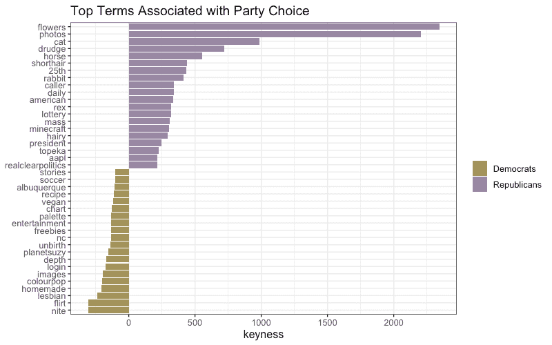
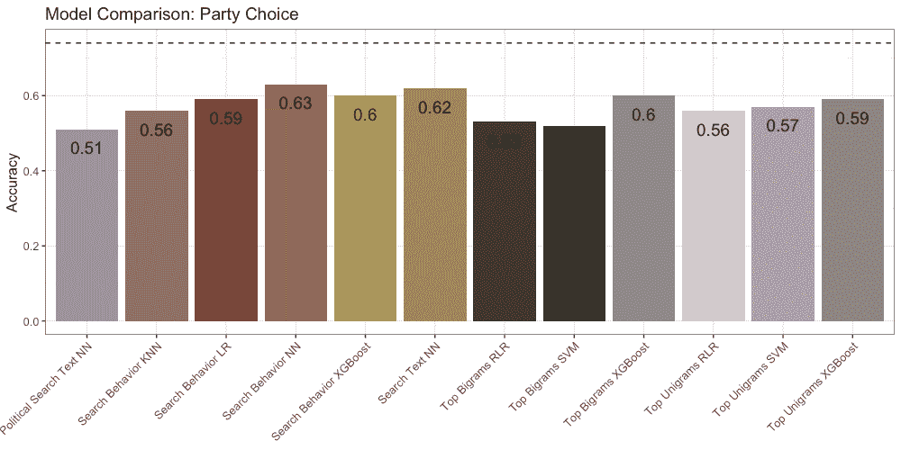

# 我能从你的网络搜索历史中预测你投了谁的票吗？

> 原文：<https://medium.com/analytics-vidhya/can-i-predict-who-you-voted-for-from-your-web-search-history-9f03aa7955f3?source=collection_archive---------23----------------------->

照片由[米切尔罗](https://unsplash.com/@mitchel3uo?utm_source=unsplash&utm_medium=referral&utm_content=creditCopyText)在 [Unsplash](https://unsplash.com/s/photos/google?utm_source=unsplash&utm_medium=referral&utm_content=creditCopyText)

在我的硕士论文中，我想看看是否有可能只利用一个人的网络搜索历史来预测他投了谁的票。我很幸运地获得了一个真正独一无二的数据集，使这成为可能:708 名美国人六个月的网络浏览历史——包括被写入搜索引擎的文本。不仅如此，所有参与者都在一系列调查中接受了采访，询问他们的人口特征，他们是否在 2018 年中期选举中投票，如果是，为哪个政党投票。研究中的每个人都得到了补偿，并通过在桌面和移动设备上安装浏览器扩展积极地选择了网络跟踪。

有很多理由相信网络搜索历史可以预测投票行为。我们都熟悉基于浏览历史的定向广告，这种广告假设某人的在线行为方式与广告商感兴趣的某个群体相关联。这是有道理的，因为之前的研究表明，在线行为和社交媒体活动可以预测年龄和性别等人口统计特征，这些特征反过来又与派对偏好等相关联。个人在撰写社交媒体帖子或博客时使用的语言也被证明可以预测人口统计数据和政党身份。对于这个研究问题，更具体地说，地理区域网络搜索的总体谷歌趋势数据已被用于成功预测从股市变化到疾病传播或投票率水平的一切事情。

这个项目很酷的一点是，我能够处理个人级别的网络搜索历史，据我所知，这是以前没有过的。我还可以查看所有的搜索引擎，而不仅仅是谷歌。因此，与之前专注于某个地理区域特定关键词的谷歌搜索量的研究不同，我能够评估一个人在所有平台上的整体搜索行为，以考虑词汇等因素——甚至可能与选民身份没有明显关系的因素——查询“情绪”(例如，词背后的情感)，或一天中进行个人搜索的时间。这些更细微的考虑是重要的，因为人们经常以更私人的方式搜索，像句子或问题一样组织查询，有时把搜索引擎当作知己。

如果搜索引擎查询被证明可以预测个人信息，如某人是否参加投票以及他们喜欢哪个政党，这可能会对投票、隐私和民主产生各种后果。可以通过比传统调查更便宜、更快速的方法来增强民意调查，并且在进行搜索时缺乏社会审查可能会克服一些社会期望偏见的问题，这基本上是指受访者在民意调查中不诚实，以努力让民意调查者更喜欢。例如，如果有人对在一个自由主义州成为特朗普的选民感到羞耻，他们可能不会诚实地说出他们打算投票给谁，这可能使预测变得困难。根据搜索引擎数据预测政治偏好也将为国内外的政治营销者和竞选活动打开大门，以锁定选民。这就是为什么我们理解这种个人数字数据的极限是至关重要的。

## **数据中的模式**

我对样本间描述性差异的初步研究显示了数据预测能力方面的良好迹象。有趣的是，数据中没有用户使用多个搜索引擎进行查询:例如，如果参与者使用谷歌进行搜索，他们从未使用过必应。此外，不同搜索引擎的用户群在意识形态、年龄、性别和其他人口统计因素方面有很大差异。平均而言，民主党人往往比共和党人提出更多的问题，尽管共和党人写的问题更长。一般来说，非投票者比投票者更晚使用搜索引擎。

某些关键词显然与党派性有关:民主党人和共和党人都在他们的十大查询词中使用了“2018”、“日”、“新”、“特朗普”和“我们”，但共和党人更有可能搜索“照片”、“鲜花”和“美国”，而“最佳”和“新闻”则更多地与民主党人相关。可以基于*keys*进一步分析词汇的差异，这依赖于卡方来比较两个文档之间的术语的相对频率，以识别与每个组最相关的术语。与共和党人联系更紧密的词包括“花”和“猫”等中性词，这些词出现在他们的热门搜索词中，但也有保守的新闻媒体，如“苦工”和“每日来电”相比之下，民主党人更倾向于使用“女同性恋”、“调情”和“素食主义者”这些词。

除了一般的搜索，我还想看看在考虑具体的、理论上相关的搜索时是否有模式。我列出了一些关键词，包括选民登记相关的关键词(如“缺席”、“投票”和“选票”)、美国众议院选举各州候选人的姓名、知名的党派政治人物以及一般的非党派政治术语(如“阻挠议事”或“选区划分者”)。

不出所料，投票者比非投票者更频繁地搜索所有这些列表中的条目。当考虑民主党和共和党时，这种差异不那么极端。

## **方法论**

我想看看是否有可能预测 1)是否有人报了票，如果有，2)是支持民主党还是共和党。

第一步是对五个独特的数据集进行特征工程:

*   *搜索行为:*第一个数据集着眼于搜索行为。这包括使用了哪个搜索引擎、一天中的时间、查询情绪以及参与者是否从预定义的列表中搜索了任何与政治相关的单词。
*   *前 1000 个单字*和*前 1000 个单字*:对于第二和第三个数据集，我找到了搜索次数最多的前 1000 个单字和前 1000 个双字短语(如“华夫饼屋”，或名字)，并记录了参与者是否搜索了这些热门术语或短语。
*   *整个搜索文本*和*整个政治搜索文本:*最后的数据集查看参与者的整个查询文本。基本上，我只是将回答者的所有问题压缩成一个大段。这个文本块被转换成一个数字表示，它捕捉了单词之间的关系，称为单词嵌入。我用了变形金刚图书馆的伯特。有一个包含他们所有搜索的数据集，其中我只压缩了包含一个之前定义的“政治”词的搜索。

这两个研究问题——是否有人投票，如果有人投票，是为哪个政党投票——都在以下模型中进行了测试:

*   *搜索行为*数据集通过逻辑回归、k-最近邻、XGBoost 和基本神经网络(MLP)实现。
*   *前 1000 个单字*和*前 1000 个二元组*数据集使用正则化逻辑回归、支持向量机和 XGBoost 进行研究。
*   最后，用神经网络对*整个搜索文本*和*整个政治搜索文本*数据集进行建模。

所有模型都依赖于监督学习，并在测试集上测试最终结果之前，使用重复交叉验证对超参数进行了调整(如果合适)。为了确保平衡的训练数据，我在训练任何模型之前都依赖 SMOTE。当特征缩放与特定模型/数据组合相关时，也要考虑这一点。所有模型的编码都是在 R 中完成的，除了神经网络和 BERT 嵌入，它们都是用 Python 完成的。

为了评估模型的性能，我首先创建了两个基线逻辑回归模型，使用年龄和教育等人口统计特征作为特征。用于比较的指标是准确性，即有多少病例被正确识别，以及 F1，这是一个也考虑假阳性和假阴性的指标。要达到的基准指标是，道岔模型测试数据集的准确率为 93%，F1 为 95%，政党选择测试数据集的准确率为 74%，F1 为 65%。

**结果**

***投票人数*** 总的来说，第一个研究问题是，是否有可能预测一名参与者是否仅根据他们的搜索历史进行了投票，这个问题的结果相当有希望。鉴于基线模型设置的高标准，很少有模型能够竞争就不足为奇了，尽管有少数模型能够完成这项任务。最好的表现来自于对参与者的整个搜索查询历史使用单词嵌入和神经网络，其中存在政治相关的术语，这实现了 96%的准确性和 94%的 F1。

然而，这个模型的棘手之处在于可解释性。众所周知，不仅神经网络难以解释，普通的方法也不会对嵌入产生有意义的结果。虽然确实存在可变重要性建模方法(如 LIME 或 R 中的 VIP 包)，但结果将是最相关的单词向量，这些单词向量本质上是用于预测的最相关单词的无意义数字向量表示。不幸的是，据我所知，没有一种方法能始终如一地将这些向量重新翻译成书面语言。

***政党选择*** 与第一个研究问题不同，没有一个政党选择模型达到甚至接近基线社会人口模型的准确度或 F1 水平。例如，最佳配置实现了 63%的准确率，比基线模型低 11%。

总的来说，表现最好的模型是利用神经网络的*搜索行为*。我用 LIME 研究了一下这些结果，发现参与者搜索的频率、平均搜索长度和使用的搜索引擎一直被认为对预测非常重要。

**结论**

所以，我想答案是——虽然是的，我们可以获得关于某人是否投票以及他们更喜欢哪个政党的有趣见解，但我实际上无法持续击败简单的逻辑回归和人口统计变量的预测能力。出于隐私考虑，这可能是最好的选择。；-)

尽管如此，如果有更大的样本量和更强的计算能力，未来的研究很有可能获得非常精确的结果。幸运的是，个人层面的搜索查询数据通常是不可用的，因此即使如此，搜索查询数据似乎也不太可能显著增加那些出于目标或预测目的而试图预测政治偏好的人的工具箱。

如果你想了解更多，所有的代码(和论文全文)都可以在这里找到:[https://github.com/MarinaWyss/search-engine-thesis](https://github.com/MarinaWyss/search-engine-thesis)