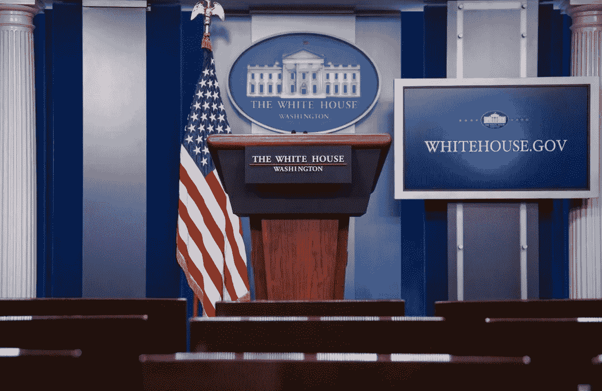
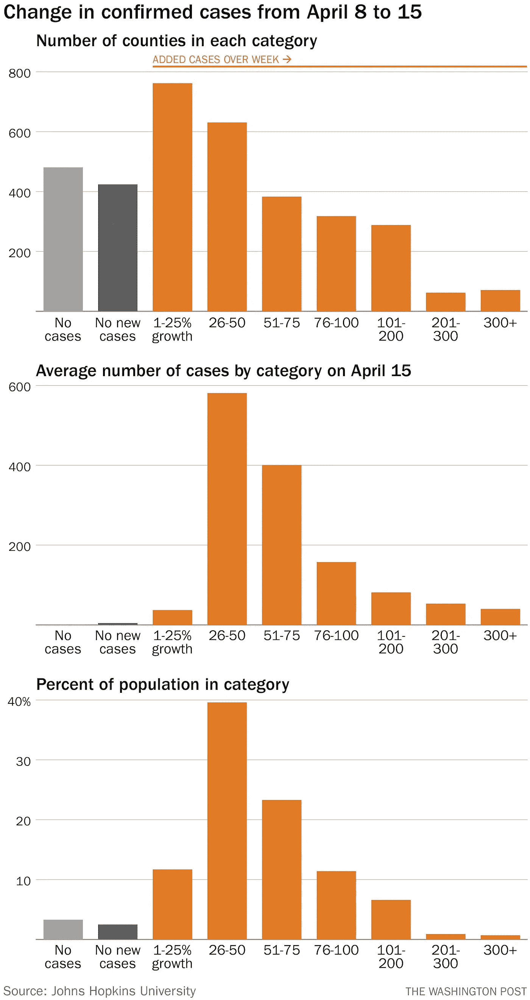
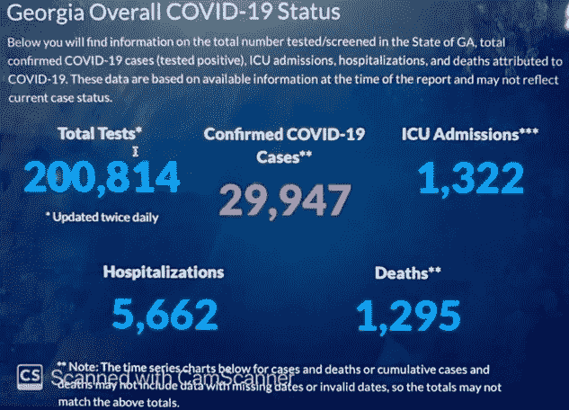
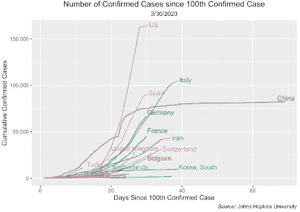
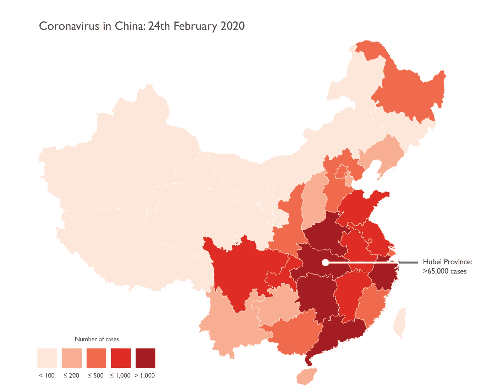

# 我可以信任 COVID 数据吗？

> 原文：<https://medium.com/analytics-vidhya/can-i-trust-covid-data-ec30eaa3f09?source=collection_archive---------26----------------------->

在疫情期间理解数据

空荡荡的白宫新闻发布厅|来源:华尔街日报

在许多人认为是定义本世纪的全球健康危机中，在媒体摄像机的持续关注下，白宫正在努力团结一个深度分裂的国家，其一波又一波的虚假声明有误导性的数据支持，或者在最糟糕的情况下，没有数据支持，进一步侵蚀他们和公众成员之间现有的脆弱信任。

4 月 17 日，特朗普总统和彭斯副总统公布了数据，他们希望这些数据能够提振州长的信心，并说服他们缩减迄今为止帮助遏制病毒在所有州蔓延的社交距离措施。

“我们的专家表示，曲线已经变平，新病例的高峰已经过去”，特朗普说，他指的是遏制感染的努力。“在全国范围内，超过 850 个县，或近 30%的国家，在过去七天内没有报告新的病例。”虽然过去一周有超过 850 个县报告感染人数几乎没有增加，但这些县中有一半以上根本没有任何病例。其余 421 个县的新增病例数量增加了一倍，当数据表示为人口而不是县的函数时，只有 7%的美国人生活在 COVID 病例增长很少或没有增长的县。

4 月 8 日至 15 日确诊病例的变化|来源:华盛顿邮报

不仅仅是白宫报告了错误的信息——公共卫生和数据专家对佐治亚州公共卫生部门公布的新冠肺炎数据的可信度表示担忧，这些数据排除了过去两周出现感染激增的病例。据信，缺失的数据导致新增病例数远高于目前国家网站上报告的大幅下降。

佐治亚州公共卫生部 COVID 数据

不准确的数据对于依靠数字来提出战略方针的决策者和官员来说可能是危险的。如果各州开放得太快，COVID 病例的漏报可能会在不久的将来酝酿一场新的感染风暴。考虑到我们每天面对的大量数据，那么我们如何理解和辨别哪些数据是可靠的或不可靠的呢？以下是我从《哈佛商业评论》等知名杂志上收集的一些观察结果。经过几个月的阅读？

# 1.检查发布的来源和目的。

许多人止步于源部分，而忽略了检查发布数据背后的意图。即使数据来自政府网站或国有媒体，数据也可能被篡改以服务于政治议程。有时，政府官员也可能在数据上犯错误，例如，国土安全部代理部长 Chad Wolf 错误地说，这种新病毒的死亡率与季节性流感相似。这突出了我们在相信他们之前交叉核对其他参考文献的迫切需要。

# 2.了解有关用于收集数据的方法的更多信息。

呈现的统计数据可能是正确的，但是用来组合它们的方法可能不是最精确或最理想的。根据每天获得的阳性检测结果来计算感染人数的数据可能不准确，因为由于地理或其他类型的限制，可能没有足够的检测来检测人口中的每个平民。换句话说，可能有隐藏的感染潜伏在周围，或者被感染但潜伏的个人在我们不知道的社区中默默地传播病毒。此外，经常需要双重检测来确认一个人是否真的患有新冠肺炎。由于检测的数量并不等于新感染的数量，基于该参数收集的数据，尤其是在检测率低的国家，不应被视为真理。

# 3.不同国家冠状病毒爆发的交叉比较可能会产生误导，甚至是危险的。

不同的国家有不同的报告标准、不同的检测方法和不同的接触者追踪方法。地理和人口统计学上的差异也可能在所获得的结果中发挥作用。例如，大国可能会发现遏制冠状病毒爆发更加困难，因为病毒可以在更大的区域传播，使接触者追踪更加困难，联邦州可能会制定自己的政策，这些政策在缓解爆发方面具有不同的效力。人口密集的国家或地区也可能面临控制疾病传播的问题，因为病毒往往在这些国家快速传播。一个恰当的例子是新加坡，由于拥挤的农民工宿舍中的猖獗传播，与以前相比，在某些日子里，每天的感染人数增加了十倍以上。尽管这座岛屿城市在控制本地和外来社区的病毒传播方面做得很好，但由于封闭的空间和外国工人的共同生活，最近几周，它的冠状病毒病例激增。

在这方面，比较美国和新加坡之间冠状病毒爆发的差异就像比较苹果和梨的差异一样——它们的内在差异太大，无法进行公平的比较。

# 4.看看用来表示数据的方法。

我之前在第 2 点讲过 ***采集*** 数据的方法，现在我要讲讲 ***表示*** 数据的方法。根据描述数据的方式，可以产生许多不同的解释。

*检查数据是否有遗漏*

由于疫情跨度长且广(因此不便于添加或与添加无关)，或者因为它们不适合预期的叙述(即如果提出来，前景会比没有提出来更糟糕)。这将导致有目的和选择性的偏见。这种数据可以包括冠状病毒在一定时期内爆发的数据；这可能很高，会动摇公众和投资者的信心，阻碍各国以它们原本希望的速度开放。如果以图形形式呈现，一定要检查图形的 x 和 y 界限。

*检查数据的测量单位*

自第 100 天以来确诊的冠状病毒病例数(对数标度)|来源:Vox

自第 100 天以来确诊的冠状病毒病例数(对数标度)|来源:Vox

虽然两幅图都显示了自第 100 例确诊病例以来的确诊病例数，但第一幅图以对数标度表示，而第二幅图以线性标度表示。而对数标度可用于响应朝向大值的偏斜(即根据对两个图表的直观观察，数据中的一些点比大部分数据更倾向于极端值，虽然在对数图中大多数国家的确诊病例数似乎在逐渐减少，但在线性图中它们似乎呈指数增长。在得出进一步结论之前，需要更多地了解这些国家病例的规模和分布情况。

此外，正如上面白宫的例子中提到的，使用不同的测量公式会产生不同的结果。以一个州的函数表示的新增确诊病例数，在以人口的函数表示时，可能会有很大不同。

*检查数据呈现方式*

让我们以空间数据为例。基于颜色编码显示全国感染范围的底图上的地理数据不一定能捕捉到疫情的实际规模和严重性。颜色代码可以以更宽的间隔堆叠，从而看起来更多的州/省/地区落入相同的容器中，而它们的实际值可能彼此显著不同。

显示截至 2020 年 2 月 24 日中国 COVID 病例数的 Chloropleth 地图|来源:ArcGis ESRI

此外，不应根据每个地区的绝对病例数对 GIS 地图进行分类，因为如果不了解这些地区的人口规模，就无法知道疫情的真实程度。与疫情发生率相似但人口规模较小的省份相比，湖北的人口规模可能更大，使得后者的冠状病毒形势比前者更为严峻。

# **5。当心滞后效应。**

最后但同样重要的一点是，要注意时间敏感数据中的滞后效应。例如，冠状病毒的一些病死率图表是通过将特定时间死亡的人数除以感染总人数计算出来的。

这种测量方法是错误的，因为它没有考虑到这个人被感染的*时间*。5 月 5 日死亡人数的数据点包括最有可能在不同日期感染的人，其中一些人可能比其他人早几周被感染。所以，一周的死亡率可能更低，并不一定意味着到下一周就不能增加，因为下一批病人的死亡率可能会比现在高。

因此，可以用两种方法中的一种正确地分析病例死亡数据——首先，结合发生率数据，发生在死亡之前，因此可以先发制人地预测即将到来的死亡率趋势。其次，受感染的个体必须分批分组，并对每批的死亡率进行分析。

# 结论

随着 COVID 最近几天不断淹没几乎每个新闻媒体的头条，我们无疑每天都被大量数据淹没。虽然如果所有呈现的数据都能够准确地显示改进的情况是理想的，但是一些数据可能容易失真。因此，我们必须客观地分析数据，以便能够了解事情的真相。