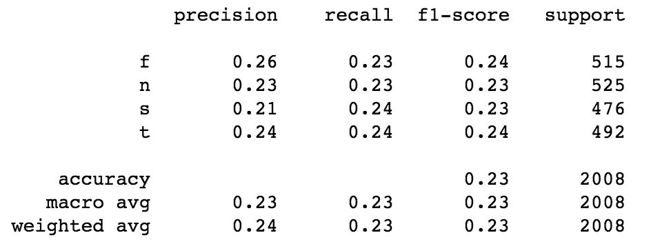

# LIWC 能帮助预测荣格认知功能吗？

> 原文：<https://medium.com/analytics-vidhya/can-liwc-help-predict-jungian-cognitive-functions-d096a039dd4f?source=collection_archive---------29----------------------->

在我的上一篇文章[关于数据科学的荣格类型学](/@mattiasostmar/towards-jungian-typology-with-data-science-95dcc6f1d57a)中，我描绘了一种使用数据科学评估卡尔·荣格原始人格类型的新方法的轮廓。下面是我如何使用相当现代的技术方法进行初步实验，例如 [XGBoost](https://machinelearningmastery.com/gentle-introduction-xgboost-applied-machine-learning/) 和 [UMAP](https://umap-learn.readthedocs.io/en/latest/basic_usage.html) 以及经过充分研究的心理词类 [LIWC](https://liwc.wpengine.com/) 。本实验使用的代码在此[公布](https://nbviewer.jupyter.org/gist/mattiasostmar/674f3e94054f44b513f8e3e1cd0ade60)以供参考。

typealyzer.com 网站(r . I . p . 2008–2019)允许人们发布一个博客网址，并获得四个字母的 Myers-Briggs 类型。对 MBTI 工作原理的深入研究表明，16 种类型中的每一种都有一种主导的认知功能。为了简单起见，这些荣格的认知功能可以简化为四个基本功能，或者是外倾的或者是内倾的，即应用于一个人的内心世界或者思想和感情或者是事物和其他人的外部世界。

与从业务逻辑的角度来看的普通业务数据(如销售或股票数据)相比，从荣格理论的角度来看的自然语言数据要复杂得多，也更具挑战性。这就是为什么我觉得它如此迷人。然而，在任何数据科学项目中，首先要做的事情之一是降低复杂性，所以这是我们的出发点。

让我们从把八种原始认知功能减少到四种开始，忽略它们中的每一种都应该是外向或内向的。

*   传感( **S**
*   直觉
*   思考( **T** )
*   感觉( **F** )

# 通过应用 LIWC 降低语言复杂性

我使用的数据集充满了噪音，因为它是基于放入 typealyzer.com 的 URL 上的所有文本。在每个样本中都可以找到大量不相关的单词和数字，如时间戳、链接文本等。因为感兴趣的是心理上有意义的词，所以首先通过计算 LIWC (2007)类别中的词来创建结构化数据集是有意义的。我们实际上以 64 个新列结束，我们稍后将使用它们来预测四个荣格基本类型。

具有荣格类型和认知功能的结构化数据集(左)和 LIWC 结果(右)

从每个班级的样本分布来看，大多数花时间张贴实际 MBTI 类型的博客 URL 的人似乎都是占主导地位的直觉型。从类型学的角度来看，这可能是有意义的，因为直觉型的人应该对抽象的东西更感兴趣，比如类型学系统。

主导型直觉型大约是感觉型的三倍

有一个方便的 Python 库叫做[不平衡学习](https://imbalanced-learn.readthedocs.io/en/stable/install.html)，它很好地补充并集成到非常流行的机器学习库 [Scikit-Learn](https://scikit-learn.org/stable/) 中。它包含了几种处理类不平衡的方法，我决定使用 [RandomUnderSampler](https://imbalanced-learn.readthedocs.io/en/stable/generated/imblearn.under_sampling.RandomUnderSampler.html) 在每个类中获取大约相同数量的样本。在平衡了类别之后，我们在每个类别中有大约 2500 个样本。那就行了！

# 用 XGBoost 预测四个函数

[XGBoost](https://xgboost.ai/) 的技术描述是，它是一种基于决策树的集成机器学习算法，使用了[梯度提升](https://en.wikipedia.org/wiki/Gradient_boosting)框架。只需知道它在过去几年的许多机器学习比赛中表现非常好，并且被认为是当今一般机器学习任务的良好首选。

这是它如何成功预测基于 64 个 LIWC 范畴的四个荣格函数的可视化。

几乎没有任何预测能力

快速看一下混淆矩阵就知道，似乎根本没有预测能力。这一点通过查看 sklearn 更详细的分类报告得到了证实。

不比随机好

我们也可以掷骰子来猜测 LIWC 范畴中的荣格函数。完全没有预测能力的迹象。当你得到没有怀疑余地的实验结果时，感觉真好，不是吗！

# 列太多使算法过拟合？

让我们看看如果将 64 个 LIWC 类别的列减少为两个会发生什么。由于我们正在处理来自自然语言的特征，我们可能不想使用传统的 PCA。由于 UMAP 比 SNE 霸王龙更快更新(开玩笑，尽管这是真的)，我们会选择 UMAP。让我们把 64 个维度(LIWC 类别的列)减少到只有两个，这样我们可以很好地可视化它们。

一个美丽的星空回旋镖在夜空中没有任何意义

这里的每个点代表数据集中的一行，四个荣格函数用颜色编码，以观察它们的分布情况。实际上他们没有。这只是一片混乱，每种颜色的点散布在整个类似回旋镖的星团中。图表上部的蓝色小卫星点以及其他小星团很可能是离群值，对整体理解没有任何帮助。

让我们再次使用 XGBoost 进行同样的分类，但是这次只使用两个特征(即列)。我们可能应该稍微减少维度，比如说 5-10 个维度会更合理。但是既然我们现在知道我们可以平静地放下希望，无论如何在数据中找到任何东西，让我们只使用我们用于绘图的相同嵌入。

更糟的是，这并不奇怪。尤其是我 **N** 学费被错划为 **S** 学费

如果我们看一下分类报告，我们可以得出结论，我们已经从与随机掷骰子完全相当的结果变成了比掷骰子更差的**！**

四级精度低于 25%。太糟糕了。

# 糟糕的预测应该归咎于什么？

LIWC、XGBoost 和 UMAP 都是经过充分研究和战斗考验的方法论。不幸的是，不能说数据集的原始数据是如何收集的。以下是数据收集方式的一些不足之处。

*   任何人都可以发布任何网址，不仅仅是博客。
*   任何人都可以说张贴的网站作者有某种 MBTI 类型
*   任何类型的浅层在线测试都可能是所述类型的基础
*   来自每个 URL 的文本数据充满了噪音，例如锅炉板文本

我会说，即使我们在这里使用了非常标准和合理的机器学习算法和评估指标。但是任何数据科学项目基本上都有一个最重要的限制； **sh-t in — sh-t out** 。

让我们看看以后是否能得到更好的数据集，并重复这个实验！所有的[代码都在这里发布](https://nbviewer.jupyter.org/gist/mattiasostmar/674f3e94054f44b513f8e3e1cd0ade60)。