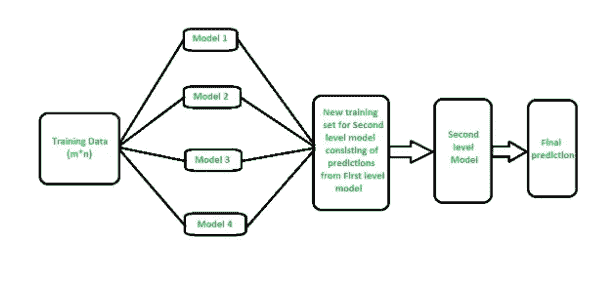

# 机器能预测销量吗？

> 原文：<https://medium.com/analytics-vidhya/can-machine-predict-sales-4e9bc17e3786?source=collection_archive---------24----------------------->

GitHub [简介](https://github.com/Anwoy-p/case_study_1)和 LinkedIn [简介](https://www.linkedin.com/in/anwoy-panigrahi-415754169/)

> 人工智能和机器学习已经成为这个数据驱动的世界中最重要的一部分。它的应用可以扩展到从简单分类到预测股票市场的任何领域。
> 
> 在本文中，我们将看到机器学习如何用于预测下个月的销售，以及集成学习及其实现的重要性。

— — — — — — — — — — — — — — — — — — — — — — — —

> **概述**

kaggle 预测未来销售额就是预测给定的一对商店和商品 id 的下个月的销售额。提供的数据集包含每个商店的日销售额和商品 id 对，为了使模型预测下个月的销售额，我们需要修改数据，即我们需要合计一个月的日销售额，预测的标签应该是[0，20]剪辑。

> **指标**

**RMSE** (均方根误差)是我们将用来解决这个问题的指标。 **RMSE** 可以定义为预测值和实际值之间的均方差的平方根。

> **探索数据:**

提供的数据由五个数据集组成

1.  **sales_train.csv** :-由六个属性组成

日期

——*date _ block _ num*—它是数据集中每个月的唯一数字，范围从 0 到 33。

— — *店铺 id*—每个店铺的唯一 Id。

— — — *物品标识—*每件物品的唯一标识。

———*item _ price*—每件商品的价格。

— — *每件商品的每日销售*

2.items_categories.csv :-它由两个属性组成

— — — *物品类别名称*—每一类别物品的名称。

— — — *项目类别标识*—项目的唯一类别标识。

**3** 。 **items.csv :** -它包含三个属性

— — — *项目名称*—每个项目的名称。

— — — *项目标识*—唯一的项目标识

— — — *项目类别标识*—唯一的项目类别标识。

**4。shop . CSV:**-它包含两个属性

— — *店铺名称*—每家店铺的名称

— — — *店铺 id-唯一店铺 id*

**5。test.csv:** -所需的数据集应该是这种格式，即对于每个商店 id 和项目 id，我们需要预测下个月的销售。

> **加载数据集:**

> **从数据中提取信息:**

——**—*标图物品每日销售***

**从图表中可以清楚地看出，一些产品的销量很高**

— — ***绘制店铺日销售额***

大多数商店的销售额都差不多，只有 3 家商店的销售额比其他商店高得多。

— — — ***绘制物品价格对比日销售额***

从图中可以清楚地看出，大部分日常销售包含的产品数量很少，即接近一种。

——**—*绘制店铺平均销售额***

大多数商店的平均销售额在 1 英镑左右。

——*—****item _ CNT _ day 和 item_price*** 的方框图

**从项目价格和项目天数的图表中可以清楚地看出，数据集中存在一些异常值，为了模型的更好性能，应将其移除**

> **数据预处理**

对于前置部分，我们将做三件事

— — — —消除离群值

— — — —替换负值

— — —修复店铺 id，即删除重复的店铺 id。

> **创建所需格式的数据集**

我们需要按要求的格式制作数据集，即每个月每个商店的每个项目的 item_cnt_day 集合

> **特色工程**

这是解决任何机器学习问题最重要的部分。我尝试了一些新功能，但在解决这个案例研究时，很少有新功能对我有效。

— — — U ***唱出假日特色****——(为我工作)*很明显，在假日期间，某个商店的销售额很可能会比平时高，也就是说，如果一个月的假日比平时多，那么该月的销售额就有可能高。

为了将假日作为一个特性包括进来，我们首先需要确定给定的一天是否是假日，然后对一个月中的假日总数求和。

为了将假日与数据集合并，我们需要根据假日存储 date_block_num。

———**-(为我工作)*商店中的全部独特物品作为特征这背后的主要思想是，拥有更多独特物品的商店的销售额可能会更高。在特征重要性图中，unique_items 具有较高的特征重要性。*

*作为一个特性，我们只需要对一个月内唯一的 items_id 求和。*

*— — ***商店中的全部独特类别***——(对我没用)这个想法是，如果一家商店在一个月中有大量的商品类别，那么该月的销售额应该很高。但是这对我不起作用，尽管它在特性重要性图中具有很高的特性重要性。*

*为了包括所有独特的类别，我们只需要计算一个月内 item_category_id 的总和。*

*— — ***使用名称作为特征***——(对我没用)我试图通过标签编码来使用项目名称，但没用。*

> ***功能选择***

*对于特征选择部分，我使用了 RFECV(递归特征消除)。对于选择在训练模型时应该使用的重要特征来说，这是一种非常好的技术。*

*它所做的是，递归地消除不太重要的特征，然后用剩余的特征训练模型。这样做有助于提高模型的性能。*

> ***建模***

****— — — —集合模型:****

*集成的思想是，数据将用于训练称为基础模型的不同模型，这些基础模型的输出将作为输入(特征)提供给预测最终输出的最后一个模型(元回归)。这样做的好处是，从所有基础模型的学习被保留，即当训练最终模型(元回归器)时，它将考虑基础模型的学习。*

**

***sklearn 堆栈-回归器***

*换句话说，集成可以被认为是从不同的专家那里获取关于特定问题的观点，因为不同的专家会有不同的观点，并在此基础上找到结论。*

****— — — —风俗合奏:****

*对于建模部分，我实现了一个定制的集合模型，它不同于 sklearn 堆叠回归器。在 sklearn Stacking-Regressor 中，所有基础模型都用相同的数据点(相同的训练集)进行训练，但在我的定制集成模型中，我们可以将不同的数据点样本传递给不同的基础学习者，并在此基础上训练元回归器。我使用 Xgboost 作为基础学习器和元回归器。*

**

***定制集合模型***

*它由三个函数组成，第一个函数用于采样数据点。对于采样，我使用了无替换采样，即在一个样本中，一个数据点只会出现一次。*

*第二部分是在不同的样本上训练 Xgboost 基础学习器，并保存它们的输出供元回归器使用。所有基本模型的超参数调整都在函数中完成。*

*最后一部分是构建元回归器。元回归器的超参数调整也已完成。*

*我已经为训练基础模型创建了 10 个样本，并在其上创建了一个元回归器。随着样本数量的增加，RMSE 可能会增加。*

> ***对照表:***

**

> ***Kaggle 评分:***

**

> ***未来工作:***

*通过在训练模型时使用更多的特征或者通过增加样本的数量，即通过增加基础学习者的数量，可以实现进一步的改进。*

> ***参考:***

* [## 应用课程

### 我们知道转行是多么具有挑战性。我们的应用人工智能/机器学习课程被设计为整体学习…

www.appliedaicourse.com](https://www.appliedaicourse.com/)  [## 特征工程

### 使用 Kaggle 笔记本探索和运行机器学习代码|使用来自预测未来销售的数据

www.kaggle.com](https://www.kaggle.com/dlarionov/feature-engineering-xgboost)  [## 第一名解决方案-第 1 部分-“实际操作数据”

### 使用 Kaggle 笔记本探索和运行机器学习代码|使用来自预测未来销售的数据

www.kaggle.com](https://www.kaggle.com/kyakovlev/1st-place-solution-part-1-hands-on-data) *