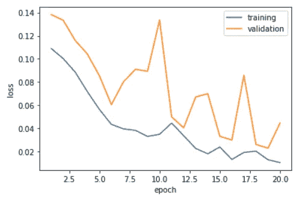

# 机器可以学习和预测吗？—使用 Pytorch 为 Iris 数据集训练深度神经网络。

> 原文：<https://medium.com/analytics-vidhya/can-machines-learn-and-predict-training-a-deep-neural-network-using-pytorch-for-iris-data-set-5fd8cb803fc4?source=collection_archive---------13----------------------->

利用 Python 程序，对鸢尾数据集训练深度神经网络，预测鸢尾植物的种类。

在这个快速发展的世界中，机器被训练并用于预测结果，涉及人工智能贡献的应用以更快的速度快速增长。

这篇文章将带你为一个著名的/基本的数据集——**虹膜数据集**训练一个深度神经网络。最后，该网络将能够基于 4 个不同的物理参数来预测虹膜的种类，这些物理参数将作为输入给出。

[本·马特](https://unsplash.com/@benjmater?utm_source=medium&utm_medium=referral)在 [Unsplash](https://unsplash.com?utm_source=medium&utm_medium=referral) 上的照片

该流程将遵循以下步骤:

1.  什么是虹膜数据集？—让我们尝试理解数据集，这样我们就可以知道哪些属性将用作输入，以及网络的输出应该是什么。
2.  拆分数据集—将数据集拆分为训练集、验证集和测试集。
3.  开发神经网络层—我们将创建深度神经网络，包括输入层、隐藏层和输出层。
4.  定义训练参数——DNN 最重要的部分是定义超参数(学习率、批量、时期数等；)，激活函数，损失函数，这些我们会在编写程序时讨论。
5.  训练网络——完成上述所有过程后，我们将训练深度神经网络。
6.  预测-根据获得的精度，我们将给出一个随机值，并检查网络是否预测了正确的值。

虹膜数据集到底是什么？

Iris 数据集有 150 行和 5 列(不包括 ID 列),看起来像这样:

已经示出了数据集的开始 5 行。

Iris 数据集由花的 4 个物理属性组成，即:

1.  萼片长度，单位为厘米
2.  萼片宽度，单位为厘米
3.  花瓣长度(厘米)
4.  花瓣宽度(厘米)

要预测的一个属性是“种类”列——鸢尾植物的种类。在所提供的数据集中，有三个物种，即“鸢尾”、“杂色鸢尾”、“海滨鸢尾”。

因此，这里 4 个物理属性将作为网络的输入，并且网络将基于所提供的输入给出一个输出，该输入是属于“鸢尾-setosa”还是“鸢尾-杂色”还是“鸢尾-海滨鸢尾”。

让我们从导入必要的包开始编码:

[如果需要，任何其他信息同样由程序中的# commenting 提供]

定义深度神经网络:

定义超级参数:

选择优化器、损失函数并将数据分成测试、验证和测试集:

通过显示其形状来检查每个集合中有多少条记录:

x_train 有 120 行 4 列，而 x_test 和 validation set (x_val)都有 15 行 4 列。看 y_train，y_test 和 y_val 分别是 120，15，15 条记录。您的输出应该是这样的:

为 Pytorch 创建数据加载器:

定义一个函数来训练模型:

类似地，定义一个函数来测试模型:

是时候训练模型了:

现在，在训练过程中，您可以看到每个时期的训练损失和验证损失，如下所示:

让我们想象一下训练损失和验证损失在每个时期是如何变化的:

查看分配给每个加权变量的数字:

检查您的模型如何为测试集工作:

此外，我们使用混淆矩阵作为测试集的评估因子:

混乱矩阵看起来是这样的:

最后，预测时间到了:

您可以更改 x_new 变量中的值，并检查您的模型是否预测了正确的鸢尾植物类别。

这就是你如何训练一个深度神经网络，并尝试使用建立的模型进行预测。

任何关于这个职位的建议都是受欢迎的。

欢迎通过 [LinkedIn](https://www.linkedin.com/in/arnold-sachith-98752a141/) 、 [Instagram](https://www.instagram.com/arnoldsachith/) 或[脸书](https://www.facebook.com/arnold.sachith)与我联系。

干杯:)

阿诺德·萨希特