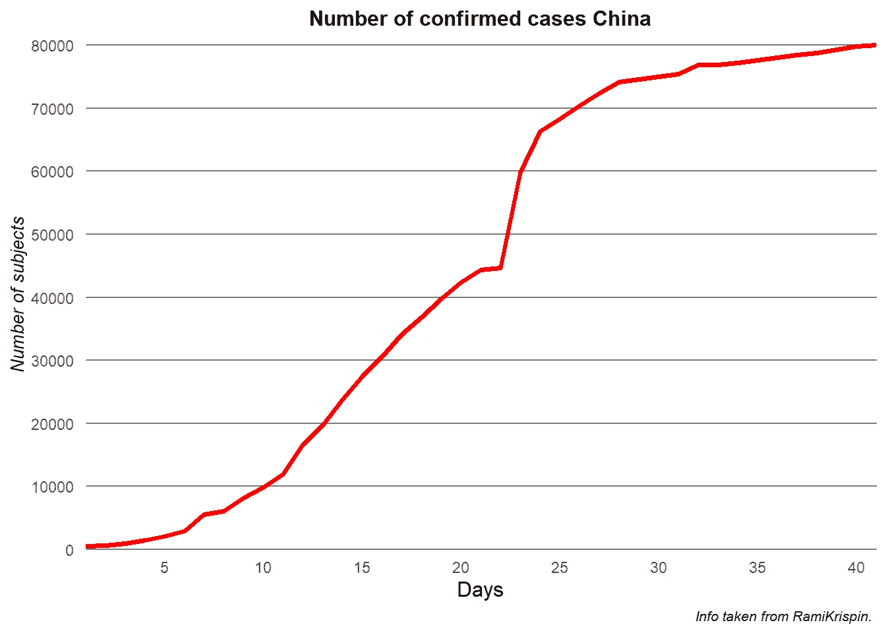
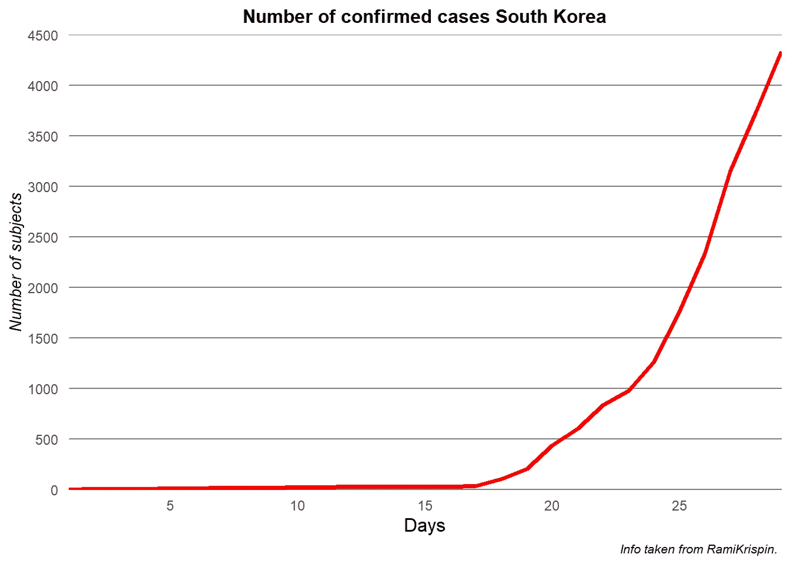
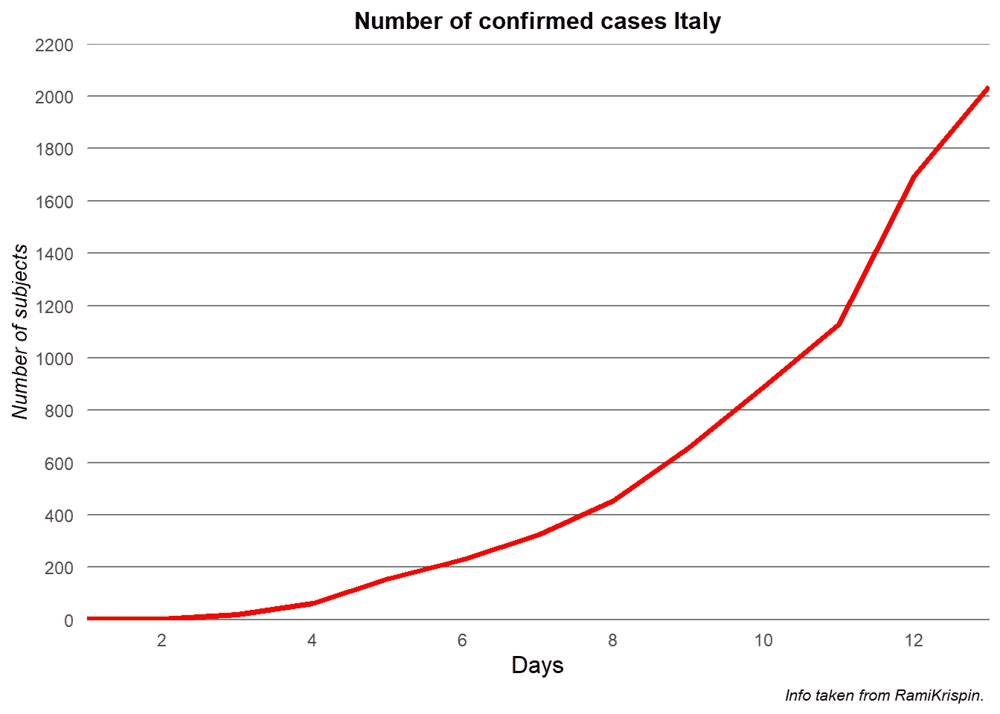
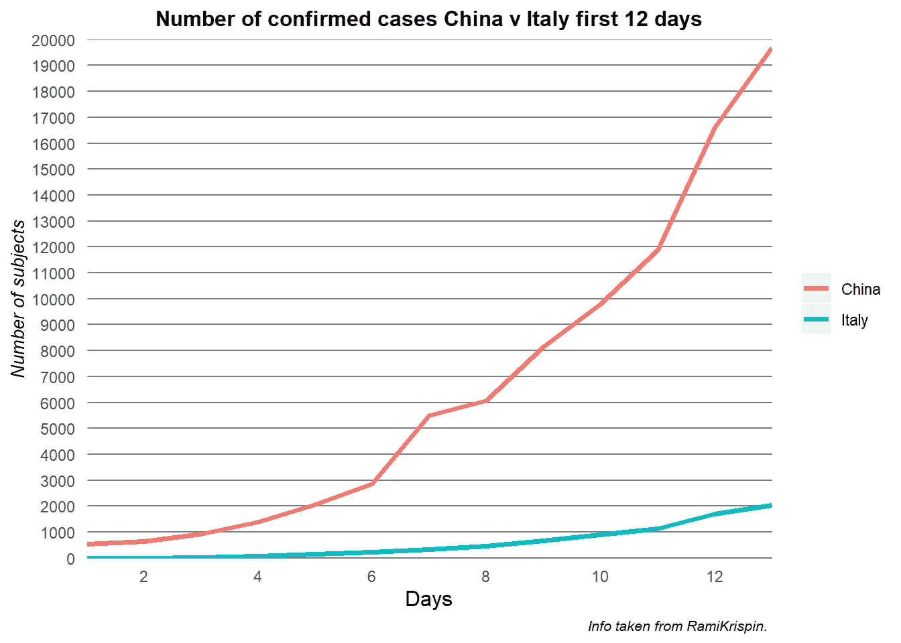
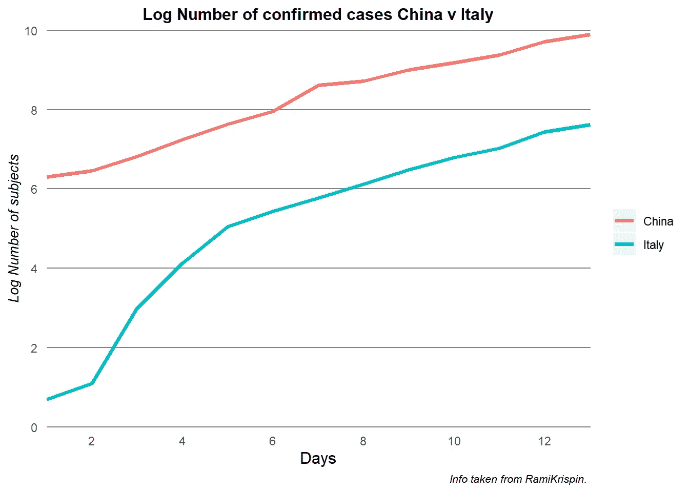

# 最坏的情况能过去吗？新冠肺炎数据分析

> 原文：<https://medium.com/analytics-vidhya/can-the-worse-be-over-covid-19-data-analysis-4e9dd042dd26?source=collection_archive---------23----------------------->

自今年 1 月中国报告首例病例以来，这种新型冠状病毒一直是新闻焦点。最近几周以来，这些数据第一次让我们有理由相信，至少在中国，这种趋势开始消退。

在本文中，我将深入研究由 [Rami Krispin](https://github.com/RamiKrispin/coronavirus) 提供的数据，以便尝试理解这一点。我将使用 R 来组织和可视化数据，我将在这里留下一些代码，您可以在我的 GitHub 上找到其余的代码。

# 我们开始吧。

我们从 [GitHub](https://github.com/RamiKrispin/coronavirus) 加载数据，并加载所需的库，ggplot2 用于图形，tidyverse 用于组织数据。

## 中国

```
**library**(ggplot2)
**library**(tidyverse)c1 <- coronavirus %>%
  select(date,type,cases,Country.Region) %>%
  group_by(date,type,Country.Region) %>%
  summarise(total_cases = sum(cases)) 

c2 <- as.data.frame(c1[which(c1$type=="confirmed" & c1$Country.Region == "Mainland China"),])

c2$day <- (1:length(c2$total_cases))

c2$corcumtotal_cases <- cumsum(c2$total_cases)
```

我组织了数据，以便只获得中国确诊病例的信息，并创建了一个新列，以便每天有一个累计总数。

```
PlotChinalin <- ggplot(c2, aes(day,corcumtotal_cases)) + geom_line(size=1.25,color="red1") + 

  theme(
    plot.title = element_text(size = 12, face = "bold",hjust = 0.5),
    plot.caption = element_text(size = 8, face = "italic"),
    panel.grid.minor = element_blank(), 
    panel.grid.major = element_line(color = "gray50", size = 0.5),
    panel.grid.major.x = element_blank(),
    panel.background = element_blank(),
    line = element_blank(),
    axis.ticks.length = unit(.15, "cm"),
    axis.ticks.y = element_blank(),
    axis.title.x = element_text(color="black", 
    size=12),
    axis.title.y = element_text(color="black",
    size=10,
    face="italic"))+

  scale_y_continuous(expand = c(0, 0), 
    limits=c(0.0,81000),                  
    breaks=seq(0.0,90000,10000),
    name = "Number of subjects")+

  scale_x_continuous(expand = c(0, 0),
    breaks=seq(0.0,40,5),
    name = "Days")+

  labs(title = "Number of confirmed cases China", 
       caption = "Info taken from RamiKrispin. ")

PlotChinalin
```



使用 ggplot2，我创建了一个中国每天累计确诊病例的图表，自从昨天报告第一例病例以来，这是每个人现在都在谈论的，确诊病例已经停止涌入，中国人民正在康复。这对中国来说的确是个好消息，然而，在其他国家这才刚刚开始。

因为图的代码很长，我将把第一个留在这里，其他的你可以在这里找到。

## 韩国

南韩是最早报告新冠肺炎病例的国家之一，然而，在最初的几周，确诊病例寥寥无几。韩国现在有 4335 例确诊病例。

```
c3 <- as.data.frame(c1[which(c1$type=="confirmed" & c1$Country.Region == "South Korea"),])

c3$day <- 1:length(c3$total_cases)

c3$corcumtotal_cases <- cumsum(c3$total_cases)

PlotKorea <- ggplot(c3, aes(day,corcumtotal_cases))+ geom_line()
PlotKorea
```



新冠肺炎在韩国的传播是一个完全不同的故事，它比中国起步晚，但在过去几周内已经加快了速度。但是，请记住这两个图表的规模，在中国，我们看到的图表一直达到 80，000，而在韩国，我们看到的图表只有 4，500。

关于韩国值得注意的一件好事是，在过去两天里，该国报告的确诊病例比 02-29 日该国宣布的最大确诊病例数要少。

## 意大利

意大利是第一个报告新冠肺炎大规模爆发的欧洲国家，在我们收到来自意大利的报告的 13 天里，确诊病例增加到 2036 例，变化的速度似乎在加快。

```
c4 <- as.data.frame(c1[which(c1$type=="confirmed" & c1$Country.Region == "Italy"),])

c4$day <- 1:length(c4$total_cases)

c4$corcumtotal_cases <- cumsum(c4$total_cases)PlotItalylin <- ggplot(c4, aes(day,corcumtotal_cases)) + geom_line() 
PlotItalylin
```



同样，重要的是要注意，线性图的比例只有 2200，而且只有 13 天，没有足够的信息。事实上，如果我们看一看在中国的前 13 天，我们确实会得到一个相当类似的增量情况，尽管数字要高得多。



从图表中我们可以看到，传播的开始在中国比在意大利要激烈得多，但是因为绝对数字可能看起来有欺骗性，我创建了一个对数标度的图表。



当查看对数图时，我们可以清楚地看到，在最初的 13 天里，中国的变化率比今天的意大利高得多。这一点非常重要，因为正如我们之前看到的意大利的图表，它看起来没有上限。

随着中国似乎控制住了病毒，总的数字正在下降，然而，当我们看到一张张照片时，我们发现全世界仍有许多工作要做。