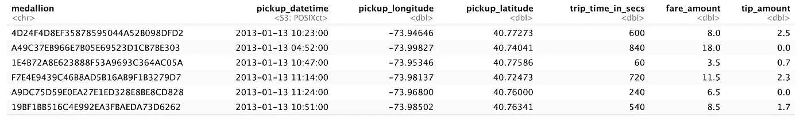
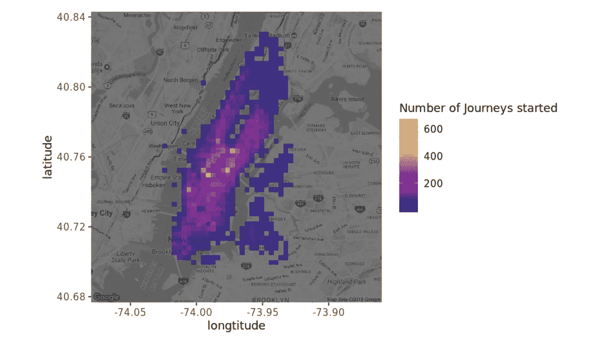
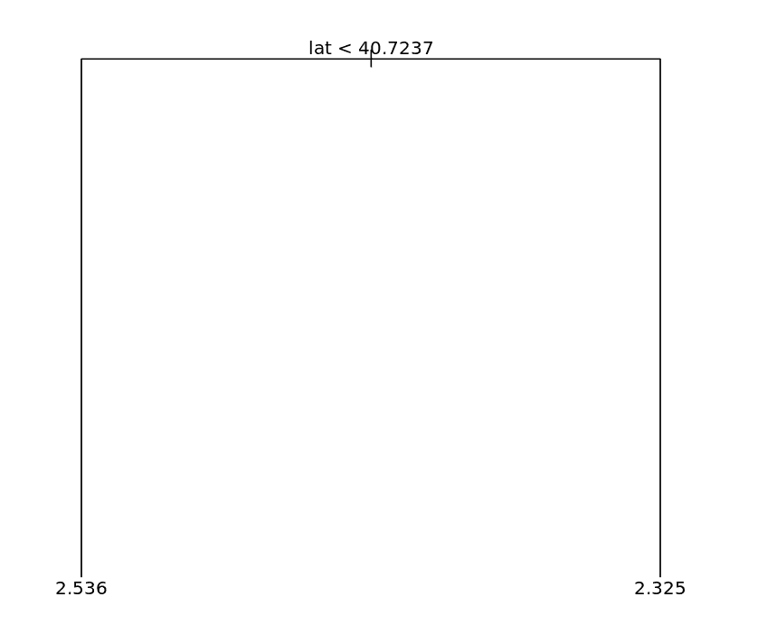
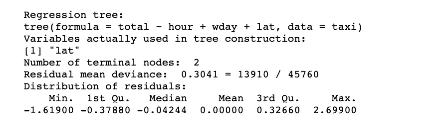
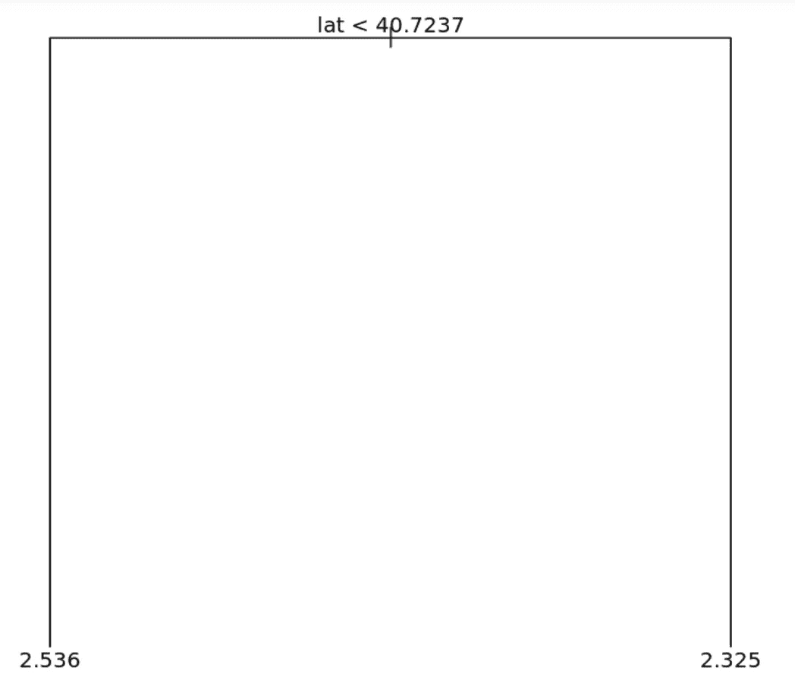
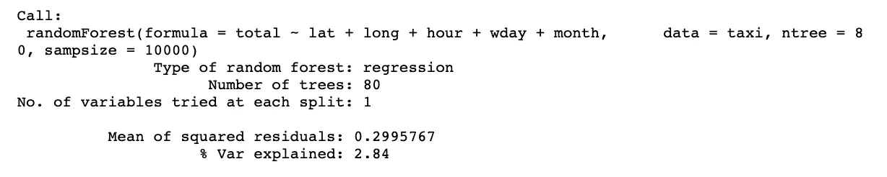
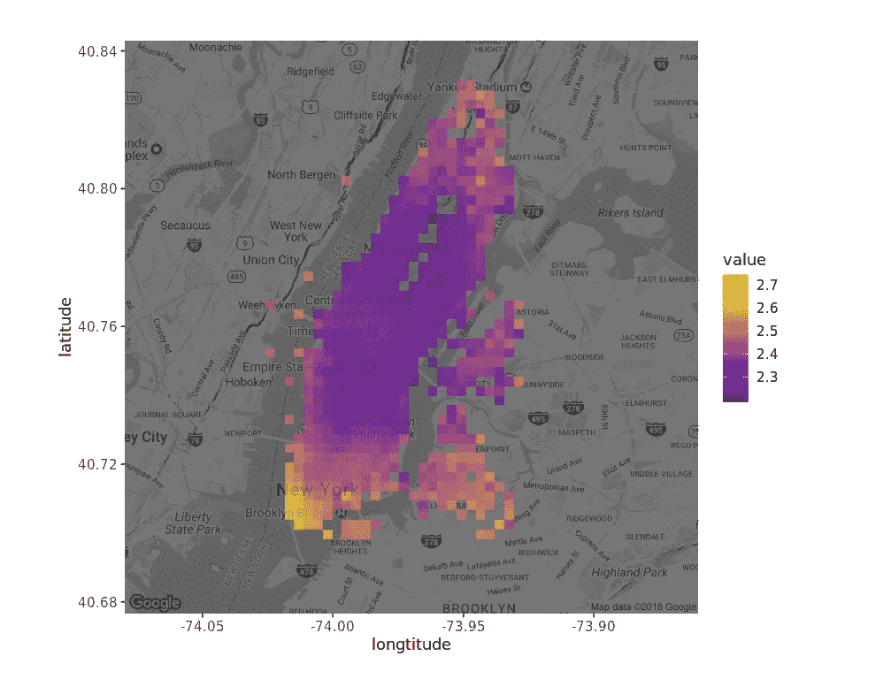
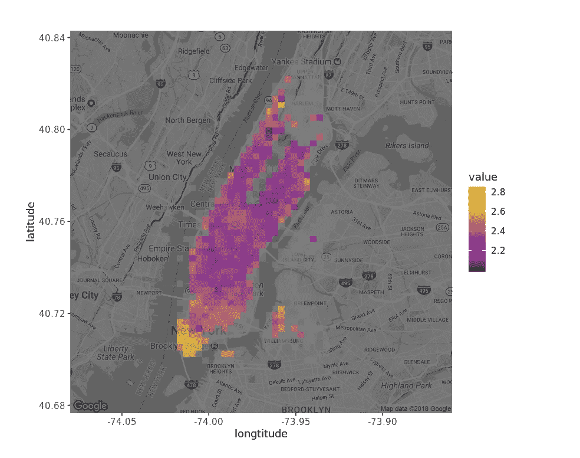

# 树能帮助纽约的出租车司机吗？—R 中的决策树和随机森林

> 原文：<https://medium.com/analytics-vidhya/can-trees-help-taxi-drivers-in-new-york-decision-trees-and-random-forest-in-r-6f6c194730d?source=collection_archive---------36----------------------->

感谢互联网，我们可以看到我们从未去过的地方，谈论它们，甚至分析它们！嗯，我早上好？！我知道我听起来像是一个 90 年代刚刚发现互联网的人…但事实是我仍然在探索我们的一些能力。

多亏了 Datacamp 项目，我找到了 49999 个纽约出租车旅程数据集。我们将开始一段从决策树到随机森林算法的小旅程，并尝试帮助出租车司机。让我们开始吧！

分析的第一部分基于 datacamp 指令。然后我会添加更多的库和分析。

徽章是每辆出租车的唯一标识。我们有取车日期、位置(经度和纬度)、行程长度和车费。我将重新排列数据集，如下所示:

现在让我们放大曼哈顿。

看起来很花哨！这里有些注释。get_map()用于从 google maps 返回地图。现在同样的方法需要 Google API 的凭证。因此，这里使用预先生成的 RDS 对象。

生成第一棵树→

这棵树说了什么？如果纬度小于 40.7237(纬度<40.7237) trips are more expensive (2.536> 2.325)。虽然我们在构建模型时使用了 long 作为预测器，但是树中没有包括它，因为它不能提高预测。

让我们从现有的数据中提取更多信息，并将其用作预测器。pickup_datetime 是一个日期对象，它使我们能够提取该日期的小时、日和月。

现在是时候画另一个有更多预测的树了。

尽管我们在模型中有更多的预测因子，但这些对模型的预测没有贡献。树，再次，仅仅是由纬度建造的。

也许我们不需要在一棵树上有更多的节点，而是需要更多的树…甚至是一片森林。

在这一点上，概念上的澄清将是非常有益的。[你可以查看这个帖子。](https://towardsdatascience.com/understanding-random-forest-58381e0602d2)

即使是森林也只能解释数据中 2.84%的可变性。这远远落后于一个好的预测。

地图上的可视化将为我们的模型提供更清晰的视图。

虽然我无法帮助出租车司机，告诉他们提高收入的确切时间和地点，但对我来说，有一个小而有效的教训:市中心更贵。对许多人来说，这可能太明显了，但对那些不太了解曼哈顿的人来说，这仍是一个学习的过程。这值得一试。