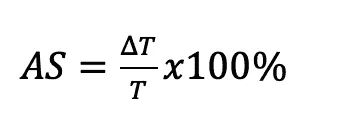

# 我们能仅根据图片检测出癌变的皮肤痣吗？

> 原文：<https://medium.com/analytics-vidhya/can-we-detect-cancerous-skin-moles-based-on-picture-only-bd728467632?source=collection_archive---------5----------------------->

当我从生物医学课上拿到最后一个项目作业时，我是一名电子工程专业的大四学生。我们可以自由选择项目主题，只要它有可能给医学界带来好处。

自从上了图像处理课，我接触了一点图像处理，所以我想，“为什么我不做一些系统/程序，可以只根据图像来决定一些事情？”一旦程序算法完成，该项目将有可能进一步发展成为一个移动/网站应用程序，可以由非专业人士使用，无需任何特殊的技术或工具

所以，我选择了**早期皮肤癌检测**作为我的项目。这个项目的目标是检测哪些痣是癌性的，哪些不是癌性的。

为什么一定是皮肤癌？为什么不是脑癌？或者其他癌症？因为皮肤是我们无需任何特殊工具，如核磁共振成像、x 光或任何其他生物医学工具，就可以轻松观察的东西。我们可以只拍一张皮肤的照片，把图像放入我们的程序，瞧！我们有结果了！

# 但是，我是怎么开始的呢？

**首先**，我需要知道癌性和非癌性皮肤痣的特征。我毫不费力地检索了皮肤癌数据集，因为这些数据遍布互联网。我从 ISIC 选择了数据集，并在这里下载了它

现在，让我们来看看图片！

**良性(非癌)**


**恶性(癌变)**


当我第一次看到这些图片时，我感到非常困惑，因为癌性和非癌性痣之间没有太大的区别。所以，我开始做一些文献研究，我发现过去有一些关于检测皮肤癌的研究。

根据过去的研究，有两种主要的方法来检测癌变皮肤。首先使用**特征提取**，其次使用**卷积神经网络**。卷积神经网络在图像分类中非常流行，因为它能够使用 2D 卷积层从输入数据中学习特征。卷积神经网络就像任何机器学习方法一样，我们可以只放一堆数据集，让系统通过更新每个神经元的权重等进行自我学习(我不会在这里解释机器学习如何工作的细节)

卷积神经网络实际上很酷，我预测如果我们有一个大数据集，这种方法会有很好的性能。但我更感兴趣的是以更“人性化”的方式进行分析，此外，我想更深入地了解如何从大量数据中提取重要信息。因此，我选择了特征提取法

# **特征提取**

在每个数据分析过程中，首先应该想到的问题是

> "我们需要从这些数据中提取什么样的信息？"

图像分析也是如此，因为图像基本上是以二维形式的数据。所以我想到的第一个问题是

> "我需要提取什么样的特征？"

从以往的研究来看， ***不对称、边界不规则*、*颜色*、*直径*** 是被医生广泛用于分析癌性皮肤痣 *s* 的*(Jain&Pise，2015)。为了简单起见(是的，当时我的截止日期很紧)，我选择通过**只提取不对称和边界不规则特征来分析癌变皮肤图像。***

挑战性的部分来了，将这些特征从图像转换成可读的格式。

***提取不对称特征***

我们如何知道一个物体是否对称？我们可以把它向一个方向折叠，看看一边是否与另一边 100%重叠

因此，为了获得物体的对称值，我们可以将痣的图片一分为二，将分割后的两张痣的图片重叠，看它们是否 100%重叠

但是首先，我们需要把前景(鼹鼠)和背景分开。以下是我所做的分离前景:

1.  将图像转换为灰度模式
2.  应用中值滤波器滤除背景中的噪声

这是结果


前(左)后(右)

现在我们可以看到前景和背景之间的巨大差异。如果我们查看图像的直方图，图像的每个像素都有 0–255 之间的值(0 为黑色，255 为白色，否则为不同强度的灰色)。这种多样化的值会使前景与背景完全分离变得更加困难，所以我使用了 *Otsu 阈值法*将每个像素的值仅变成 0 或 1(这也被广泛称为二值化过程)。值高于 140 的像素变为 1，否则变为 0。

现在我们可以将前景完全分离成一个新的图像！

我们可以通过将图像(仅前景)分成两个新图像，将其重叠，并使用以下公式计算不对称百分比，来计算对象的不对称



δT 是非重叠区域的差值，T 是物体的总面积

我用这个 Matlab 代码找到物体的质心，将其平移到中心，折叠，并计算物体的不对称程度

```
%% Make the measurements
 props = regionprops(labeledImage, ‘Centroid’, ‘Orientation’);
 xCentroid = props.Centroid(1)
 yCentroid = props.Centroid(2)
 %% Find the half way point of the image.
 middlex = columns/2;
 middley = rows/2;%% Translate the image
 deltax = middlex — xCentroid;
 deltay = middley — yCentroid;
 binaryImage = imtranslate(binaryImage, [deltax, deltay]);%% Rotate the image
 angle = -props.Orientation
 rotatedImage = imrotate(binaryImage, angle, ‘crop’);%% flip to check asymmetry
 flipped =fliplr(rotatedImage)

 %% Measuring assymmetry
 % get the total area
 props2 = regionprops(labeledImage, ‘Area’);
 % count non overlapped area
 nonOverlapped = xor(flipped, rotatedImage);
```

***提取边界不规则度***

在找到物体的质心并将其移动到图片的中心后，我使用了著名的 canny 边缘检测算法来找到痣的边缘。结果是这样的


边缘不规则性分析由于其主观性而相当复杂。在本研究中，边缘不规则性的分析是通过计算每个边缘到“皮肤疾病”区域的质心的距离并在一维图中描绘出来进行的。如果图趋于平直或双曲线，没有许多局部最大值或最小值，则意味着边具有清晰和正常的边。通过计算图的导数，然后计算导数图中零交叉的数量，来确定局部最大值和最小值的数量。导数图中的零交叉表示局部最大值或最小值。边缘导数图中的过零值越多，图像的边缘越不规则。

这是我用来计算边缘不规则程度的代码

```
 %% filledimage to make border clearer
filledimage = regionprops(labeledImage,'FilledImage')
filledimage = filledimage.FilledImage;%% find centroid of the image
edgeprops = regionprops(filledimage,'BoundingBox', 'Centroid');%% Edge detection
findedge = edge(filledimage,'canny');%% Convert centroid to integer
boundingboxint = uint32(edgeprops.BoundingBox)
centroidint =uint32(edgeprops.Centroid)%% Scan the edge of image and plot it into 1D array
plotdist=[]
for i= boundingboxint(2) : boundingboxint(4)
    for j= boundingboxint(1) : boundingboxint(3)
        if findedge(i,j) == 1
            dist = sqrt(double(( ((i-centroidint(1))^2) + ((j-centroidint(2))^2) ) ))
            plotdist = vertcat (plotdist, dist)
        end
    end
end%% Derivate the edge array 
firstorderdist = diff(plotdist);%% Count the local maximum and minimum of the border by counting how many times the graph cross zero
[r c] = size(firstorderdist)
count=0;
for i=1 :(r-1) 
    if ( firstorderdist(i)>0 & firstorderdist(i+1) <0 ) | ( firstorderdist(i)<0 & firstorderdist(i+1) >0 )
        count= count+1;
    end
end
borderarr=vertcat(borderarr, count);
```

是的，我们完成了特征提取，万岁！

# 分类

在选择分类方法之前，将不对称和不规则数放在一个表中，并将该表映射到一个图中，以便我可以识别其分布。从数据分布的结果来看，K-最近邻算法具有最优的分类超平面。

因为我的电脑处理海量数据的性能很差，只能处理 80 张*良性训练图像*，80 张*恶性训练图像*，20 张良性测试图像，20 张恶性测试图像。

**结果**

通过特征提取和 k-NN 回归对皮肤癌的检测得到的准确度为 **75%** ，精确度为 **85%** ，特异性为 **72%** 。该精度值受到数据集质量的影响，其中所使用的数据集不具有相同的标准亮度水平，而用于从背景中分离前景的二进制化具有确切的参数。这可能导致分割和参数计算性能下降

**结论和进一步工作**

总之，在检测癌变皮肤癌时，我们不能仅依靠图像，因为准确性仍然很低。

但是，我们可以通过以下方式提高精度:

1.  添加更多特征(颜色和直径)
2.  添加更多培训数据
3.  改进预处理算法，使图像更好地标准化

所以，就这样了。我个人很享受这个项目，因为它可以满足我对数据和图像分析的好奇心。我热爱学习，所以欢迎批评！

你也可以通过我的电子邮件 teresiasavera@gmail.com 与我联系，以进一步了解代码，或者只是讨论一些与图像分析甚至机器学习相关的有趣话题！

干杯！