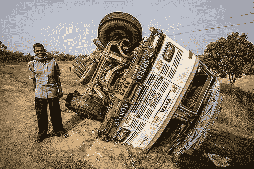

# 我们能减少交通事故吗？

> 原文：<https://medium.com/analytics-vidhya/can-we-minimize-road-accidents-85e6dff77ca5?source=collection_archive---------15----------------------->

图片来自 loupiote.com

这张图片有点滑稽，司机站在一辆翻倒的卡车旁大笑。这在我的国家是常见的景象。许多事故的发生是因为卡车司机的生活压力很大，他们连续驾驶几个小时，以便及时运送货物。

根据一项研究，2018 年印度的道路事故增加到 1.49 起。嗯，这个数字肯定很大，但是我们能做些什么来减少这个数字吗？现在，这个想法肯定是无人驾驶汽车/卡车，这些天我们对此进行了大量研究。如果我们考虑工作的话，这肯定是个问题，因为更多的卡车司机会失业。但是，我发现每一项新技术创造的新工作都比减少几个工作岗位要多。

毫无疑问，这将在未来成为现实。这不是我们所能阻止的，因为这个想法正在一天天变大，有一天它会成为现实。但是我们目前能做的是至少在我们的卡车上建立一个模型，它可以发出警报，从而帮助司机不要睡着，在路上保持警惕。

我从 Adrian rose Brock(pyimagesearch . com 的创始人)那里了解到这一点。如果实施的话，这肯定会创造一场革命，更重要的是拯救生命(最重要的)。

在下一篇文章中，我们将详细介绍技术如何拯救生命。