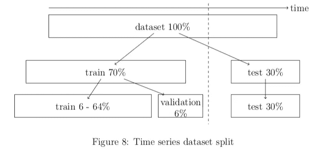
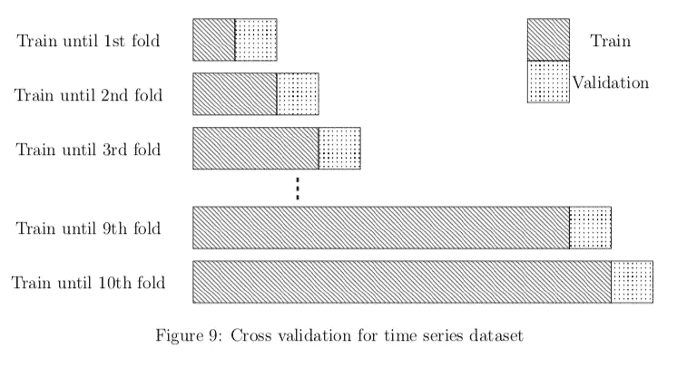
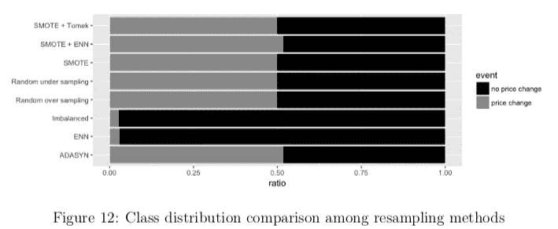
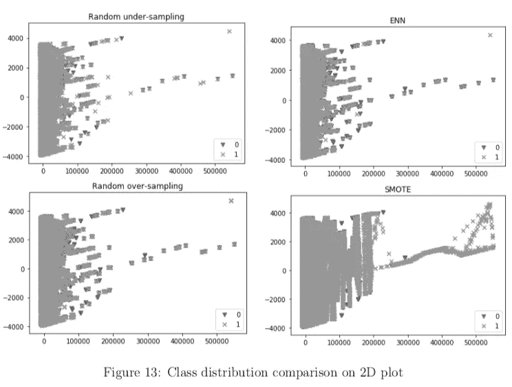
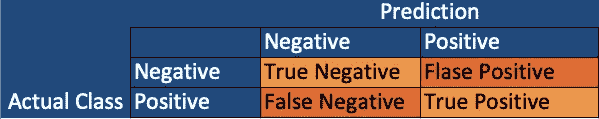
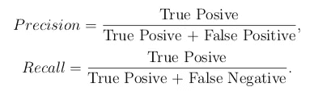
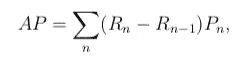
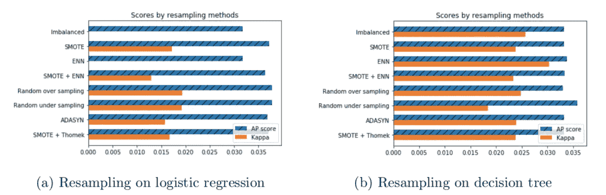
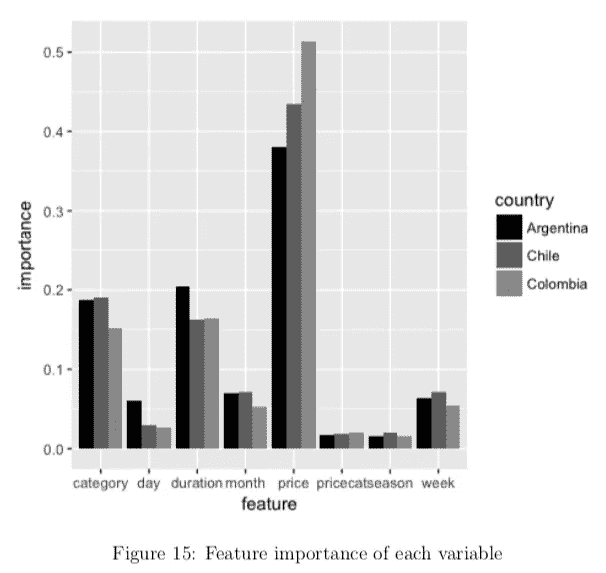

# 我们可以通过使用机器学习和计量经济学来预测在线超市的价格调整吗？

> 原文：<https://medium.com/analytics-vidhya/can-we-predict-a-price-adjustment-in-an-online-supermarket-by-using-machine-learning-and-7bf3e8fff81a?source=collection_archive---------10----------------------->

## 第 2 部分:机器学习方法


Joshua Rawson-Harris 在 [Unsplash](https://unsplash.com?utm_source=medium&utm_medium=referral) 上拍摄的照片

这个系列贯穿了我的硕士论文，它不仅是我的第一个端到端机器学习项目，也是我的计量经济学和机器学习研究之间的桥梁。我的论文试图预测企业的价格变化行为。这个故事，接下来是第一部分— [计量经济学方法](/@kyosuke1029/can-we-predict-a-price-adjustment-in-an-online-supermarket-by-using-machine-learning-and-ab5b762abac0)展示了我如何用机器学习解决这个问题。如果你想看的话，全文可以在 [ResearchGate](https://www.researchgate.net/publication/324749650_Analyzing_online_price_by_using_machine_learning_techniques) 上找到。

# 内容

1.  **ML 方法——时间序列分类问题**
2.  **不平衡数据**
3.  **结果**
4.  **结论和后续步骤**

# **ML 方法——时间序列分类问题**

在深入讨论之前，让我简单回顾一下我想达到的目标。在我的论文中，我试图建立一个模型来预测今天商品的价格是否会调整(尽管现在我认为如果我预测明天的价格调整会更好)。我得到了美国和南美国家网上超市每日价格的数据集。[本系列的第 1 部分](/@kyosuke1029/can-we-predict-a-price-adjustment-in-an-online-supermarket-by-using-machine-learning-and-ab5b762abac0)表明用计量经济学的方法来理解这个问题。因此，我们可以看到，项目的价格和长度自上次价格调整是最重要的功能之一。

要将这个问题设置为机器学习问题，我需要创建一个目标变量。因为我们想要预测今天的价格调整，所以我创建了一个今天和昨天价格的比较(请查看第 1 部分)。现在，我们将数据集分为训练集和测试集。由于这是时间序列分类问题，这些集合必须是连续的，否则您将会有来自未来的数据泄漏，并且无法创建正确的模型。下面大致展示了我如何分割数据集。



出于同样的原因，时间序列模型的交叉验证也必须谨慎处理。我实现了 10 重交叉验证，它被用来调整一些超参数。



# **不平衡数据**

我们凭直觉就知道，网上超市的价格不会经常调整(至少不会每天都调整)。是的，这种直觉是正确的，事实上，价格只有 2%左右的时间被调整。这意味着我们的二元目标变量有严重的类不平衡。首先，当我建立一个模型并运行测试时，我获得了 98%的准确率！然后当我检查混淆矩阵时，我的模型仅仅预测了一个错误。为了使我们的模型更有教育意义，我们需要处理不平衡数据，有几种方法可以处理它。

1.  使用基于树的算法
2.  重采样
3.  使用适当的指标

基于树的算法，从它们的特性来看，即使在不平衡的数据集上也能很好地执行。但是当你结合重采样方法时，可能会更好(它不总是更好，但只是一般来说，线性模型也可以比基于树的算法做得更好，但也只是一般情况)。有几种重采样方法，但主要是过采样、欠采样、合成样本生成以及它们的组合。

在本论文中，我实现了随机过采样、欠采样、合成少数过采样技术(SMOTE)、编辑最近邻规则(ENN)、SMOTE + ENN、SMOTE + Tomek 链接和自适应合成(ADASYN)，以下是结果。



从上面的图中我们可以注意到一些模式，例如，在 SMOTE 方法中使用 k-最近邻算法产生了许多正类，而 ENN 没有去除许多负类。

以上采样方法简单介绍给好奇那些是什么的人。

**随机过采样:**

该算法随机选择少数类，通过替换产生新的样本。由于这种方法会创建重叠的样本，因此它往往会过度拟合。

**随机欠采样:**

该算法随机选择一个多数类，并删除它以平衡类的分布。这种方法的主要缺点是可能会删除潜在的有用信息。为了克服这一缺点，Wallace 等人(2011)建议将欠采样与打包相结合，这样就很有可能防止移除有用信息(这种方法可在[*imb lean . ensamble*](https://imbalanced-learn.readthedocs.io/en/stable/ensemble.html)*)*中找到)。然而，这种方法在实际应用中会因抽样偏差而显著增加假阳性。Pozzolo 等人(2105)建议使用贝叶斯最小风险理论来找到分类的正确阈值。

**合成少数过采样技术(SMOTE):**

SMOTE 是由 Chawla 等人(2002)提出的，以克服随机过采样的缺点，它在文献中表现得相当好(Chawla，2003)。SMOTE 通过对随机选择的少数及其 k 近邻进行插值来创建合成的少数样本。因此，过拟合问题不太可能发生，并且由于它生成少数群体的 k 个最近邻，合成样本可以被分布到多数群体类中。

**编辑的最近邻规则(ENN)** — ENN 也是应用 k-最近邻算法的方法之一(Wilson，1972)。移除多数类是通过选择与它的三个最近邻居中的至少两个的类不同的任何观察来完成的。

**重击+ ENN:**

这种方法是 SMOTE 和 ENN 的结合。SMOTE 算法实现后，ENN 算法去除了大多数类。与其他混合方法(即 SMOTE + Tomek 链接)相比，使用此方法的好处是 ENN 可以移除比 Tomek 链接更多的观测值，从而可以实现更深层次的数据清理。

所有这些重采样方法都可以在名为 [*imblearn*](https://imbalanced-learn.readthedocs.io/en/stable/index.html) 的 Python API 中获得。下面是示例代码片段。

```
from imblearn.over_sampling import RandomOverSampler
ros = RandomOverSampler(random_state=123)
x_resampled, y_resampled = ros.fit(x_tr, y_tr)
```

**注意:**您必须小心，您只能对您的训练数据集应用重采样方法。

正如我上面提到的，如果我使用准确性度量(正确预测的数量/总样本的数量)，我们不能测量模型的真实预测能力。因此，我在论文中使用了以下指标。

1.  精确
2.  回忆
3.  平均精确度(AP)分数
4.  科恩的卡帕
5.  (F1-得分)

精度显示了你的正面类的预测“有多准确”,而回忆显示了模型可以捕捉到的实际正面类的“多少”。这些可以在混淆矩阵中看到，并且可以如下计算。



混淆矩阵



精确度和召回率的方程式

使用这两个指标，您可以计算 AP 分数。



其中 R 是召回，P 是精度，n 是第 *n* 个阈值。我上面提到的其他指标也很容易使用，Cohen 的 Kappa 考虑了一部分类分布，因此它可以正确地测量不平衡数据的性能。我在论文中没有使用 F1 分数，但它是标准的衡量标准，非常有用。

这些指标可以通过使用 [scikit-learn](https://scikit-learn.org/stable/modules/classes.html) 来计算。

```
from sklearn.metrics import precision_score, recall_score, average_precision_score, cohen_kappa_score, f1_score
precision_score(y_true, y_predicted)
recall_score(y_true, y_predicted)
```

# 结果

在这里，我将展示我从这些分析中得到的一些结果。首先，让我们看看重采样方法是如何影响模型性能的。我用一些简单的算法建立了一个模型，比如逻辑回归和决策树。我使用了与计量经济学分析几乎相同的功能(物品的价格、自上次价格调整以来的天数、一周中的某天、一年中的某月、一年中的某季、物品的类别和物品价格箱。我使用重采样方法来创建“平衡”数据集，然后在这些数据集上进行训练，然后在测试数据集中测试这些模型。下面是使用和不使用重采样时模型性能的比较。



左边是逻辑回归的结果，另一边是决策树模型的结果。乍看之下，您可能会注意到，无论有无重采样，决策树模型都表现得相当好，然而，与在不平衡数据集上进行的训练相比，在重采样数据集上进行的整体训练提高了它们的得分。你可能会注意到分数很低，大约是 0.03，甚至是 AP 分数和 Cohen 的 Kappa 的最好分数。这说明了这个问题的难度，也说明了这个模型还有很大的改进空间。

作为一个案例研究，我将数据集汇总为每周数据。所以目标变量变成了商品价格是否会在一周内调整。在这个数据集中，类别不平衡在一定程度上得到了解决(正类别占整个数据的 30%)。我应用 SMOTE 进行重采样，并使用 Adaboost，然后精度和召回率都在 65%左右，AP 分数为 0.55，Cohen 的 Kappa 为 0.42，这是相当不错的分数。

我在构建决策树模型时也检查了特征的重要性。我为每个国家创建了单独的模型，它们的特征重要性彼此相似。正如我们在计量经济学方法中也发现的那样，物品价格、持续时间和物品类别成了最重要的特征之一。



# 结论和下一步措施

这一系列故事走过了端到端的机器学习研究。本文采用计量经济学和机器学习的方法来研究美国和南美国家网上超市中企业的价格调整行为。与机器学习相结合的计量经济学分析解释了为什么要调整价格，以及哪些预测因素更能提供预测价格变化的信息。另一方面，机器学习分析侧重于价格变化的预测。机器学习分析通过使用计量经济学分析结果来提高其预测能力。

对于未来的研究，增加几个变量是有望的。现有文献证明了一些本论文没有涵盖的事实，如价格变化和工资变化之间的联系(Klenow 和 Malin，2010)。此外，由于项目价格与一些经济指数密切相关，我们可以将这些特征纳入其中，以捕捉更多基于状态的行为。在机器学习方法方面，由于本文没有实现任何复杂的模型，甚至也没有实现太多的特征工程，因此有相当大的改进空间。就个人而言，我对使用概率校准(贝叶斯最小风险理论)结合 Pozzolo 等人(2015 年)建议的随机欠采样非常感兴趣。这可能是下一篇博文的好主题。

# 包裹

在这篇文章中，

*   介绍了如何处理时间序列数据集
*   介绍了如何处理不平衡数据集
*   显示了使用和不使用重采样时模型性能的比较结果

如果你觉得这个故事有帮助，有趣或什么的，请点击👍button:)此外，如果您有任何问题、反馈或任何其他信息，请随时在下面留下您的评论。我真的很感激。还有，你可以在 [LinkedIn](https://www.linkedin.com/in/kyosuke-morita-58329286/) 上找到我。

# **参考**

[拜伦·c·华莱士](https://ieeexplore.ieee.org/author/38234661600)；[凯文小](https://ieeexplore.ieee.org/author/38077833300)；[卡拉·e·布罗德利](https://ieeexplore.ieee.org/author/37326639900)；托马斯·a·特里卡利诺斯。(2011).阶级失衡。 *IEEE 第 11 届数据挖掘国际会议*

谢拉、鲍耶、霍尔和凯格尔迈耶(2002 年)。Smote:合成少数过采样技术。人工智能研究杂志，16:321–357。

n . v . chaw la(2003 年)。C4。5 和不平衡数据集:调查抽样方法，概率估计和决策树结构的影响。在 ICML 会议录，第 3 卷，第 66 页。

Klenow，P. J .和 Malin，B. A. (2010 年)。定价的微观经济证据。《货币经济学手册》，第 3 卷，第 231-284 页。爱思唯尔。

安德烈亚·达尔·波佐洛。、奥利维尔·卡伦、里德·约翰逊、吉安卢卡·邦坦皮。(2015).不平衡分类的欠采样概率校准。 *IEEE 计算智能研讨会系列*

威尔逊法学博士(1972 年)。使用编辑数据的最近邻规则的渐近性质。IEEE 系统、人和控制论汇刊，(3):408–421。