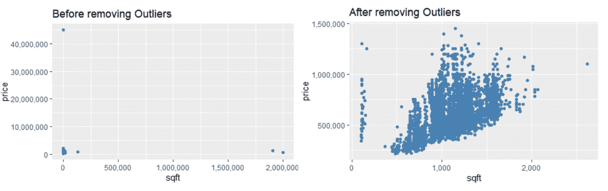
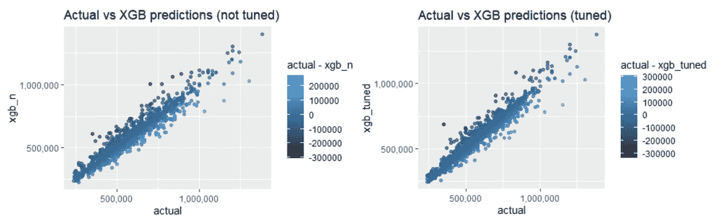
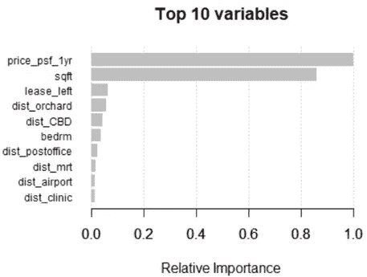

# 我们能用 XGBoost 预测新加坡的公共住房价格吗？(第一部分)

> 原文：<https://medium.com/analytics-vidhya/can-we-use-xgboost-to-predict-public-housing-price-in-singapore-part-1-f58200981fca?source=collection_archive---------12----------------------->

## R 中的极端梯度推进分析

图片来源:来自 [Pixabay](https://pixabay.com/photos/bridge-bishan-park-bishanpark-1931388/) 的孔文五

最近，我的一个亲戚决定去 HDB 的二手房市场找房子，他想知道一套三居室公寓的“公允价值”。出于好奇，我想看看能否回答她的问题，并研究是否有可能预测 HDB 转售市场的房价。

# **研究问题**

(1)HDB 一套三居室转售公寓的中位数价格是多少？
(2)解释 HDB 转售价格的重要变量是什么？
(3)给定物业的一系列特征，我们能多准确地预测 HDB 转售公寓的价格？

# **数据**

三周前，我利用网络搜集技术，从房地产网站 99.co 获得了一个包含 7620 个 HDB 房源的横截面数据集。数据集包含物业级别的变量，如*平方英尺*和*卧室数量*，以及舒适度级别的变量，如*到最近学校的距离*和 1 公里半径内学校的数量*。*

****网络抓取伦理***
明智的做法是先使用 ***robotstxt*** 包来检查我们是否被允许从网页上抓取数据。如果***" paths _ allowed()"***的输出为真，则表示我们准备就绪！如果你对网络搜集的技术感兴趣，一定要访问这篇文章的第二部分，在那里我会举例说明如何从 99.co 获得数据。*

*显然，从包含个人信息的网站上抓取数据是不允许的，比如脸书或 Instagram。*

# ***变量定义***

*以下是数据集中变量含义的简要概述。我将跳过对那些标准变量的解释，如***【bedrm】***，其中指的是房产中卧室的数量。*

****【lease _ left】***指 99 年租约到期的年数；此后，HDB 的所有权将归还给政府。*(是的，你没看错。我们的组屋只向政府租用 99 年。**

****“dist _ CBD”***指物业到中央商务区，或者市中心的距离。*

****【dist _ orchard】***指到新加坡黄金购物带的距离。*

****“dist _ mrt”、“dist_park”、“dist _ sch”***分别指物业到最近的火车站、公园、学校的距离。*

****“捷运数量”、“公园数量”、“学校数量”*** 指该物业 1 公里范围内的火车站、公园和学校数量。*

****“price _ PSF _ 1yr”***是指该街区内房产过去一年每平方英尺的成交均价。*

****【txn _ count _ 1yr】***指过去一年该地块内房产的成交套数。*

*如果我们看一下 [HDB 的网站](https://www.hdb.gov.sg/cs/infoweb/residential/buying-a-flat/new/types-of-flats)，HDB 的公寓一般分为“2 室”、“3 室”、“4 室”、“5 室”和“行政”。***【new _ house type】***体现了这种分类。*

***汇总统计** 我们可以通过***【new _ house type】***对数据进行分组，以获得对平均和中值房价的一些总体看法。*

*乍一看，我怀疑这些数据包含一些异常值。HDB 公寓的转售价格很少达到 100 万美元大关，更不用说了。此外，一套五居室公寓的价格不太可能达到令人瞠目结舌的 4500 万美元！*

*由于这些是房产中介提供的房源数据，而非官方交易数据，因此可能会有一些无意义的条目。因此，在进行进一步分析之前，谨慎的做法是删除异常值。*

**

*作者图片*

*既然已经删除了异常值，让我们再来看看汇总统计数据。哪个区的组屋最贵，哪里可以找到更便宜的组屋？*

*给定 1，311 个观察值的子样本，似乎一套中等的三居室公寓的成本约为 438，000 美元(基于中值价格)。*

*对于大多数居住在[四室公寓](https://www.propertyguru.com.sg/property-management-news/2016/3/119296/more-singaporeans-now-living-in-condos-survey#:~:text=Around%2080.1%20percent%20of%20households,room%20flats%20(18.2%20percent).)的新加坡家庭来说，根据 2753 个观察子样本，他们的房子在今天的市场上预计可以卖到 55 万美元左右(基于中值价格)。*

*从地区层面来看，HDB 2 区、3 区、12 区和 15 区的房价相当高是不足为奇的，因为这些地区靠近市中心。第二区组屋的中位数价格非常接近 100 万美元！*

*相比之下，组屋往往在 23、25、27 和 28 区更实惠，这些区位于新加坡的远北、西北和东北地区。*

# *用 XGBoost 算法预测 HDB 价格*

*现在我们已经查看了汇总统计数据，让我们在实现 **XGBoost** 算法之前预处理我们的数据集。*

*因为 XGBoost 算法只接受数字变量，所以我必须对数据进行两次转换。“character”类型的变量被删除，而分类变量“district”被转换为多个虚拟变量。例如，位于第 28 区的 HDB 公寓如果位于第 28 区，将被赋值为“1”，否则为“0”。“性格”变量的省略不会影响我们的分析。*

*现在，我们可以将数据分为训练集和测试集。我们将使用 80%的数据来训练模型，并留出剩余的 20%来评估模型的预测准确性。*

***为什么是 XGBoost？**
首先，XGBoost 基于梯度增强框架构建，与现有的梯度增强包相比，在计算速度方面可能快 10 倍。其次，就预测准确性而言，它是最好的算法之一(基于许多 Kaggle 数据科学竞赛)。*

*对于 XGBoost 算法背后的数学的直观解释，我建议观看 YouTube 上的 [StatQuest 的视频](https://www.youtube.com/watch?v=OtD8wVaFm6E&ab_channel=StatQuestwithJoshStarmer)。它提供了最好的，也是最简单的解释。*

# ***上面的参数是什么意思？***

****目标= 'reg:squarederror'*** 表示我们面临的是一个回归问题，目标是最小化平方误差。*

****【eta】***指模型的学习率。较低的 eta 值意味着该模型对过拟合更稳健，但计算速度较慢。默认值为 0.3。*

****【n rounds】***控制升压迭代的最大次数。根据 [XGBoost 手册](https://cran.r-project.org/web/packages/xgboost/xgboost.pdf)，较低的 eta 意味着较大的 nrounds 值。*

****【lambda】***为正则化参数，默认值为 0。*

*使用默认值，我们获得了大约 4.93%的平均绝对百分比误差(MAPE)，这已经很不错了！让我们看看是否可以通过调整算法做得更好。*

*这里，我们通过最小化均方根误差(RMSE)指标来要求模型的最佳迭代。虽然 MAPE 略有改善，达到 4.92%，但与之前相比，RMSE 的增长更加明显。*

***实际值与预测值的直观对比** 坦率地说，下面的散点图看起来与我非常相似。但是与 R 平方为 0.8774 的未调优模型相比，调优模型产生了较低的 RMSE 和较高的 R 平方值 0.936。*

**

*左:R 平方= 0.8774。右:R 的平方= 0.936*

***特征重要性** 现在让我们看看特征重要性，看看哪些是解释 HDB 价格变化的最重要变量。*

**

****【price _ PSF _ 1yr】******【sqft】***和***【lease _ left】***等变量是解释 HDB 价格的 3 个最重要的变量。但是，这种产出有经济意义吗？*

*回想一下***“price _ PSF _ 1yr”***是指该区块过去一年的单元平均成交价格。***【price _ PSF _ 1yr】***与 HDB 价格的相关性为 *0.696* ，这表明过去的交易价格是*【粘性】*，买方&卖方隐含地利用它们来形成对 HDB 市场估值的预期。*

****【sqft】***与 HDB 价格的相关性为 *0.44* 。这相当简单；房子越大，市场价格越高。*

****【lease _ left】***与 HDB 价格的相关性为 *0.345* ，这在经济上也是有道理的。较短的***【lease _ left】***意味着房产必须尽快归还政府，理论上应该在转售市场上获得较低的价格。*

*让我惊讶的是，***【dist _ mrt】***和 HDB 在-0.01 只是轻度负相关。直觉上，如果你的房产离火车站更近，价格应该会更高。一个可能的原因是距离溢价已经反映在价格中了。毕竟，[陆路交通管理局](https://www.lta.gov.sg/content/ltagov/en/upcoming_projects.html)一直在扩大铁路网，到 2030 年，10 个家庭中有 8 个将连接到距离火车站不到 10 分钟的地方。*

*最后，我们还有一些变量，如 ***"dist_orchard"*** 和 ***"dist_CBD"*** ，这些变量反映了这样一个事实，即离市中心越近的组屋价格越高。*

# *结论*

*在这篇文章中，我们仔细观察了新加坡的公共住房市场。特别是，我们试图找出 HDB 地区和公寓类型的转售价格的变化，并应用 XGBoost 算法来预测给定一组独特特征的房地产价格。*

*[本文的第 2 部分](https://cheongweisi.medium.com/can-we-use-xgboost-to-predict-public-housing-price-in-singapore-part-2-7291f552dc80)将说明我是如何使用网络抓取技术从 99.co 的网站上获得这里使用的数据集的。*

*在未来，我将在类似的分析中关注新加坡的共管公寓。敬请关注！*

****非常感谢您的阅读！****