# 你能自动向网上卖家建议产品价格吗？Mercari 价格建议挑战

> 原文：<https://medium.com/analytics-vidhya/can-you-automatically-suggest-product-prices-to-online-sellers-mercari-price-suggestion-challenge-c097753c2580?source=collection_archive---------27----------------------->

# **1。业务问题:**

这个问题是基于 https://www.kaggle.com/c/mercari-price-suggestion-challenge 的一场追逐赛。Mercari 是日本最大的社区购物应用程序[https://www.mercari.com/](https://www.mercari.com/)

这是一个帮助零售商在线销售产品的平台。诸如“产品名称”、“产品状况”、“运输信息”、“产品品牌”、“产品描述”等产品信息由卖方提供，并且基于这些属性，卖方对产品报价。由于网上销售的产品种类繁多，最优定价的问题变得更加困难。服装的价格可能会有很大的季节性变化，而电子产品的价格可能与产品规格高度相关，对于古董来说，可能是它的年龄。这里的目标是开发一种算法来帮助建议给定产品的最优价格。

# 2.**利用 ML/DL 解决问题:**

给定的问题可以被认为是关于机器学习应用的回归问题，因为我们需要基于先前的定价信息来预测产品的价格。我们已获得以下信息来解决该问题:

*   `train_id`或`test_id` -列表的 id
*   `name`——清单的标题。请注意，我们已经清理了数据，删除了看起来像价格(例如$20)的文本，以避免泄漏。这些删除的价格表示为`[rm]`
*   `item_condition_id` -卖方提供的物品的状况
*   `category_name` -清单的类别
*   `brand_name`
*   `price` -物品的销售价格。这是你要预测的目标变量。单位是美元。该列在`test.tsv`中不存在，因为这是您将要预测的。
*   `shipping` - 1 表示运费由卖方支付，0 表示由买方支付
*   `item_description` -项目的完整描述。请注意，我们已经清理了数据，删除了看起来像价格(例如$20)的文本，以避免泄漏。这些删除的价格表示为`[rm]`

# 3.**评估指标:**

竞争对手使用的度量标准是 **RMSLE(均方根对数误差)**。

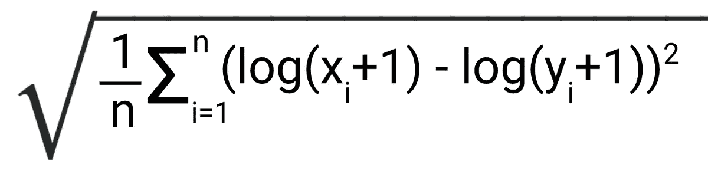

RMSLE 公式已经在下面的博客中很好地解释了[https://medium . com/analytics-vid hya/root-mean-square-log-error-RMSE-vs-RM LSE-935 c6cc 1802 a](/analytics-vidhya/root-mean-square-log-error-rmse-vs-rmlse-935c6cc1802a)

以下是博客中提供的 RMSLE 的属性:

**1。对异常值的鲁棒性:**

由于其基于对数的公式，与 RMSE 相比，RMSLE 在处理异常值时是稳健的。例如:**假设预测值为 X，实际值为 Y**

Y = 60 80 90，X = 67 78 91。经计算，它们的 RMSE 和均方根误差分别为:4.242 和 0.6466

**在数据中引入异常值**

Y = 60 80 90 750，X = 67 78 91 102。现在，在这种情况下，RMSE 和 RMSLE 分别为:374.724 和 1.160。因此，与 RMSLE 相比，RMSE 分数呈指数上升。

2.**相对误差计算:**

与计算绝对误差的 RMSE 相比，RMSLE 只计算相对误差。例如:对于 100 和 90 的预测值和实际值，RMSE =10，RMSLE= 0.105。那么对于 100 和 900 的预测值和实际值，RMSE =100，但 RMSLE=0.105。因此，RMSLE 只对相对误差评分。

# **4。** **探索性数据分析:**

在我们开始为数据公式化特征之前，建立一个关于数据的视角是非常重要的。以下是 EDA 中的重要观察结果:

项目的价格分布:

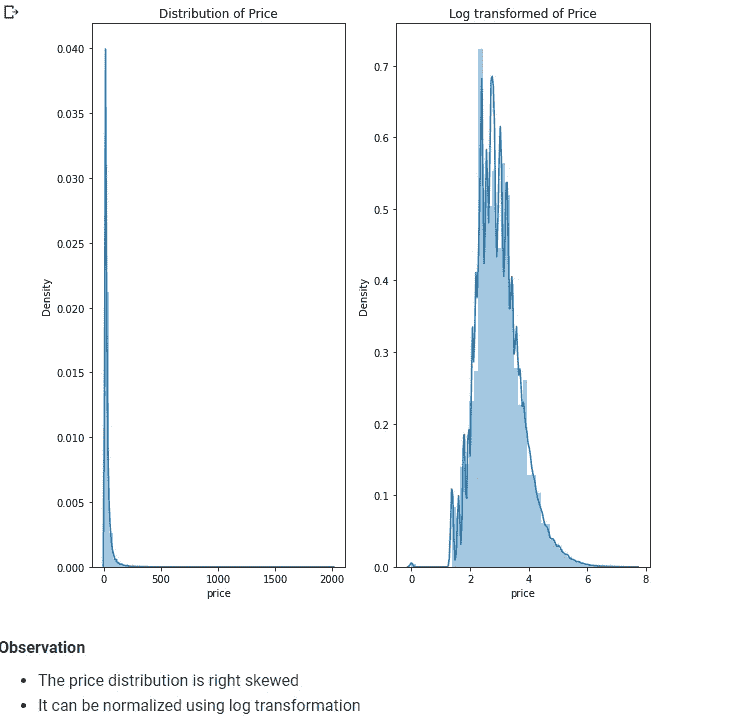

我们绘制累积密度函数来衡量价格最高的区域

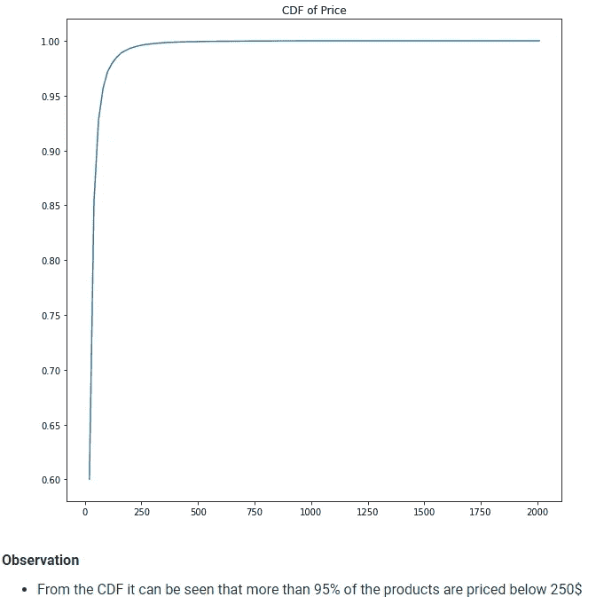

从价格 CDF 可以看出，大多数产品的平均价格都低于 250 美元。

有一些属于特定品牌的免费产品:

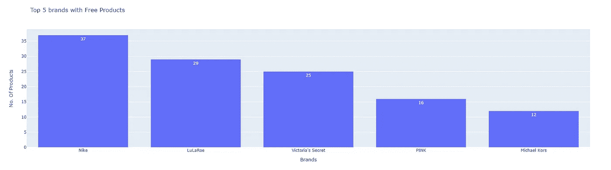

**运费价格分析:**

由于这个平台是在线的，所以运输信息的价格变化是非常关键的。买家发货的产品比卖家发货的产品贵。

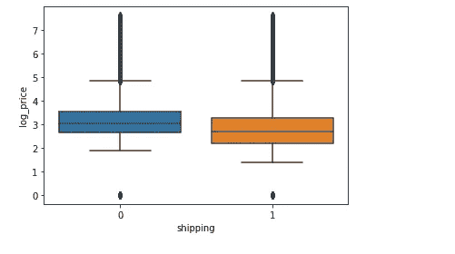

**项目条件价格分析:**

项目条件有五个等级，从“1–5”。item_condition= 5 的价格最高

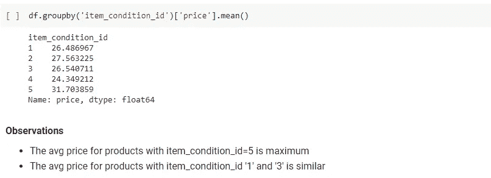

**不同品牌的价格差异:**

在给类似产品定价时，品牌扮演着重要的角色

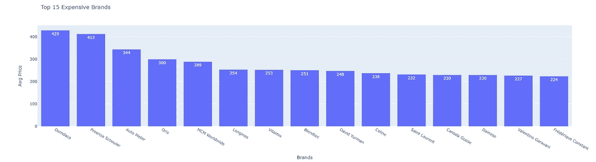

**产品类别分析:**

给定产品大致有 10 个类别，如下所示:

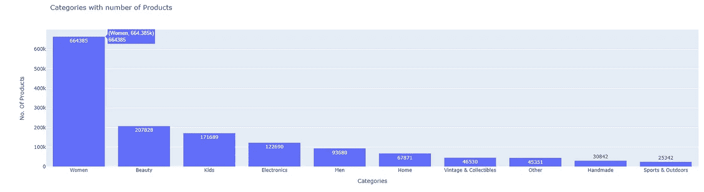

**产品名称分析:**

产品名称在定价中起着关键作用。让我们分析一下最常见的产品名称:

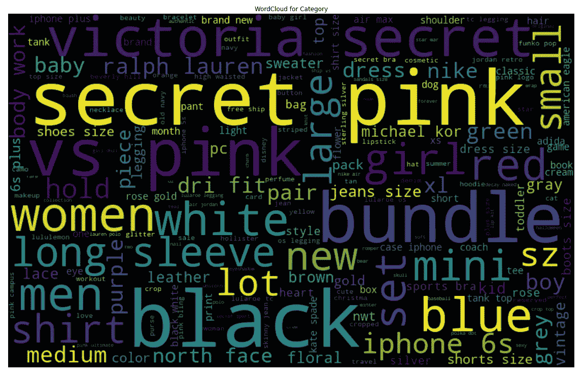

大多数产品名称中都嵌入了品牌名称。

**产品描述分析:**

产品的描述是决定其价格的主要因素:

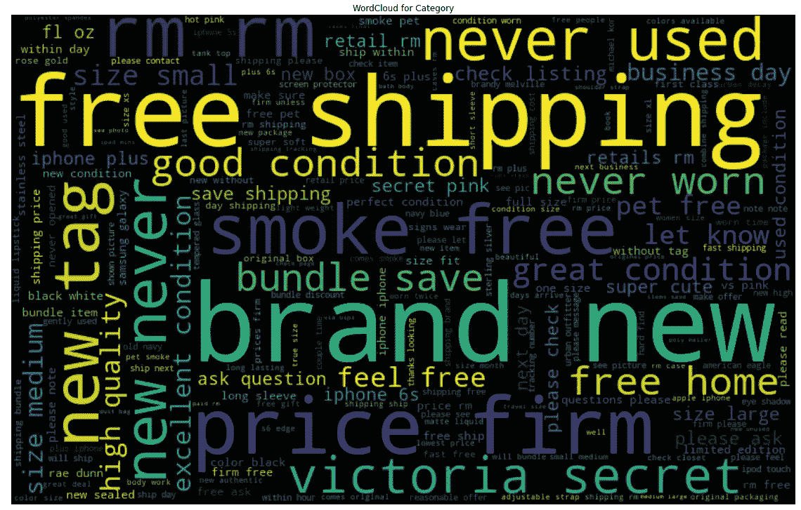

关于产品的描述强调了产品的状况、运输信息、品牌等，这些都是预测价格的关键。

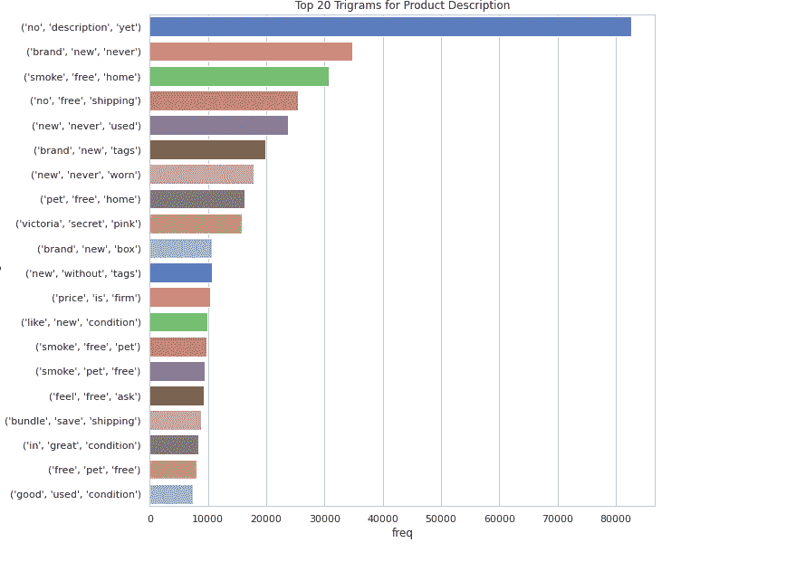

从三元图来看，似乎有 80000 多种产品没有描述。

# **5。特征工程:**

正如他们所说的“垃圾进垃圾出”，特征工程是至关重要的。因此，我使用如下所示的代码片段创建了基本功能:

这已经被用于从产品名称和产品描述中提取特征。它可以被认为是基本文本统计的特征。

# **7。我的模特之路:**

我试验了 5 种基本类型的模型**岭回归器、CatBoost 回归器、LGBM 回归器、LSTM 模型和基于 MLP 的模型**，使用预训练手套模型的 3 种文本编码 **TFIDF、平均单词到向量和 TFIDF 单词到向量。下面是数据编码的代码片段:**

这些函数用于对分类特征执行一次热编码，对数值特征执行数值缩放。

上述功能用于使用基于预训练手套的模型执行 W2V 和 TFIDF W2v。

上述函数用于执行 Tfidf 编码。

具有不同编码的所有模型的摘要如下:

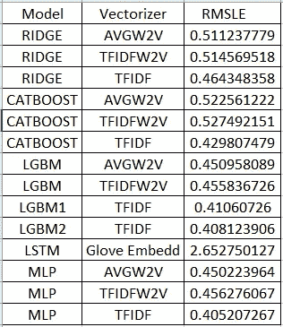

最好的分数是 MLP 模型，批量= 512，如下所示:

在对 MLP 的进一步实验中，我能够将 RMSLE 分数降低到 0.4030793899334728，batchsize=200。但这不足以让她进入排行榜的前 10%。所以我选择了基于 LGBM 和 MLP 模型的集合模型:

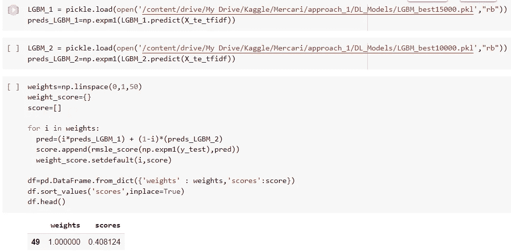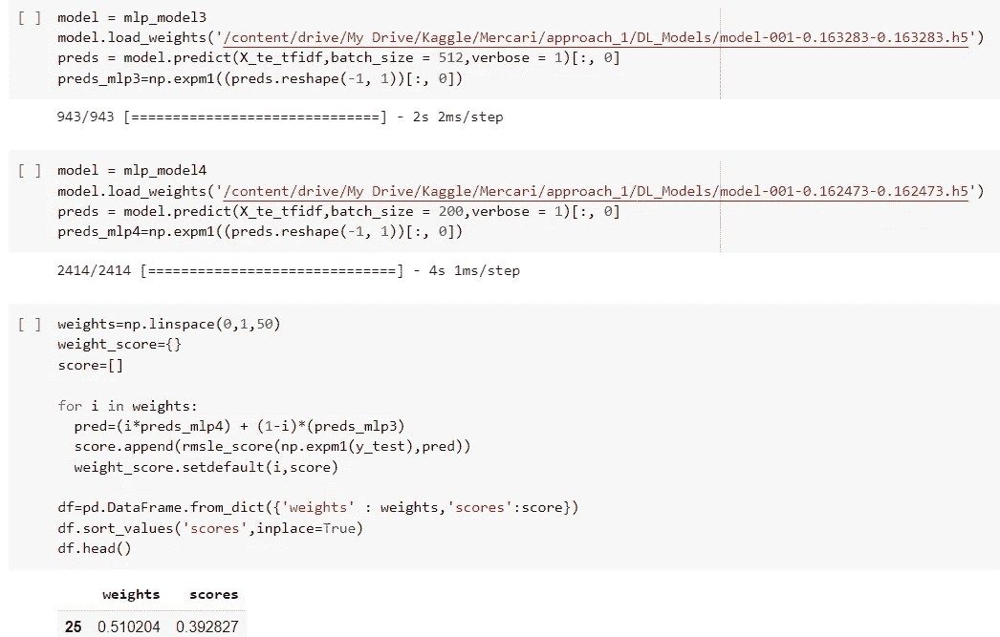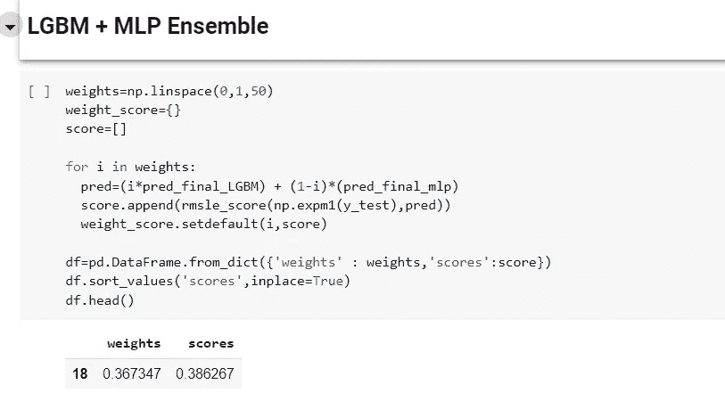

这个组合帮助我进入前 10%，在排行榜上获得第 226 名:

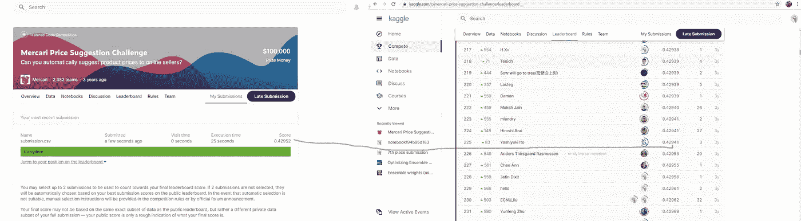

# **8。未来工作:**

想尝试 fastext()编码

可以优化神经网络来提高分数

# **9。如何联系我:**

我的 Linkedin 简介[**链接**](https://www.linkedin.com/in/akash-anande-it/) 代码链接为 Github [**链接**](https://github.com/Akashaanande/Mercari-Price-Prediction-Case-Study)

# 10。参考文献:

我引用了以下链接作为我的案例研究:

[https://medium . com/analytics-vid hya/root-mean-square-log-error-RMSE-vs-RM LSE-935 c6cc 1802 a](/analytics-vidhya/root-mean-square-log-error-rmse-vs-rmlse-935c6cc1802a)

[https://www . ka ggle . com/c/Mercedes-benz-greener-manufacturing/discussion/36128](https://www.kaggle.com/c/mercedes-benz-greener-manufacturing/discussion/36128)

[https://www . ka ggle . com/c/Mercedes-benz-greener-manufacturing/discussion/36390](https://www.kaggle.com/c/mercedes-benz-greener-manufacturing/discussion/36390)