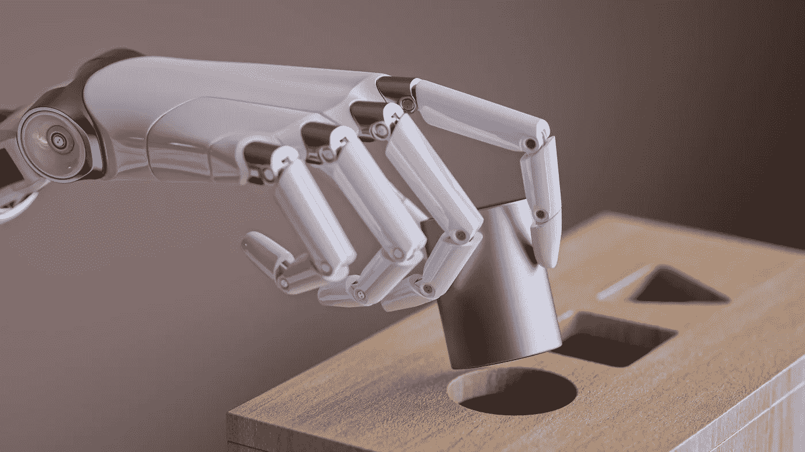
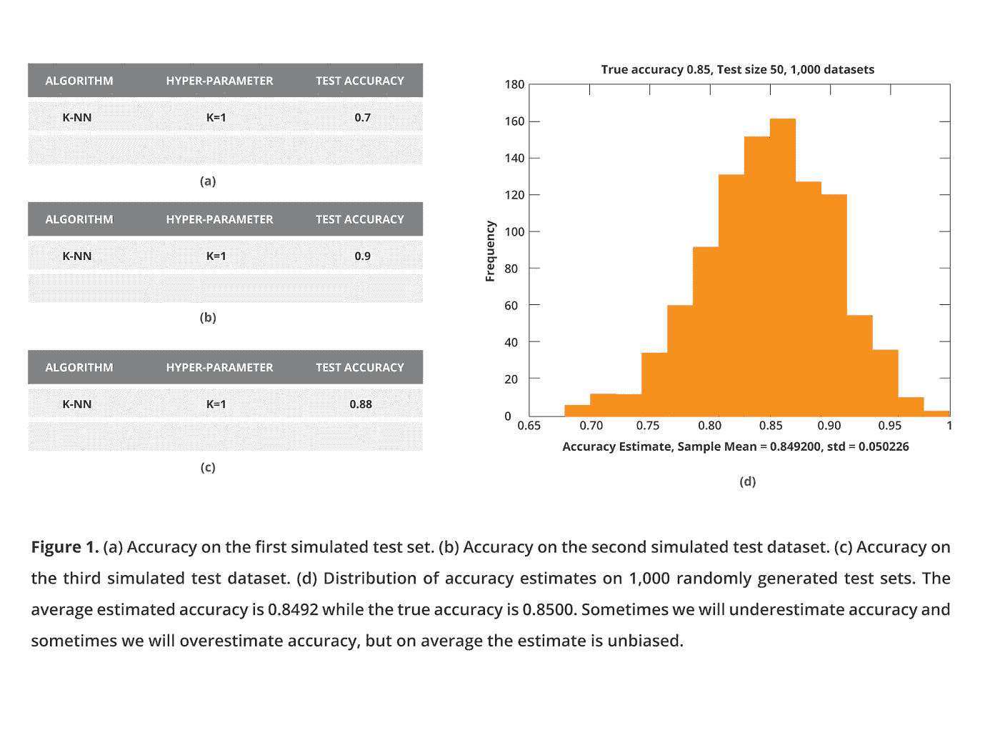
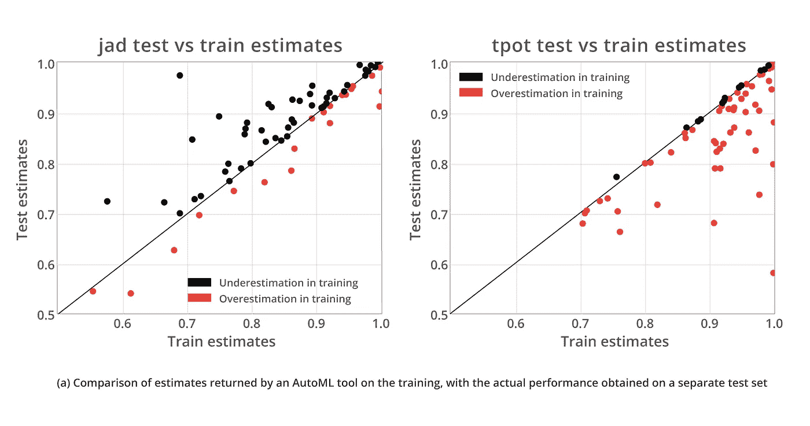

# 你能信任 AutoML 吗？

> 原文：<https://medium.com/analytics-vidhya/can-you-trust-automl-3a02332e66a0?source=collection_archive---------12----------------------->

*根据许可通过 Shutterstock 拍摄图像*

**什么是 AutoML？**

自动机器学习(AutoML)承诺端到端地自动化机器学习过程。它是机器学习和数据科学的一个快速崛起的超热门子领域。AutoML 平台尝试数百甚至数千个不同的 ML 管道，称为 ***配置*** ，结合不同分析步骤(转换、插补、特征选择和建模)的算法及其相应的超参数。他们经常交付击败专家并赢得竞争的模型，所有这些都只需要点击几下鼠标或几行代码。

**需要评估性能**

然而，仅仅获得一个模型是远远不够的！除非有预测性能的保证，否则不能相信模型的预测。模型几乎总是准确的还是更接近随机猜测？我们可以依赖它来决定诊所的生死或需要花钱的商业决策吗？对样本外(新的、看不见的样本)性能进行可靠的估计是至关重要的。一个好的分析师会为你提供它们，AutoML 工具也是如此。现有的 AutoML 库和平台会返回对其模型性能的可靠评估吗？

测试集的大小是多少？

嗯，有些 AutoML 工具根本不返回任何估计值！举个例子，有争议的，最流行的 AutoML 库:auto sklearn。它的作者建议，为了评估性能，您应该拿出一个独立的、未受污染的、库看不到的测试集来严格地评估最终模型的性能。像 auto sklearn 这样的工具本质上提供的是一个组合的算法选择和超参数优化( **CASH** )或超参数优化( **HPO** )引擎。它们可能非常有用和普及，但只是部分实现了 AutoML 愿景。毕竟，如果您被要求决定最优的测试规模，编写应用模型的代码，以及做评估的代码，那么这个工具就不是完全自动化的。决定最佳测试规模并不简单。它需要机器学习技能和知识。这需要专家。你应该遗漏 10%、20%或 30%的数据吗？您应该随机划分还是根据结果类别分层划分。如果你有 100 万个样本呢？你会忽略百分之几？如果你有 1，00 0，000 个样本，而阳性类的患病率是 100，000 分之一，那会怎样？如果你有一个像生存分析那样的审查结果呢？对于您的测试集来说，多少是足够的，这样估计才是准确的？你如何计算你的估计值的置信区间？一旦你让用户决定测试集估计，你就不能再声称你的工具将机器学习“民主化”给了非专家分析师。

**估计丢失样本**

然而，进行单独的坚持测试会产生额外的、更深层次的、更严重的问题。隐瞒的数据是“估计损失”它可能是我们不得不花大价钱收集或测量的珍贵数据，我们不得不等待很长时间才能获得的数据，我们只是用它们来衡量一个模型的有效性。它们不是用来改进模型和我们的预测的。在许多应用程序中，我们可能没有足够的奢侈去忽略一个相当大的测试集！我们需要分析新型冠状病毒(新冠肺炎)的数据，只要我们观察到最初的几例死亡。在我们等待足够长的时间，让 1000 个受害者“备用”来进行性能评估之后，就不会了。当竞争对手推出新的产品时，我们需要分析我们最近的数据并立即做出反应，而不是等到有足够多的客户退出。“小”样本数据也很重要。他们就在那里，他们将永远在那里。 ***大数据可能在计算上具有挑战性，但小样本数据在统计上具有挑战性*** 。需要额外测试集的 AutoML 平台和库不适合分析小样本数据。

**从评估模型性能到评估配置性能**

其他 AutoML 工具只根据您的输入数据返回性能评估。它们不需要您选择测试集大小，真正实现了过程的自动化，并且名副其实。想法是这样的:最终的模型是在**所有输入数据**上训练出来的。平均而言，由于分类器随着样本量的增加而改进，这将是最好的模型。但是，我们没有任何样本进行评估。嗯，交叉验证和类似的协议(例如，重复拒绝)使用代理模型来估计最终模型的性能。他们培训了许多其他具有相同配置的车型。所以， ***他们不直接估计预测模型的性能；他们评估产生模型*** 的配置(学习方法，流水线)的性能。但是，你能相信他们的估计吗？这让我们想到了所谓的“赢家的诅咒”

**评估单一配置的性能**

我们将用一个小的模拟实验来说明一个有趣的统计现象。首先，我们将尝试评估一个**单一配置**的性能，该配置由一个具有特定超参数(比如 1-最近邻)的分类器组成。我模拟了一个由 50 个样本组成的测试集，用于 50–50%分布的二元结果。我假设我的分类器有 85%的机会提供正确的预测，即 85%的准确率。下图(a)显示了我在第一次尝试中获得的精度估计值。然后，我生成第二个(b)和第三个(c)测试集以及相应的估计。

有时我的模型在特定的测试集上有点幸运，我估计性能高于 0.85。事实上，有一次模拟，模型在几乎所有 50 个样本中都是正确的，并且获得了 95%-100%的准确度。其他时候，模型在特定的测试集上会不走运，我会低估性能，但平均来说，估计是正确的，无偏的。我不会欺骗我自己、我的客户或我的科学家同事。

**赢家的诅咒(或者为什么你总是高估自己)**

现在，让我们模拟 AutoML 库和平台实际做什么，也就是**尝试数千种配置**。为了简单起见，我假设我只有 3 种不同算法(K-NN、决策树和简单贝叶斯)的 8 种配置(而不是数千种)与一些超参数值匹配。每次我应用所有的*，在相同的测试集上评估它们的性能，*选择最好的一个*作为我的最终模型，*报告获胜配置的评估性能*。在模拟中，我假设所有配置都导致 85%准确性的同等预测模型。*

**

*1000 次模拟后会发生什么？平均起来，我的估计是 0.916，而真实的准确率是 0.85。我系统性地高估了自己。不要自欺欺人；交叉验证会得到相同的结果。为什么会这样？这种现象与统计学中的“赢家的诅咒”有关，即在许多模型中优化的效应大小往往被高估。在机器学习中，这一现象首先由大卫·延森发现，并命名为“多重归纳问题”[Jensen，Cohen 2000]。但是，让我们面对它“赢家的诅咒”更酷(对不起大卫)。从概念上讲，这种现象类似于多重假设检验。我们需要使用错误发现率的 Bonferroni 程序来“调整”产生的 *p* 值。类似地，当我们交叉验证许多配置时，我们需要针对多次尝试“调整”获胜配置的交叉验证性能。所以……***当你交叉验证一个单一配置的时候，你就获得了一个准确的性能估计*** (实际上是对所有数据训练出来的模型的保守估计)； ***当您交叉验证多个配置并报告获胜配置的估计值时，您高估了性能。****

***真的重要吗？***

*这种高估真的意义重大，还是仅仅出于学术好奇？嗯，当你有一个大而平衡的数据集时，这是不明显的。在小样本数据集或非常不平衡的数据集上，其中一个类只有几个样本，这可能会变得非常重要。它可以轻松达到 15-20 个 AUC 点[Tsamardinos et al. 2020]，这意味着您的真实 AUC 等于随机猜测(0.50)，您报告 0.70，对于某些域来说，这被认为是值得尊敬和可公布的性能。高估程度越高(a)某些类别的样本量越小，(b)您尝试的配置越多，(c)您的配置产生的模型越独立，以及(d)您的获胜模型越接近随机猜测。*

***高估可以修复吗？我们能打败赢家的诅咒吗？***

*那么，我们该怎么解决呢？至少有三种方法。第一个是——你猜对了——提供一个单独的测试集，我们称之为评估集。每个配置的交叉验证期间的测试集用于选择最佳的一个(即用于*调整*)并且被每个配置多次“看到”。评估集将只被使用一次，只是为了评估最终模型的性能，所以没有“赢家的诅咒”但是，接下来，当然，我们又回到了和以前一样的问题“丢失估计样本”第二种方法是做一个**嵌套交叉验证**【Tsamardinos et al .，2018】。这个想法是这样的:我们认为选择获胜的模型是我们学习过程的一部分。我们现在有了一个**单一程序**(如果你愿意，可以称之为元配置)，它会尝试许多配置，使用交叉验证选择最佳配置，并使用获胜的配置在所有输入数据上训练最终模型。**我们现在交叉验证我们的单一学习程序**(它在内部也对每个配置执行交叉验证；因此，术语嵌套)。嵌套交叉验证是准确的(参见[Tsamardinos et al. 2018]中的图 2)，但计算量相当大。它训练 O( *C* ⋅ *K* 2)模型，其中 *C* 是我们尝试的配置数量， *K* 是我们交叉验证中的折叠数量。不过还好，有更好的办法；**自举偏差校正 CV** 或 **BBC-CV** 方法【Tsamardinos 等人 2018】。BBC-CV 与嵌套交叉验证(Tsamardinos et al. 2018 中的图 2)一样精确，并且快一个数量级，即 trains O(C⋅K)模型。 ***BBC-CV 从本质上消除了拥有单独评估集*** 的需要。*

*那么，我们可以信任 AutoML 吗？*

*回到我们的激励问题:我们能信任 AutoML 吗？尽管在 AutoML 上做了很多工作，几十篇论文，竞赛，挑战和比较评估，**到目前为止没有人检查这些工具是否返回准确的估计值**？没人知道，直到我们最近的几个作品[Xanthopoulos 2020，Tsamardinos 等人 2020]。在下图中，我们比较了两个 AutoML 工具，分别是 TPOT[奥尔森等人 2016]和我们自己的 Just Add Data Bio，或者简称为 JADBio [Tsamardinos 等人 2020](【www.jadbio.com】T2)。TPOT 是一个常用的免费 AutoML 库，JADBio 是我们使用 BBC-CV 的商业 AutoML 平台。JADBio 的设计考虑了这些估计因素，特别是包含小样本、高维度的生物数据。假设从生物数据中学习的模型可以在关键的临床应用中使用，例如，预测治疗反应和优化治疗，我们确实努力返回准确的性能估计。*

*我们在 openml.org 的 100 个二元分类问题上尝试了这两个系统，涵盖了广泛的样本大小、特征大小和平衡比(详见[Xanthopoulos 2020])。每个数据集被分成两半，一个馈送给 AutoML 工具并获得模型和自我评估的估计(由 AutoML 平台评估的模型的估计，称为训练估计)，另一个应用模型(测试集上的模型的估计，称为测试估计)。性能指标是 AUC。每个点都是一个数据集上的实验。红点是对角线下方的点，测试估计低于训练估计，即高估的性能。黑点是对角线上方的点，这里的性能被低估了。*

**

*TPOT 严重高估了表现。在一些数据集上，该工具估计模型的性能为 1.0！在其中一种情况下(最低红点)，测试中的实际表现低于 0.6，危险地接近随机猜测(0.5 AUC)。很明显，你应该对 TPOT 的自我评估持怀疑态度。你需要将样本输给一个坚持测试集。另一方面，JADBio 系统地低估了性能。其图形中间的最高黑点在测试中接近 1.00 AUC，但估计性能低于 0.70 AUC。平均而言，杰德比奥的估计更接近对角线。本实验中的数据集有 100 多个样本，有的超过数万个。在其他更具挑战性的实验中，我们在 370 多个组学数据集上测试了我们的系统 JADBio，样本规模小至 40 个，平均特征数量为 80，000 多个。使用 BBC-CV 的 JADBio 没有高估性能[Tsamardinos 等人，2020]。不幸的是，不仅仅是 TPOT 表现出这种行为。其他类似的评估和初步结果表明，这可能是 AutoML 工具的常见问题[Xanthopoulos 2020]。*

***不要相信和验证***

*总之，首先，当心 AutoML 工具的性能自我评估。当您自动化分析并生成数千个模型时，很容易高估性能。在您完全保留部分数据的数据集上尝试您最喜欢的工具。您需要多次这样做来衡量平均行为。尝试具有挑战性的任务，如小样本或高度不平衡的数据。高估的程度可能取决于元特征(数据集特征)，如缺失值的百分比、离散特征的百分比、离散特征的值的数量等。因此，尝试与您通常分析的数据集具有相似特征的数据集！第二，即使你不使用 AutoML 并且你自己编码分析，你仍然可能产生许多模型并且报告未调整的，未修正的交叉验证的获胜模型的估计。“赢家的诅咒”无时无刻不在困扰着你。你不想向你的客户、老板、教授或论文评审报告一个高度膨胀、过于乐观的表现，是吗？…或者，你会吗？*

***参考文献***

**【詹森博士和科恩博士(2000)* [*归纳算法中的多重比较*](https://arizona.pure.elsevier.com/en/publications/multiple-comparisons-in-induction-algorithms) *。马赫。学习。, 38, 309–338.]**

**【Tsamardinos I .、Charonyktakis P .、Lakiotaki K .、Borboudakis G .、Zenklusen J.C .、Juhl H .、Chatzaki E .和 Lagani V. (2020)* [*只需添加数据:自动预测建模和生物特征发现。*](https://www.biorxiv.org/content/10.1101/2020.05.04.075747v1)*

***【Tsamardinos I .、Greasidou E .和 Borboudakis g .(2018)*[*自举样本外预测，实现高效准确的交叉验证。*](https://link.springer.com/article/10.1007/s10994-018-5714-4) *马赫。学习。, 107, 1895–1922.】***

***【约尔达尼斯·黄波罗斯，硕士论文，克里特大学计算机科学系，2020 年】***

***【Olson r . s .、Bartley N .、Urbanowicz R.J .和 Moore J.H. (2016)* [*评估一种用于自动化数据科学的基于树的管道优化工具。*](https://arxiv.org/abs/1603.06212)*ge CCO 2016—2016 遗传与进化计算会议论文集。美国纽约州纽约市 ACM 出版社，第 485-492 页。】***

****作者****

***合著者:Ioannis Tsamardinos (JADBio)、Iordanis Xanthopoulos(希腊克里特大学)、Vassilis Christophides(法国 ENSEA)***