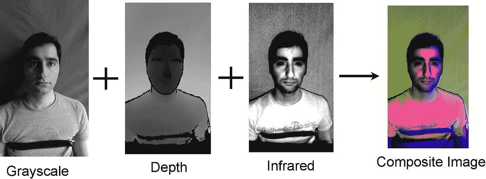
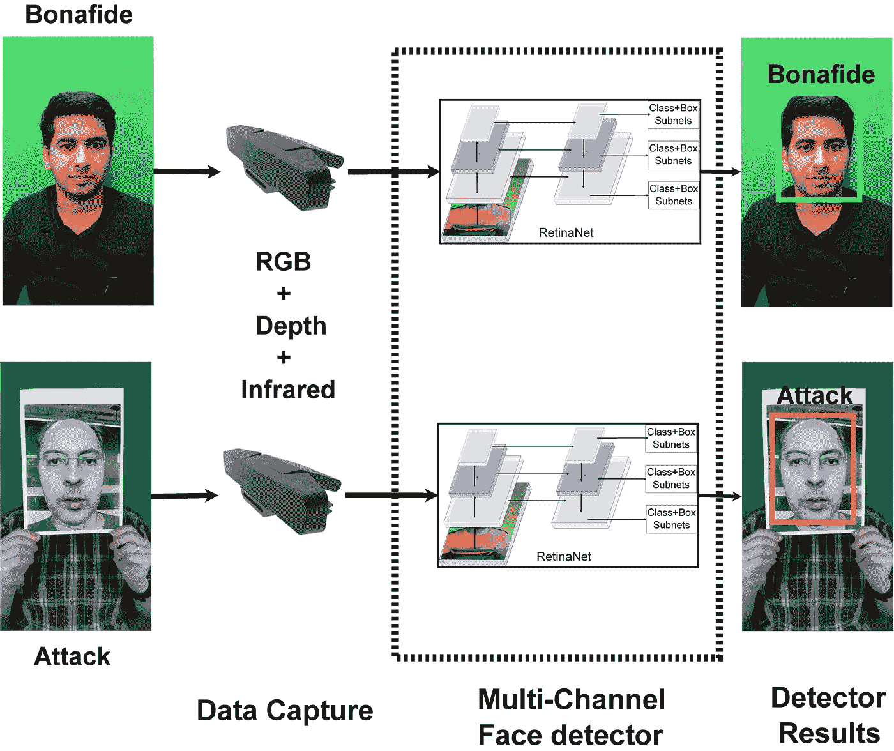

# 你的人脸检测器可以反欺骗吗？用多通道人脸检测器检测人脸呈现攻击

> 原文：<https://medium.com/analytics-vidhya/can-your-face-detector-do-anti-spoofing-3460a57e585a?source=collection_archive---------25----------------------->

典型的人脸识别系统可以被简单的攻击欺骗，比如打印一张照片，或者在摄像机前播放一段视频。使用 3D 面具和化妆，袭击可能会更加复杂。 ***呈现攻击检测*** (PAD)方法试图保护人脸识别系统免受这些漏洞的影响，通过拥有单独的管道来对人脸的 ***活性*** 进行分类。

攻击可以有两种类型，当某人想要被识别为其他人时的 ***冒充攻击*** ，以及当某人想要逃避识别时的 ***混淆攻击*** 。

大多数 PAD 系统包括涉及人脸检测的流水线，接着是一些预处理，然后是将人脸图像分类为真实或欺骗的分类器。这是人脸识别流水线中的唯一阶段，并且它增加了人脸识别系统的计算成本。此外，当使用的传感器仅仅是彩色图像时，抵抗复杂类型攻击的性能通常很差。

将三个通道组合成合成图像

论文 [**你的人脸检测器能做反欺骗吗？多通道人脸检测器**](https://arxiv.org/pdf/2006.16836.pdf) 的人脸呈现攻击检测，引入了一种全新的处理呈现攻击的方式。这个想法非常简单，可以很容易地用你最喜欢的深度学习框架([**TF**](https://www.tensorflow.org/)/[**py torch**](https://pytorch.org/))提供的任何最先进的对象检测器来实现。

思路如下:*不是先检测人脸，分类为真/假*把人脸检测器的任务改成 ***检测真实人脸*** 。嗯，说起来容易做起来难。问题是，试图用彩色图像来做这件事会导致很多检测失败和假阳性，这并不奇怪，因为如果只使用 RGB 通道，真实的人脸和所谓的高质量打印看起来是一样的。

具有内置反电子欺骗能力的用于同时人脸定位的多通道人脸检测器

解决方案是使用多通道信息，现有的相机可以提供 RGB-D，如 [**Kinect**](https://developer.microsoft.com/en-us/windows/kinect/) ，即将推出的[**OpenCV AI Kit-D(OAK-D)**](https://opencv.org/introducing-oak-spatial-ai-powered-by-opencv/)，或 [**英特尔 Realsense**](https://www.intelrealsense.com/depth-camera-d415/) 系列传感器可以提供 RGB-D 和红外通道。最低要求是应该有一个以上的信息通道可用(比如 RGB 和 D)。现在将多通道信息堆叠在一起，形成 4 通道(RGB-D)或 5 通道(RGB-D-红外)图像。然后采用任何目标检测框架( [RetinaNet](https://github.com/yhenon/pytorch-retinanet) 或 [Detectron](https://github.com/facebookresearch/detectron2) 或 [YOLO](https://github.com/ultralytics/yolov5) )来定位人脸。必须注意将攻击位置标记为*非面部*类。地面真实位置可以通过单独在颜色通道上运行标准人脸检测器来获得。

由于多通道信息，以这种方式训练的模型应该能够正确地检测真实/活体人脸。您可以通过添加更多通道(如热通道)来提高该方法的鲁棒性。更多细节可在参考文件中找到。

**参考文献**

1.  乔治，马塞尔。，*你的人脸检测器能做反欺骗吗？使用多通道人脸检测器检测人脸呈现攻击*。2020 年 Idiap 研究报告。