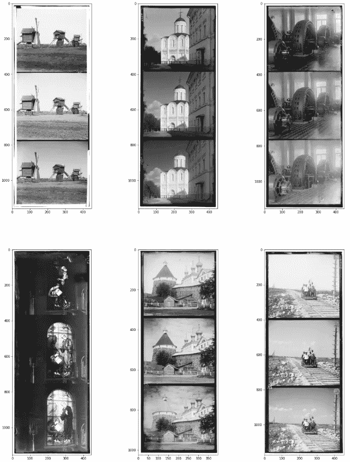
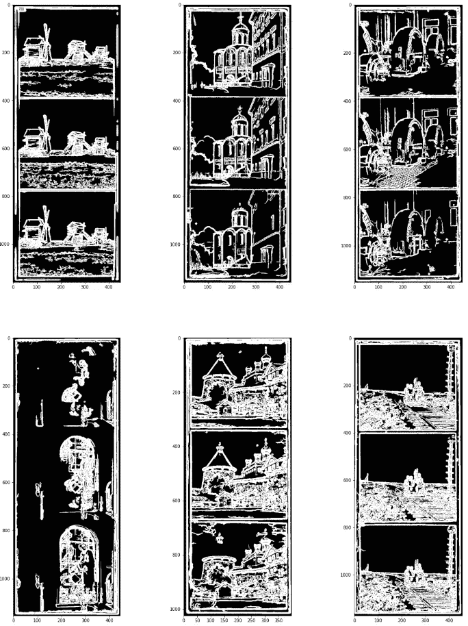
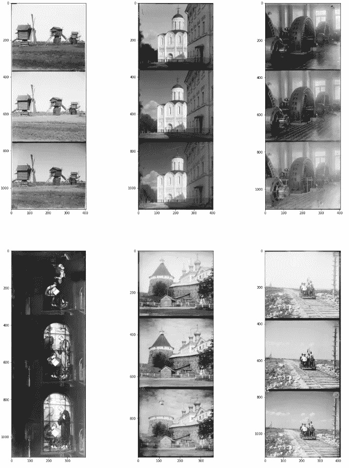
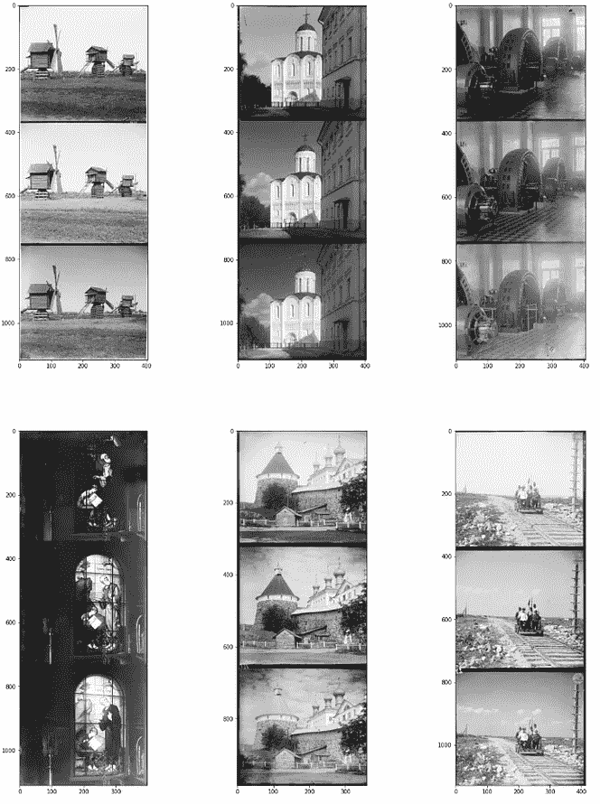

# Canny 边缘检测器

> 原文：<https://medium.com/analytics-vidhya/canny-edge-detector-7b8037fa0764?source=collection_archive---------5----------------------->

让我们用 Python 实现一个 canny 边缘检测器并移除输入图像的边界。

让我们直接进入实现，因为我们已经在[文章](/analytics-vidhya/introduction-to-computer-vision-5e104ed62ef1)中讨论了边缘检测的基础知识。为了更好地理解这一过程，请务必阅读。

## **数据可视化**

**输入图像加载和可视化**

我们使用 Matplotlib、NumPy、OS 和 CV2 库进行可视化。

给定函数接受给定目录的输入，并返回该目录中的图像数组。这里，我们将数组加载到变量“plates”中。

```
 **def** load_data(dir_name = 'plates'):
    imgs=[]
    **for** root,dirs,files **in** os.walk(dir_name):
        **for** filename **in** files:
            **if** filename.endswith('.png'):
                img=cv2.imread(os.path.join(root,filename),0)
                imgs.append(img)
    **return** np.array(imgs)

plates = load_data()
```

现在我们将可视化加载的图像。辅助函数“visualize()”显示作为参数给出的图像。

```
**def** visualize(imgs, format=**None**):
    plt.figure(figsize=(20, 40))
    **for** i, img **in** enumerate(imgs):
        **if** img.shape[0] == 3:
            img = img.transpose(1,2,0)
        plt_idx = i+1
        plt.subplot(3, 3, plt_idx)    
        plt.imshow(img, cmap=format)
    plt.show()

visualize(plates, 'gray')
```



“可视化”功能的输出

## Canny 检测器实现

**Canny 检测算法**

1.  *降噪:*为了去除噪声，对图像进行高斯模糊平滑，核大小为 5×5，sigma = 1.4。由于高斯核中的元素之和等于 1，所以在卷积之前应该对核进行归一化。
2.  *计算渐变:*当图像 *I* 平滑后，计算导数 *Ix* 和 *Iy* w.r.t *x* 和 *y* 。它们可以通过将图像 *I* 分别与 Sobel 核 *Kx* 和 *Ky* 进行卷积来实现。然后，计算幅度 G 和斜率θ。
3.  *非最大抑制。*对于每个像素，找到两个邻居(在正负梯度方向，假设每个邻居占据 *pi/4* 的角度，并且 *0* 是向右的方向)。如果当前像素的幅值大于相邻像素的幅值，则没有任何变化，否则，当前像素的幅值被设置为零。
4.  *双门槛。*将梯度幅度与两个指定的阈值进行比较，第一个小于第二个。小于低阈值的梯度被抑制；高于高阈值的梯度被标记为强梯度，并且相应的像素被包括在最终的边缘图中。所有剩余梯度被标记为弱梯度，并且在下一步中考虑对应于这些梯度的像素。
5.  *通过滞后进行边缘跟踪。*由于由真实边缘引起的弱边缘像素将连接到强边缘像素，所以当且仅当具有弱梯度的像素 *w* 与具有强梯度的像素 *s* 包含在相同的斑点(连接成分)中时，具有弱梯度的像素被标记为边缘并包括在最终的边缘图中。换句话说，应该有一个连接 *w* 和 *s* 的相邻弱像素链(相邻像素是所考虑像素周围的 8 个像素)。

让我们用这个算法来定义这个函数。

```
**from**  **skimage.feature** **import** canny
**from** **skimage** **import** dtype_limits
**from** **scipy** **import** ndimage
**from** **scipy.ndimage.filters** **import** convolve, gaussian_filter

**def** Canny_detector(img,highThreshold=91,lowThreshold=31):
  img=np.array(img,dtype=float) *#convert to float to prevent clipping values*

  *#step1: Noise reduction*
  img=gaussian_filter(img,sigma=1.4,truncate=3.3)

  *#step2: Calculating gradients*
  Kx=[[-1,0,1],[-2,0,2],[-1,0,1]]  *#Sobel filters*
  Ky=[[1,2,1],[0,0,0],[-1,-2,-1]]
  Ix=convolve(img,Kx)
  Iy=convolve(img,Ky)
  grad=np.hypot(Ix,Iy) *#magnitude of gradient*
  theta=np.arctan2(Iy,Ix) *#slope theta of gradient*

  thetaQ=(np.round(theta*(5.0/np.pi))+5)%5 *#Quantize direction*

  *#step3: Non-maximum suppression*
  gradS=grad.copy()
  **for** r **in** range(img.shape[0]):
    **for** c **in** range(img.shape[1]):
      *#suppress pixels at the image edge*
      **if** r==0 **or** r==img.shape[0]-1 **or** c==0 **or** c==img.shape[1]-1:
        gradS[r,c]=0
        **continue**
      tq=thetaQ[r,c] % 4

      **if** tq==0: *#0 is E-W (horizontal)*
        **if** grad[r,c] <= grad[r,c-1] **or** grad[r,c]<=grad[r,c+1]:
          gradS[r,c]=0
      **if** tq==1: *#1 is NE-SW*
        **if** grad[r,c] <= grad[r-1,c+1] **or** grad[r,c]<=grad[r+1,c-1]:
          gradS[r,c]=0
      **if** tq==2: *#2 is N-S (vertical)*
        **if** grad[r,c] <= grad[r-1,c] **or** grad[r,c]<=grad[r+1,c]:
          gradS[r,c]=0
      **if** tq==3: *#3 is NW-SE*
        **if** grad[r,c] <= grad[r-1,c-1] **or** grad[r,c]<=grad[r+1,c+1]:
          gradS[r,c]=0

    *#step4: Double threshold*
    strongEdges=(gradS>highThreshold)
    *#strong has value 2, weak has value 1*
    thresholdEdges=np.array(strongEdges,dtype=np.uint8)+ (gradS>lowThreshold)

    *#step5: Edge tracking by hysterisis*
    *#Find weak edge pixels near strong edge pixels*
    finalEdges=strongEdges.copy()
    currentPixels=[]
    **for** r **in** range(1,img.shape[0]-1):
      **for** c **in** range(1,img.shape[1]-1):
        **if** thresholdEdges[r,c]!=1:
          **continue** *#Not a weak pixel*

        *#get a 3X3 patch*
        localPatch=thresholdEdges[r-1:r+2,c-1:c+2]
        patchMax=localPatch.max()
        **if** patchMax==2:
          currentPixels.append((r,c))
          finalEdges[r,c]=1

    *#Extend strong edges based on current pixels*
    **while** len(currentPixels) > 0:
      newPixels=[]
      **for** r,c **in** currentPixels:
        **for** dr **in** range(-1,2):
            **for** dc **in** range(-1,2):
              **if** dr==0 **and** dc==0:
                **continue**
              r2=r+dr
              c2=c+dc
              **if** thresholdEdges[r2,c2]==1 **and** finalEdges[r2,c2]==0:
                *#copy this weak pixel to final result*
                newPixels.append((r2,c2))
                finalEdges[r2,c2]=1
      currentPixels= newPixels

    **return** finalEdges
```

现在让我们对输入图像应用这个函数。

```
canny_imgs = []
**for** img **in** plates:
    canny_img = Canny_detector(img)
    canny_imgs.append(canny_img)

visualize(canny_imgs, 'gray')
```



描述 canny 边缘变换的“可视化”函数的输出

## 边界移除

值得注意的是，大部分图像都有来自四面八方的取景。这种成帧会明显恶化通道对准的质量。这里，我们使用 Canny 边缘检测器找到车牌上的边界，并根据这些边缘裁剪图像。

**边框去除算法**

可以通过以下方式移除边框:

*   将 Canny 边缘检测器应用于图像(已经应用)。
*   找出帧像素的行和列。例如，在上限的情况下，我们将在图像的上边缘的邻域中搜索行(例如，其高度的 5%)。
*   对于每一行，让我们计算它包含的边缘像素的数量(使用 Canny 检测器获得)。有了这些数字，让我们找到其中的两个最大值。对应于这些最大值的两行是边缘行。
*   由于帧中有两种颜色变化(首先，从浅色扫描仪背景到深色磁带，然后从磁带到图像)，我们需要距离图像边界更远的第二个最大值。
*   对应于该最大值的行是裁剪边界。为了不找到两个相邻的峰值，应该实现非最大值抑制:将第一个最大值旁边的行设置为零，然后搜索第二个最大值。

让我们用这个算法来定义这个函数。

```
**def** remove_borders(img, canny_img):   
    dx = int(img.shape[1] * 0.05) 
    **return** img[dx : -dx, dx : -dx]
```

现在，让我们将该函数应用于之前获得的 canny 图像。

```
cropped_imgs = []
*#crop borders*
**for** i, img **in** enumerate(plates):
    cropped_imgs.append(remove_borders(img, canny_imgs[i]))

visualize(cropped_imgs, 'gray')
```



描述边界移除的“可视化”功能的输出

让我们比较一下所有的图像:



输入图像(左)，Canny 边缘检测器转换的图像(中)，从图像中移除的边界(右)

感谢您的阅读！

快乐学习！