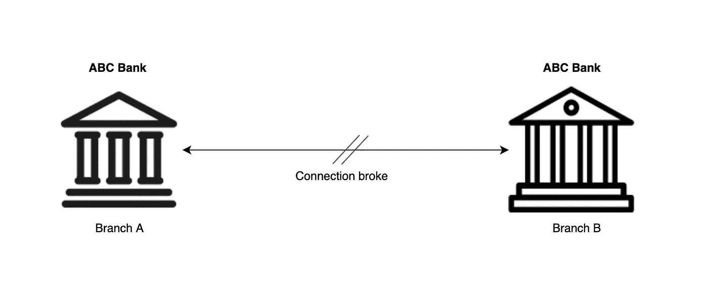
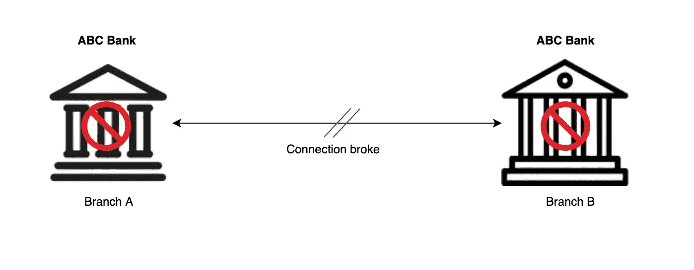
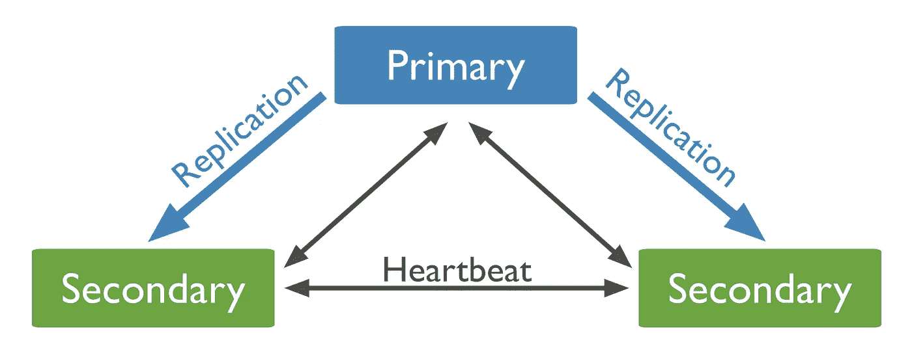
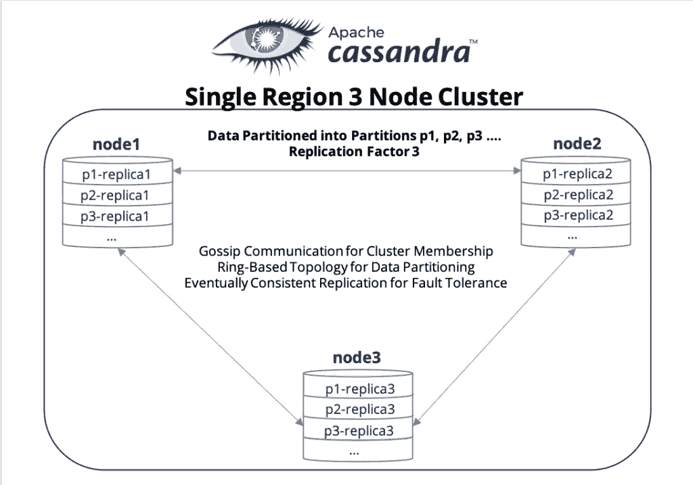

# CAP 定理和分布式系统

> 原文：<https://medium.com/analytics-vidhya/cap-theorem-e82890777ea2?source=collection_archive---------11----------------------->

无檐软平帽

**CAP 定理**指出分布式数据存储不可能同时提供三个特征中的两个以上:*一致性、可用性和分区容差。*它也被称为**布鲁尔定理**，以计算机科学家[埃里克布鲁尔](https://en.wikipedia.org/wiki/Eric_Brewer_(scientist))的名字命名。

如果这个定义对你来说不清楚，让我们举个例子。假设有一家名为 **ABC bank** 的银行，它有两家分行。客户在这家银行可以进行三种基本操作:

1.  银行活期存款
2.  取钱
3.  检查余额

这两个分支机构都将数据存储在其本地数据库中，并且它们同步工作，即无论何时在两个分支机构中的任何一个发生存款或取款，它都会将该交易通知另一个分支机构，以便两个分支机构都有一致的数据视图(两个分支机构都有相同的交易和余额数据)，并且这是实时发生的。一切都运行良好，客户也很高兴，因为他们能够非常顺利地进行银行交易。

ABC 银行

但是突然之间，两个分支机构之间的连接断开了(系统之间的隔离),他们无法相互共享客户交易细节，这是一个真正的业务问题。

断开连接

这里有哪些可能的情况，

*   一个客户在 A 支行存了一笔 **x** 的钱，然后不知怎么的他到了 B 支行并试图查看余额。但是，由于两个分支机构之间的网络连接中断，客户无法查看上次存款后的新余额。这是非常糟糕的客户体验。
*   另一个客户从分行 A 提取全部资金。如果他去分行 B，他可以再次从那里取款，因为从分行 A 的最后一次取款没有在分行 B 中更新。这意味着客户可以取款，即使他没有余额，这是银行当局最不希望发生的事情。这甚至可能挑战 ABC 银行的存在。

上述两个问题在现实世界中都是非常重要和可能的。我们可以做些什么来避免上述情况🤔,

*   这两个分支机构都可以停止运营，并在银行前面放置一个类似“对不起，我们暂时关闭了”的公告板，直到这两个分支机构之间的连接重新建立并运行。这就是我们所说的**一致**设计。我们通过牺牲可用性来使两个分支中的数据保持一致。但是这将使客户恼火，因为他们不能提取他们账户上的钱。事实上，提取现金是银行的基本功能，如果他们不能做到这一点，客户会高兴吗？

分支关闭(一致设计)

*   或者银行可以允许客户取钱。即使分支机构现在不能相互通信，但它们可以保存这些事务，并在它们之间的连接建立并运行时相互更新它们。这就是我们所说的**可用**设计，也就是说，即使在它们之间有一个以一致性为代价的分区，系统也是可用的。但在这种情况下，如果客户从两家分行提取现金，余额变为负值的风险就存在。

## 一致性:

如果所有节点在任何时间点都有相同的数据，那么我们就说分布式系统是一致的，也就是说，如果我们在一致的系统上执行读操作，所有节点都将返回最近一次写操作的值。

在 ABC 银行的案例中，当存在网络分区时，使银行不可用的第一种解决方案是一致设计的一个例子。由于银行正在阻止任何进一步的交易，直到分支机构 A 和 B 之间的连接恢复，两个分支机构将具有相同的客户数据，并且来自两个分支机构的余额查询将给出相同的结果。

## 可用性:

在可用系统中，无论操作是读还是写，所有未发生故障的节点都将返回成功响应。

在 ABC 银行的案例中，第二种解决方案是让客户可以使用银行，并在分行之间的网络连接建立并运行后同步分行之间的数据，这是可用设计的一个示例。在这里，即使数据不一致，客户也可以随时使用银行。

## 分区公差:

分区意味着分布式系统中不同节点之间的通信中断，也就是说，如果一个节点不能从另一个节点接收任何消息，那么我们可以说节点之间存在分区。在 ABC 银行的情况下，当分支机构 A 和 B 之间的连接断开时，这两个分支机构之间存在一个分区。

分区容错是指即使系统中存在分区，系统也应该能够工作。如果系统中的任何节点出现故障，其中一个副本将承担责任并执行所需的操作。

让我们回到上限定理，如前所述根据**上限定理**分布式系统只能提供上述 3 个属性中的 2 个。但是我们不能真正避免分布式系统中的分区，因为我们不能 100%保证网络连接不会失败，因为存在实际或现实世界的限制。所以我们必须在一致性和可用性之间做出选择。

> CAP 定理指出，当发生分区时，分布式数据存储必须在一致性和可用性之间进行权衡

基于我们选择一致性还是可用性，分布式系统被分为 CP 和 AP。

## CP(一致性和分区容差)— MongoDB

在这种类型的系统中，我们将选择一致性而不是可用性，MongoDB 就是一个很好的例子。

CP 系统— MongoDB

MongoDB 是一个 NoSQL 数据库，它以 BSON(二进制 JSON)的形式将数据存储在一个或多个主节点中。这些主节点将拥有多个异步更新的副本集。这些副本集将向其他节点发送心跳，以检查其他节点(主副本集)是否是活动的。如果在一段时间内没有接收到心跳，那么该节点将被标记为非活动。如果主节点变得不可用，则需要选择一个次节点作为主节点。在从副本集中选出新的主节点之前，整个系统将保持不可用，即，它选择一致性而不是可用性。

## AP(可用性和分区容差)— Cassandra

AP 系统会选择可用性而不是一致性，Apache Cassandra 就是一个很好的例子。

AP 系统— apache cassandra

Cassandra 是一个对等系统，即具有多个故障点的无主架构。它还在不同的节点中维护多个数据副本。如果系统中出现分区，则副本不会用新数据更新。但是在这里，即使数据不一致，用户仍然可以使用副本。Cassandra 提供了最终一致性，这意味着所有副本最终将获得更新的数据，但在一段时间间隔内，在分区的情况下会有不一致的数据。也就是说，*这种类型的系统会选择可用性而不是一致性。*

# 摘要

根据 CAP 定理，我们不能在分布式数据库中拥有一致性、可用性和分区容差，我们需要在三者中选择任意两个。但是在分布式数据库中，由于现实世界的限制，我们无法避免分区，所以它必须总是选择。因此，我们必须从一致性和可用性中选择一个。从这两个属性中进行选择将取决于我们将要构建的系统和需求。如果我们想要建立一个数据一致性非常重要的银行系统，我们必须选择一致性而不是可用性，但如果我们要建立一个像脸书或 Twitter 这样的社交媒体应用程序，数据可用性比一致性更重要，我们可以反过来。