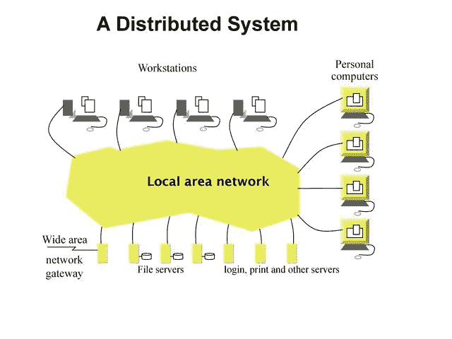

# 分布式系统中的 CAP 定理及其折衷

> 原文：<https://medium.com/analytics-vidhya/cap-theorem-in-distributed-system-and-its-tradeoffs-d8d981ecf37e?source=collection_archive---------17----------------------->

## CAP 定理是由 Eric Brewer 提出的，后来被 Gilbert 和 Lynch 证明。

CAP 定理用于设计或处理分布式系统。CAP 说“一个分布式系统可以同时满足这些保证中的任何两个，但不能满足所有三个”