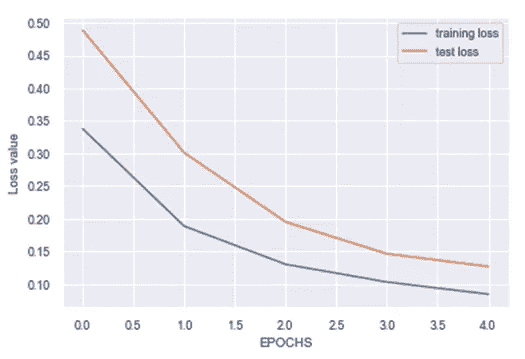

# 基于机器学习的首都自行车份额需求预测

> 原文：<https://medium.com/analytics-vidhya/capital-bike-share-demand-prediction-using-machine-learning-3c6c2c958e82?source=collection_archive---------6----------------------->

首都自行车共享站。本·舒明的图片在许可下分发[https://creativecommons.org/licenses/by-sa/3.0/deed.en](https://creativecommons.org/licenses/by-sa/3.0/deed.en)

使用机器学习来预测事件非常流行。这个概念有很多应用。我们希望预测天气以做好最坏的准备，我们希望预测股票以赚更多的钱，企业希望预测销售以便他们可以专注于大局。所有这些都可以使用机器学习来完成。

在这项研究中，让我们讨论如何使用一种叫做长短期记忆(LSTM)模型的特殊神经网络来预测自行车共享需求。

# 数据:

对于这个任务，我使用了位于[的自行车共享数据集 https://archive . ics . UCI . edu/ml/datasets/Bike+Sharing+dataset](https://archive.ics.uci.edu/ml/datasets/bike+sharing+dataset)。该数据集包含华盛顿大都市区的自行车共享数据。数据集包含温度、风速、星期几、小时、假期等参数，以及显示一小时内自行车出行次数的“计数”参数。

 [## 金融领域的机器学习|数据驱动的投资者

### 在我们讲述一些机器学习金融应用之前，我们先来了解一下什么是机器学习。机器…

www.datadriveninvestor.com](https://www.datadriveninvestor.com/2019/02/08/machine-learning-in-finance/) 

在我们处理数据之前，最好先想象一下数据显示的趋势。例如，出于本能，人们会想比较工作日和周末的自行车共享需求。图 1 显示了 2011 年 2 月 7 日至 11 日工作日(周一至周五)的自行车共享每小时需求。

图一。2011 年 2 月 7 日至 11 日工作日的每小时自行车份额计数

很明显，工作日早上 6 点到 10 点和下午 4 点到 7 点的自行车共享活动有所增加，中午略有增加，这是可以理解的，因为这是办公/上学高峰时间，而中午是午餐时间。因此，自行车份额需求在这些时候很高。

下图 2 显示了 2011 年 2 月 12 日和 13 日周末周六和周日的自行车份额需求。

图二。2011 年 2 月 12 日和 13 日周末(周六和周日)的自行车份额需求

从图 2 可以明显看出，自行车共享需求从早上 6 点到下午 2 点增加，然后减少。可以观察到，周末自行车共享需求没有工作日数据显示的两个高峰，这两个高峰可能显示人们在早上使用自行车共享，在户外享受和下午 2 点后需求下降。

图 3 显示了每月的需求计数。

图 3。每月自行车共享需求的箱线图

据观察，当天气不冷时，自行车份额需求较高，因为 1 月(1)、2 月(2)和 12 月(12)似乎比一年中的其他月份需求相对较少。

现在让我们转到预处理部分，为机器学习模型准备数据。

# 预处理:

对于预处理，我首先删除分析不需要的列，即

1.  随意(有多少用户随意使用自行车共享)
2.  已注册(有多少注册用户使用自行车共享)
3.  工作日(星期几)
4.  即时(数据记录的序列号)
5.  归一化温度

删除这些列后，我们的数据中只剩下以下几列，如图 4 所示:

图 4。删除不相关的列后的一瞥

这里

1.  季节有 4 个不同的值 1 =春天，2 =夏天，3 =秋天，4 =冬天
2.  假日(0 或 1)-是否将该日视为假日
3.  工作日(0 或 1)-这一天既不是周末也不是假日
4.  天气有 4 个截然不同的数值 1:晴、少云、部分多云、部分多云
    2:雾+多云、雾+碎云、雾+少云、雾
    3:小雪、小雨+雷雨+散云、小雨+散云
    4:大雨+冰托盘+雷雨+雾、雪+雾
5.  temp —以摄氏度为单位的温度
6.  湿度—相对湿度
7.  风速——风速
8.  cnt —每小时自行车共享数

**缩放数据**

由于湿度、风速和温度是连续值，我们使用 scikit-learn 的标准定标器来定标每一列，使平均值为 0，标准偏差为 1。原因是，如果值经过缩放或归一化，机器学习算法的性能会很好。我们对“cnt”自行车份额需求列进行了同样的操作。

**创建数据序列**

为了预测一个小时的自行车共享需求，我们给我们的算法一个“n”值序列，并让它预测第”(n+1)个值。为此，我们构建了“n”小时的“n”个输入序列，然后使用算法预测第(n+1)小时的第(n+1)次自行车共享需求。我用 10 个值的序列来预测第 11 小时的自行车份额需求。

**拆分数据**

最后，我们将数据拆分为训练:测试拆分。我选择在 90:10 火车:测试分裂。

# **机器学习模型**

对于这项任务，可以采用许多模型。例如，基于树的预测器、神经网络或其他模型。我选择使用称为长短期记忆(LSTM)模型的特殊类型的神经网络，它是递归神经网络的变体，但没有消失/爆炸梯度问题。LSTM 如下所示:

图 5。在[https://commons.wikimedia.org/w/index.php?下发行的林明贤的长短期记忆模型 title =用户:林明贤&action = edit&red link = 1](https://commons.wikimedia.org/w/index.php?title=User:MingxianLin&action=edit&redlink=1)

这些 LSTMs 非常擅长捕捉基于时间序列的顺序数据。由于这是一个独立的话题，我就不多谈它的理论了。

我使用的 Keras 库具有图 6 所示的模型特征。

图 6。LSTM 模型

# 结果

该模型被训练 10 个时期，并且发现训练和验证损失分别为 0.08 和 0.13，如图 7 所示。

图 7。培训和验证损失

预测模型预测自行车份额需求的性能如图 8 所示。

图 8。LSTM 模型预测的自行车份额需求与实际需求

可以看出，我们的模型在预测自行车份额需求方面做得非常好。

# 结论

我希望读者对 LSTM 预测首都自行车份额需求的实现感兴趣。它帮助我用 Keras 实现了 LSTM，并加强了我对熊猫的了解。完整的代码可以在我的 GitHub 知识库中找到，网址是[https://GitHub . com/shayanalibhatti/Predicting _ Bike _ Share _ Demand _ with _ LSTM](https://github.com/shayanalibhatti/Predicting_Bike_Share_Demand_with_LSTM)。