# 从实体书中捕捉你最喜欢的语录

> 原文：<https://medium.com/analytics-vidhya/capture-your-favourite-quotes-from-physical-books-80ca4833dbf3?source=collection_archive---------26----------------------->

这是一篇由两部分组成的系列博客:

*   [第 1 部分:设置逻辑应用程序从图像中检索文本(this)](/@bhagiasanjay/capture-your-favourite-quotes-from-physical-books-80ca4833dbf3)
*   [第 2 部分:将检测到的文本推送到 blob 存储中的文本文件](/@bhagiasanjay/capture-your-favourite-quotes-from-physical-books-part-2-1b531f1010f4)

我喜欢看书。虽然我热爱科技，但某些书最适合实体形式，我对此持开放态度——不管怎样。电子书的一个好处是，它让突出显示或记录我们最喜欢的引言或章节变得非常简单。说到实体书，有各种各样的(手工)技巧可以用来做笔记。当我前几天在读一本书时，我想如果我拍一张照片，然后把这句话写到某个地方的文本文件中，作为我的收藏，我可以在以后参考，这不是很好吗？当然，我没有马上放下这本书，因为我喜欢它，所以我继续——我知道这不是那么容易做到的。

一旦完成阅读，我就着手为此创建一个解决方案。我在日常工作中使用微软 Azure，所以这对我来说是一个显而易见的选择。我四处寻找可以帮助我轻松地将不同部分组合在一起以解决手头挑战的服务。

这是我想出来的。

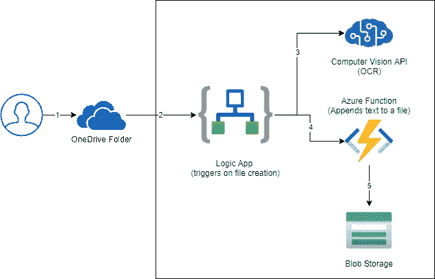

**流程是:**我会用手机给任何报价拍照，上传到我 OneDrive 的某个文件夹。如果该文件夹中有新文件，逻辑应用程序就会被触发，读取文件的内容，将图像传递给认知 API (OCR to Text ),该 API 返回检测到的文本，然后我们调用 azure 函数，将引用附加到我的 blob 存储中的文本文件。

**基本原理**

*   OneDrive(个人):我已经使用它了，它是我的私人驱动器，可以从任何地方和我的设备上安全访问
*   逻辑应用:帮助我编排流程，而无需编写太多代码，我可以使用内置连接器来访问 OneDrive、认知服务、blob 存储等。
*   [计算机视觉 API](https://docs.microsoft.com/en-au/azure/cognitive-services/computer-vision/) :让从图像中检测文本变得几乎微不足道，并且与逻辑应用程序配合得相当好
*   Azure Functions:虽然我不应该使用它，但这是为了在 blob 存储中添加文本，因为目前没有内置的连接器。
*   Blob 存储:我可以将这个文件存储在任何其他地方，但是存储帐户在这种情况下非常方便(支持本地追加 blob)。

有了高级架构之后，让我们深入研究实现。

# 创建逻辑应用程序

*   前往 Azure 门户网站，创建一个逻辑应用程序。

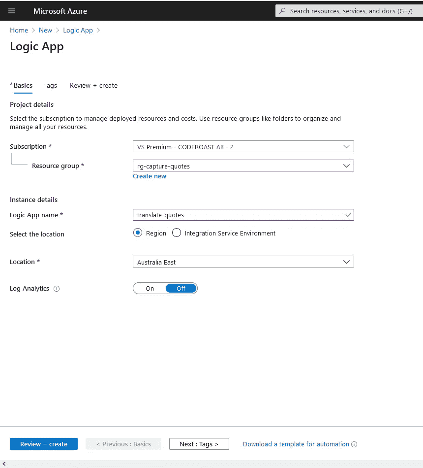

*   创建资源后，转到该资源。
*   从模板中选择“空白逻辑应用”
*   搜索“OneDrive”连接器，并从触发器中选择“创建文件时”

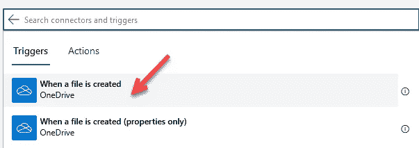

*   登录到您的 OneDrive 帐户，并选择用于存放您的移动图像的文件夹。

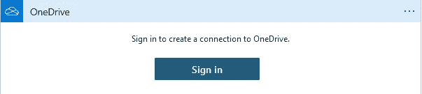

*   设置您希望 OneDrive connector 查找新文件的频率(在开发期间，选择较小的窗口，当您准备好使用它时，增加它，这样您就不会过于频繁地轮询 OneDrive)

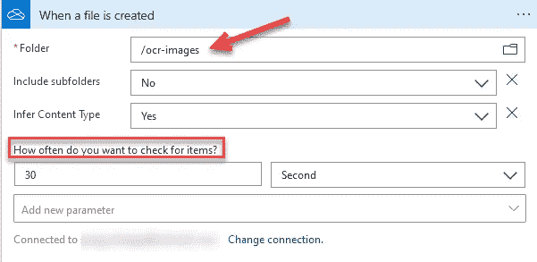

*   单击“新步骤”添加下一个操作。
*   搜索“Cognitive”并选择“Computer Vision API”，然后搜索“ocr”。
*   从列表中选择“光学字符识别(OCR)到文本”

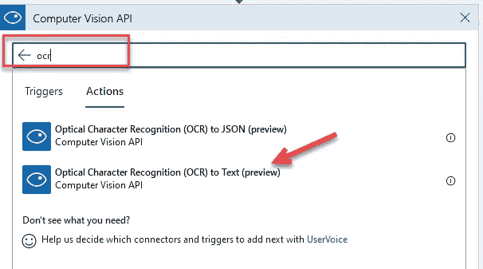

*   为了填充这些信息，我们需要一个计算机视觉资源。

# 创建计算机视觉资源

*   打开另一个选项卡/窗口并转到 Azure Portal(portal.azure.com)
*   创建“计算机视觉”类型的新资源。选择“F0”定价层(它是免费的，尽管您在一个订阅中只能有一个免费资源)

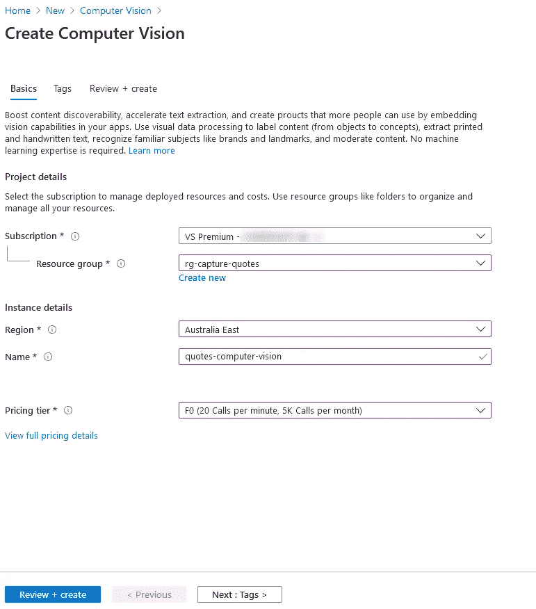

*   创建资源后，导航到该资源(通过选择“转到资源”或从顶部的搜索栏中搜索)
*   转至“资源管理”部分下的“密钥和端点”
*   复制“Key1”和“Endpoint”(在记事本或您喜欢的任何地方)

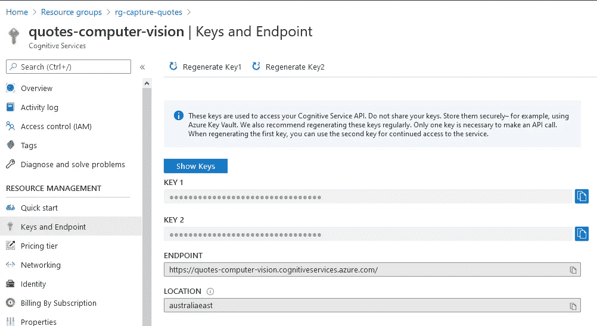

*   现在回到逻辑应用程序
*   输入连接名称'计算机视觉连接'
*   在“帐户密钥”字段中输入计算机视觉 API 中“密钥 1”的值
*   将“站点 Url”设置为您从计算机视觉处理的“端点”
*   单击“创建”按钮创建连接

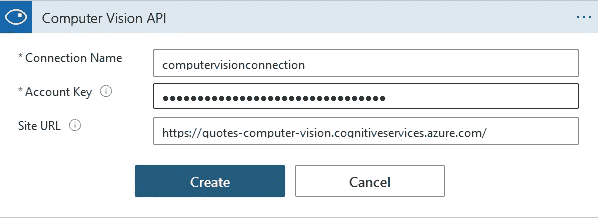

*   对于“图像源”，从下拉列表中选择“图像内容”。
*   对于“图像内容”，将其设置为上一步中的文件内容(通过选择动态内容)。将光标放入—图像内容字段，将弹出一个窗口，从中选择值)

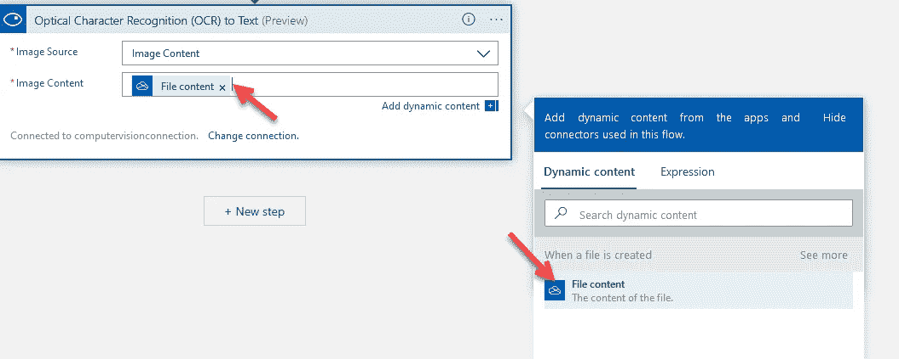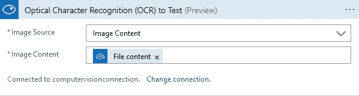

*   这是目前为止 logic 应用程序的外观

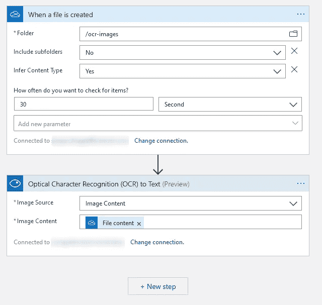

*   在这一点上，我们有一个逻辑应用程序，如果 OneDrive 中的“/ocr-images”文件夹下有一个新文件，并且使用计算机视觉 API 翻译文本，则会触发该应用程序。考验的时候到了

# 测试应用程序

*   保存应用程序。在 OneDrive 中上传您的文件夹中某些文本的图片。检查 logic 应用程序的运行历史，并选择最后一次运行。
*   我已经上传了这张照片

*   我看起来是这样的。

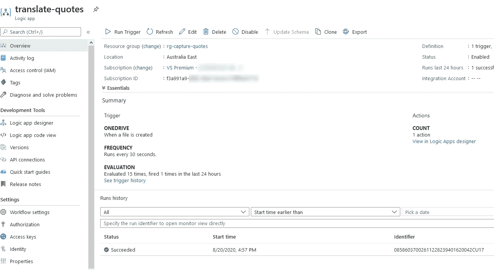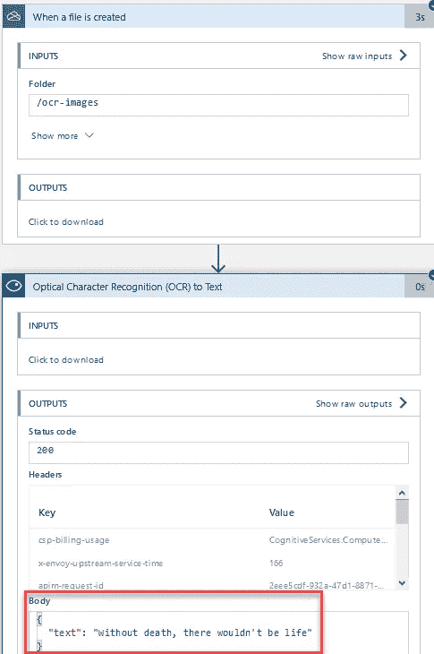

检查“Body”中的文本，您会发现它与图像中的文本相匹配。很棒，不是吗？

我们差不多完成了。但是我想更进一步。我想将文本存储在一个文本文件中，该文件位于我的 blob 存储中。我希望每次运行逻辑应用程序时都追加文本，这样我就可以在一个文件中的新行上引用我的话。这将在本系列的第二部分中讨论，敬请关注。

干杯

请启用 JavaScript 查看 Disqus 支持的[评论。](http://disqus.com/?ref_noscript) [评论由](https://disqus.com)提供

*原载于 2020 年 8 月 24 日 https://www.sanjaybhagia.com***。**