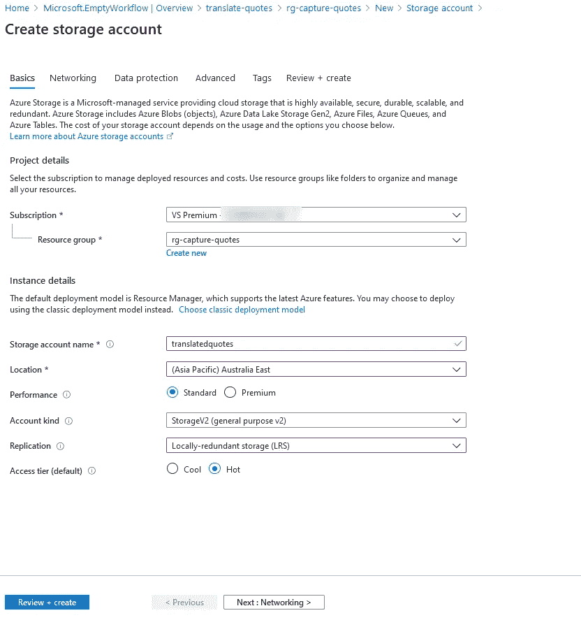
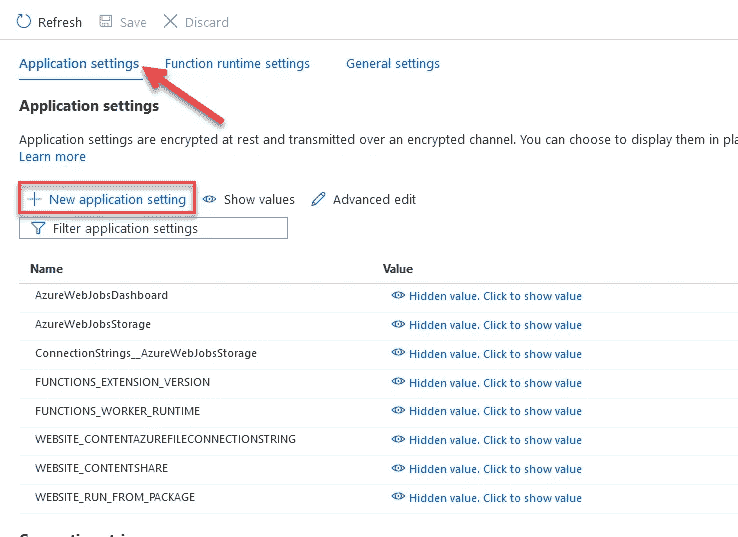
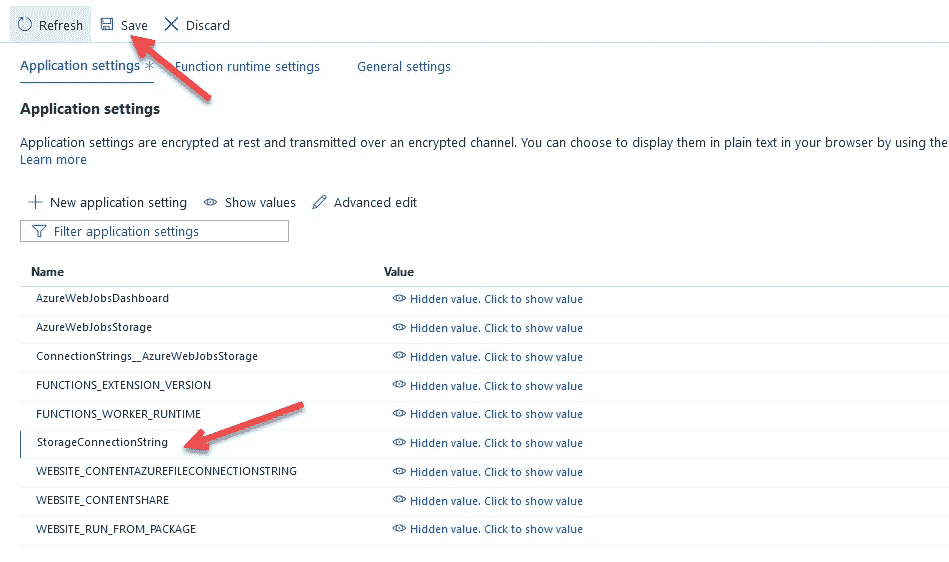
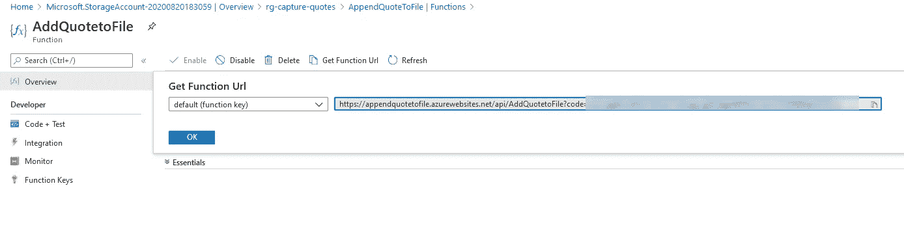
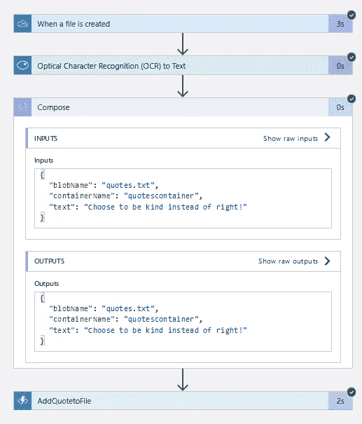
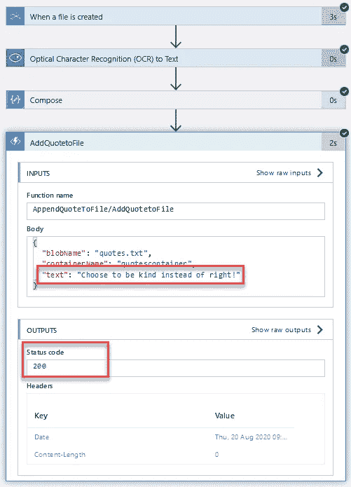
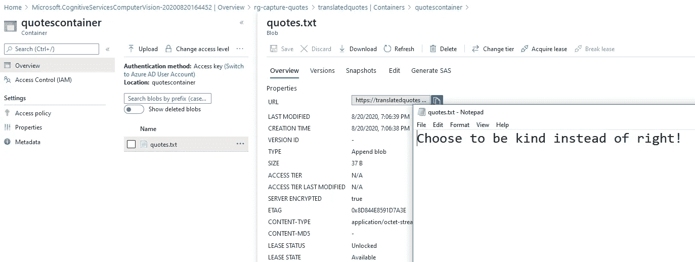
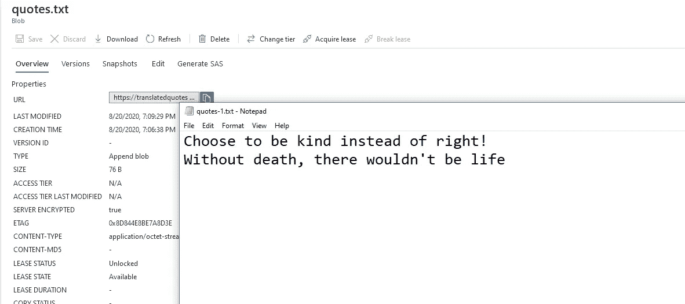
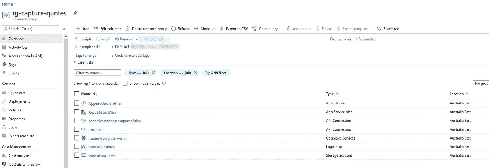

# 从实体书中捕捉你最喜欢的语录——第二部分

> 原文：<https://medium.com/analytics-vidhya/capture-your-favourite-quotes-from-physical-books-part-2-1b531f1010f4?source=collection_archive---------33----------------------->

这是一篇由两部分组成的系列博文:

*   [第 1 部分:设置逻辑应用程序从图像中检索文本](/@bhagiasanjay/capture-your-favourite-quotes-from-physical-books-80ca4833dbf3)
*   [第 2 部分:将检测到的文本推送到 blob 存储中的文本文件(this)](/@bhagiasanjay/capture-your-favourite-quotes-from-physical-books-part-2-1b531f1010f4)

在我之前的博客文章中，我们创建了 logic 应用程序，我们可以将图片上传到 OneDrive 中的文件夹，计算机视觉 API 可以从该图像中检测文本。如果你还没有通读那篇[文章](https://www.sanjaybhagia.com/2020/08/25/capture-quotes-from-books)，请在继续这篇文章之前通读一下。让我们在这篇博文中更进一步。

# 将检测到的文本保存到文本文件

当前，没有针对 blob 存储的“追加”操作的操作。如果你问我，我会觉得这有点令人失望！所以我们需要写一点代码来实现这一点。我知道我说过，我希望这很简单，但这就是生活，你必须在你没有预料到的地方写一些代码。我打算用 C#来学习 Azure 函数，你可以使用任何你觉得舒服的语言。

# 创建 Azure 功能应用

您可以选择任何您喜欢的 IDE，我将使用 Visual Studio(如果您喜欢，VSCode 也很棒)

我不会详细讨论如何创建和发布函数，因为已经有人写过了。你可以按照这个[链接](https://docs.microsoft.com/en-us/azure/azure-functions/functions-develop-vs)来创建 Azure 函数，并将它们发布到 Azure。如果您更喜欢 VS 代码，请检查[这个](https://docs.microsoft.com/en-us/azure/azure-functions/functions-create-first-function-vs-code?pivots=programming-language-csharp)出来。

*   创建了函数项目后，删除“Function1.cs”文件并添加一个新函数(右键单击项目->添加->新建 azure 函数->选择“Azure 函数”并将其命名为 AddQuotetoFile)
*   选择“HTTP 触发器”并按“确定”

继续看实际的代码。下面是一些细节:
该函数需要以下有效载荷(请求)

```
{ "blobName": "testfile.txt", "containerName": "ocr-images", "text": "Here is the quote from the book" }
```

*   **blobName** :我们需要添加文本的 blob 的名称(如果它还不存在，将在第一次创建它)
*   **containerName** :文件应该存在的 blob 存储容器
*   **文本**:我们想要写入文件的实际文本

在这个函数中，当它被触发时，我们希望:

1.  解析 HTTP 请求体
2.  确保我们有所有需要的信息
3.  获取对 blob 容器的引用(如果不存在，则创建)
4.  获取对 blob 的引用(如果不存在，则创建)
5.  将文本追加到文件的末尾

这是我的主函数的样子。请查看我的 [GitHub 库](https://github.com/sanjaybhagia/capture-quotes-books)了解整个解决方案。

```
public static class AddQuotetoFile
    {
        [FunctionName("AddQuotetoFile")]
        public static async Task<IActionResult> Run(
            [HttpTrigger(AuthorizationLevel.Function,"post", Route = null)] HttpRequest req,
            ILogger log)
        {
            log.LogInformation("C# HTTP trigger function processed a request.");

            // Expects JSON body:
            // {
            //      "blobName": "[Blob name here]",
            //      "containerName": "[Container name here]",
            //      "text": "\"Column A\","Column B\",\\n,\"A1\",\"B1\",\\n,\"A2\",\"B2\""
            // }

            var connectionString = System.Environment.GetEnvironmentVariable("StorageConnectionString");

            // StorageConnectionString configured as app setting.

            string requestBody = await new StreamReader(req.Body).ReadToEndAsync();
            dynamic data = JsonConvert.DeserializeObject(requestBody);

            var blobName = data?.blobName;
            var containerName = data?.containerName;
            var text = data?.text;

            if (blobName == null)
            {
                return new BadRequestObjectResult("blobName is required.");
            }

            if (containerName == null)
            {
                return new BadRequestObjectResult("containerName is required.");
            }

            if (text == null)
            {
                return new BadRequestObjectResult("text is required.");
            }

            var storageAccount = CloudStorageAccount.Parse(connectionString);
            var blobClient = storageAccount.CreateCloudBlobClient();
            CloudBlobContainer container = blobClient.GetContainerReference(containerName.ToString());

            await container.CreateIfNotExistsAsync();

            var appendBlob = container.GetAppendBlobReference(blobName.ToString());

            if ((await appendBlob.ExistsAsync()) == false)
            {
                await appendBlob.CreateOrReplaceAsync();
            }

            StringBuilder lineToAdd = new StringBuilder();
            lineToAdd.AppendLine(text.ToString());
            await appendBlob.AppendTextAsync(lineToAdd.ToString());

            return new OkResult();
        }
    }
```

*   前往入口
*   为存储帐户创建资源



*   按“查看+创建”来创建帐户
*   一旦创建了资源，就去找它
*   选择设置下的“访问键”
*   复制 Key1 连接字符串
*   返回 Visual Studio，打开“local.settings.json”文件，并在 Values 下设置属性“StorageConnectionString”

```
{ "IsEncrypted": false, "Values": { "AzureWebJobsStorage": "UseDevelopmentStorage=true", "FUNCTIONS_WORKER_RUNTIME": "dotnet", "StorageConnectionString": "<your connection string goes here>" } }
```

此时，如果您想在本地测试该函数，请按 F5 调试解决方案，您可以通过 Postman(或任何其他工具)发出 HTTP 请求，以确保该函数按预期运行。将一个文件放入您创建的存储帐户的容器中，构造 HTTP 请求并点击您的本地函数端点(您可以使用 simulator 来选择文件，而不是使用 Azure 中的存储帐户，如果您设置了它)。

一旦你建立了正确运行的函数，就该发布函数了。我们都知道 *"* ***朋友不会让朋友右键点击并发布*** *"* —但这对于本演示来说是可以的，所以不要觉得不好，继续吧—是的，右键点击解决方案并点击发布。按照我之前提到的链接([此处](https://docs.microsoft.com/en-us/azure/azure-functions/functions-develop-vs)和[此处](https://docs.microsoft.com/en-us/azure/azure-functions/functions-create-first-function-vs-code?pivots=programming-language-csharp))获取关于如何在本地运行以及从 Visual Studio 和 Visual Studio 代码发布的说明。

*   一旦发布成功，我们将添加应用程序设置。
*   导航到 Azure 门户，打开我们刚刚发布的功能应用资源
*   转到设置下的“配置”



*   添加新的应用程序设置
*   名称:StorageConnectionString
*   值:"您之前放在 local.settings.json 文件中的存储帐户的连接字符串"



*   请确保单击“保存”来保存设置，否则将会丢失设置。

现在我们已经准备好了设置。您可以像前面一样通过 Postman 在 point 测试这一点。唯一的变化是从 Azure 而不是 localhost 获取函数的 URL。仍然在您的功能入口->选择'功能'->选择您的功能(' AddQuotetoFile) ->点击'获取功能 URL '并复制 Url。



我们差不多完成了，现在是测试的时候了。在 OneDrive 文件夹“ocr-images”中上传另一张图像，并再次查看运行历史记录。以下是我成功的跑步记录:



让我们打开存储帐户，看看文本是否成功写入。

*   选择存储帐户->容器->配额容器
*   单击文件“quotes.txt”(注意 blob 类型是“追加 Blob”)
*   从弹出窗口中点击“下载”,在任何编辑器中打开它，检查内容



我在 OneDrive 上传了另一个文件。再次下载 quotes.txt 文件，看看内容。您将看到附加了另一行。



这是我们最终为此解决方案创建的所有资源



我们终于完成了！现在，当您拍摄任何报价的照片并将其上传到 OneDrive 时，Logic 应用程序将被触发，并将报价附加到 blob 存储中的文本文件中。

*如果您遵循并提供了资源，并且您不打算使用该解决方案，您可以在此处删除资源组。*

这是一篇比我预想的要长得多的博文，所以谢谢你的关注。
让我知道你是否觉得这有用，如果你有任何进一步改进的建议。

干杯

请启用 JavaScript 查看 Disqus 支持的[评论。](http://disqus.com/?ref_noscript) [评论由](https://disqus.com)提供

*原载于 2020 年 8 月 25 日 https://www.sanjaybhagia.com*[](https://www.sanjaybhagia.com/2020/08/25/capture-quotes-from-books-2)**。**