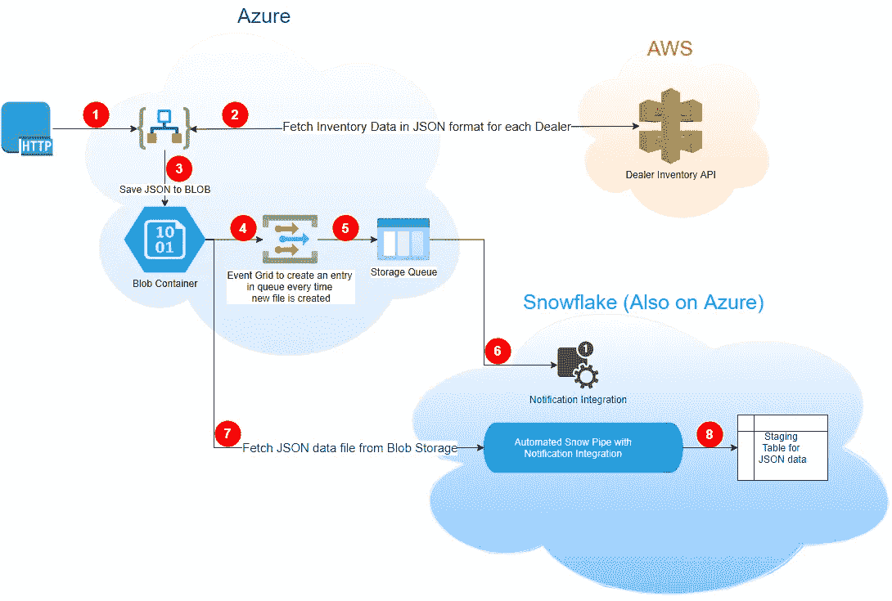
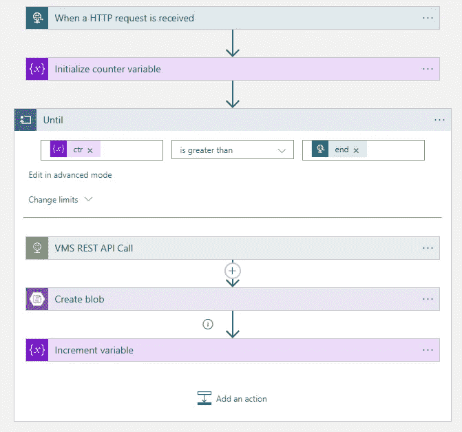
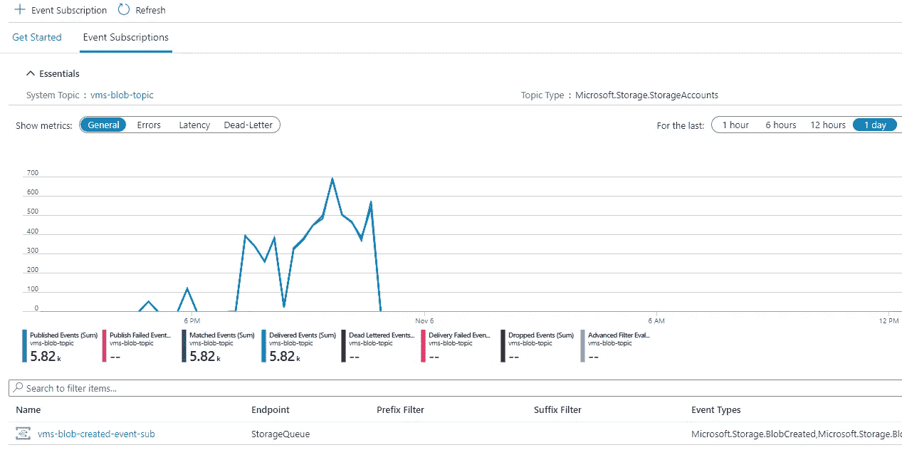
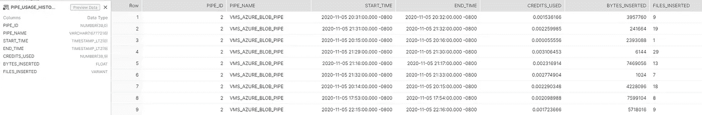
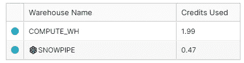
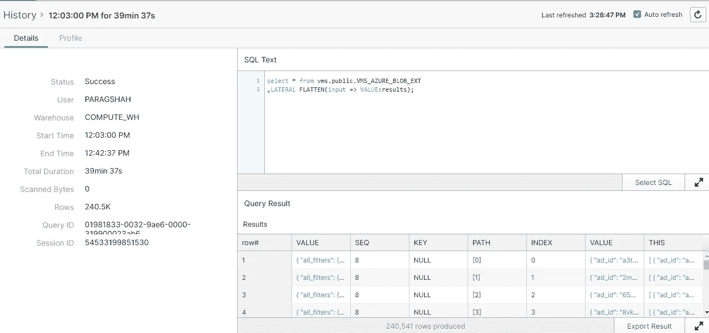
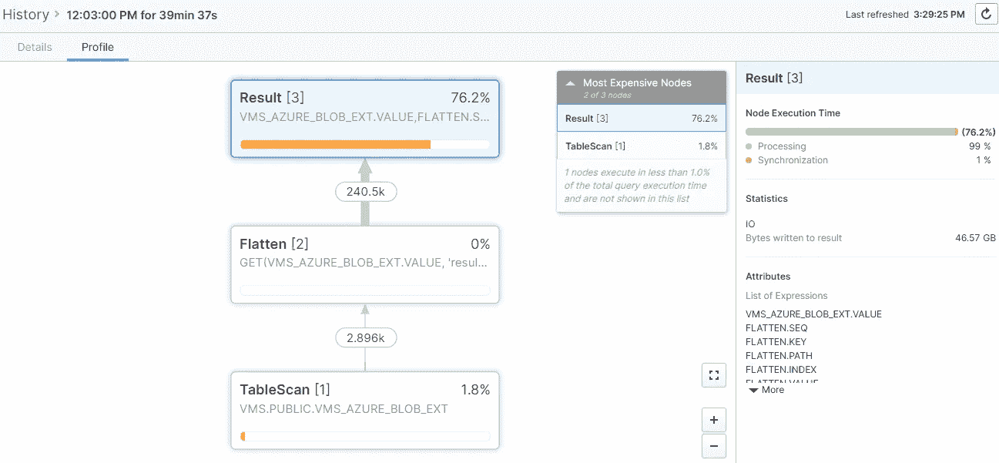

# 汽车购买是有趣的雪花第 2 部分

> 原文：<https://medium.com/analytics-vidhya/car-buying-is-fun-with-snowflake-part-2-42a6b91d0870?source=collection_archive---------17----------------------->

在 [part 1](https://paragshah.medium.com/car-buying-is-fun-with-snowflake-7decb8d7e774) 中，在推入雪花阶段之前，车辆库存数据被下载到本地。它包括手动运行 Python 脚本来下载 JSON 数据、在 SnowSql 中运行命令来上传文件，然后复制到命令中以将数据加载到雪花表中。

我能够使用 Azure Logic 应用程序和 Blob 存储来自动化所有这些。这个想法是每天自动运行整个过程，从雪花的每个汽车经销商那里获得更新的库存。

以下是自动化工作流程的样子:



红色圆圈中的步骤在下面展开

1.  Azure Logic App 是这个工作流程的起点。现在我用 REST API 作为触发器，接受两个整数输入，开始和结束 id



2.一旦 API 被调用，它就用一个循环启动 Logic App，从开始到结束遍历每个 Ids 值，并调用 VMS API

3.逻辑应用程序将 API 响应作为对象存储在 Blob 存储中

4.创建 EventGrid 主题是为了在存储中创建新的 blob 时将消息推入存储队列。每当一个新的 JSON blob 在外部阶段变得可用时，需要这个步骤来自动调用 SnowPipe



查询雪花。account Usage . Pipe _ Usage _ History 视图，提供 SnowPipe 执行的日志



创建自动化 SnowPipe 需要首先在雪花中进行一些设置步骤，然后通过云提供商进行设置。

```
create notification integration VMS_AZURE_QUEUE_INTEGRATION
 enabled = true
 type = queue
 notification_provider = azure_storage_queue
 azure_storage_queue_primary_uri = ‘https://<storage account>.queue.core.windows.net/<queue name>
 azure_tenant_id = ‘<Tenant ID>’;

//Run DESC command to get AZURE_CONCENT_URL to authenticate Snowflake account. While you do that, you will also need to go to Azure Portal > Storage Account > Queue > Access Control (IAM) > Add Role Assignments to allow new Snowflake account access to “Storage Queue Data Contributor” role.
desc notification integration VMS_AZURE_QUEUE_INTEGRATION;

CREATE STORAGE INTEGRATION VMS_AZURE_BLOB_INTEGRATION
 TYPE = EXTERNAL_STAGE
 STORAGE_PROVIDER = AZURE
 ENABLED = TRUE
 AZURE_TENANT_ID = ‘<Tenant ID>’
 STORAGE_ALLOWED_LOCATIONS = (‘azure://<storage account>.blob.core.windows.net/<storage container name>/’);

//Run DESC command to get AZURE_CONCENT_URL to authenticate Snowflake account. While you do that, you will also need to go to Azure Portal > Storage Account > Container > Access Control (IAM) > Add Role Assignments to allow new Snowflake account access to “Storage Blob Data Contributor” role.
desc storage integration VMS_AZURE_BLOB_INTEGRATION;

Create STAGE “VMS”.”PUBLIC”.”VMS_AZURE_STAGE” 
 STORAGE_INTEGRATION = VMS_AZURE_BLOB_INTEGRATION 
 URL = ‘azure://<storage account>.blob.core.windows.net/<storage container name>’ 
 COMMENT = ‘Stage location for incoming JSON files from LogicApp’;

create or replace pipe VMS_AZURE_BLOB_PIPE 
 auto_ingest=true 
 integration=’VMS_AZURE_QUEUE_INTEGRATION’ 
 comment=’AUTOMATED PIPE’ as COPY INTO “VMS”.”PUBLIC”.”VMS_AZURE_BLOB_LZ1" FROM @”VMS”.”PUBLIC”.”VMS_AZURE_STAGE” FILE_FORMAT = ( FORMAT_NAME = “VMS”.”PUBLIC”.”VMS_JSON_FORMAT”);
```

一旦配置完成，SnowPipes 就会在 Blob 存储中创建新文件时运行，不会出现任何问题。与使用 SnowSql 手动加载相比，使用 SnowPipe 的好处是在加载数据时节省大量成本。SnowPipe 使用无服务器概念，并且确实需要我们的仓库来运行。



为了完全自动化这个工作流，唯一需要做的就是在 Logic 应用程序中用一个递归活动触发器替换 REST API 触发器。

与上述工作流无关，我还在雪花中创建了一个外部表，以检查从外部 stage 访问非结构化数据时的性能。我经历了非常慢的查询性能。XS size compute 花费了 39 分钟来展平 2896 个 blobs 中的 JSON 数据。拼合后的总行数:233370。



基于外部表在用于非结构化数据时对性能造成的影响，它将通过将它们加载到雪花中来节省资源。一旦加载完毕，JSON 数据的扁平化速度会像闪电一样快。在外部表上花费 39 分钟的东西，一旦加载到带有变量列的雪花表中，只需 3.3 秒。

[第三部](https://paragshah.medium.com/car-buying-is-fun-with-snowflake-part-3-963e79bea82d)出版。这完全是关于雪花流和将数据着陆到下一级着陆区的任务。