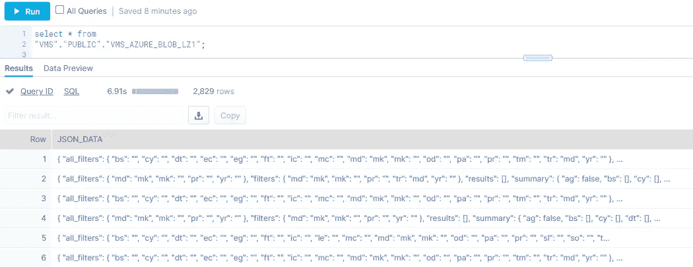
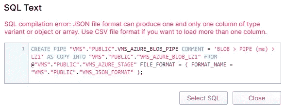
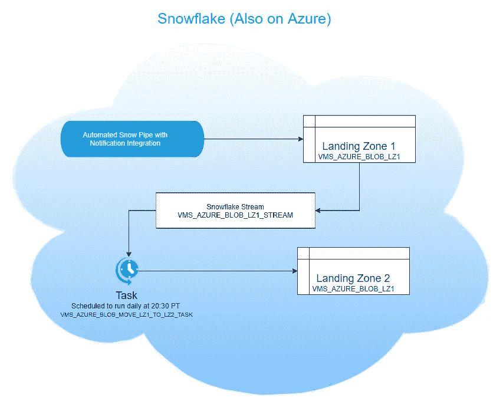
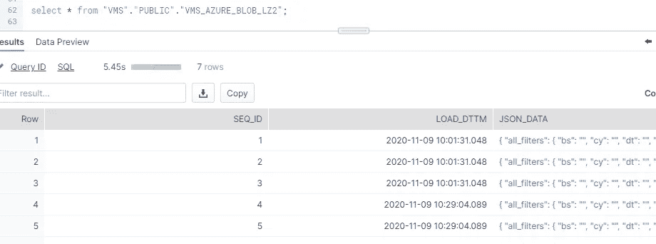
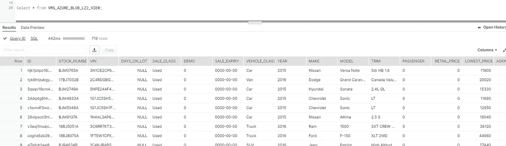

# 汽车购买是有趣的雪花第 3 部分

> 原文：<https://medium.com/analytics-vidhya/car-buying-is-fun-with-snowflake-part-3-963e79bea82d?source=collection_archive---------19----------------------->

在[第二部分](/analytics-vidhya/car-buying-is-fun-with-snowflake-part-2-42a6b91d0870)中，使用 Azure Logic 应用程序和 SnowPipe 自动完成了将数据导入雪花的整个流程。JSON 数据被加载到雪花着陆表中，该表只有一个名为 JSON_DATA 的列。



理想情况下，还应该有一个 datetime 列，其中包含数据加载到登录表的日期和时间。然而，由于 SnowPipe 的限制，当使用 JSON 格式时，它不允许任何额外的列。如果你尝试，你会得到以下错误。



可以利用 Snowflake 的流和任务功能将这些数据移动到第二个登录表中，该表中有其他列，如 load_dttm (load date time)。



雪花流有助于 CDC(变更数据捕获)。它有点像 Kafka 主题，在其基表中每次更改都包含一行。在这种情况下，VMS_Azure_Blob_LZ1(着陆区 1)

```
//Create a stream on VMS_Azure_Blob_LZ1 table
CREATE OR REPLACE STREAM VMS_AZURE_BLOB_LZ1_STREAM ON TABLE “VMS”.”PUBLIC”.”VMS_AZURE_BLOB_LZ1";//Verify using
SHOW STREAMS;//Verify that stream works by invoking REST API to load some same data in LZ1 and then run a Select on stream
SELECT * FROM VMS_AZURE_BLOB_LZ1_STREAM;
```

下一步是将数据流中的数据插入到着陆区 2 表中。这将是一个简单的 SQL 插入，如下所示

```
//Create a 2nd Landing table (Seq is used to generate auto incremented ids)create or replace TABLE VMS_AZURE_BLOB_LZ2 (
 SEQ_ID NUMBER(38,0) NOT NULL DEFAULT VMS.PUBLIC.VMS_AZURE_BLOB_LZ2_SEQ.NEXTVAL,
 LOAD_DTTM TIMESTAMP_NTZ(9) NOT NULL DEFAULT CURRENT_TIMESTAMP(),
 JSON_DATA VARIANT NOT NULL
)COMMENT='Data will be inserted from stream and task'
;//Test and verify that select from Stream works as intended before using it in TaskINSERT INTO "VMS"."PUBLIC"."VMS_AZURE_BLOB_LZ2" (JSON_DATA) (
  SELECT 
    JSON_DATA
  FROM
    VMS_AZURE_BLOB_LZ1_STREAM
  WHERE
    "METADATA$ACTION" = 'INSERT'
```

请记住，整个想法是自动化，所以插入需要自动运行。使用雪花任务可以做到这一点。它基本上是一个使用“cron”时间格式的任务调度程序。在这种情况下，它被设置为 30 20 * * *在所有经销店关门后的太平洋时间晚上 8:30 运行。

```
CREATE OR REPLACE TASK VMS_AZURE_BLOB_MOVE_LZ1_TO_LZ2_TASK
  WAREHOUSE = TASKS_WH //A specific WH created to be used for Tasks only to show up on bill as separate line item
  SCHEDULE  = 'USING CRON 30 20 * * * America/Vancouver' //Process new records every night at 20:30HRS
WHEN
  SYSTEM$STREAM_HAS_DATA('VMS_AZURE_BLOB_LZ1_STREAM')
AS
  INSERT INTO "VMS"."PUBLIC"."VMS_AZURE_BLOB_LZ2" (JSON_DATA) (
  SELECT 
    JSON_DATA
  FROM
    VMS_AZURE_BLOB_LZ1_STREAM
  WHERE
    "METADATA$ACTION" = 'INSERT'
);
```

请注意，在上述 DDL 中，指定的仓库是 TASKS_WH，它是专门为运行任务而创建的，在雪花生成的每月账单中，它将作为单独的行时间出现。通过这种方式，可以更轻松地监控和跟踪任务成本，方法是将任务组合在一起，以便计算可以一起完成其中的一些任务，从而节省成本。

一旦任务被创建，记得恢复它，否则任务不会运行。默认情况下，它将在挂起状态下创建。使用以下语句，任务被更改为“恢复”状态。

```
ALTER TASK VMS_AZURE_BLOB_MOVE_LZ1_TO_LZ2_TASK RESUME;
```

一旦雪花流中的一行被处理(插入)到它的最终目的地，它就被从流中删除。这就像从队列中弹出一个项目。这确保了相同的数据不会被再次处理。

数据现在处于它的最终存放位置，在这个表中，每一行现在都有一个 LOAD_DTTM 值，表示该行被加载的时间。



最后，一个视图将解析这个复杂 JSON 对象并返回表格数据。

```
create or replace view VMS_AZURE_BLOB_LZ2_VIEW as
select value:ad_id::text as id,value:stock_number::text as stock_number, value:vin::text as vin, value:days_on_lot::int as days_on_lot, value:sale_class::text as sale_class,value:demo::text as demo,
value:sale_expiry::text as sale_expiry, value:vehicle_class::text as vehicle_class, value:year::text as year,
value:make::text as make, value:model::text as model, value:trim::text as trim, value:passenger::text as passenger, 
value:retail_price::double as retail_price,value:lowest_price::double as lowest_price, value:asking_price::double as asking_price, value:internet_price::double as internet_price, value:final_price::double as final_price,
value:wholesale_price::double as wholesale_price, value:sales_tax::double as sales_tax,
value:odometer::int as odometer, value:fuel_type::text as fuel_type, value:transmission::text as transmission, value:engine::text as "ENGINE", value:drive_train::text as drive_train, value:doors::text as doors, 
value:exterior_color::text as exterior_color, value:vdp_url::text as vdp_url, value:image:image_original::text as image_original, value:manu_program::text as manu_program, 
value:manu_exterior_color::text as manu_exterior_color,
value:body_style::text as body_style, value:certified::int as is_certified, value:company_data:company_name::text as company_name,
value:company_data:company_city::text as company_city, value:company_data:company_province::text as company_province, value:company_data:company_sales_email::text as company_sales_email, 
value:company_data:company_sales_phone::text as company_sales_phone 
from vms.public.VMS_AZURE_BLOB_LZ2
,LATERAL FLATTEN(input => json_data:results);
```

查询视图以获取此数据



在这一点上，整个管道是自动化的。从从 REST APIs 获取数据的 Logic App 中的计时器开始，将数据转储到博客存储中，使用 SnowPipe 将数据加载到雪花中，最后将 JSON 数据转换为表格格式以便于使用。

我相信这些数据是为雪花的数据共享功能准备的:)