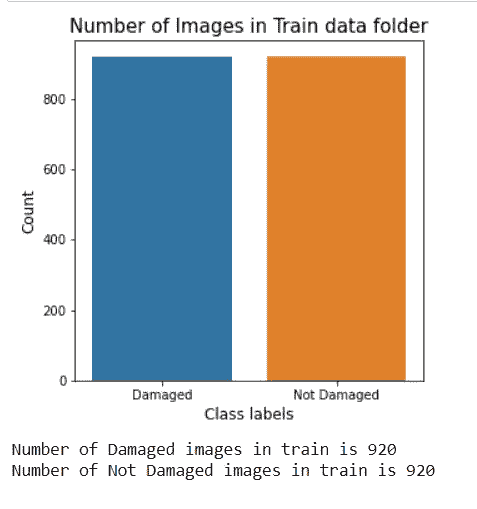
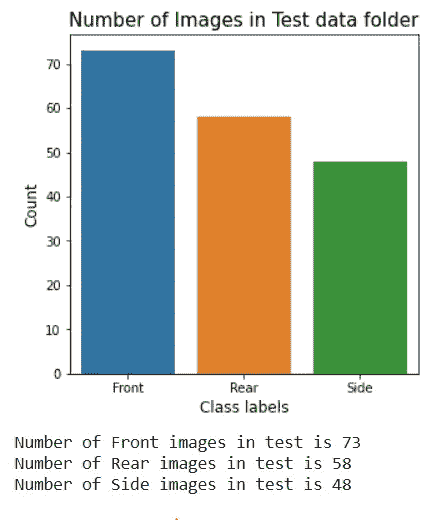

# 使用深度学习的汽车损坏评估

> 原文：<https://medium.com/analytics-vidhya/car-damage-classification-using-deep-learning-d29fa1e9a520?source=collection_archive---------0----------------------->

# 概述:

在汽车保险行业，大量的金钱被浪费在索赔泄漏上。索赔漏损是索赔的最佳解决方案和实际解决方案之间的差距。正在使用目视检查和验证来减少索赔泄漏。但是检查可能需要很长时间，并导致索赔处理的延迟。用于检查和验证的自动化系统将对加速该过程有很大帮助。

# **内容:**

1.  业务用例
2.  映射到深度学习问题
3.  数据源
4.  现有方法
5.  对现有方法的改进
6.  探索性数据分析
7.  首次切割方法
8.  深度学习模型
9.  模型比较和选择
10.  Yolo V3
11.  最终管道
12.  Web 应用程序
13.  未来的工作
14.  参考

# 1.业务用例:

减少保险处理过程中的索赔损失。正在进行目视检查和验证。因为这需要很长时间，因为人们需要过来检查损坏情况。我们正试图使这一过程自动化。使用这种自动化将导致索赔处理更快。

# 2.将问题映射到深度学习模型:

我们正在尝试自动化车辆损坏的目视检查和验证。我们的输入数据是汽车受损的图像。

为了验证车辆损坏，我们将问题分为三个阶段。1.首先，我们检查给定的汽车输入图像是否已经损坏。

2.其次，我们检查图像中汽车的哪一侧(前、后、侧)受损。

3.第三，我们检查损坏的严重程度(轻微、中等、严重)。

这个问题是一个经典的分类问题，因为我们将处理图像作为输入，我们将使用卷积神经网络(CNN)。

**绩效指标**:

在这方面，我们使用准确度、精确度和召回率作为性能指标。

为了计算准确度、精确度和召回率，我们需要构造混淆矩阵。上述公式如下所示。

# 3.数据源:

因为汽车损坏的数据很少。汽车数据集从下载。

【https://www.kaggle.com/anujms/car-damage-detection. 

上面的数据集是按照我们需要的阶段划分的。

这包括培训和验证，其中每个文件夹有损坏的汽车照片和全车照片。总共有 2300 幅图像出现在训练和验证组合中。

# 4.现有方法:

1.  [https://www . ee . iitb . AC . in/student/~ kalpesh . Patil/material/car _ damage . pdf](https://www.ee.iitb.ac.in/student/~kalpesh.patil/material/car_damage.pdf)

在上述论文中，该团队收集了图像并将数据集分为 8 类(保险杠凹痕、车门凹痕、玻璃破碎、前照灯破碎、尾灯破碎、擦伤、粉碎、无损坏)。

由于包含图像的数据集较少，因此他们使用水平翻转在-20°和 20°之间随机旋转的增强，将数据集综合放大了 5 倍。

他们从零开始训练了一个卷积神经网络和 AE CNN。准确率没有达到 75%。所以他们去训练预训练的模型。他们使用了预先训练的模型 Cars、Inception、Alexnet、VGG19、VGG16 和 Resnet。他们从预训练模型和 SoftMax 的输出中训练线性 svm，使用 adadelta 优化和交叉熵损失。实验表明，使用 SoftMax 分类器比线性 SVM 分类器效果更好，训练速度更快。

2.[https://easychair.org/publications/preprint_open/RlQ2](https://easychair.org/publications/preprint_open/RlQ2)

在这篇论文中，该团队收集了图像，并准备了受损汽车的数据集。他们将数据集分为保险杠凹痕、车门凹痕、玻璃破碎、头灯破碎、尾灯破碎、擦伤、粉碎、无损坏。

他们通过旋转 20 度、剪切 0.2、缩放范围 0.2 和水平翻转将数据集放大了 4 倍。

而不是在没有预训练重量的情况下训练 CNN。他们选择了预先训练好的模型(Alexnet，Inception V3，VGG19，Resnet50，Mobile nets)。他们只训练 FC 层和每个预训练模型的所有层。

在这个过程中，他们使用 YOLOV3 来定位损坏，并使用边界框来突出显示。

# 5.对现有方法的改进:

在所有上述模型中，只有预训练模型的表现优于从头训练。

我将使用 VGG16，VGG19，Resnet。我们也可以使用密集网络，我们可以看到它如何优于其他网络。

# 6.探索性数据分析:

我们有三种类型的数据:

1.  培训和测试文件夹的汽车损坏，而不是损坏的图像。
2.  培训和测试文件夹的前部、后部和侧面有损坏。
3.  损坏严重程度为轻微、中等、严重的培训和测试文件夹。

## **第一阶段(损坏或未损坏):**

在 EDA 中，我们将查看每个文件夹有多少个文件，以及数据中顶部图像的高度和宽度。

**条形图:**

**观察结果**:

1.  从列车图中我们可以看到，受损和未受损等级的图像是相等的。
2.  不存在阶级不平衡。
3.  由于我们拥有的数据集较少，我们可以使用数据扩充来扩大数据集。

**观察:**

1.  从测试图中我们可以看到，受损和未受损类的图像是相等的。
2.  因为 cars 数据集很少，所以测试文件夹中的图像数量较少。

**图像尺寸图:**

**观察:**

1.  从上面的图中我们可以看到，(194，259)图像形状在受损文件夹和未受损文件夹中比其他图像形状更丰富。
2.  但是在未损坏的文件夹中，具有(194，259)和(480，640)的图像的数量几乎相等。
3.  列车损坏文件夹中有 132 个独特的图像形状。
4.  “列车未损坏”文件夹中有 385 个独特的图像形状。

## 阶段 2(前部、后部和侧面):

**柱状图:**

**观察:**

1.  从火车图中我们可以看到，前面、后面和侧面的图像是不相等的。
2.  我们有更多的正面图像，后面和侧面的数量几乎相等。
3.  由于我们拥有的数据集较少，我们可以使用数据扩充来扩大数据集。

**观察:**

1.  从测试图中我们可以看到，我们的前、后和侧类图像是不平等的。
2.  因为 cars 数据集很少，所以测试文件夹中的图像数量较少。

**图像图:**

**观察:**

1.  从上面的图中我们可以看到,( 194，259)的图像形状在所有的类中都更加丰富。
2.  列车前部文件夹中有 70 个独特的图像形状。
3.  列车后部文件夹中有 67 种独特的图像形状。
4.  列车侧文件夹中有 60 个独特的图像形状。

## 第三阶段(轻度、中度和重度):

**条形图:**

**观察:**

1.  从火车图中我们可以看到，我们对轻微、中度和严重的印象是不一样的。
2.  我们有更多的严重图像和较少的轻微图像。
3.  由于我们拥有的数据集较少，我们可以使用数据扩充来扩大数据集。

**观察:**

1.  从测试图中我们可以看到，轻微、中等和严重的图像是不相等的。
2.  因为 cars 数据集很少，所以测试文件夹中的图像数量较少。

**图像情节:**

**观察:**

1.  从上面的图中我们可以看到,( 194，259)的图像形状在所有的类中都更加丰富。
2.  列车前部文件夹中有 66 种独特的图像形状。
3.  列车后部文件夹中有 63 种独特的图像形状。
4.  列车侧文件夹中有 70 个独特的图像形状。

# 7.首次切割方法:

由于我们拥有的数据集很小，我们将使用数据扩充综合放大数据集两倍。各种论文显示了不同类型的数据增强。我们将使用以下两种类型的数据增强，看看哪种性能更好。

1.  -20 到 20 度之间的随机旋转和水平翻转变换。
2.  在-20 和 20 之间随机旋转，剪切范围为 0.2，缩放范围为 0.2，水平翻转。

我们将创建所需的培训文件夹来保存数据增强图像。

## 数据扩充:

由于我们拥有的数据较少，我们将使用数据扩充来综合扩大数据集。正如在现有的方法中提到的，我将使用两种类型的增强，并将数据集放大两次。

1.  使用-20 到 20 度之间的随机旋转和水平翻转变换将数据集放大两倍。
2.  使用-20 和 20 之间的随机旋转、0.2 的剪切范围、0.2 的缩放范围和水平翻转将数据集放大两倍。

**数据增强的可视化:**

数据扩充 1:

原创

数据增强图像

数据扩充 2:

原创

数据扩充

因此，我们将对我们拥有的所有数据进行数据扩充，并在一个文件夹中创建由原始图像和生成的图像组成的文件夹。

我为每个阶段创建了三种类型的数据。让我们分别查看每个阶段的文件数量。

检查是否损坏:

1.  原始数据(1840 个训练文件，460 个测试文件)
2.  原始数据+数据扩充 1 (3680 个训练文件，460 个测试文件)
3.  原始数据+数据扩充 2 (3680 个训练文件，460 个测试文件)

检查前面、后面或侧面:

1.  原始数据(985 个训练文件，179 个测试文件)
2.  原始数据+数据扩充 1 (1970 个训练文件，179 个测试文件)
3.  原始数据+数据扩充 2 (1970 个训练文件，179 个测试文件)

检查轻微、中等、严重:

1.  原始数据(979 个训练文件，171 个测试文件)
2.  原始数据+数据增补 1 (1958 个训练文件，171 个测试文件)
3.  原始数据+数据扩充 2 (1958 个训练文件，171 个测试文件)

在对上述数据进行模型训练后，我将使用 YOLO V3 使用边界框将图像分类为以下类型之一。

1.  玻璃和灯碎了
2.  汽车凹痕和划痕
3.  破碎

# 8.型号:

因为预训练模型比从头开始训练模型效果更好。我们将在没有完全连接层的情况下导入以下预训练模型。

在图像网络数据集上进行预训练:

1.  VGG16
2.  VGG19
3.  DenseNet201
4.  ResNet50

我们需要一个基线模型来比较我们的神经网络模型。因此，我将使用逻辑回归作为基线模型，从上述预训练模型中提取特征。

我使用了预训练模型，并在单个 ipynb 中预测了所有阶段的类。我们有三个阶段

第一阶段:检查是否损坏

第二阶段:损伤定位

第 3 阶段:评估损坏的严重程度

使用逻辑回归作为基线模型，我通过保持层作为第一模型的不可训练层和保持层作为第二模型的可训练层来训练上述模型。

由于这些型号没有 FC 层，我对所有型号都使用了以下配置。

我已经创建了通用的函数，可以用于任何预训练的模型。

神经网络和基线模型的输入数据。

**基线模型(逻辑回归):**

下面的函数给出了使用预训练模型预测的一系列特征。我已经创建了一个 x_train，y_train，x_test，y_test 使用上述功能。

使用上述代码进行逻辑回归的超参数调整。使用上面的最佳 alpha 创建模型并将模型保存到磁盘。

混淆矩阵:

对于二进制值阶段 1(检查是否损坏)

对于多类，我将展示混淆，精度和召回矩阵，并计算平均精度和召回。

基线模型的代码:

**神经网络:**

我创建了下面的函数，分别是只在 FC 层上训练和在所有层上训练。

使用上述函数创建模型后，我使用阶段 1 的二元交叉熵损失和阶段 2 和阶段 3 的分类交叉熵损失进行了编译。使用 SGD 优化器和准确性作为度量。

我已经训练了 50 个纪元的每个模型，并使用模型检查点保存最佳模型。

阶段 1 使用 VGG16 的示例:

我一共培养了 108 个模特。下面是我得到的分数和对每个数据的结论。

# 9.型号比较和选择:

**原始数据:**

**原始数据+数据扩充 1:**

原始数据+数据扩充 2:

**结论:**

1.  从以上所有模型中，我们可以看到，在增强 1 的原始数据上训练的 Densenet(在所有层上训练)模型在阶段 2 和阶段 3 中表现最佳。
2.  对于阶段 1，在增强 1 的原始数据上训练的 densenet(在所有层上训练)非常接近在原始数据上训练的模型，并且两个模型的精度相同。因此，我们可以使用用增强 1 在原始数据上训练的 Densenet(在所有层上训练),而不是在原始数据上训练的模型。

所以强化 1 的 Densenet(在所有层上训练)在所有 3 个阶段中效果最好。

# 10.YOLO V3:

我在训练 yolov3 时使用了下面的 github 链接作为参考。

 [## robin genz/object-detection-yolov 3-Google-colab

### 本指南解释了如何使用 Google Colaboratory 上的 Darknet 使用 YOLOv3 训练您自己的自定义数据集。合作实验室…

github.com](https://github.com/robingenz/object-detection-yolov3-google-colab) 

我已经使用了 3 个自定义对象检测类。

1.  玻璃和灯碎了
2.  汽车凹痕和划痕
3.  破碎

由于没有数据可以下载，我使用 LabelImg 工具来创建边界框并给出类。使用下面的 github 链接安装标签。

 [## 佐他林/标签

### LabelImg 是一个图形化的图像注释工具。它是用 Python 写的，使用 Qt 作为它的图形界面…

github.com](https://github.com/tzutalin/labelImg) 

在为 yolo 创建数据之后，我已经按照为培训 Yolo 指定的方式创建了 train.txt、test.txt、custom.data、yolov3_custom.cfg、custom.names 文件。

因为我们有 3 个职业，我们将训练 yolo 6000 个周期，重量将保存为 1000 的倍数。

我已经使用了 3 种类型的测试图像来查看每种重量的表现。下面是测试图片。

玻璃和灯破碎示例

汽车凹痕和划痕示例

粉碎示例

**结论:**

1.  在观察每个文件的结果后，Yolo custom 4000 weights 给出了比其他型号更好的结果。

# 11.最终管道:

代码下面是最终的管道。给定一个输入图像，它会给出报告和 yolo 预测。

下面是上述函数的输出:

我只显示了 VGG 16(只有 FC 层)的代码。关于 EDA、VGG16、VGG19、Densenet、Resnet 的其他模型和完整的 ipynb 文件，请访问我的 GitHub 资源库。

上面的文件在我的 github 存储库中被命名为 final_old.ipynb。

# 12.Web 应用程序:

上面的 final_old 文件已被修改，以将输出返回到 web app。我已经创建了一个模板文件夹，其中有 app.html 文件包含所需的网页。

因为我们将在 Colab 笔记本上运行，所以我使用 Ngrok 来运行 flask。访问我的 github 存储库，找到 final.ipynb 文件，其中包含带 ngrok 实现的 flask 和 app.html 文件。

下面是 web app 的演示视频。

# 13.未来工作:

1.  我们可以通过下载图像获得更多的数据，从而提高训练精度。
2.  使用云服务部署 web 应用程序。

# 14.参考资料:

1.  [https://www . ee . iitb . AC . in/student/~ kalpesh . Patil/material/car _ damage . pdf](https://www.ee.iitb.ac.in/student/~kalpesh.patil/material/car_damage.pdf)
2.  【https://www.kaggle.com/anujms/car-damage-detection 号
3.  [https://github . com/robin genz/object-detection-yolov 3-Google-colab](https://github.com/robingenz/object-detection-yolov3-google-colab)
4.  [https://github.com/tzutalin/labelImg](https://github.com/tzutalin/labelImg)
5.  [https://www.appliedaicourse.com](https://www.appliedaicourse.com/)

# 个人资料:

**GitHub 资源库:**[https://github.com/bnspriyatham/Car-Damage-Classification](https://github.com/bnspriyatham/Car-Damage-Classification)

**领英简介:**[https://www.linkedin.com/in/priyatham-bhaskara-21a670ab/](https://www.linkedin.com/in/priyatham-bhaskara-21a670ab/)