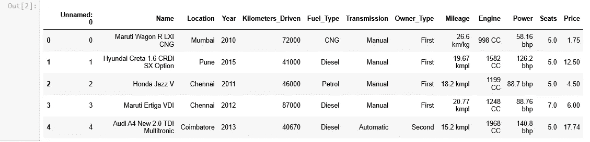
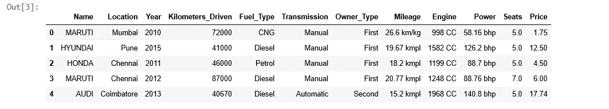
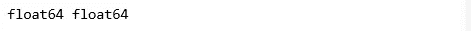
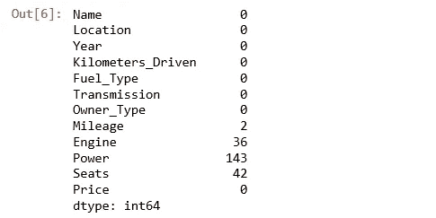
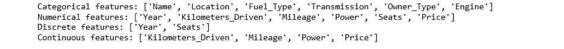
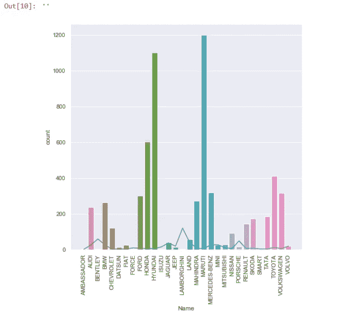
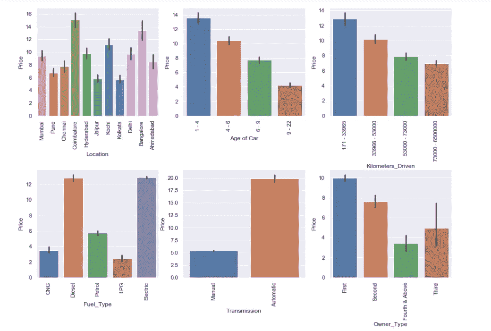
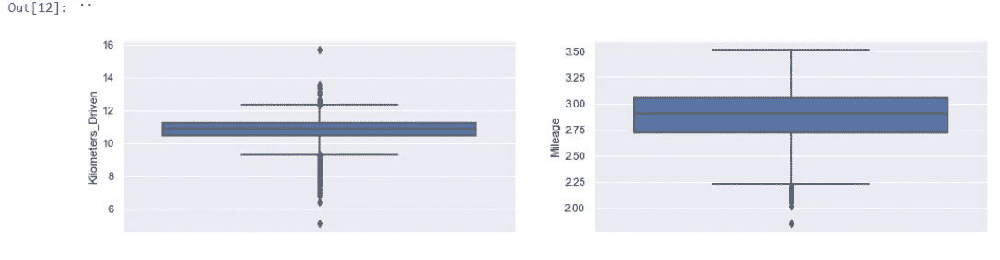
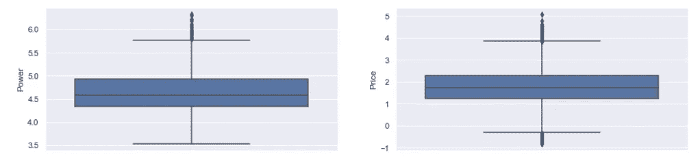

# 用机器学习模型预测汽车价格(上)

> 原文：<https://medium.com/analytics-vidhya/car-price-prediction-with-machine-learning-models-price-f40ea2203f15?source=collection_archive---------23----------------------->

在过去的几年里，机器学习的应用几乎渗透到了每一项技术创新中。从相当简单的将电子邮件分类为垃圾邮件或火腿到复杂的应用程序，如随机对象检测或自动驾驶汽车，这个领域正在以非常快的速度发展。随着海量数据和更快的计算机处理器的出现，可以肯定地说，我们还有很长的路要走。

机器学习的一个常见应用是基于一些给定的特征进行预测。该模型从一些标记的数据中学习，然后对新的看不见的数据进行预测。这种类型的学习被归类为监督学习。

监督学习可以进一步分为两种:分类或回归。分类问题回答问题，会吗？而回归问题回答多少？


玛丽莎·布尔·水中香在 [Unsplash](https://unsplash.com?utm_source=medium&utm_medium=referral) 上拍摄的照片

在这篇文章中，我将与您分享一种逐步建立机器学习模型的方法，该模型可以根据汽车的里程数、使用年限、变速器类型、前车主数量和其他许多特征来预测汽车的价格。我评估了 5 ML 算法(线性回归器、Lasso、Ridge、决策树和随机森林回归器)对数据的性能。

这篇文章将分为两部分。这第一部分将涵盖数据清理和 EDA，而在第二部分，我们将预处理数据和应用机器学习算法。在帖子结束时，你将理解几乎所有机器学习模型的框架，如果你是一个新手，也许能够建立你的模型。这是工作流程的样子。

1.  数据清理和管理
2.  探索性数据分析
3.  特征工程
4.  模型评估
5.  超参数调谐
6.  型号选择
7.  结论和对未来工作的设想

事不宜迟，让我们开始吧。

# 数据清理和管理

数据是从 Kaggle 获得的，可以在这里下载[。我将从导入必要的库开始。](https://github.com/dayvheed/Car-Prices-/blob/master/train-data.csv)

```
import pandas as pd
import numpy as np
import matplotlib.pyplot as plt
import seaborn as sns
import datetime as dt
from sklearn.preprocessing import RobustScaler
from sklearn.model_selection import KFold
from sklearn.model_selection import train_test_split
from sklearn.model_selection import cross_val_score
from sklearn.model_selection import GridSearchCV
from sklearn.linear_model import LinearRegression
from sklearn.tree import DecisionTreeRegressor
from sklearn.linear_model import Lasso
from sklearn.linear_model import Ridge
from sklearn.ensemble import RandomForestRegressor
from sklearn.metrics import r2_score
from sklearn import metrics
import pickle
sns.set()
```

之后，我读取数据并打印前 5 个样本。在我们的分析中，列“未命名:0”是不必要的，因此它从数据帧中删除。简而言之，汽车的品牌是好的，而不是整个车型。因此，我将每个条目按空间分开，选择了第一个索引。

```
# Read the data
train = pd.read_csv(r"C:\Users\wale obembe\Downloads\Compressed\245550_518431_bundle_archive\train-data.csv")
# Print the first 5 rows of the dataframe
print(train.head())# Drop the 'Unnamed: 0' column 
data = train.drop('Unnamed: 0', axis=1)
# Select only the brand of the car and not the model
data['Name'] = data['Name'].apply(lambda x: x.split(' ')[0].upper())
data.head()
```



年份一栏显示了汽车的购买年份。但是为了更容易理解，我从现在的年份中减去了年份，以表示汽车已经使用了多长时间。

```
# Change the Year column to the years of usage
data['Year'] = dt.date.today().year - data['Year']
```

你会注意到一些列，比如“里程”和“功率”，在数字旁边有它们的单位。对于我们的分析，我们只需要数值。所以我再次按空格分割，选择第一个索引并转换成数值。

```
# Select the first word of the Mileage column
data['Mileage'] =data['Mileage'].apply(lambda x: str(x).split(' ')[0])
# Change 'nan' string to real missing values
data['Mileage'] = [x if x != 'nan' else np.nan for x in data['Mileage']]
# Convert the datatype to floating numbers
data['Mileage'] = pd.to_numeric(data['Mileage'])# Select the first word of the Power column
data['Power'] = data['Power'].apply(lambda x: str(x).split(' ')[0])
# Change 'null' string to real missing values
data['Power'] = [np.nan if x=='null' else x for x in data['Power']]
data['Power'] = [np.nan if x=='nan' else x for x in data['Power']]
# Convert the datatype to floating numbers
data['Power'] = pd.to_numeric(data['Power'])print(data['Mileage'].dtype, data['Power'].dtype)
```



现在它们是浮点数，我检查了丢失的值，它们是存在的。

```
# Check for null values
data.isnull().sum()
```



然而，我注意到一些条目是“nan”或“null”字符串，从技术上讲，这不是一个缺失值，尽管它们应该是。这些字符串被转换为丢失的值。接下来，用列的中值替换缺失值，并删除“引擎”列中的缺失值，因为它是一个分类特征。我用中位数而不是平均数来代替，因为我后来意识到这些数据有很多异常值。这里的平均值是一个很大的值。

```
# Replace missing values with median value of the column
mileage_median = data['Mileage'].median()
data['Mileage'] = data['Mileage'].fillna(mileage_median)power_median = data['Power'].median() 
data['Power'] = data['Power'].fillna(power_median)seat_median = data['Seats'].median()
data['Seats'] = data['Seats'].fillna(seat_median)# Drop the remaining rows with missing value
data.dropna(axis=0, inplace=True)
# Check for missing values
data.isnull().sum().any()
```


# 探索性数据分析

首先，我将每个特征分为类别特征、数值特征、连续特征或离散特征。

```
# Classify the non-numerical features
cat_features = [x for x in data.columns if data[x].dtype == 'O']# Classify the numerical features
num_features = [x for x in data.columns if data[x].dtype != 'O']# Classify the discrete features
discrete_features = [x for x in num_features
                     if len(data[x].unique()) < 25]# Classify the continuous features
continuous_features = [x for x in num_features
                      if x not in discrete_features]
# Check them out
print(f"Categorical features: {cat_features}\nNumerical features: {num_features}\
\nDiscrete features: {discrete_features}\nContinuous features: {continuous_features}")
```



然后，我进行了一些数据可视化，以更好地理解数据。我在 seaborn 用计数图法检查了每个品牌被购买的次数。

```
# Create a figure
plt.figure(figsize=(8, 8))
# Count the number of times a car was bought and plot the graph
count = sns.countplot(cat_features[0], data=data, order=data.groupby('Name').mean()['Price'].index)
count.set_xticklabels(count.get_xticklabels(), rotation='vertical')# Plot the mean price of each car
price = sns.lineplot(data.groupby('Name').mean()['Price'].index, data.groupby('Name').mean()['Price'].values)
;
```

马鲁蒂和现代的销量最大，而宾利、兰博基尼和其他一些品牌的买家数量最少。凭直觉，人们会怀疑豪华车会非常昂贵，这也是其销量相对较低的原因。为了证明这一说法，我绘制了一个显示每个品牌价格的线图。兰博基尼和宾利是最贵的两辆车。



此外，我检查了每个功能如何影响价格。条形图显示，使用 1 至 4 年的汽车、行驶里程少于 33963 公里的汽车、只有一位前车主的汽车比其他类别的汽车价格更高。此外，柴油和电动汽车比汽油驱动的汽车或其他燃料类型的汽车更贵。自动变速器的汽车比手动变速器的汽车价格高得多。

```
# Create a figure with 6 subplots
fig, ax = plt.subplots(2,3, figsize=(15, 10))
fig.subplots_adjust(hspace=0.5)# Graph each categorical feature wrt to thee Price
a = sns.barplot(data.columns[1], 'Price', data=data, ax=ax[0][0])
a.set_xticklabels(a.get_xticklabels(), rotation='vertical')b = sns.barplot(pd.qcut(data[data.columns[2]], 4), 'Price', data=data, ax=ax[0][1])
b.set_xticklabels(['1 - 4', '4 - 6', '6 - 9', '9 - 22'], rotation='vertical')
b.set_xlabel('Age of Car')c = sns.barplot(pd.qcut(data[data.columns[3]], 4), 'Price', data=data, ax=ax[0][2])
c.set_xticklabels(['171 - 33965', '33966 - 53000', '53000 - 73000', '73000 - 6500000'], rotation='vertical')d = sns.barplot(data.columns[4], 'Price', data=data, ax=ax[1][0])
d.set_xticklabels(d.get_xticklabels(), rotation='vertical')e = sns.barplot(data.columns[5], 'Price', data=data, ax=ax[1][1])
e.set_xticklabels(e.get_xticklabels(), rotation='vertical')f = sns.barplot(data.columns[6], 'Price', data=data, ax=ax[1][2])
f.set_xticklabels(f.get_xticklabels(), rotation='vertical');
```



最后，检查数据中是否存在异常值非常重要。我用 seaborn 为数字特征绘制了一个箱线图。顶部和底部胡须后的圆点表示异常值的存在。异常值是数据分布中极高或极低的值，它们的存在会严重损害您的分析。数据中的异常值将被立即处理。

```
data1 = data.copy()# Create a figure with 4 subplots    
fig, ax = plt.subplots(2,2, figsize=(16,8))# Create a boxplot for the continuous features
box1 = sns.boxplot(y=np.log(data1[continuous_features[0]]), ax=ax[0][0])
box2 = sns.boxplot(y=np.log(data1[continuous_features[1]]), ax=ax[0][1])
box3 = sns.boxplot(y=np.log(data1[continuous_features[2]]), ax=ax[1][0])
box4 = sns.boxplot(y=np.log(data1[continuous_features[3]]), ax=ax[1][1])
;
```



我会暂时停在这里。请注意第 2 部分，我将从一些特性工程开始，并结束这个项目。感谢阅读！