# 使用 Matplotlib 的 CNN 汽车视觉

> 原文：<https://medium.com/analytics-vidhya/car-visuals-for-cnn-using-matplotlib-2c2366334bf2?source=collection_archive---------32----------------------->

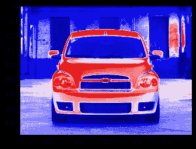

当解决一个[计算机视觉](https://g.co/kgs/w3bLos)问题时，我们会遇到许多小步骤。通过使用 [TensorFlow](https://www.tensorflow.org/learn) 库使您的代码更少，大部分过程变得更容易。但是，您可以实现的一个更高的飞跃是在探索数据的过程中。无论你的代码有多小，这样的步骤对于创建你的[模型](https://www.ibm.com/support/knowledgecenter/en/SS3RA7_15.0.0/com.ibm.spss.modeler.help/neuralnet_model.htm)都很重要。因为，归根结底，是您的数据定义了除您创建的层之外的大部分模型。

我会努力让这篇文章有助于你*理解图像*为分类问题编写模型。我们先简单看看一个**卷积**是什么意思。

## ***卷积***

在 Instagram stories 上使用滤镜时，如果您确实使用了，这种变化背后的底层逻辑是低级图像处理的一部分。在极客语言的更深层次上，通过在内核和图像之间进行*卷积*来改变外观。

Instagram 故事上的颜色过滤器

也就是说，原始图像矩阵会根据另一个矩阵—过滤器(也称为内核)而改变。下面是我用向量做的一个插图。我试图尽可能多地包含一些常识，以帮助你理解真正发生了什么。如果你觉得难以理解，可以随时查看[这个视频](https://youtu.be/C_zFhWdM4ic)。我推荐。

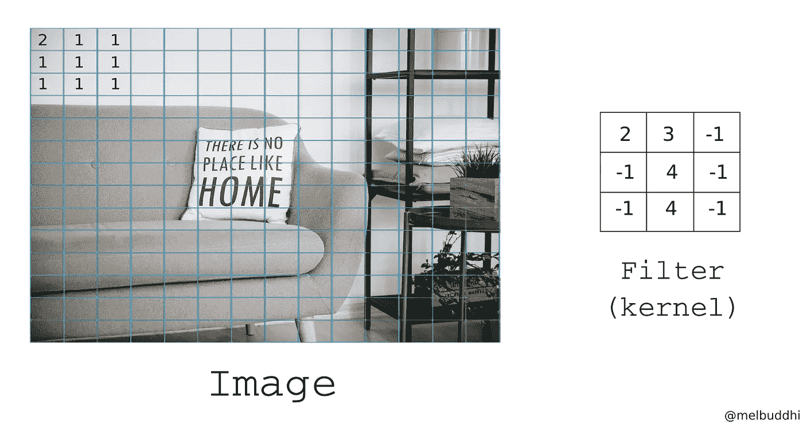

图像矩阵和核

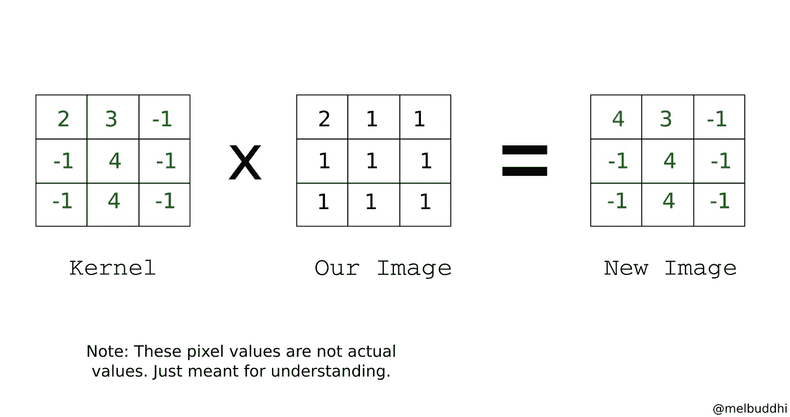

核卷积

此外，上图中的“X”和“=”不是卷积的正确表示，因为只有相应的值被相乘，而不是矩阵。

因此，图像中有许多这样的像素，如果单词存在，它们都会变得错综复杂。不改变图像的亮度-这些新值被归一化。

我想我们现在对卷积已经知道得够多了。请注意，在 CNN 中，卷积并不是唯一的处理过程。还有另一个叫做 ***池化*** 的过程，它也有助于只保留模型所需的独特细节。

让我们跳到观想！

这里有一些可能的“色彩映射表”,你可以用它来理解你的数据集，或者你的数据集中的一个特殊例子。您可以在我的 [GitHub](https://github.com/melbuddhi/data-science/blob/master/deeplearning/Understanding_Cars196_dataset_.ipynb) 资源库中找到要使用的代码。

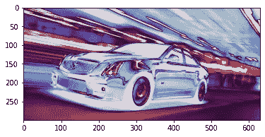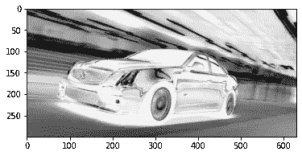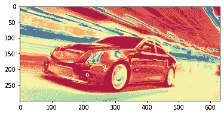

暮光|双星|光谱

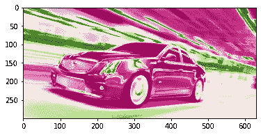

afmhot | hot | PiYG

使用如此不同的色彩映射表制作您想要的图像。因为，甚至你的模型可能会帮助你找出你首先需要理解的东西。很明显,“二进制”色图有助于我们从整个图像中分辨出(如果不能识别的话)汽车。通过下面的图片，你会更好地理解这一点，其中这辆卡车是图片中唯一的对象。

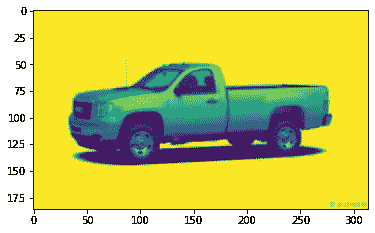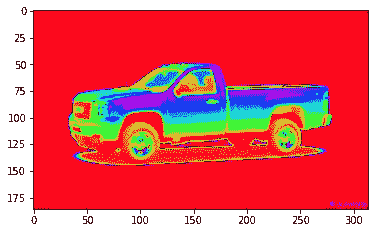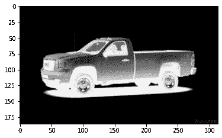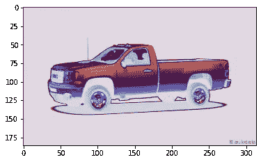

对于分类来说，主要你需要的是将物体从它的环境中区分出来。机器理解这种差异需要时间。而像你这样的人，甚至不需要彩色地图来找出卡车。这就是为什么这种辅助设备对让计算机自己解决问题很重要。太傻了，对吧？

希望你对卷积以及如何在 Matplotlib 中使用不同的颜色图有所了解。我可以说，即使有 Snapseed 这个我用来给照片分级的应用程序，我也没有遇到过如此多样的颜色。嗯，这是因为它通常不需要正常的编辑。虽然这是一个学习色彩灵活性的好方法。

感谢您的阅读！