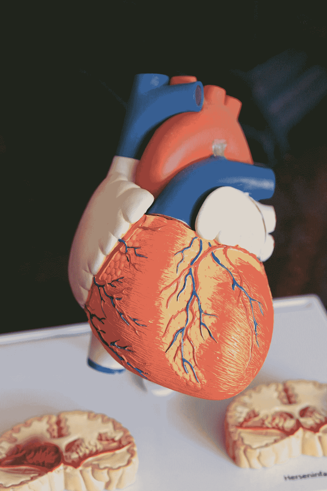
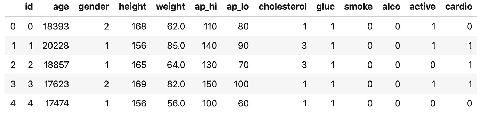
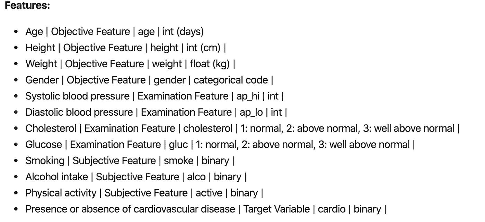
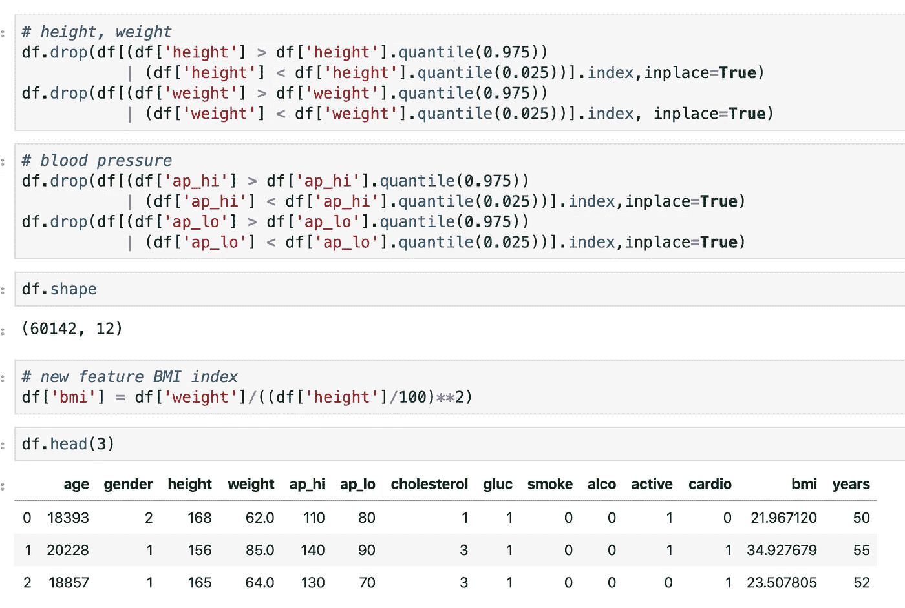
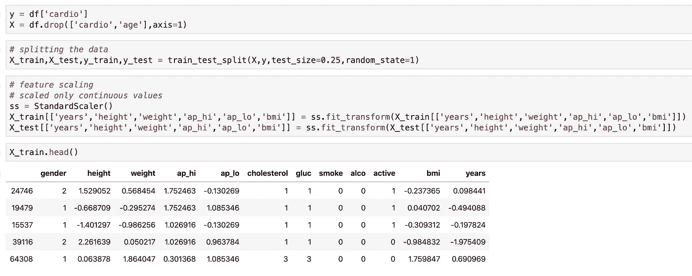
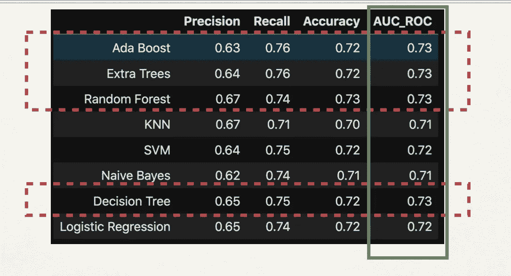
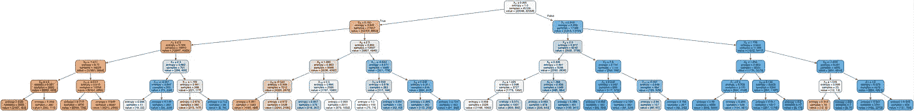

# 心血管疾病(CVD)预测

> 原文：<https://medium.com/analytics-vidhya/cardiovascular-disease-cvd-prediction-5ccf3d6101cc?source=collection_archive---------9----------------------->

Robina Weermeijer 在 [Unsplash](https://unsplash.com?utm_source=medium&utm_medium=referral) 上的照片

1.  心血管疾病是全球头号死亡原因
2.  人们可以通过遵循健康的饮食和锻炼来显著降低患心血管疾病的风险

我的目标是尝试不同的机器学习模型，看看哪一个表现最好。

数据来自 Kaggle，有 70k 个实例，12 个特征。

**剔除异常值:**

数据清理在这里得到了很好的解释([https://www.kaggle.com/sulianova/eda-cardiovascular-data](https://www.kaggle.com/sulianova/eda-cardiovascular-data))。我用了她的密码。

去除身高、体重中低于 2.5%和高于 97.5%的异常值
，并去除舒张压高于收缩压的异常值，这是不正确的。此外，创建了新的身体质量指数(身体质量指数)功能。

## 拆分数据:

清理数据后，我将数据分为训练和测试数据。在建模之前，对训练数据中的所有特征进行了缩放(分类除外)。

## **建模结果**

> 查看[我的 GitHub](https://github.com/aabdygaziev/flatiron-mod5-project) 来看看 Jupyter-notebook。

拟合数据后，我得到了下面这些结果。从所有的模型中，我得到了非常相似的结果。尽管决策树、随机森林和额外树等分类模型的 AUC 得分略高于其他模型，为 0.73。

**下图为决策树分类器的工作原理:**

决策树分类器分裂成树

作为决策特征，我的算法选择了收缩压。当心脏收缩将血液推向循环系统，向每个细胞输送足够的氧气并清除二氧化碳时，这是一种压力测量。

我相信算法做得很好，选择了正确的特征，开始将数据分成树。我之所以这么说，是因为从统计数据来看，有心脏病的人有高血压。通过观察血压，我们通常可以检查心脏的状态。心脏病的主要因素之一是胆固醇。

当我们食用动物制造的食物时，它含有我们肝脏产生的帮助消化食物的胆固醇。因此，当我们体内胆固醇水平升高时，就会开始形成斑块。斑块堵塞动脉。这会使动脉通道变窄，从而减少血液流动。为了克服这一点，你的心脏开始比正常情况下跳动得更快，以将血液输送到你的细胞。这可能会给你带来各种心脏问题。