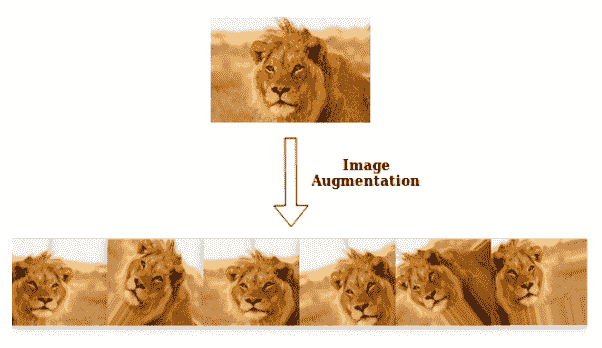

# 使用 Google Colab 的食肉动物图像分类

> 原文：<https://medium.com/analytics-vidhya/carnivores-image-classification-using-google-colab-add14f7c3e4f?source=collection_archive---------4----------------------->

## 具有数据增强和迁移学习能力的卷积神经网络！



# 总说明

美国有线电视新闻网

卷积神经网络(CNN)是大多数计算机视觉技术的基础。与传统的[多层感知器](https://missinglink.ai/guides/neural-network-concepts/perceptrons-and-multi-layer-perceptrons-the-artificial-neuron-at-the-core-of-deep-learning/)架构不同，它使用两种称为“卷积”和“汇集”的操作来将图像简化为其基本特征，并使用这些特征来理解和分类图像。

[](https://www.analyticsvidhya.com/blog/2017/06/architecture-of-convolutional-neural-networks-simplified-demystified/) [## 去神秘化的卷积神经网络结构

www.analyticsvidhya.com](https://www.analyticsvidhya.com/blog/2017/06/architecture-of-convolutional-neural-networks-simplified-demystified/) 

**数据增强**

这是一种可用于通过在数据集中创建图像的修改版本来人为扩展训练数据集大小的技术。在更多数据上训练深度学习神经网络模型可以创建图像的变体，这些变体可以提高 fit 模型将它们已经学习到的知识推广到新图像的能力。

[](https://nanonets.com/blog/data-augmentation-how-to-use-deep-learning-when-you-have-limited-data-part-2/) [## 数据扩充|在数据有限的情况下如何使用深度学习

nanonets.com](https://nanonets.com/blog/data-augmentation-how-to-use-deep-learning-when-you-have-limited-data-part-2/) 

**迁移学习**

这是一种克服孤立的学习范式，并利用为一项任务获得的知识来解决相关问题的思想。我们冻结网络的早期卷积层，只训练最后几层进行预测。其思想是卷积层提取适用于所有图像的一般、低级特征，而后面的层识别特定特征。

[](https://data-flair.training/blogs/transfer-learning/) [## 用 CNN-data flaer 实现深度学习的迁移学习

数据-天赋.培训](https://data-flair.training/blogs/transfer-learning/) 

# 为什么选择 Google Colab？

在普通笔记本电脑上训练深度学习模型需要大量的计算能力，并且经常会无休止地运行。这可能会阻止初学者亲自探索深度学习的世界。

有了 Colab，你可以通过利用谷歌硬件的能力在谷歌的云服务器上执行代码，包括 GPU 和 TPU，而不管你的机器的能力如何。

## 创建新笔记本

要在 Colab 上创建新笔记本，打开[https://colab.research.google.com/](https://colab.research.google.com/)，它会自动显示你之前的笔记本，并给出创建新笔记本的选项。


在这里，您可以单击“新建笔记本”来启动一个新笔记本，并开始在其中运行您的代码。默认是 Python 3 笔记本。

默认情况下，你在 Google Colab 中创建的所有笔记本都存储在你的 Google Drive 中。在你的驱动器中有一个名为“Colab 笔记本”的文件夹，在那里你可以找到所有你从 Google Colab 创建的笔记本。


要从 Colab 中的 Drive 打开笔记本，右键单击所需的笔记本，然后“打开方式> Google 协同实验室”。


## 从驱动器加载数据

你可以通过将 Google Drive 安装到笔记本电脑上来轻松加载数据。为此，请在笔记本中键入以下代码。

```
from google.colab import drive
drive.mount('/content/drive')
```

它会给你一个打开的链接，


*   转到链接
*   登录您的 Google 帐户
*   复制代码
*   粘贴到笔记本上

现在如果你在你的“**文件”**部分看到，你会找到你的“**驱动器”**。


假设你上传了食肉动物文件夹下的图片。


您可以通过复制图像的路径并将其粘贴到路径变量中来获取图像。

```
train_path='/content/drive/My Drive/carnivores/train'
test_path='/content/drive/My Drive/carnivores/test'
```

# 食肉动物图像分类

该数据由来自 3 大洲的 4 种食肉动物的图像组成→猎豹和鬣狗(非洲)、美洲虎(南美洲)和老虎(亚洲)。训练集由 3600 幅图像组成(每种食肉动物 900 幅)，测试集有 400 幅图像(每种食肉动物 100 幅)。数据中可供学习的例子非常少，因此这是一个具有挑战性的机器学习问题，但也是一个现实的问题:在许多现实世界的用例中，即使是小规模的数据收集也可能非常昂贵，有时几乎是不可能的。

要下载数据，请访问以下链接:

[](https://drive.google.com/drive/folders/1PDjKvn9TqB5jTxuaPts4Fe05kLWWB0SX?usp=sharing) [## 食肉动物-谷歌驱动

drive.google.com](https://drive.google.com/drive/folders/1PDjKvn9TqB5jTxuaPts4Fe05kLWWB0SX?usp=sharing) 

我们将使用 Keras 深度学习神经网络库，它提供了通过 *ImageDataGenerator* 类使用图像数据增强来拟合模型的能力。我们还将使用预训练的 InceptionV3 模型进行迁移学习。

# 导入包

```
import numpy as np
import matplotlib.pyplot as plt
import pandas as pd
import sklearn
import mathimport warnings
warnings.filterwarnings("ignore")
```

# 作为特征提取器的预训练 CNN 模型

让我们利用 Keras，加载 InceptionV3 模型，并冻结卷积块，以便我们可以将它用作图像特征提取器。

```
import keras
from keras.applications.inception_v3 import InceptionV3
from keras.models import Model,load_modelconv_base =  InceptionV3(weights='imagenet',include_top=False,
                         input_shape=(300, 300, 3))output = conv_base.layers[-1].output
output = keras.layers.Flatten()(output)
model_tl = Model(conv_base.input, output)model_tl.trainable = Falsefor layer in model_tl.layers:
    layer.trainable = Falselayers = [(layer, layer.name, layer.trainable) for layer in  
               model_tl.layers]
model_layers=pd.DataFrame(layers, columns=['Layer Type', 'Layer  
                 Name', 'Layer Trainable'])print(model_layers) 
```


InceptionV3 模型的所有层现在都被冻结了(Layer Trainable 对于所有层都是假的)，因为我们不希望它们的权重在模型训练期间发生变化。InceptionV3 模型中的最后一个激活特征映射为我们提供了瓶颈特征，然后可以将其展平并馈入完全连接的深度神经网络分类器。

# 数据预处理和数据扩充

为了充分利用我们为数不多的训练示例，我们将通过一些随机转换来“扩充”它们，以便我们的模型永远不会看到两次完全相同的图片。这有助于防止过度拟合，并帮助模型更好地概括。

在 Keras 中，这可以通过 *ImageDataGenerator* 类来完成。本课程允许您:

*   在训练过程中，配置要对图像数据执行的随机变换和归一化操作
*   通过`.flow_from_directory(directory)`实例化增强图像批次(及其标签)的生成器。然后，这些生成器可以与接受数据生成器作为输入的 Keras 模型方法一起使用。

```
from keras.models import Sequential
from keras.layers import Dense, Dropout, Conv2D, MaxPool2D, Flatten
from keras.preprocessing.image import ImageDataGenerator
from keras import optimizerstest_size=400
batch_size=32
epochs=25train_path='/content/drive/My Drive/carnivores/train'
test_path='/content/drive/My Drive/carnivores/validation'target_size=(300,300) #resize all images to 300x300train_datagen = ImageDataGenerator(rescale=1./255, zoom_range=0.3,  
                                   rotation_range=50,
                                   width_shift_range=0.2, 
                                   height_shift_range=0.2, 
                                   shear_range=0.2,
                                   horizontal_flip=True,
                                   brightness_range = [0.8, 1.2],
                                   fill_mode='nearest',        
                                   **validation_split=0.2**)test_datagen = ImageDataGenerator(rescale=1./255)# The list of classes will be automatically inferred from the subdirectory names/structure under train_dirtrain_generator = train_datagen.flow_from_directory(
                  **train_path,**
                  target_size=target_size,#  
                  batch_size=batch_size,
                  class_mode='categorical',
                  **subset='training'**)validation_generator = train_datagen.flow_from_directory(
                       **train_path,**
                       target_size=target_size,
                       batch_size=batch_size,
                       class_mode='categorical',
                       **subset='validation'**)
```

Keras 现在使用 ImageDataGenerator 从单个目录中添加了训练/验证分割。使用 ImageDataGenerator 中的 validation_split，将训练数据分成 2 个子集→训练和验证。

# 建筑模型架构

现在让我们构建我们的深度神经网络分类器的架构，它将把上述平坦化的瓶颈特征作为输入。

```
from keras.models import Sequential
from keras.layers import Dense, Dropout, Conv2D, MaxPool2D, Flatten
from keras import optimizers# building a linear stack of layers with the sequential model
model =Sequential()
model.add(model_tl)# hidden layer
model.add(Dense(128, activation='relu'))
model.add(Dropout(0.2))# output layer
model.add(Dense(4, activation='softmax'))# compiling the sequential model
model.compile(loss='categorical_crossentropy',
              optimizer=optimizers.RMSprop(lr=1e-4),
              metrics=['acc'])print(model.summary())
```


# 保存模型检查点

Google Colab 提供了一次 12 小时的最大 gpu 运行时间,“理想情况下”,如果他们检测到不活动(90 分钟)或有重负载时，它可能会在此之前断开连接。因此，我们将在拟合模型之前使用 Keras 中的回调来保存检查点，这样我们的进度就不会丢失。

```
from keras.callbacks import *filepath="/content/drive/My Drive/MyCNN/epochs:{epoch:03d}-val_acc: 
          {val_acc:.3f}.hdf5"checkpoint = ModelCheckpoint(filepath, 
                             monitor='val_acc', 
                             verbose=1,
                             save_best_only=False,
                             save_freq='epoch',     
                             mode='max')callbacks_list = [checkpoint]
```

*   **filepath :** 用于 drive 中名为 ***MyCNN*** 的文件夹(在你的 drive 中创建这个新文件夹)，每个文件将存储有纪元编号和验证精度，这些文件包含你的神经网络的权重。
*   **ModelCheckpoint :** 对于上述代码中传递的参数，它监视验证精度，并在每个时期后存储验证精度。
*   **callbacks_list :** 创建一个列表，这样你就可以在这个列表中添加任何其他的回调函数，并在训练时将它传递给 fit 函数。

# 断开后恢复训练

*   在新的运行时装载驱动器
*   使用相同的架构并创建模型
*   `model.load_weights('/content/drive/My Drive/MyCNN/epochs:020-val_acc:0.985.hdf5')`从一个检查点加载重量，该检查点在第 20 个时期达到 98.5%的验证准确度。
*   然后编译拟合模型(在 model.fit()中增加一个额外的参数→initial _ epoch = 20；直到你的模型被保存的最后一个纪元)，从第 21 个纪元继续等等。


# 培训模式

我们将使用带有检查点的体系结构，并使模型适合训练数据。

```
history = model.fit(
          train_generator,
          steps_per_epoch=train_generator.samples//batch_size,    
          validation_data=validation_generator,
          validation_steps=validation_generator.samples//batch_size,
          epochs=epochs,
          verbose=1,
          shuffle=True,
          **callbacks=callbacks_list**)
```


您可以清楚地看到，它在每个时期后开始保存模型

# 模型性能

为了评估和可视化模型性能，我们创建了一个函数:

*   **学习曲线:**在每个时期后绘制模型精度和损失，以了解模型是否合适。

```
# Model evaluationscores_train = model.evaluate(train_generator,verbose=1)
scores_validation = model.evaluate(validation_generator,verbose=1)
print("Train Accuracy: %.2f%%" % (scores_train[1]*100))
print("Validation Accuracy: %.2f%%" % (scores_validation[1]*100))#For plotting Accuracy and Lossdef LearningCurve(history):
# summarize history for accuracy
plt.plot(history.history['acc'])
plt.plot(history.history['val_acc'])
plt.title('model accuracy')
plt.ylabel('accuracy')
plt.xlabel('epoch')
plt.legend(['train', 'validation'], loc='upper left')
plt.show()# summarize history for loss
plt.plot(history.history['loss'])
plt.plot(history.history['val_loss'])
plt.title('model loss')
plt.ylabel('loss')
plt.xlabel('epoch')
plt.legend(['train', 'validation'], loc='upper left')
plt.show()LearningCurve(history) #Save the trained model to a file model_weight_file='/content/drive/MyDrive/MyCNN/
                   carnivores_tlearn_img_aug_cnn.h5'
model.save(model_weight_file)
```


我们可以看到，我们的模型的训练准确率为 **99.51%** ，验证准确率为 **99.03%。**训练和验证精度彼此相当接近，表明该模型是很好的拟合。

# 做预测

我们将使用测试数据进行预测，看看我们的模型在看不见的数据上表现如何。

```
# We take the ceiling because we do not drop the remainder of the batchcompute_steps_per_epoch = lambda x: int(math.ceil(1\. * x / batch_size))test_steps = compute_steps_per_epoch(test_size)test_generator = test_datagen.flow_from_directory(
                 test_path,
                 target_size=target_size, 
                 batch_size=batch_size,
                 class_mode=None,
                 shuffle=False)test_generator.reset()#Calling the saved model for making predictions
tl_img_aug_cnn = load_model(model_weight_file)pred=tl_img_aug_cnn.predict(test_generator,
                            verbose=1,
                            steps=test_steps)predicted_class_indices=np.argmax(pred,axis=1)
labels = (test_generator.class_indices)
labels = dict((v,k) for k,v in labels.items())
predictions = [labels[k] for k in predicted_class_indices]filenames=test_generator.filenames
results=pd.DataFrame({"Filename":filenames,
                      "Predictions":predictions}) #create a function for visualizing model performanceimport seaborn as snsdef PerformanceReports(conf_matrix,class_report,labels):
    ax= plt.subplot()
    sns.heatmap(conf_matrix, annot=True,ax=ax)
    #labels, title and ticks
    ax.set_xlabel('Predicted labels')
    ax.set_ylabel('True labels')
    ax.set_title('Confusion Matrix')
    ax.xaxis.set_ticklabels(labels)
    ax.yaxis.set_ticklabels(labels)
    plt.show()
    ax= plt.subplot()
    sns.heatmap(pd.DataFrame(class_report).iloc[:-1, :].T,  
                annot=True,ax=ax)
    ax.set_title('Classification Report')
    plt.show()from sklearn.metrics import confusion_matrix,classification_report,accuracy_scorelabels=['cheetah','hyena','jaguar','tiger']
test_labels = [fn.split('/')[0] for fn in filenames]cm=confusion_matrix(test_labels,predictions)
print(cm)cr=classification_report(test_labels, predictions)
class_report=classification_report(test_labels, predictions,
                                   target_names=labels,
                                   output_dict=True)
print(cr)PerformanceReports(cm,class_report,labels)
```

使用`.predict()`函数将给出概率输出，因此我们需要将它们转换成类别号。在这种情况下，它是 4 个类，所以类号是 0，1，2 和 3。

`predicted_class_indices=np.argmax(pred,axis=1)`

下一步是我们需要类的名字:

```
labels = (train_generator.class_indices)
labels = dict((v,k) for k,v in labels.items())
predictions = [labels[k] for k in predicted_class_indices]
```

类别编号将由类别名称替换。最后，将它安排在一个数据帧中，并在图像名称后附加预测的类。

```
filenames=test_generator.filenames
results=pd.DataFrame({"Filename":filenames,
                      "Predictions":predictions})
```


# 在你走之前

***感谢*** *的阅读！请随意将这种方法应用于您的图像分类问题。如果你有任何困难或疑问，请在下面评论。非常感谢你的支持。如果你想和我联系，打 jatin.kataria94@gmail.com 找我。*