# 用 Python 脚本卡通化

> 原文：<https://medium.com/analytics-vidhya/cartoonization-with-python-script-8881fcce6ddc?source=collection_archive---------16----------------------->

机器学习或者我应该称之为“神奇的学习”？每天我都能感受到人工智能和人工智能在我们日常生活中的本质。ML 正在到处传播它的存在，无论是教育行业，虚拟机器人，甚至是图像编辑，因为我昨天发现了一个惊人的项目，其动机是在没有任何编辑工具(沉重和昂贵)的情况下将图像卡通化，而不是使用小 python 脚本(简单和免费)。

在这篇文章中，我将阐述如何用 python 的两个库，即 **cv2** 和 **numpy** ，对一幅图像进行基本的卡通化。为了获得卡通效果，使用了两个函数:

1.  **双边滤波器:**用于平滑图像和减少噪声，从而减少要卡通化的图像的调色板。
2.  **边缘检测:**该功能应用于结果图像，生成粗体轮廓。

让我们按照循序渐进的编码方式，为您最喜爱的图像增添一些乐趣:

1.  **导入必要的库:**要导入的第一个库是 cv2，然后是 numpy。

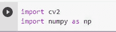

导入库的代码

**2。读取图像进行操作:**在 cv2.imread()函数的帮助下，我们将从本地目录中读取图像。

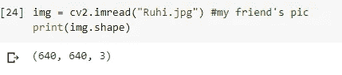

读取图像以进行卡通化

**3。调整图像大小:**由于 bilateralFilter()函数具有高计算成本的缺点，我们将调整图像大小，通过减小其宽度和高度将其转换为低分辨率图像。

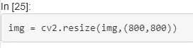

调整大小

**4。应用双边过滤器:**调整大小可能会导致图像像素的混叠，所以我们将使用高斯金字塔来缩小缩小的图像。但是在此之后，双边滤波器可能处理缓慢，另一个技巧是对图像迭代小的双边滤波器，而不是一次使用大的双边滤波器。

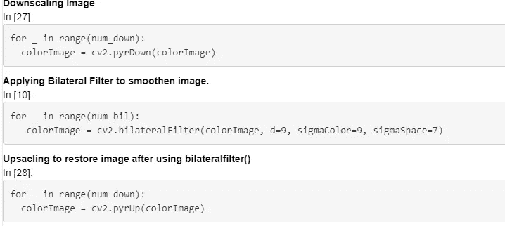

双边功能

此函数中使用的参数有:

*   **d:** 每个像素邻域的直径。
*   **sigmaColor:** 色彩空间中西格玛的值。值越大，混合更远颜色的机会就越大。
*   **西格玛空间:**坐标空间中西格玛的值。该值越大，如果更远的像素的颜色在 sigmaColor 范围内，它们混合的机会就越大。

通过放大将图像恢复到原始大小。

5.**将图像转换为灰度图像:**在此步骤中，RGB 图像被转换为其灰度版本。

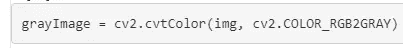

灰度图像

**6。** **对灰度图像应用中值模糊:**中值模糊用于设置灰度图像中每个像素的中值，以减少噪声并有效地执行自适应阈值处理。中值模糊应用于七个像素的邻域。

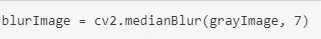

中值模糊

7.**使用自适应阈值:** adaptiveThreshold()函数类似于用于将灰度图像转换为二值图像的阈值函数，因为卡通图像带有很少的颜色。

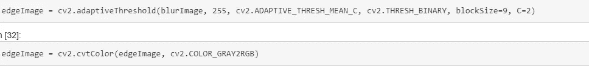

自适应阈值

**8。将彩色图像与最终边缘图像结合:**到目前为止，每一步之后，这里是最后一步，通过将双边滤波器生成的原始 RGB 图像与使用 bitwise_and 的边缘掩蔽结合起来，得到最终输出。

按位与

**最后使用 imshow()函数来查看输出。**

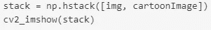

图像输出

我尝试使用这个脚本的几个图像是:

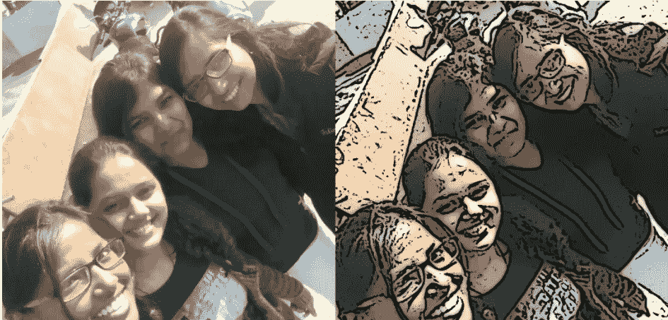

决赛成绩

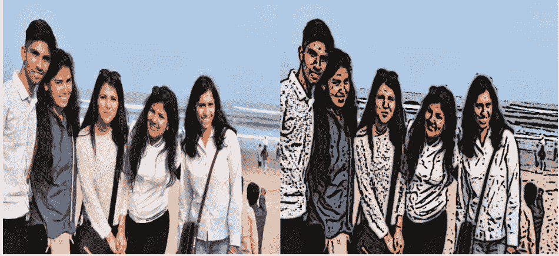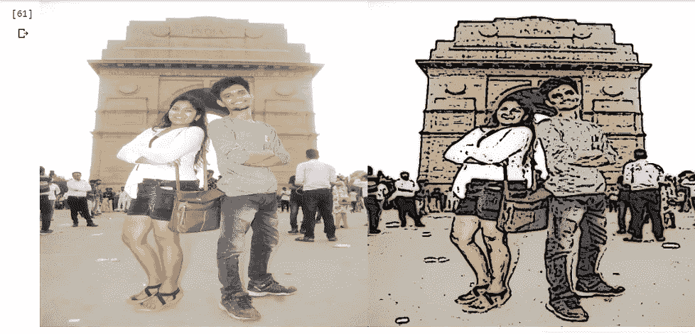

输出

我希望你仔细地遵循了每一步，如果你错过了一些步骤或者在某个地方卡住了，这里是 github repo 的链接:[https://github.com/tanviagwl98/ImageCartoonization_OpenCV](https://github.com/tanviagwl98/ImageCartoonization_OpenCV)

参考资料:

*   [https://www.instagram.com/p/CErJrqZAD7Y/](https://www.instagram.com/p/CErJrqZAD7Y/)
*   [https://www.geeksforgeeks.org/python-bilateral-filtering/](https://www.geeksforgeeks.org/python-bilateral-filtering/)