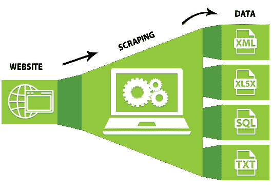
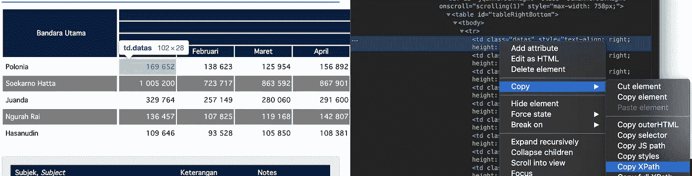
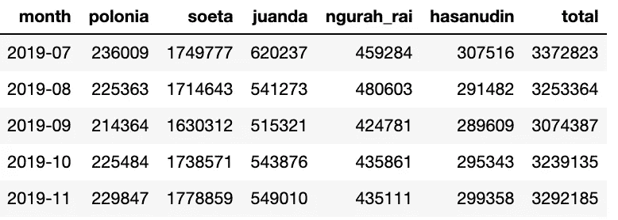

# 案例:使用 Selenium 收集数据

> 原文：<https://medium.com/analytics-vidhya/case-scraping-data-using-selenium-b0432a4bff95?source=collection_archive---------10----------------------->

## 我的一个 python 游乐场，瞧，成功了



我每天都在处理脏数据，来源可能是网站中的任何地方，也可能是线下的任何来源。获得这些数据后，您只剩下两个选项:

1.  安心于**手动工作**，这是**少思考**多努力的工作。
2.  试着抓住如何让**自动化**这些东西的想法，这真的很痛苦，但你可以**之后聪明地**工作。

我相信我们肯定都选择了第二种选择。

我承认 Python 正在改变我的整个工作生活。我几个月前才彻底学会，并把它应用到工作生活中。我是那种非常热衷于学习的人，实际上，我无法想象如果没有 python，我的生活会是什么样子。就像甘地说的:

> 活着，就像你明天就会死去一样。学习吧，就像你会永远活着一样。

**Python** 是如此**便捷**的编程语言，与其他语言相比相当**易学**和**易懂**。如果你是编码新手，我建议你先学习 Python，理解其中的概念。

# 什么是数据抓取？

抓取网页以获取有价值的数据或信息的行为。当你处理公共数据集时，这通常是需要的，因为它在 [Kaggle](http://www.kaggle.com) 等中还不可用，然后你需要从网站上获取数据。

为了节省时间和精力，您应该通过运行 python 脚本来废弃该网站。在本例中，脚本使用的是 Selenium 框架。

# 为什么是硒？

对于抓取网站，我们可以使用几个比较知名的框架，比如 [BeautifulSoup](https://www.crummy.com/software/BeautifulSoup/bs4/doc/) 、 [lxml](https://lxml.de/) 等。事实上， [**Selenium**](https://selenium.dev/) 并不是主要为抓取网站而构建的，它是自动化网络浏览器的测试目的框架。但就我个人而言，我更喜欢 Selenium，因为我们只需几行代码就可以与网站进行更多的交互(登录、点击等),而且内置功能更简单。

# 要做的步骤

1.  将 Chromedriver 包安装到 jupyter 领域(我用 chrome 作为我的浏览器)

```
pip install chromedriver_binary
```

2.将必要的包导入到脚本中

```
from selenium import webdriver
import chromedriver_binary
import pandas as pd
import datetime
import numpy as np
```

3.设置你想去的网址

```
url = "[https://www.bps.go.id/dynamictable/2015/03/10/812/jumlah-penumpang-yang-berangkat-pada-penerbangan-domestik-di-bandara-utama-indonesia-2006-2019-orang-.html](https://www.bps.go.id/dynamictable/2015/03/10/812/jumlah-penumpang-yang-berangkat-pada-penerbangan-domestik-di-bandara-utama-indonesia-2006-2019-orang-.html)"
```

4.创建一个 web 驱动程序开始抓取

```
driver = webdriver.Chrome()
driver.get(url)
```

5.单击想要捕获的数据，运行 inspect element，并复制 XPATH



网站和检查元素

6.创建函数也从其他行获取数据，只需更改值

```
def parse_table(val):
    value = driver.find_elements_by_xpath('//*[[@id](http://twitter.com/id)="tableRightBottom"]/tbody/tr[{}]/td'.format(str(val)))added_value = []for item in value:
        member = item.text
        member = "".join(member.split())
        added_value.append(member)

    return added_valuepolonia = parse_table(1)
soeta = parse_table(2)
juanda = parse_table(3)
ngurah_rai = parse_table(4)
hasanudin = parse_table(5)
```

7.创建从 2006 年到 2019 年的每月周期

```
start_year = 2006
end_year = 2020month_key = pd.DataFrame({"month": pd.period_range(start_year, freq='M', periods=(end_year-start_year)*12)
                         })
```

8.最后，通过连接所有机场，以一个数据框架的形式准备数据，并对其进行清理，然后创建总价值，即每月 5 个现有机场的总和

```
complete_data = pd.concat([month_key, 
           pd.DataFrame({"polonia": polonia,
                         "soeta": soeta,
                         "juanda": juanda,
                         "ngurah_rai": ngurah_rai,
                         "hasanudin": hasanudin
                        })
                        ], axis=1)complete_data = complete_data.dropna()def cast_as_numeric(df, col):
    df[col] = pd.to_numeric(df[col])
    return print("cast as numeric done")cast_as_numeric(complete_data, "polonia")
cast_as_numeric(complete_data, "soeta")
cast_as_numeric(complete_data, "juanda")
cast_as_numeric(complete_data, "ngurah_rai")
cast_as_numeric(complete_data, "hasanudin")complete_data["total"] = complete_data.iloc[:,1:].sum(axis=1)
```



输出数据

下一次，如果你想运行额外的月份，你只需在你的 jupyter 中运行所有，脚本将自动从网站上获取数据。

谢谢你为这篇文章鼓掌，我只想分享我到目前为止为聪明地工作所做的努力。我的座右铭是做任何需要做的事情，不做那些没有效率的事情。

我还有其他文章，也许你会感兴趣。

*   [如何使用 Airflow 和 Google BigQuery 安排查询](/dataseries/how-to-schedule-query-using-airflow-and-google-bigquery-6d6936e868a8)
*   [使用 Tableau 创建时间对比趋势](/dataseries/creating-time-comparison-trend-using-tableau-51e41d151d2f)

我将不断学习更多的知识，以不断完善我的知识，并在我目前所学的工具上进行合作，我的下一个议程可能是使用气流自动化数据采集。敬请期待！！