# 通过选择最佳特征选择最佳多元回归模型以预测房屋销售价格的实例研究

> 原文：<https://medium.com/analytics-vidhya/case-study-of-a-model-to-predict-the-selling-price-of-the-new-houses-coming-onto-the-market-a6443726de5b?source=collection_archive---------16----------------------->

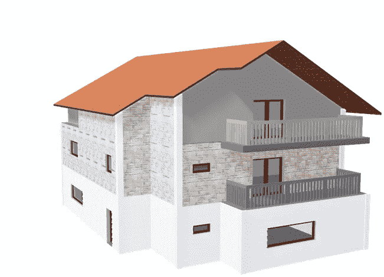

## ***分析概述***

*   数据类型-所有变量都是数字。没有分类数据。
*   缺失数据-数据集中没有缺失数据。
*   分析- EDA 和多元线性回归，然后进行模型验证。

**所用包装:**

ggplot、dplyr、olsrr、car、boot、DataExplorer 等。

**可视化:**

直方图、条形图、密度图、散点图、配对图、热图。

# **探索性数据分析**

*   数据集摘要:39 个观察值和 11 个变量

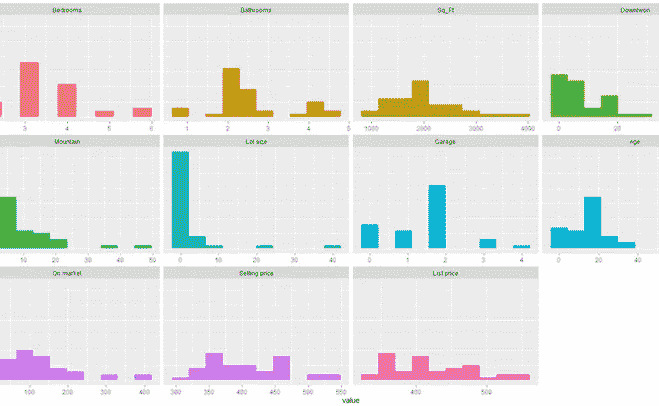

**直方图**

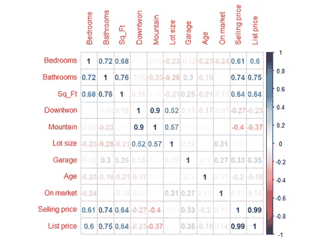

**相关性**

# ***模型构建:***

1.决定预测变量

2.使用了 3 个不同的函数:stepAIC，ols_step_best_subset，regsubsets。

3.建立了两个可能的模型

# 模型 1:

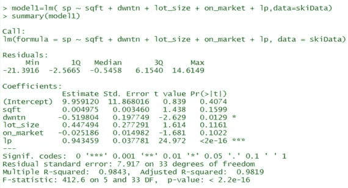

**型号 1**

# 模型 2:

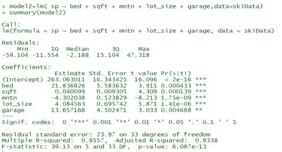

**模式二**

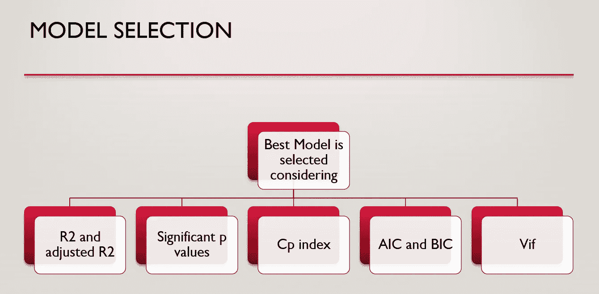

型号选择

在考虑最佳模型时，我们计算了 R2 并调整了 R2、显著 p 值、Cp 指数、AIC、BIC 和 Vif。

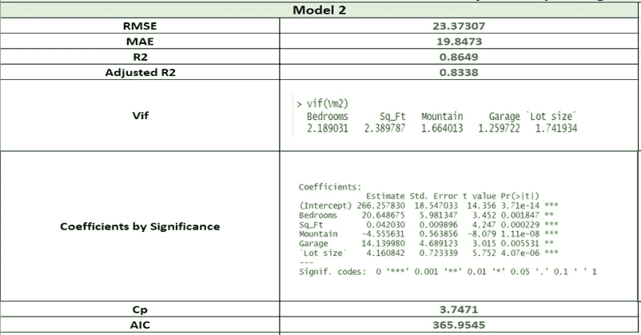

决定模型的值

# *模型的最终方程:*

售价= 266.26 + 20.65(卧室)+ 0.042(平方英尺)-4.55(山地)+ 14.14(车库)+ 4.16(地段面积)

在哪里

售价为 1000 美元

卧室-卧室数量

Sqft-房屋面积，以平方英尺为单位

从酒店到滑雪场对面的山脚下有 100 英里

车库-车库能容纳的汽车数量

地块大小——以英亩为单位的地产大小

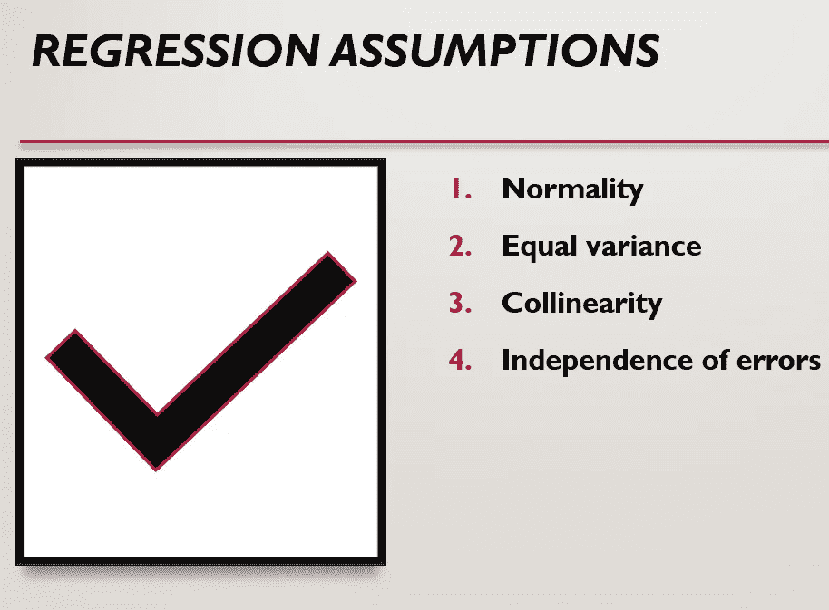

我们已经检查了多元线性回归的假设。

**德宾沃森试验:**

误差之间不存在自相关。

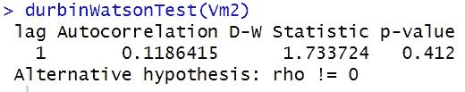

DW 测试

**剩余诊断图**

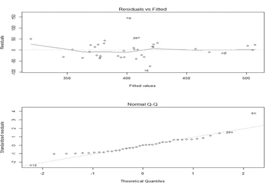

# *模型验证:*

**类型 1:数据分割**

1.将数据分成测试和训练数据集。

2.33 行作为训练行来建立回归模型

3.6 行作为测试行进行预测。

4.计算并比较 RMSE、梅氏和 P 值。

**类型 2 : K 折交叉验证**

由于数据有限，我们可以进行 K 倍交叉验证，以消除数据有限时的过度拟合。

## 数据分割验证的预测值和测试值:

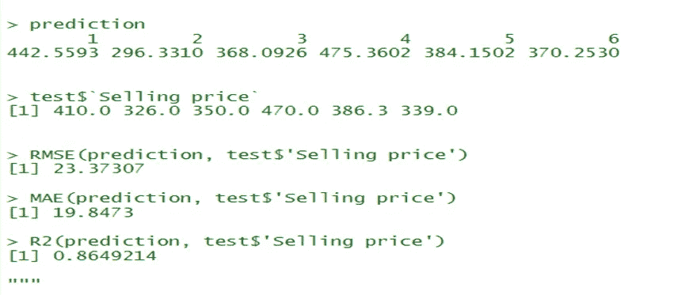

# **结论:**

*   标价是销售价格的代理，因此将标价作为预测变量会降低其他变量的重要性
*   预测科罗拉多滑雪胜地房屋销售价格的最佳模型是销售价格= 266.26 + 20.65(卧室)+ 0.042(平方英尺)-4.55(山地)+ 14.14(车库)+ 4.16(地段大小)
*   房子的年龄或上市时间并不影响售价。
*   随着山基里程的增加，售价降低。所以山的里程越低，售价越好。