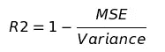

# 案例研究-梅赛德斯·奔驰-绿色制造挑战

> 原文：<https://medium.com/analytics-vidhya/casestudy-mercedes-benz-greener-manufacturing-challenge-1336ba321d27?source=collection_archive---------9----------------------->

**内容:**

1.  商业问题
2.  现有方法
3.  探索性数据分析
4.  数据准备
5.  系统模型化
6.  模型比较
7.  未来的工作
8.  参考

## **1。业务问题:**

梅赛德斯-奔驰绿色制造竞赛的目标是开发一个机器学习模型，可以根据车辆配置准确预测汽车在测试台上花费的时间。ML 模型将有助于加快测试速度，从而降低二氧化碳排放量。

 [## 梅赛德斯-奔驰绿色制造

### 你能减少一辆奔驰花在测试台上的时间吗？

www.kaggle.com](https://www.kaggle.com/c/mercedes-benz-greener-manufacturing) 

**2。现有方法:**

[*该内核建立在观察到目标变量可能来自 4 个不同的高斯分布，并分别为其中 4 个聚类建立 4 个模型的基础上。建立的模型也很简单，max_depth 为 2，估计值<为 100，表明模型观察到数据的潜在趋势。*](https://github.com/Danila89/kaggle_mercedes/blob/master/solution_11_place.ipynb)

这个内核在特性工程方面给出了很好的想法，并且只有一个 xgboost 模型。它还考虑了基于特征间相关性的特征移除。

[*这显示了特征 X0 在数据集中的重要性及其对目标*](https://www.kaggle.com/paulorzp/one-line-solution-in-python-lb-0-55453) *的影响。*

**我的方法有什么不同:**

我测试了各种各样的模型，如 LinearRegression、Xgboost、RandomForest、ExtraTreeRegressor、SVR 和 NeuralNet。这已经通过分类变量的各种编码完成了(one_hot、target、label)。降维技术，如 TSVD 和选择测试，也被用在这个过程中。贝叶斯优化用于超参数调整。模型的堆叠是在基于树的模型上完成的。已经进行了 t 检验，以检查 ID 特征是否为交叉验证提供了统计上的显著差异。一些功能工程也已经试用。

***公制:***

在这场比赛中的度量是 R2 (R 平方)得分，也称为决定系数。这个指标比 MSE 更容易理解。

R2 与 MSE 的关系

R2 解释了模型性能与基线模型的比较。这里的基线指的是目标变量的方差，也就是说，假设一个模型将目标的平均值作为每一列的输出，那么 MSE 将等于目标变量的方差。如果 R2 为-ve，则模型的表现比基线(每次观察的平均值)差。R2 介于 1 和-无穷大之间。R2 会像 MSE 一样受到异常值的影响。

**3。探索性数据分析:**

*   368 个二进制列，数据集中有 8 个分类列。
*   所有的列都是匿名的。
*   存在的分类变量具有从 4 到 47 的大范围基数。
*   数据集中不存在缺失值。
*   数据集中有重复的列(56)。这些必须移除。
*   数据集中大约有 20-30 个异常值。

目标变量的箱线图

由此导致的问题是，如果你忽略离群值，将会发生以下情况——在训练的第一阶段，模型将会受到影响，因为离群值没有学习的趋势。让事情变得更糟的是(R2 或 MSE)对离群值来说是最糟糕的。所以当你继续推动模型时，它会记住异常值(**过度拟合！).**

这可以简单地通过将异常值限制到一个阈值来解决。在这里，我们接受了离群值无法预测的事实，我们最好准备我们的模型在非离群点上工作良好。阈值选择为 150。我没有尝试的另一种方法是在 cv 计算中忽略这些异常值造成的损失，这样模型不是基于它们的性能异常值而是基于非异常值进行排名，本质上与上述相同。

目标的分布图显示了 4 个峰值(存在 4 个高斯分布)

还存在具有不同目标的相同行(515)。这进一步证明了这一定是真实世界的数据集:-)。在这里，我试图用 mean 来代替 targets，但这似乎让事情变得更糟。所以我保留了数据。

特征本身之间也有很好的相关性。现在可以有一些相互关联的特性，但却增加了模型的价值。但是这告诉我们，模型给出的特性重要性必须有所保留。

一瞥特征之间的相关性(最后 100 个)

PCA 可视化(2 个组件)也给出了一些有趣的结果。这虽然不好，但是通过预测每个聚类的平均值，可以充当最简单的回归变量。

PCA 清楚地将数据分为 3 类

图表显示，含有 200 种成分的五氯苯甲醚足以解释 99%以上的差异

有些特征(X127，X261，X314)与目标变量具有非常好的(. 65)相关性。

存在方差小于. 01 的列，我们将删除所有这些列。X4 似乎是唯一的分类变量，因此消除了这种差异。

具有目标编码的 X0(分类)是数据集中最相关的变量。8 与目标的相关性。

**4。数据准备:**

在这里，我制作了 3 个具有统一格式的列的数据集(重复，方差<.01 removed="" and="" targets="" clipped="" at="" with="" :-=""/>

1.  One-Hot Encoded Categorical
2.  Label Encoded Categorical
3.  Target Encoded Categorical

***)。折叠次数越多，CV 越可靠。***

**5。造型:**

我构建的第一个模型是添加了 pca(12 个组件)作为新特性的 xgboost。该模型是具有 16 个模型的 bagging 模型，其中 15 个模型在各种 CV 折叠上训练，1 个模型在完整的训练数据上训练。并输出这 16 个预测平均值。

第二个是对 one_hot 编码数据的简单 LR 模型。此处使用了 Minmax Scaler 来缩放 ID 列(只有数字列，而不是二进制列)，这给出了一个具有 CV 分数(. 58302)的合理结果。

有很多 kaggle 内核在谈论 ID 特性的重要性。因此，我决定做 t 检验，看看这是不是真的。为此，我在 250 次折叠(5 次折叠，50 次重复)中使用了 cross_val_score，以获得使用 ID 和不使用 ID 训练的模型的 cv 分数，这些分数成为我对 scipy.stats.ttest_rel 的输入，它输出 p_value，如果该值< . 05，则 ID 特征确实重要，否则不重要。

> t 检验要求样本服从高斯分布→这个条件在这里成立。

具有 ID 特征(橙色)和不具有 ID 特征(蓝色)的数据的 CV 分数之间的距离图

测试表明，由于 p 值为 0.074，这在统计学上是不显著的，因此我们不能拒绝 ID 列改变 CV 值的假设。这可能是因为可以有任何其他特征传递与 ID 相同的信息，使得该特征冗余。

我的第三个模型是在目标编码数据集上使用 LR 调优模型。这里还必须使用 MinMaxScaler 来将每个特征调整到相同的比例。

线性回归片段

超参数调谐图

在这里，我在 2 个不同的数据集(one_hot，label)上训练了 3 个基于树的模型(xgboost，RandomForest，ExtraTrees)。这些模型是手动调整的超参数，并且 6 个模型中的每一个都比上述线性模型表现得更好。在所有这些模型中，Xgboost 表现最好。并且与目标编码数据集相比，标签数据集给出了更好的结果。

在 ExtraTrees 上进行手动调谐

带有标签编码数据集的 xgboost 上的前 10 个要素重要性

接下来，我使用 mlextend StackingCVRegressor 对三个模型进行了堆叠，并将岭回归元作为元模型。这个模型在 PrivateLB 上给出了前 5%的分数。这里，我在模型上保留了 0 (alpha)正则化和 0 偏差。这实际上与取基本模型(树模型)的加权平均值相同，只是模型(山脊)用于寻找这些权重。

使用堆叠的片段

在这里，我试图按照这里的想法添加新的功能。这种内核似乎可以根据与目标变量的相关性创建新的特征，使用 Spearman 系数测量相关性，然后将它们相加。

我尝试的其他方法包括使用 TSVD 对 one_hot 数据集使用 SVR，以及为 FeatureSelection 选择最佳测试。

选择此处使用最佳代码段。

230 n 处的弯头 _ TSVD 海图中的分量

超参数调谐图

已经在树模型(Xgb、RandomForest、ExtraTrees)上执行了贝叶斯优化，以查看是否可以实现分数的任何提升，但是它收敛到与手动调整超参数几乎相同的结果，除了花费非常少的时间。

需要将一个方法作为贝叶斯优化的强制方法来传递

这里是真正进行参数搜索的地方

使用了一个简单的深度学习模型。然而，这种架构真的很难，因为单个层就足以适应数据集。这就迫使用辍学来很好地概括。但是 Dropout 从来不会处理单个隐藏层，必须使用具有良好架构的多个层才能达到模型泛化良好的程度。但是这个模型没有之前的堆叠模型好。

神经网络的新纪元 vs R2

神经网络的丢失与纪元

Gridsearch 已经用于网络中的训练参数和模型参数，以找出哪一个效果最好。

神经网络网格搜索

**6。型号对比:**

所有试验过的模型的漂亮表格摘要

最佳成绩截图

**7。未来工作:**

*   **好的特性>聪明的模型**使用交互发现好的特性总是可以改进模型。
*   与 kaggle 标准相比，这里完成的堆叠非常简单，我们还可以在这方面进行改进。但是要注意小数据集的大小。
*   我看到一些 kaggle 内核有 4 个特性，并获得了前 1%的结果，因此特性选择可以进一步改进。
*   使用噪声可以更好地完成这里使用的目标编码，以避免目标泄漏。它被称为影响编码。可以试试。
*   神经网络架构可以进一步探索各种辍学和隐藏层，纪元在这里没有调整，所以肯定有改进的空间。

> N **注:**此处显示的代码已更改，以提高博客的可读性。请查看[代码](https://github.com/level14taken/mercedes-benz-greener-manufacturing/blob/master/SelfCaseStudy.ipynb)以了解完整的项目。

**8。参考文献:**

[回归度量](/@george.drakos62/how-to-select-the-right-evaluation-metric-for-machine-learning-models-part-1-regrression-metrics-3606e25beae0)

[https://github . com/GKarmakar/RegressionUsingNN/blob/master/regressionusingneuralnetwork . ipynb](https://github.com/GKarmakar/RegressionUsingNN/blob/master/RegressionUsingNeuralNetwork.ipynb)
neural _ net:-[https://www . ka ggle . com/frednavruzov/baseline-to-start-with-keras-l b-0-55](https://www.kaggle.com/frednavruzov/baseline-to-start-with-keras-lb-0-55)

Bayesian _ optimization:-[https://www . ka ggle . com/btyuhas/Bayesian-optimization-with-XG boos](https://www.kaggle.com/btyuhas/bayesian-optimization-with-xgboos)t

t-test:-[https://machine learning mastery . com/statistical-significance-tests-in-python/](https://machinelearningmastery.com/statistical-significance-tests-in-python/)

异常值检测:-[https://stack overflow . com/questions/22354094/python-way-of-detecting-outliers-in-one-dimension-observation-data](https://stackoverflow.com/questions/22354094/pythonic-way-of-detecting-outliers-in-one-dimensional-observation-data)

课程:-[https://www.appliedaicourse.com](https://www.appliedaicourse.com/)

**Linkedin:-**[https://www.linkedin.com/in/manoj-guthikonda-5405b4112/](https://www.linkedin.com/in/manoj-guthikonda-5405b4112/)

**Github**:-[https://github.com/level14taken](https://github.com/level14taken)