# 神经网络中的灾难性遗忘

> 原文：<https://medium.com/analytics-vidhya/catastrophic-forgetting-in-neural-networks-27fe097fc681?source=collection_archive---------7----------------------->

这篇文章是关于使用置换 MNIST 和 MLP 网络分析灾难性遗忘的。

深度学习方法已经在各个领域取得了许多突破，但它们受到学分分配和**“遗忘问题”的困扰。**随着时间的推移，深度学习系统的能力越来越强，但是标准的多层感知器(MLP)和传统的训练方法无法在不灾难性地忘记之前学习的训练数据的情况下处理增量学习新任务或类别。我们称这个问题为神经网络中的灾难性遗忘。解决这个问题是至关重要的，以便代理在现实生活中部署时不断学习和改进。简而言之，当你在任务 A 上训练了一个模型，并使用相同的权重来学习新的任务 B 时，那么你的模型会忘记关于任务 A 的学习信息。这意味着它会灾难性地忘记以前的信息。在本文中，我们将测量和分析神经网络中的灾难性遗忘。

**概述**

1.  这次作业我们将使用 MNIST 发型。
2.  训练网络超过 50 个历元，以达到期望的性能/精度。
3.  现在测试任务 A，使用相同的网络，然后在任务 B 上训练 20 个周期，现在测试任务 A 和 B。对 N 个任务(N = 10)继续此操作。
4.  纪元总数[50+20+20+20+20+20+20+20+20+20]= 230

**设置**

编码是在 Tensorflow 1.14 中在 Unix 环境中使用渴望执行(Python 3.6)完成的。选择一个唯一的种子(使用名称和随机整数)来创建 MNIST 数据集的 10 个不同排列(图 1 ),每个排列被视为一个不同的任务。同样对于每个排列，
数据集具有 49500 个训练图像、10000 个测试图像和 5500 个验证图像。我们在置换数据集上训练三种类型的 MLPs (2 层深度、3 层深度、4 层深度)。每个 MLP 为第一个任务训练 50 个时期，为另外 9 个任务(230 个任务)训练 20 个时期。目的是最小化神经网络中的灾难性遗忘。如果 MLP 开始进一步的任务训练，它应该记住并保留以前训练的大部分任务的重量。

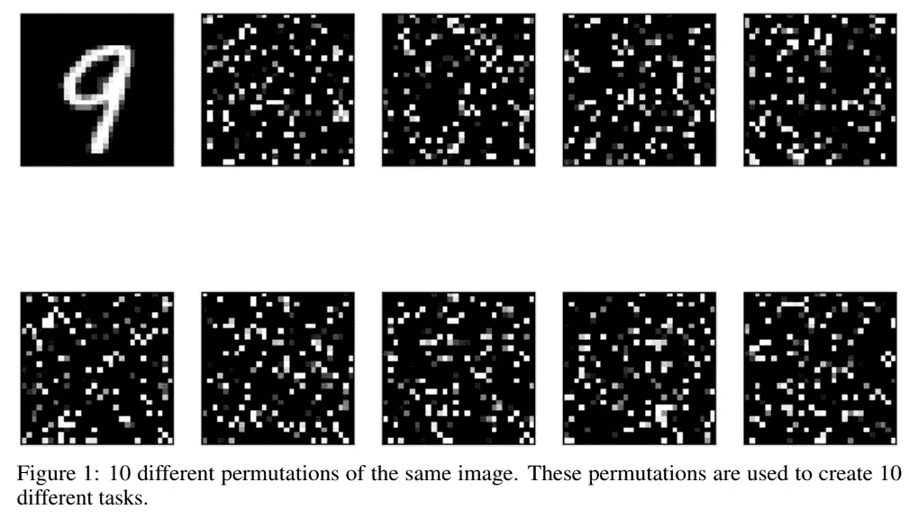

**性能度量**
四种不同的性能度量用于估计神经网络中的遗忘水平。下面讨论了本实验使用的所有指标。

1.  **合成任务矩阵**

在模型完成对每个任务的学习之后，评估其验证和测试性能以形成结果任务矩阵。我们构建一个矩阵

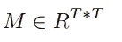

其中 *M_i，j* 为模型在任务 *t_j* 上训练后在任务 *t_i* 上的分类准确率 t。构建结果矩阵后，我们可以使用该矩阵计算其他绩效指标，如
ACC、BWT、CBWT、TBWT。

2. **ACC(平均准确率)得分**
直观来看，ACC 得分是对最后一项任务训练完成后，每项任务获得的准确率的平均值(如等式所示，T 为任务数)。根据[1]，ACC 分数是评估深度神经网络中遗忘的最重要的度量。这个指标越大，模型越好。

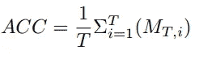

**3。BWT(反向迁移)得分**
反向迁移得分是如果模型在任务 n (m < n)上进行训练，则该模型在任务 m 上的性能如何受到影响的度量。这个指标的值越大越好。通常，由于深度学习模型的遗忘特性，我们会观察到负的反向迁移分数。如果后向迁移得分为正，这意味着该模型在新任务训练后能够提高旧任务的绩效。方程式中给出了 BWT 的公式。如果两个模型的 ACC 分数相似，通常选择具有较高 BWT 的模型。

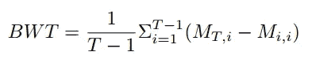

**4。CBWT(累积反向迁移)分数**
【2】提出了另外两个性能指标，因为上面提到的两个指标可能不足以评估神经网络中的遗忘。CBWT 是 BWT 的延伸。CBWT 评分的目的是测量整个连续学习过程中遗忘的总量，而不是像 BWT 只能做的那样简单地检查最后一行。等式中给出了计算 CBWT 的公式。

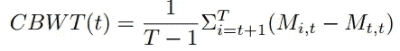

其中 T 是当前任务号，T 是任务总数。

**5。TBWT(真实后向迁移)得分**
由[2]提出的另一个评估度量使用独立的分类器(G)来比较每个任务的准确度(在对所有任务的训练完成之后)。TBWT 类似于 BWT，但我们将每个任务的模型退化与黄金标准(即全负荷训练)进行比较。在我们的实验中，独立的分类器是随机森林分类器(有 64 个估计器，通常每个 MNIST 排列的准确率为 90%)。等式中给出了计算 TBWT 的公式。

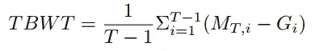

其中 G_ii 是在任务 I 上训练的独立分类器的准确度。

**最优训练模型**

在本节中，您将看到各种超参数、损失函数和优化器的比较，以找到可以避免灾难性遗忘的最佳神经网络。

1.  **学习率对比**

人们注意到，如果学习率太高，我们通常可以在训练期间获得当前任务的非常高的准确度分数。然而，在那种情况下，神经网络对于先前网络的遗忘倾向是更具灾难性的。因此，我们需要找到最佳的学习速率来训练神经网络，以便遗忘不会是灾难性的，并且当前任务的测试精度不会太低。如图 2 所示(仅针对 230 个历元的任务 1)，当学习率过高时，分类准确率低至 30%。然而，当学习率太低时，网络几乎不会忘记。我们在当前任务上没有获得最佳的准确度(第一个任务的准确度在 50 个时期后只有 70%)。因此，学习率被选择为 0.0002，这是经验分析后观察到的最佳学习率。

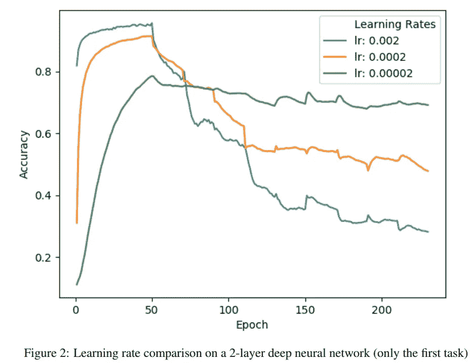

**2。优化者对比**

三个不同的优化器(Adam、RMSProp 和 SGD)在这个实验中进行了比较，学习率为 0.0002，以查看哪个优化器有助于网络避免灾难性的遗忘。在图 3 中，我们可以看到针对第一个任务(230 个时期)训练的优化器的验证准确性的比较。如图所示，Adam 和 RMSProp 比 SGD 更适合这个目的，因为 SGD 的精度急剧下降。然而，我们观察到，当用 Adam 或 RMSProp 训练时，ACC 和 BWT 分数是差不多的。对于其余的实验，Adam 被用作期望的优化器。

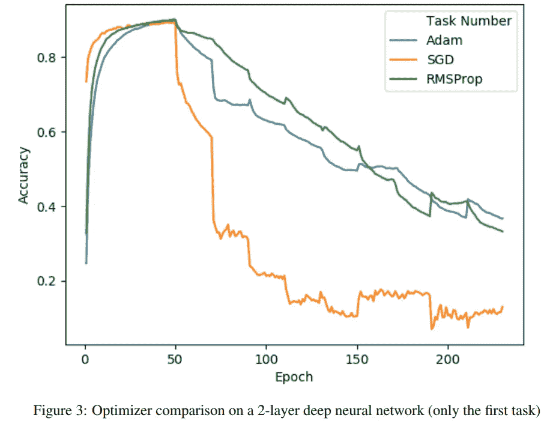

**3。损失函数比较**

因为这是一个分类任务，所以使用了具有 softmax 函数和一键编码的分类交叉熵。然而，它不是仅仅使用普通的损失函数，而是与各种正则化函数(L1、L2、L1 + L2)结合起来进行性能比较。在一些经验分析之后，我们使用非常小的β(10–7)系数进行正则化。结果如图 4 所示。我们可以看到交叉熵结合 L1 正则化可以更好地帮助避免某些任务的灾难性遗忘。然而，与普通交叉熵相比，L2 正则化和混合正则化给出了较弱的性能。表 1 描述了不同损失函数的 ACC 和 BWT 分数(在所有任务的训练之后)。

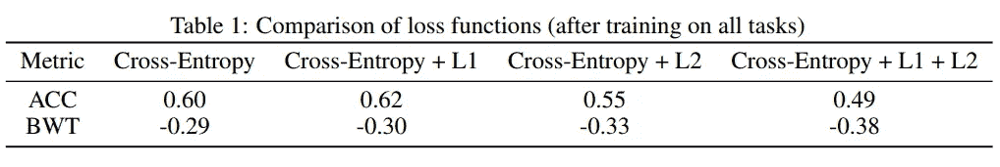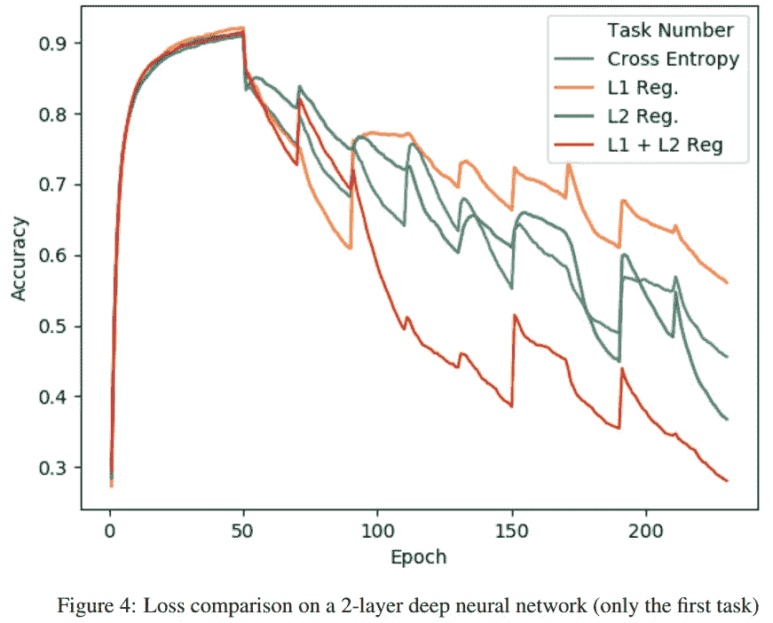

**4。神经网络深度比较**

据观察，更深层次的神经网络更容易发生灾难性遗忘。如图 5 和表 2 所示，2 层神经网络具有最好的 ACC 和 BWT 分数(3 次运行的平均值)。其原因在于，改变更深 MLP 的权重可能会导致最终结果发生重大变化。当从 4 层 MLP 切换到 2 层时，ACC 得分从 0.62 下降到 0.54。如图 5 所示，对于 4 层网络的许多任务来说，下降幅度更大，但我们观察到 2 层网络的下降平稳。

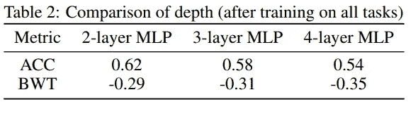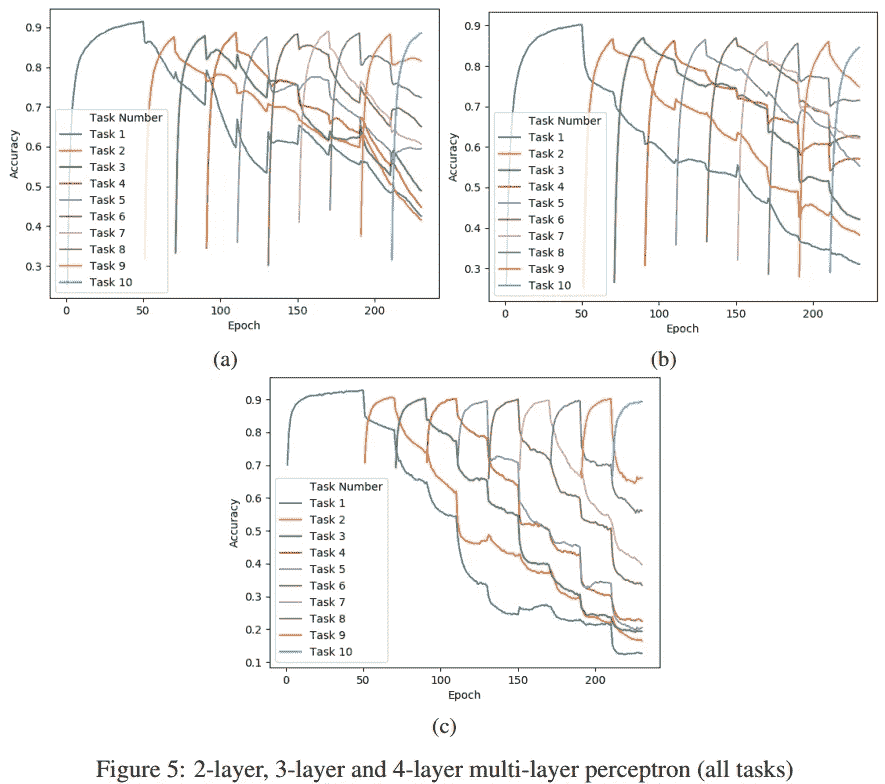

**4 层网络的掉线**

在每一个具有不同脱落概率的层之后添加一个脱落层。在[1]中，提到添加丢失有助于神经网络减轻灾难性遗忘。然而，据观察，更高的概率并不总是导致更好的性能。事实上，当退出概率为 0.1 时，性能有所提高，之后，当退出概率更高时，性能开始下降。在图 6 中，我们可以看到，增加更高的概率意味着大多数任务没有达到最佳精度，这导致 ACC 分数下降。如图 6 所示，我们看到 ACC 和 BWT 分数在训练后急剧下降，退出概率为 0.2。因此，我们坚持 0.1 的退出概率用于进一步评估。

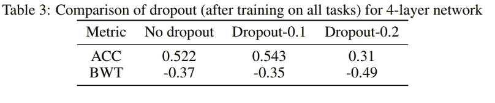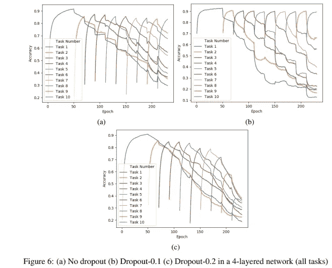

**最佳绩效指标**

具有 Adam 优化器、L1 正则化器、0.1 下降率和 0.0002 学习率的 2 层深度神经网络被用作获得最佳性能的最佳模型。表 4 显示了通过使用该网络得到的任务矩阵。每个任务的验证准确性如图 7 所示。可以看出，在对所有 10 个任务进行训练后，大多数任务的准确率仍然在 60%以上。接下来，我们根据前面提到的结果任务矩阵来评估性能指标。

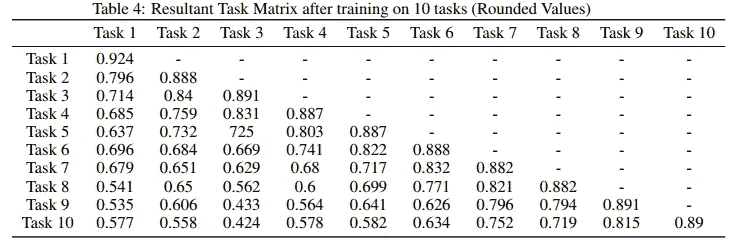

**ACC 得分:0.6535**

**BWT 得分:-0.27**

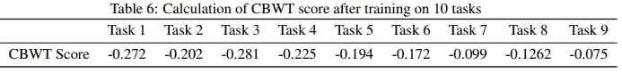

**TBWT 分数(使用随机森林):-0.291**

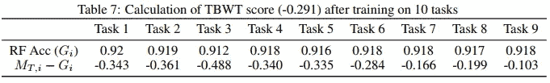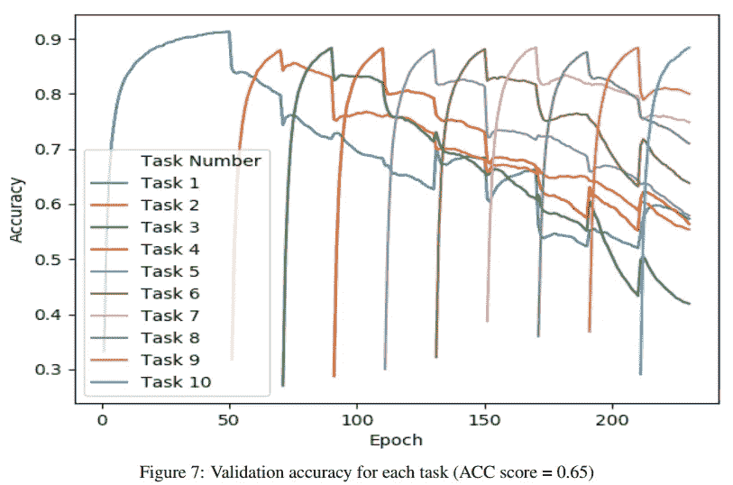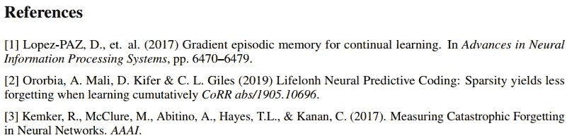