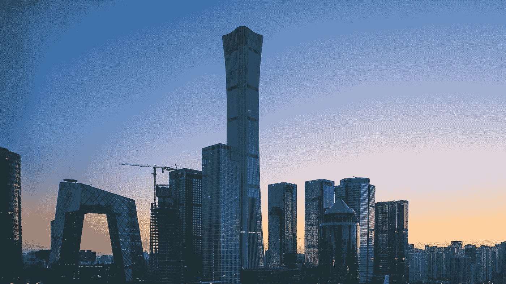

# CatBoost 预测北京 PM2.5 浓度

> 原文：<https://medium.com/analytics-vidhya/catboost-for-forecasting-pm2-5-concentration-in-beijing-e0e972a11e1d?source=collection_archive---------9----------------------->

玛格达·埃勒斯拍摄的中国北京照片

我们的数据是来自 UCI 机器学习知识库的北京 PM2.5 数据。有一些北京/中国相关的 PM2.5 数据。我们使用了一个从 2010 年到 2015 年的数据，其中包含了我们可以用作预测特征的气象因素。

## 目标:预测未来 12 小时 PM2.5 浓度水平。