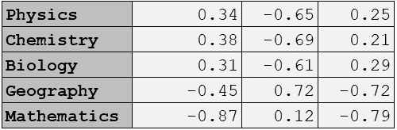
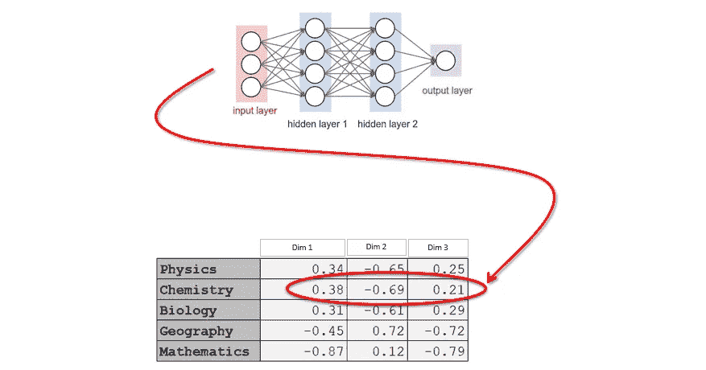

# 分类嵌入器:通过神经网络编码分类变量

> 原文：<https://medium.com/analytics-vidhya/categorical-embedder-encoding-categorical-variables-via-neural-networks-b482afb1409d?source=collection_archive---------1----------------------->

在你之前—

```
**pip install categorical_embedder**
```

我先说一下。

我们知道机器学习模型喜欢数字数据。我们转换我们的输入(文本、图像、语音等)。)转换成数字，然后输入到 ML 模型中。像 CatBoost 和 LightGBM 这样的模型确实可以处理分类变量，但是在实际训练开始之前，它们也可以通过不同的技术将它们转换成数字。如虚拟编码、标签编码、目标编码、频率编码等方法。服务于我们的目的，但我们能做得更好吗？我们有没有更好的方法来编码我们的分类变量，来解释我们的目标变量？

答案是肯定的！我们可以使用神经网络以嵌入的形式更好地表示我们的分类变量。

什么是嵌入？

> “嵌入是类别的固定长度向量表示”

嵌入仅仅意味着用一组固定的数字来表示一个类别。假设我有一个数据集，它有一个列 ***【主题】*** ，其中有 5 个唯一值:物理、化学、生物、地理和数学。然后，我们可以用一组数字(假设为 3)来表示这些类别:



原因 3:我稍后会谈到这一点。

**传统方法:**

传统上，我们通过以下方式将分类变量转换成数字

*   一个热编码
*   标签编码

在一个热编码中，我们构建与该特征中的唯一类别的数量一样多的特征，并且对于每一行，我们将 1 分配给表示该行的类别的特征，而其余的特征被标记为 0。当一个要素中有大量类别(唯一值)导致数据非常稀疏时，这种技术就会出现问题。由于每个向量与其他向量的距离相等，变量之间的关系就消失了。

将分类特征转换为数字的另一种方法是使用一种称为标签编码的技术。标签编码只是将该列中的每个值转换成一个整数。这种技术非常简单，但是会导致特征类别之间的比较，因为它使用了数字排序。该模型可能认为化学优先于物理，类似地，生物的权重高于化学(事实并非如此)。

**分类嵌入是如何工作的？**

首先，每个分类变量类别被映射到一个 n 维向量。这种映射由神经网络在标准的监督训练过程中学习。继续我们的示例，如果我们想要使用“主题”列作为特征，那么我们将以监督的方式训练神经网络，获得每个类别的向量，并生成如下的 5x3 矩阵。



之后，我们将用数据中相应的向量替换每个类别。

**为什么分类嵌入是更好的选择？**

*   我们限制每个类别所需的列数。当列具有高基数时，这很有用。
*   从神经网络获得的生成嵌入揭示了分类变量的内在性质。这意味着相似的类别将有相似的嵌入。

## **包:分类嵌入器**

```
pip install categorical_embedder
```

借助此软件包，您可以为数据中的分类变量生成嵌入:


下面是生成分类嵌入的简单代码:

```
import categorical_embedder as ce
from sklearn.model_selection import train_test_splitdf = pd.read_csv('HR_Attrition_Data.csv')
X = df.drop(['employee_id', 'is_promoted'], axis=1)
y = df['is_promoted']embedding_info = ce.get_embedding_info(X)
X_encoded,encoders = ce.get_label_encoded_data(X)X_train, X_test, y_train, y_test = train_test_split(X_encoded,y)embeddings = ce.get_embeddings(X_train, y_train, categorical_embedding_info=embedding_info, 
                            is_classification=True, epochs=100,batch_size=256)
```

更详细的 [Jupyter 笔记本](https://github.com/Shivanandroy/CategoricalEmbedder/blob/master/example_notebook/Example%20Notebook.ipynb)可以在这里找到

分类嵌入器:示例笔记本

**范畴嵌入器里面是什么？**

*   `ce.get_embedding_info(data,categorical_variables=None)`:该函数识别数据中的所有分类变量，确定其嵌入大小。分类变量的嵌入大小由其唯一值数量的最小值 50 或一半决定，即列的嵌入大小= Min(50，该列中唯一值的数量)可以在`categorical_variables`参数中传递分类变量的显式列表。如果`None`，该函数自动获取所有数据类型为`object`的变量
*   `ce.get_label_encoded_data(data, categorical_variables=None)`:该函数使用 sk learn . preprocessing . label encoder 对所有分类变量进行标签编码(整数编码)，并返回标签编码的数据帧用于训练。Keras/TensorFlow 或任何其他深度学习库都希望数据是这种格式。
*   `ce.get_embeddings(X_train, y_train, categorical_embedding_info=embedding_info, is_classification=True, epochs=100,batch_size=256)`:该函数训练一个浅层神经网络，并返回分类变量的嵌入。在引擎盖下，它是一个 2 层神经网络架构，具有 1000 和 500 个具有“ReLU”激活的神经元。它需要 4 个输入- `X_train`、`y_train`、`categorical_embedding_info`:get _ embedding _ info 函数的输出和`is_classification` : `True`用于分类任务；`False`用于回归任务。

对于分类:`loss = 'binary_crossentropy'; metrics = 'accuracy'`和回归:`loss = 'mean_squared_error'; metrics = 'r2'`

**请在这里找到** [**Github 回购**](https://github.com/Shivanandroy/CategoricalEmbedder) **和** [**示例笔记本**](https://github.com/Shivanandroy/CategoricalEmbedder/blob/master/example_notebook/Example%20Notebook.ipynb) **。**