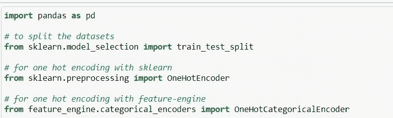

# 特征工程中的分类编码(一种热编码)。

> 原文：<https://medium.com/analytics-vidhya/categorical-encoding-in-feature-engineering-8f9e24737e48?source=collection_archive---------6----------------------->

**一个热编码**

一种热编码包括用不同的布尔变量(也称为哑变量)对每个分类变量进行编码，布尔变量取值 0 或 1，指示某个类别是否出现在观察中。

例如，对于分类变量“性别”，使用标签“女性”和“男性”，我们可以生成布尔变量“女性”，如果人是“女性”则取 1，否则取 0，或者我们可以生成变量“男性”，如果人是“男性”则取 1，否则取 0。

对于值为“红色”、“蓝色”和“绿色”的分类变量“颜色”，我们可以创建 3 个新变量，称为“红色”、“蓝色”和“绿色”。如果观察是所述颜色，这些变量将取值 1，否则取值 0。

**编码成 k-1 个虚拟变量**

然而，请注意，对于变量“颜色”，通过创建 2 个二进制变量，比如“红色”和“蓝色”，我们已经对所有的*信息进行了编码:*

*-如果观察值为红色，则由变量“红色”(红色= 1，蓝色= 0)
捕获-如果观察值为蓝色，则由变量“蓝色”(红色= 0，蓝色= 1)
捕获-如果观察值为绿色，则由“红色”和“蓝色”(红色= 0，蓝色= 0)组合捕获*

*我们不需要添加第三个变量“绿色”来捕捉观察是绿色的。*

*更一般地，分类变量应该通过创建 k-1 个二进制变量来编码，其中 k 是不同类别的数量。对于性别，k=2(男性/女性)，因此我们只需要创建 1(k-1 = 1)个二元变量。以颜色为例，它有 3 个不同的类别(k=3)，我们需要创建 2 个(k-1 = 2)二进制变量来捕捉所有的信息。*

*一种热编码成 k-1 个二进制变量的方法考虑到，我们可以少用 1 个维度，但仍能表示全部信息:如果观察值在所有二进制变量中为 0，那么它在最终的(不存在的)二进制变量中必然为 1。*

***当一个热点编码分类变量时，我们创建 k — 1 个二元变量。***

*大多数机器学习算法在拟合时考虑整个数据集。因此，将分类变量编码成 k-1 个二进制变量更好，因为它避免了引入冗余信息。*

***异常:一次热编码成 k 个虚拟变量***

*在一些情况下，最好将变量编码为 k 个虚拟变量:*

*-当构建基于树的算法时
-当通过递归算法进行特征选择时
-当对确定每个单一类别的重要性感兴趣时*

*与大多数机器学习算法相反，**基于树的算法在被训练时不**评估整个数据集。他们在每棵树的每个节点从数据集中随机提取一个特征子集。因此，如果我们想要一个基于树的算法来考虑**所有**的类别，我们需要将分类变量编码成 **k 个二元变量**。*

*如果我们计划通过递归消除(或添加)来进行特征选择，或者如果我们想要评估分类变量的每个单一类别的重要性，那么我们还需要整个二元变量集(k)来让机器学习模型选择哪些变量具有最大的预测能力。*

## ***一次热编码的优势***

*-直接实施
-不假设分类变量
的分布或类别-保留分类变量
的所有信息-适用于线性模型*

## *限制*

*-扩展特征空间
-编码时不添加额外信息
-许多虚拟变量可能相同，从而引入冗余信息*

## *笔记*

*如果我们的数据集包含一些高度基数的变量，我们很快就会得到有数千列的数据集，这可能会使我们的算法训练缓慢，模型解释困难。*

*此外，这些虚拟变量中的许多可能彼此相似，因为两个或更多变量共享相同的 1 和 0 的组合并不罕见。因此，即使我们编码成 k-1，一个热编码也可能引入冗余或重复的信息。*

**

## *编码很重要*

*就像插补一样，所有分类编码方法都应该在训练集上执行，然后传播到测试集。*

*为什么？*

*因为这些方法将从训练数据中“学习”模式，因此您希望避免泄露信息和过度拟合。但更重要的是，因为我们不知道在未来/实时数据中，我们是否会有所有类别出现在训练数据中，或者是否会有更多或更少的类别。因此，我们希望通过从一开始就设置正确的流程来预测这种不确定性。我们希望创建从训练集学习类别的转换器，并使用这些学习的类别在训练集和测试集中创建虚拟变量。*

*##熊猫的一个热门编码*

## *优势*

*- quick
-返回熊猫数据帧
-返回虚拟变量的特征名称*

## *熊猫的局限性:*

*-它不保存从训练数据传播到测试数据的信息*

*— — -*

*pandas 方法 get_dummies()将创建与变量中的类别一样多的二进制变量:*

*如果变量颜色在训练数据中有 3 个类别，它将创建 2 个虚拟变量。然而，如果变量 colour 在测试数据中有 5 个类别，它将创建 4 个二进制变量，因此训练和测试集将以不同数量的特征结束，并且将与使用 Scikit-learn 的训练和评分不兼容。*

*在实践中，我们不应该在我们的机器学习管道中使用 get-dummies。然而，它对于快速数据探索是有用的。我们用例子来看看这个。*

## *转换成 k 个虚拟变量*

**

## *额外收获:get_dummies()可以处理缺失值*

**

## *Scikit-learn 的一个热门编码*

***优势***

*-快速
-在训练和测试集中创建相同数量的功能*

***局限性***

*   *它返回一个 numpy 数组，而不是 pandas data frame
    ——它不返回变量名，因此不便于变量探索。*

*感谢阅读。我的 [linkedin](https://www.linkedin.com/in/ankush-kunwar777/)*