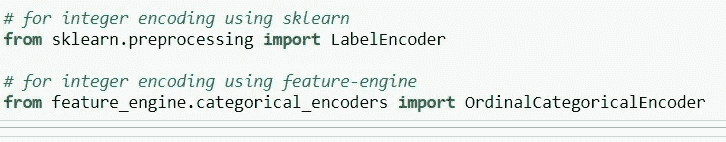
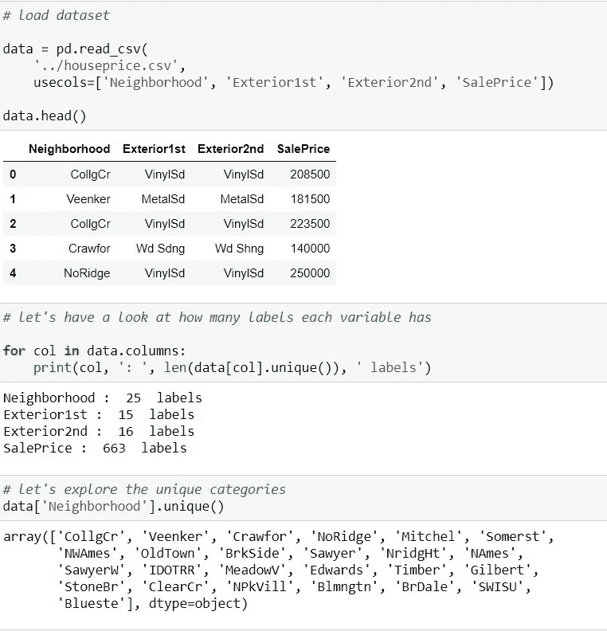
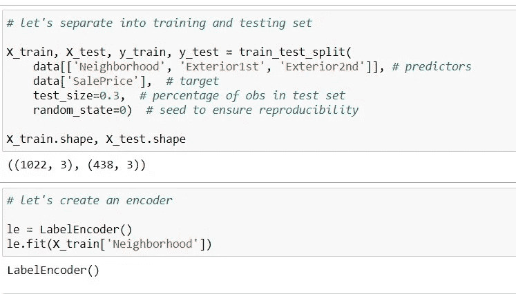
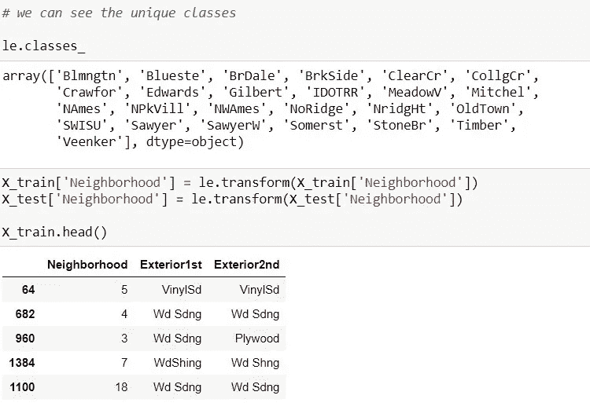

# 特征工程中的分类编码(标签/序数/整数编码)。

> 原文：<https://medium.com/analytics-vidhya/categorical-encoding-label-ordinal-integer-encoding-in-feature-engineering-1beeaa00f0fa?source=collection_archive---------3----------------------->

**标签/整数编码:定义**

*   整数编码包括用从 1 到 n(或从 0 到 n-1，取决于实现)的数字替换类别，其中 n 是变量的不同类别的数量。
*   数字是任意分配的。

这种编码方法允许对机器学习模型进行快速基准测试。

**优势**

-简单易行
-不扩大功能空间

**限制**

-不获取任何关于类别标签的信息
-不适用于线性模型。

整数编码更适合非线性方法，这种方法能够浏览任意分配的数字，试图找到将它们与目标相关联的模式。

加载数据集

## **用 Scikit 学习整数编码**

不幸的是，LabelEncoder 一次只能处理一个变量。然而，有一种方法可以自动处理所有的分类变量。

感谢我的 [Linkedin](https://www.linkedin.com/in/ankush-kunwar777/) 。