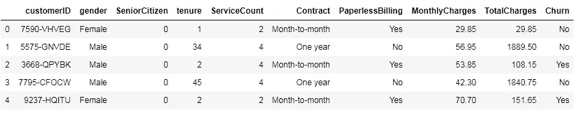
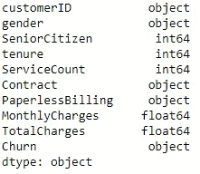
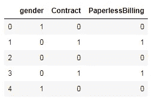
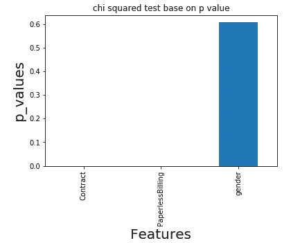

# 使用卡方检验的分类特征选择

> 原文：<https://medium.com/analytics-vidhya/categorical-feature-selection-using-chi-squared-test-e4c0d0af6b7e?source=collection_archive---------2----------------------->

什么是相关性？


[来源](https://www.google.com/search?q=character&tbm=isch&ved=2ahUKEwi8nKuokNjtAhXHASsKHSw_BJ4Q2-cCegQIABAA&oq=character&gs_lcp=CgNpbWcQAzIECCMQJzIFCAAQsQMyBAgAEAMyCAgAELEDEIMBMggIABCxAxCDATIFCAAQsQMyBQgAELEDMgUIABCxAzIFCAAQsQMyBQgAELEDOgQIABBDOgIIAFCUE1iZPmC6P2gAcAB4AIAB0QGIAewUkgEGMC4xNy4xmAEAoAEBqgELZ3dzLXdpei1pbWfAAQE&sclient=img&ei=hfDcX_zFBceDrAGs_pDwCQ&bih=625&biw=1366#imgrc=OCpB5dLHG0KxSM)

相关性定义了两个或多个特征之间的相互关系。假设你想买一所房子，房地产商给你看了一些房子，你观察到房价随着房子面积的增加而增加。在这里，房子的大小与价格密切相关。

假设你是一名玩家，白领工作出现了巨大的衰退。这次衰退不会影响你的收入，因为白领工作的衰退与你的职业无关。在这种情况下，两个特征之间没有任何关联。

在卡方检验中，我们使用 p 值来决定一个特征是否与目标变量相关。

H0 :-分类特征和目标变量之间没有关系

H1:范畴特征和目标变量之间存在某种关系

如果 **p 值≥0.05** ，未能拒绝零假设，则目标变量和分类特征之间没有任何关系。

如果 **p_value < 0.05** ，拒绝零假设，目标变量和分类特征之间将会有一些关系，我们将会把所有这些特征用于进一步的机器学习管道。让我们开始吧……

N 注:-卡方检验只适用于离散的目标变量。如果目标变量是连续的，那么我们应该先做宁滨，然后再做卡方检验。

## 步骤 1:获取数据集并导入所有必要的库

```
#importing all the essential library
import numpy as np
import pandas as pd
import matplotlib.pyplot as plt 
import seaborn as sns
from sklearn.feature_selection import chi2
from sklearn.model_selection import train_test_split
--------------------------------------------------------------------
df=pd.read_csv(""[https://raw.githubusercontent.com/srivatsan88/YouTubeLI/master/dataset/churn_data_st.csv](https://raw.githubusercontent.com/srivatsan88/YouTubeLI/master/dataset/churn_data_st.csv)",sep=",")
df.head()
```



数据集的前五行

## 步骤 2:特征编码

a.首先，我们将提取所有具有分类变量的特征。

```
df.dtypes
```



图 1

我们将删除 customerID，因为它对目标变量没有影响。

b.提取所有具有分类变量的特征，然后对它们进行特征编码。

```
cat_df["gender"]=cat_df["gender"].map({"Female":1,"Male":0})
cat_df["Contract"]=cat_df["Contract"].map({'Month-to-month':0, 'One year':1, 'Two year':2})
cat_df["PaperlessBilling"]=cat_df["PaperlessBilling"].map({"Yes":0,"No":1})
cat_df.head()
```



编码输出

## 步骤 3:应用卡方检验

```
x=cat_df.iloc[:,:-1]  #Independent variable
y=cat_df.iloc[:,-1]   #Target variable
f_score=chi2(x,y)   #returns f score and p value 
f_score[out] >> (array([2.63667886e-01, 1.11578017e+03, 1.53480111e+02]),
 array([6.07611392e-001, 1.22794132e-244, 3.00847449e-035]))
--------------------------------------------------------------------
# printing p values for each categorical features
p_value=pd.Series(f_score[1],index=x.columns)
p_value.sort_values(ascending=True,inplace=True)[out] >>Contract            1.227941e-244
        PaperlessBilling     3.008474e-35
        gender               6.076114e-01
        dtype: float64
```

让我们借助可视化来理解 p_value。

```
p_value.plot(kind="bar")
plt.xlabel("Features",fontsize=20)
plt.ylabel("p_values",fontsize=20)
plt.title("chi squared test base on p value")
plt.show()
```



图 2

如果我们看到上面的图，我们可以得出结论:**性别**特征的 p_value 约等于 0.6，意味着 **p_value > 0.05** ，因此性别对目标变量没有意义。

所以我们只选择**合同**和**无纸账单**进行进一步的机器学习建模。

N 注:该技术基于一个假设，即某些数据可能很重要，但卡方检验并未表明在这种情况下，我们的领域知识起着关键作用