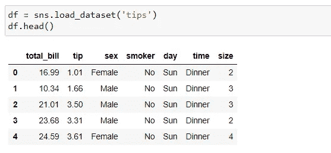
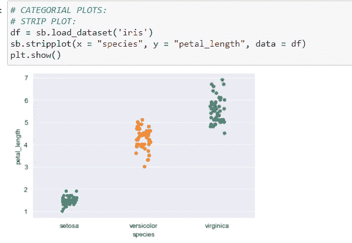
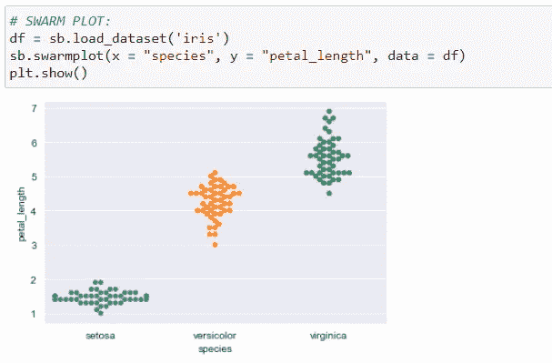
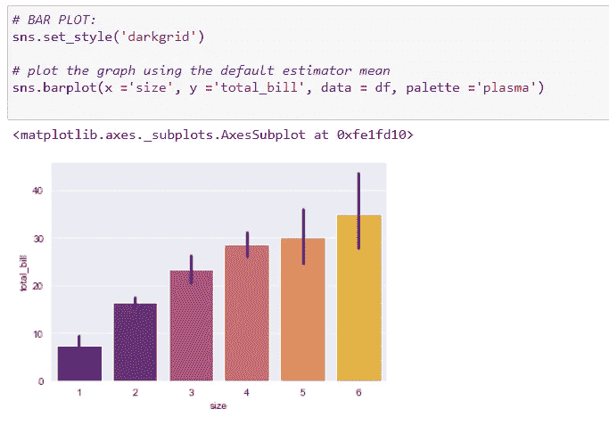
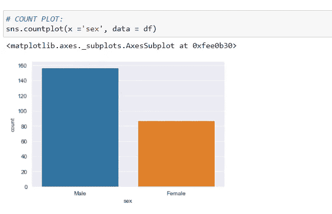
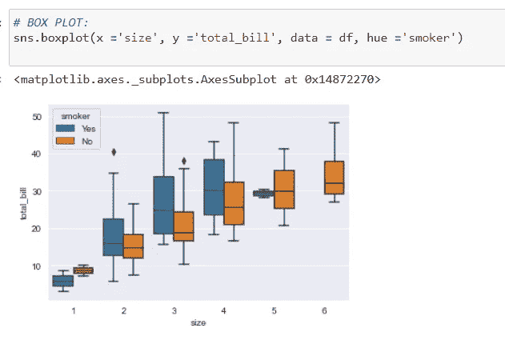
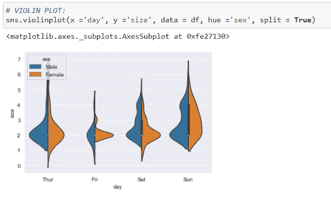
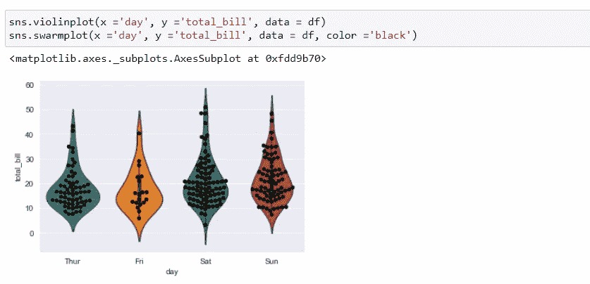
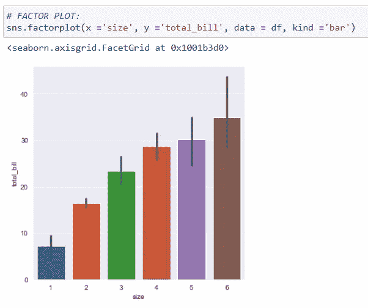

# 分类图及其类型

> 原文：<https://medium.com/analytics-vidhya/categorical-plots-and-its-types-7fa7c3641b7b?source=collection_archive---------13----------------------->


# 大家好！！

让我们快速浏览一下 python 中的分类图。这篇博客将向你解释什么是分类图以及 Python 中的各种分类图。

**让我们开始吧！！**

# 什么是分类图？？？

众所周知，Python 提供了各种绘图技术和各种库，Seaborn 就是这样一个库。

**Seaborn** 除了是一个统计绘图库，还提供了一些默认数据集。我们将使用一个名为“iris”的默认数据集。

分类图是由一个以上的数据类别组成的图。

# 分类图的类型


分类图的各种形式如下:

*   条形图
*   计数图
*   箱线图
*   紫罗兰花
*   条状地块
*   群集图
*   因子图

让我们一个一个地看看它们:

**首先，导入必要的库:**

```
import numpy as np
import pandas as pd
import matplotlib.pyplot as plt
import seaborn as sb
```

**现在，从 Seaborn 加载数据集‘iris’:**



# 一条曲线:



# 双群体图:



# 三格图:



# 四计数图:



# 五格图:



# 6-小提琴情节:



**→小提琴情节和虫群情节的组合:**



# 7 因素图:



**因此，这些是分类图的一些类型。通过这种方式，我们可以享受 python 及其有趣的库，并从中获得乐趣，还可以绘制各种图形。**

> 谢谢大家！！
> 
> 快乐学习！！😊