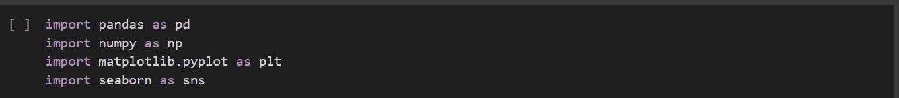

# 希伯恩的分类图

> 原文：<https://medium.com/analytics-vidhya/categorical-plots-in-seaborn-748a5b291679?source=collection_archive---------13----------------------->

# 什么是 Seaborn 图书馆？

Seaborn 是 Python 的一个数据可视化库，类似于 Matplotlib 和 Plotly 等其他可视化库。它基于 Matplotlib 库。Seaborn 是一个强大的 Python 库，可以轻松地创建信息丰富且有吸引力的可视化效果。

# Seaborn 图书馆的优势:

*   使用方便
*   与 pandas 数据结构配合良好
*   构建于 matplotlib 之上

# 如何安装 Seaborn 库？

要安装 Python Seaborn 库，可以根据您使用的平台使用以下命令:

*pip 安装 seaborn*

**或**

*康达安装海博*

# 分类图入门-

## 什么是分类数据？

分类数据是信息的集合，这些信息被分成不同的组，例如，如果一个组织或机构试图获取其雇员的生物数据，那么得到的数据被称为分类数据。该数据被称为分类数据，因为它可以根据生物数据中存在的变量进行分组。分类变量的例子有种族、性别、年龄组和教育水平。分类数据的分析通常涉及数据表的使用

## 让我们使用 Seaborn 绘制分类数据

这里有几个情节类型-

1.  计数图
2.  条形图
3.  箱线图
4.  点图

## 导入所需的库

导入库

## 加载和读取数据集

为了演示各种分类图，我们必须加载一些数据集并进行一些 EDA(探索性数据分析),以使用 Pandas 库了解有关数据的基本信息。

函数给出数据集的前 5 行作为输出

函数给出了所有的列名

函数给出了数据的简明摘要

函数给出了数据的形状

## 从可视化部分开始

1.  **计数图-**

使用 Seaborn 库的 catplot()函数创建计数图。传递参数，如“数据”、“x”和“色调”输入和“种类”。

通过“订单”参数更改订单来自定义计数图。

2.**条形图-**

使用 Seaborn 库的 catplot()函数创建条形图，方法是将种类参数指定为“bar ”,并将数据和输入指定为参数。

显示每个类别的数量变量的平均值

通过关闭置信区间定制条形图

通过将“ci”参数指定为假

更改条形图的方向

水平条形图

3.**箱线图-**

使用 Seaborn 库的 catplot()函数创建一个盒图，方法是将种类参数指定为“box ”,并将数据和输入“x”和“y”指定为参数。

箱线图显示了定量数据的分布

自定义箱形图

用“sym”参数省略异常值

使用“whis”参数更改胡须

在绘图中自定义胡须

4.**点图-**

使用 Seaborn 库的 catplot()函数创建点图，方法是将种类参数指定为“点”，并将数据和“x”、“y”和“色调”输入指定为参数。

点图中的点表示定量变量的平均值

自定义点图-断开点和自定义置信水平

定制点图

这就把我们带到了本文的结尾。我希望你已经清楚地理解了可视化。 ***确保你尽可能多地练习*** 。

如果你想查看更多与数据科学和机器学习相关的资源，你可以参考我的 [Github 账户](https://github.com/Ravjot03)。

请留意本系列中的其他 [Jupyter 笔记本](https://github.com/Ravjot03/Data-Visualization-with-Python)，它们将解释用 Python 实现 Seaborn 数据可视化的各个方面。

你也可以在 Github 账号上查看我的[数据科学作品集](https://github.com/Ravjot03/Data-Science-Portfolio)。

希望你喜欢这个帖子。