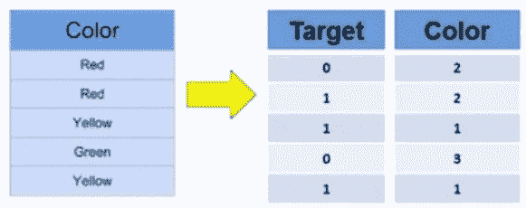
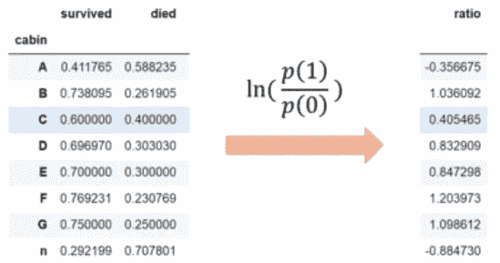
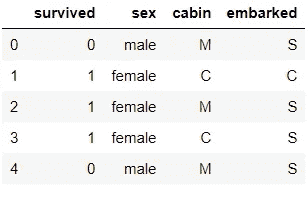
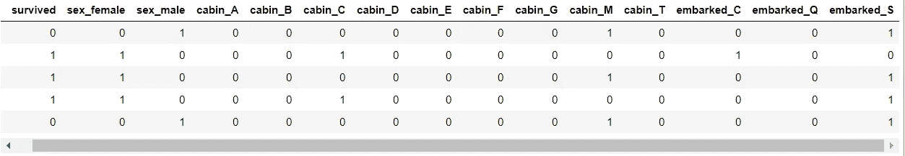
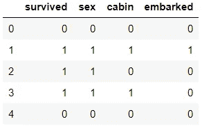
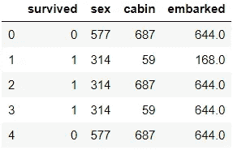
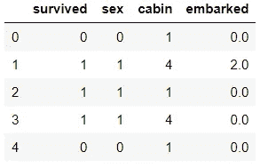
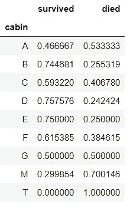
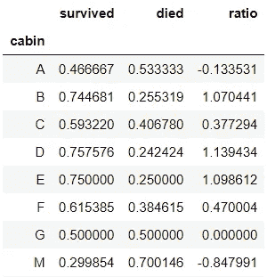
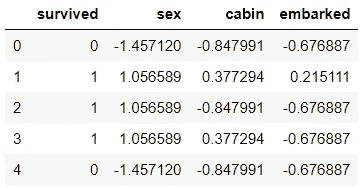

# 分类变量编码技术

> 原文：<https://medium.com/analytics-vidhya/categorical-variable-encoding-techniques-17e607fe42f9?source=collection_archive---------0----------------------->

分类变量是指有两个或更多类别(值)的变量。分类变量有两种类型，**名词性**和**序数**。一个名义变量对其类别没有内在的排序。例如，性别是一个具有两个类别(男性和女性)的分类变量，这些类别没有内在的顺序。序数变量有明确的顺序。

许多 ML 算法不能直接对分类或标签数据进行操作。但是，决策树可以直接从这些数据中学习。因此，它们要求所有输入变量和输出变量都是数字。这意味着分类数据必须转换成数字形式。

分类变量编码的几种类型有:

1.  **一个热编码**:用不同的布尔变量(也称为哑变量)对每个分类变量进行编码，布尔变量取值为 0 或 1，表示某个类别是否出现在观察中。


一键编码

2.**整数编码/标签编码**:用 1 到 n(或 0 到 n-1，取决于实现)的数字替换类别，其中 n 是变量的不同类别的数量。

3.**计数或频率编码**:用数据集中显示类别的观察值的计数替换类别。类似地，我们可以用数据集中观察值的频率或百分比来代替类别。也就是说，如果我们 100 次观察中有 10 次显示蓝色，如果进行计数编码，我们将用 10 代替蓝色，如果用频率代替，则用 0.1 代替蓝色。

4.**有序整数编码**:类别由整数 1 到 k 代替，其中 k 是变量中不同的类别，但这种编号是由每个类别的目标决定的。在下面的示例中，绿色的目标平均值为 0，红色的目标平均值为 0.5，黄色的目标平均值为 1。因此黄色被 1 代替，红色被 2 代替，绿色被 3 代替。



5.**使用“证据权重”编码**:每个类别将被[p(1)/p(0)]的自然对数代替，其中 p(1)是类别变量中每个类别的好目标变量的概率，p(0)是坏目标变量的概率。在著名的“**泰坦尼克号**”**数据集中，分类变量之一，“**船舱**”**可以编码如下，假设“**幸存**”为目标变量。 **p(1)** 是每个类别的存活概率 **p(0)** 是死亡概率。**注意:WoE 非常适合于逻辑回归，因为 Logit 变换只是概率的对数，即 ln(P(货物)/P(货物))。******

********

****证据的重要性****

****让我们继续用 python 实现上述技术:****

****导入所需的库，并在加载“titanic”数据集后做一些预处理来删除空值****

```
**import numpy as np #for numpy operations
import pandas as pd #for creating DataFrame using Pandas 
# to split the dataset using sklearn 
from sklearn.model_selection import train_test_split
# load titanic dataset
data = pd.read_csv('titanic.csv',
                   usecols=['sex', 'embarked', 'cabin', 'survived'])
# let's capture only the first letter of the 
# cabin for this demonstration
data['cabin'] = data['cabin'].fillna('Missing')
data['cabin'] = data['cabin'].str[0]data.head()**
```

********

# ****一个热编码****

****熊猫库中的 get_dummies 会做如下所示的编码工作。它将使用 0 和 1 为每个类别创建额外的列，以指示该类别是否存在。如果类别存在，则用 1 表示，否则用 0 表示。****

```
**pd.get_dummies(data)**
```

********

****独热编码列****

****限制:它会随着列数的增加而扩展维度，这可能会导致训练时数据过度拟合。****

# ******整数编码/标签编码******

****要替换列中的每个类别，我们必须创建一个字典，其中每个类别都有键，每个类别的值都是任意数字。然后，每个类别可以映射到列中字典中定义的数字。这可以通过使用以下两个函数来实现:****

```
**# Returns dictionary having key as category and values as number
def find_category_mappings(data, variable):
    return {k: i for i, k in enumerate(data[variable].unique())}# Returns the column after mapping with dictionary
def integer_encode(data,variable, ordinal_mapping):
    data[variable] = data[variable].map(ordinal_mapping)for variable in ['sex','cabin','embarked']:
    mappings = find_category_mappings(data,variable)
    integer_encode(data, variable, mappings)data.head()**
```

****函数" **find_category_mapping"** 会返回字典:****

```
**{‘male’: 0, ‘female’: 1} **=> 'sex'**
{‘M’: 0, ‘C’: 1, ‘E’: 2, ‘G’: 3, ‘D’: 4, ‘A’: 5, ‘B’: 6, ‘F’: 7, ‘T’: 8}  **=> 'cabin'**
{‘S’: 0, ‘C’: 1, ‘Q’: 2, nan: 3}  **=> 'embarked'****
```

********

****整数/标签编码列****

****限制:标签编码不适合像逻辑回归这样的线性模型。****

# ******计数或频率编码******

****第一步是创建字典，其中键作为类别，值作为该类别的频率(或计数)。然后，使用字典将类别替换为计数****

```
**# create the dictionary
count_map_sex = data['sex'].value_counts().to_dict()
count_map_cabin = data['cabin'].value_counts().to_dict()
count_map_embark = data['embarked'].value_counts().to_dict()
# Map the column with dictionary
data['sex'] = data['sex'].map(count_map_sex)
data['cabin'] = data['cabin'].map(count_map_cabin)
data['embarked'] = data['embarked'].map(count_map_embark)
data.head()**
```

********

****计数/频率编码****

****限制:如果两个不同的类别在数据集中出现相同的次数，也就是说，它们出现在相同数量的观察值中，它们将被相同的数量所取代，因此，可能会丢失有价值的信息。****

# ******有序整数编码******

****首先计算 column 中每个类别的目标均值(在 Pandas 中使用 **groupby()** )并排序。将数值按升序分配给目标平均值。目标平均值越低，数值越低，反之亦然。****

```
**def find_category_mappings(data, variable, target):
    # first  we generate an ordered list with the labels
    ordered_labels = data.groupby([variable])[target].mean().sort_values().index
    # return the dictionary with mappings
    return {k: i for i, k in enumerate(ordered_labels, 0)}def integer_encode(data,variable, ordinal_mapping):
    data[variable] = data[variable].map(ordinal_mapping)data.head()**
```

****函数**find _ category _ mapping()**将根据每个类别的**排序目标均值**返回以下字典****

```
**{'male': 0, 'female': 1} **=> 'sex'**
{'T': 0, 'M': 1, 'A': 2, 'G': 3, 'C': 4, 'F': 5, 'B': 6, 'E': 7, 'D': 8}  **=> 'cabin'**
{'S': 0, 'Q': 1, 'C': 2} **=> 'embarked'****
```

********

****有序整数编码****

****局限性:容易造成过拟合****

# ******编码使用“证据权重”******

****对于“cabin”列，计算每个类别存活= 1 和存活= 0 的概率(类似于其他分类列)。****

```
**#probability of survived = 1
prob_df = data.groupby(['cabin'])['survived'].mean()
# and capture it into a dataframe
prob_df = pd.DataFrame(prob_df)# and now the probability of survived = 0
# (probability of non-events or p(0))prob_df['died'] = 1-prob_df['survived']**
```

********

****“客舱”栏中每个类别的 p(1)和 p(0)****

****计算“证据权重”:****

```
**prob_df['ratio'] = np.log( prob_df['survived'] / prob_df['died'] )**
```

********

****证据的重要性****

****在计算了 WoE 之后，可以在字典中捕获它，并且可以映射到‘cabin’列。****

****我定义了两个函数来执行上述所有步骤:****

```
**# Encoding using WoE
def find_category_mappings(data, variable, target):
    tmp = pd.DataFrame(data.groupby([variable])[target].mean())
    tmp['non-target'] = 1 - tmp[target]
    tmp['ratio'] = np.log( tmp[target] / tmp['non-target'] )
    return tmp['ratio'].to_dict()def integer_encode(data, variable, ordinal_mapping):
    data[variable] = data[variable].map(ordinal_mapping)for variable in ['sex','cabin','embarked']:
    mappings = find_category_mappings(data, variable, 'survived')
    integer_encode(data,variable, mappings)**
```

********

****使用证据权重的编码****

****局限性:也容易造成过拟合****

# ******结论******

****由于处理任何数据集中的分类变量都是特征工程中的关键步骤，因此可以根据模型的类型应用上述任何技术。有些技术与线性模型(如逻辑回归)一起使用效果更好，而有些技术与非线性模型(如决策树)一起使用效果更好。如果有更少的类别，并且是**名义上的**分类数据，那么**一键编码**就可以了。如果作为自变量和因变量(目标变量)的任何分类列之间的关系很重要，那么可以应用**有序整数编码**。对于**序数**分类数据，只需使用**标签编码**即可。****

****希望你喜欢文章:)****