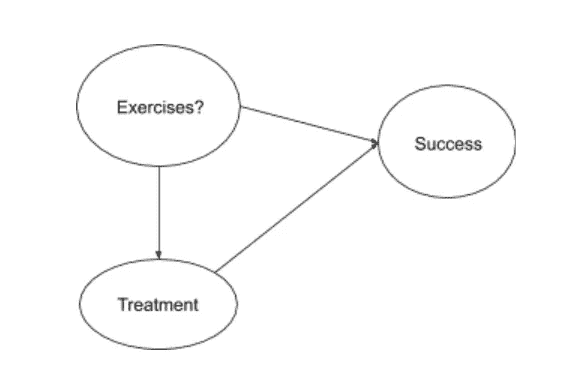
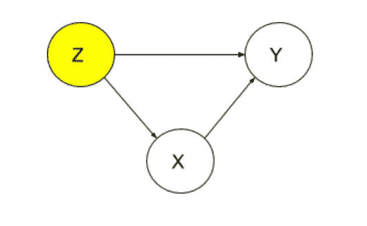
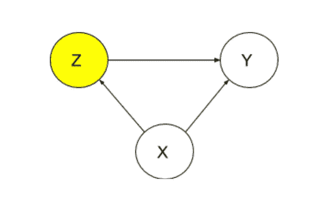
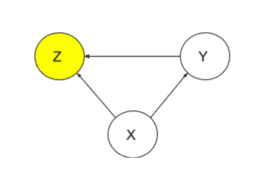

# 因果推理——简介

> 原文：<https://medium.com/analytics-vidhya/causal-inference-a-brief-introduction-3807004cc519?source=collection_archive---------8----------------------->

图片通过 [pixabay](https://pixabay.com/)

**动机**

假设我们从当地的一个研究实验室得到了关于锻炼和不锻炼的病人的两种治疗成功率的数据。

从这些数据中，我们可以得出以下结论:

*   在两个亚组{锻炼，不锻炼}中，治疗 1 具有更高的成功率。
*   在所有患者中，治疗 2 的成功率更高。

我们可能会问，为什么治疗 2 对整个人群更有效，但对两个亚组都不太有效。从这些数据中很难确定哪种治疗方法实际上更好。为了确定这一点，我们需要更深入地思考数据是如何产生的，存在哪些潜在的[混杂因素](https://en.wikipedia.org/wiki/Confounding)，以及实验背景。我们需要理解数据背后的因果故事。

一个潜在的原因可能是，治疗 1 对锻炼的患者来说是成本有效且侵入性较小的(即，膳食补充剂)，因此它更多地用于这一亚组。因此，在除了最困难的情况之外的所有情况下，医疗从业者更倾向于避免治疗 2，这种治疗非常成功，但是更昂贵且更具侵入性(即手术)。虽然他的因果故事很好地解释了数据，但数据本身并没有告诉我们治疗的因果效应。创建因果故事需要更多信息。

在上面的故事中，我们被动地观察了医生进行治疗——我们不知道研究人员是否指示医生随机进行治疗。如果我们观察到患者接受了治疗 1，我们可以推断该患者进行了锻炼。在这种情况下，因为我们没有进行任何干预或采取任何行动(例如，对谁接受什么治疗进行随机分组)，所以谈论因果关系比谈论[相关性](https://en.wikipedia.org/wiki/Correlation_and_dependence)更困难。例如，如果我们指示医生随机选择谁接受何种治疗(即进行干预)，我们就有足够的信息进行因果推断。

**什么是随意推断？**

因果推理是一个概念和技术框架，用于理解假设行为或[干预](https://plato.stanford.edu/entries/causal-models/#Inte)的效果。因果问题示例包括:

*   什么导致压力？
*   运动能预防肥胖吗？
*   算法增加了刑事司法系统的公平性吗？
*   如果我今天不开车，我不会收到超速罚单吗？

一般来说，在一个实验中，我们执行一个动作，做一个主动分配。动作的效果通常不是由条件概率给出的——对某事的条件作用(被动观察)不同于在现实世界中执行动作。我们称一个行为的结果为因果效应——如果我们被动地观察某件事，谈论因果关系是不够的。

**干预措施的重要性**

干预使我们能够区分与观察相符的不同因果结构(见下文)。如果我们操纵(执行一个动作)事件 A，而事件 B 没有变化，那么 A 不可能是事件 B 的原因。同样，如果对事件 A 的操纵导致了事件 B 的变化，那么 A 一定是事件 B 的原因，尽管也可能有 A 的其他原因(即混杂因素)。例如,“do-intervention”保持一个变量常数，以便确定该变量与其他变量之间的因果关系。使用上面的激励示例，假设我们正在查看概率:

P(Y=y | X=x) *其中 Y = {成功，失败}，X = {治疗 1，治疗 2}*

如果我们进行 do 干预，并将 X 固定为处理 1，我们可以观察到以下概率:

p(Y = Y | do(X =处理 1))

一般来说，这两个概率是不相等的——这意味着 X 不是 Y 的真正原因，其他变量影响 Y 的结果。如果这些概率相等，我们可以推断 X 对 Y 有因果影响。有关执行干预的更多信息，请阅读此处的。

**结构因果模型**

我们使用结构因果模型来正式表示因果故事。这些因果模型代表了我们对世界的假设；它们不是给我们的，也没有办法把它们从数据中取出来(在这里拥有领域知识是有益的)。在上面的激励性例子中，我们可以通过与医疗从业者谈论他们在给病人分配治疗时的决策过程来构建我们的因果模型。这是我们之前例子中的一个简化的因果模型:

在这个因果模型中，变量“练习？”混淆了变量“治疗”和“成功”如果医生知道病人锻炼，他们可能会选择成功率最高的治疗方法。同样，病人是否锻炼也会影响他们的成功。接下来，我们将深入探讨如何构建结构性因果模型，以及在进行因果推断时我们应该控制哪些变量。

我们首先通过在实验中包括所有可能共享依赖关系的变量来构建因果模型。这里有一个警告，即使我们定义了研究中所有的*观察到的*变量，也可能有*未观察到的*变量，我们可能不知道或无法测量——这是常见的，我们最好的办法是严格设计一个与我们的假设兼容的模型。一旦我们有了一个因果模型——这是一个因果故事的代表——我们就可以用它来决定哪些变量是*中介*，哪些变量是*混杂*，哪些变量是*碰撞*，从而决定我们应该控制哪些变量。构建因果模型时，我们应该了解三个重要变量:

1.  混杂变量

在这个模型中，Z 是一个混杂变量。这个模型被称为 *fork* ，其中 Z 是 X 和 y 的共同原因。混淆导致条件概率(观察)和 do 干预(行动)之间的不一致，如前所述:

*P(Y = Y | X = X)≠P(Y = Y | do(X = X))*

2.中介变量

在这个模型中，Z 被称为中介变量。z 对 X 对 y 的总因果效应有贡献。

3.碰撞器变量

在这个模型中，Z 被称为碰撞器变量。z 去发现 X 和 Y——在这种情况下，我们可以用条件概率代替“do-interventions”。

那么，在实验中我们应该控制哪些变量呢？

我们应该努力控制混杂变量，而不是中介变量或碰撞变量。控制混杂变量可以让我们了解 X 对 Y 的真正因果影响。控制中介变量可以减少 X 对 Y 的真正影响。控制碰撞变量可以在 X 和 Y 之间产生反相关性(即使它们在群体中确实不相关)，这种现象被称为[伯克森定律](https://en.wikipedia.org/wiki/Berkson%27s_paradox#:~:text=Berkson's%20paradox%20also%20known%20as,in%20statistical%20tests%20of%20proportions.)或[碰撞偏差](https://catalogofbias.org/biases/collider-bias/)。

**估计因果关系**

下一步是确定某项行动或干预的因果影响——在数据上执行。在这个例子中，我们将使用 do-intervention。回想一下，do 干预将一个变量固定为一个常数值，以确定该变量对其他变量的因果影响，概率为:

P(Y=y | do(X=x))

很难继续计算这个概率。幸运的是，[调整公式](https://www.stat.cmu.edu/~cshalizi/uADA/12/lectures/ch24.pdf)允许我们将它改写为条件概率:

P(Y = Y | do(X = X))=σ(P(Y = Y | X = X，Z=z)P(Z=z))，*其中σ在所有 Z 上*

这为我们提供了一种根据条件概率来估计 do 干预的因果效应的方法——对于 Z 的每个可能值，我们在由条件 Z = z 定义的人口的每个分区中分别估计 X 对 Y 的因果效应。

值得注意的是，我们可以用这个公式控制一组*变量*，而不仅仅是一个变量(也就是说，Z 可以由一组混杂因素{A，B，C}组成)。

我们如何确定控制哪组变量？回想一下，我们不想控制中介变量或碰撞变量。从一个简单的模型(比如上面的例子)中确定这个集合似乎很容易，但是现实生活中的因果模型可能非常复杂(图中节点的组合爆炸)。幸运的是，[后门标准](http://bayes.cs.ucla.edu/BOOK-2K/ch3-3.pdf)允许我们确定一个我们可以控制的最小节点集，这样我们就可以消除混杂偏倚。在没有未观察到的混淆的情况下，校正公式通常是可靠的-可能有一些变量混淆了 X 和 Y，而我们无法测量或知道这些变量。即使有这种限制，通过仔细的假设和合理的因果模型设计，调整公式仍然可以提供强大的洞察力。

与调整公式类似，当我们的变量 Z 由离散值组成时，调整公式是适用的，当 Z 连续或太大而无法求和时，可以使用[反向倾向得分加权](http://www.rebeccabarter.com/blog/2017-07-05-ip-weighting/) (IPSW)。

**剧透警报:**

我们可以避免设计因果模型和处理未观察到的变量的头痛的一个方法是通过执行[随机对照试验](https://en.wikipedia.org/wiki/Randomized_controlled_trial) (RCT)。RCT 与实施干预相比有两大优势——它们消除了混杂偏倚，使研究人员能够量化他们的不确定性。RCT 比观察性研究更受欢迎，在观察性研究中，我们进行干预来确定因果关系。不幸的是，在许多情况下，RCT 可能过于昂贵、不可能或有害。

**重要性**

因果推断不是一个解决方案，也不会使回答正确的问题和执行正确的行动来确定因果关系变得更容易。但是，它可以作为新研究设计的指南。它可以帮助我们选择包括哪些变量，排除哪些变量，以及控制哪些变量。我们看到，结构因果模型可以作为一种机制来整合科学领域的知识，并交换合理的假设，得出合理的结论。最重要的是，科学家有必要深入理解因果推理技术和概念，以避免可能对社会造成问题的不适当的结论或建议。

*在* [*下一篇*](/@amandrell97/an-application-of-causal-inference-3ae2629f8f58) *中，我们将深入探讨因果推断在现实数据上的应用和使用。特别是，我们将看到如何应用反向倾向评分权重* *来估计治疗的因果效应。*