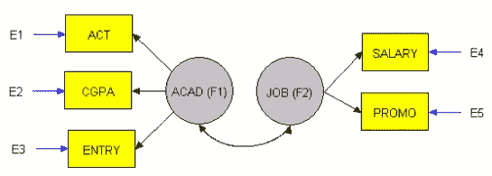

# 因果推理:导论

> 原文：<https://medium.com/analytics-vidhya/causal-inference-an-introduction-f424df7c76ef?source=collection_archive---------2----------------------->

最近，因果关系的概念在机器学习和人工智能领域越来越受欢迎，因为它与世界的工作有着内在的联系。因果关系指的是原因和结果之间的关系，也就是说，它基于这样一种假设，即每一个结果都是由一个特定的原因或一组原因引起的。在这篇博客中，我们将了解因果推理的基础知识，熟悉该领域中使用的术语，并深入研究反事实和反事实推理科学，这在最近变得越来越流行。

*先决条件:本博客期望读者熟悉神经网络的基本概念，以及如何借助* [*损失函数和优化器*](/data-science-group-iitr/loss-functions-and-optimization-algorithms-demystified-bb92daff331c) *来训练神经网络。*

# 因果推理

因果推理的领域是基于简单的因果原则，也就是说，我们的行为直接导致直接的结果。通过因果推理，我们可以直接发现政策(或行动)的变化如何导致现实世界结果的变化。让我们熟悉一下该领域中使用的术语。

**单位:**数据中的一个个体样本。

**变量:**数据集中分析单元的特征。比如国家、人物、天气等。

**总体:**收集所有分析单元的集合。

**结果变量:**我们想要影响的特定变量。

**策略/处理变量:**用于创建变更(即动作)的变量。

**干预:**改变治疗变量的值，保持其他变量值不变，以研究治疗变量变化的影响。

**混杂因素:**影响输入和输出变量的变量。

**反事实结果:**如果该装置暴露于不同的处理，将会出现的结果(无法观察)。

**单元级因果效应:**在保持所有其他变量不变的情况下，由于特定变量的值发生变化而对数据中单个单元产生的因果效应。

**交互效应:**这是指其他变量也可能影响因果效应值的事实。

**异质性:**是指不同单元在受到相同处理时表现出不同因果效应的概念。

给定输入变量的分布 **X** 和结果变量(效果) **Y** 的分布，因果演算区分两种条件分布——观察分布 *P(y|x)* 和干预分布 *P(y|do(x))* 。 *P(y|x)* 表示 **Y** 的分布，假设我们观察到变量 ***X*** 取值 *x* ，而*P(Y | do(X)】*描述了 **Y** 的分布，这将通过人工强制变量 **X** 取值 *x* 来观察，保持其余变量在使用**随机对照试验(RCTs)可以获得这样的干预分布。然而，由于伦理或实践方面的考虑，并不总是有可能进行这样的实验。更多关于因果推理及其与 do 演算的关系可以在[这里](https://www.inference.vc/untitled/)找到。**

****因果推理**的基本问题是，在现实世界中，每个单元只能接受多重处理中的一种，并且只能观察到与该处理相对应的结果。对同一单位的其他治疗的效果不能直接观察到，这就是我们想要使用因果推理技术来预测的。**

****注:**相关性并不意味着因果关系。相关性指的是两个变量如何相关，而因果关系研究的是一个变量是否影响其他变量。两个变量可能以相关的方式变化，但其中一个可能不会引起另一个的变化。**

## **因果推理的框架**

****结构方程建模(SEM)。** [*结构方程建模*](https://www.lexjansen.com/wuss/2006/tutorials/TUT-Suhr.pdf) 是一种表示、估计和测试变量(测量变量和潜在结构)之间关系网络的方法。该模型最常见的形式是 SEM，其目的是说明测量变量的变化和共变。**

****

**结构方程模型——学术结构和工作结构之间的关系**

****潜在成果框架。**也被称为 [*鲁宾因果模型(RCM)*](https://en.wikipedia.org/wiki/Rubin_causal_model) ，*潜在结果框架*是基于潜在结果的思想。例如，如果一个人上过大学，她在 40 岁时会有一个特定的收入，而如果她没有上过大学，她在 40 岁时会有一个不同的收入。为了衡量这个人上大学的因果效应，我们需要比较同一个人在两种不同未来的结果。因为不可能同时看到两种可能的结果，所以其中一种可能的结果总是会被忽略。**

# **反事实推理**

**在某种程度上，反事实推理可以被定义为对另一个现实的预测。给定一对原因和结果，反事实推理侧重于回答这个问题——“在所有其他条件不变的情况下，对该单位进行不同的处理会有什么影响？”。例如，给一个患有某种疾病的病人服用一种药物 **D1** ，他们表现出好转的迹象。在这种情况下，一个反事实的调查将是询问患者如果接受不同的药物 **D2** 治疗是否仍会表现出类似的改善。**

**进行反事实推理有多种方法，但由于这是一个介绍性的博客，我们将只提到一些非常基本的建模技术。**

****贝叶斯结构建模。**在该方法中，设计了一个因果图，并使用贝叶斯技术来估计与特定初始化相对应的结果。[这篇](https://arxiv.org/pdf/1506.00356.pdf)论文提出了一个相似的模型，用于对时间序列数据进行反事实推断，其中一个变量值在一个特定的时间步长进行干预，并且在随后的时间步长中观察这种干预的效果。**

****

**文中提出的图形模型**

****基于深度学习的生成建模。本文介绍了一种基于变分自动编码器(VAE)的方法，该方法遵循代理推理的因果结构。下图显示了一个具体的因果图。****

****

**因果效应变分自动编码器的模型和推理网络的总体结构。白色节点对应于参数化的确定性神经网络转换，灰色节点对应于从相应分布中抽取样本，白色圆圈对应于根据处理 t 的切换路径**

****基于深度学习的确定性方法。**在这种技术中，使用神经预测网络，使得给定输入和单元已经经受的处理，可以获得一组预测值。[这篇](https://arxiv.org/pdf/1606.03976.pdf)论文提出了 TARNet，该 TARNet 遵循类似的方法，其中有一组共享层，信息在处理分支之间共享，然后有一个单独的分支用于该单元可能经受的每种处理。**

****

**TARNet 在论文中提出。**

**这些都是非常基本的方法，旨在执行反事实推理。其他复杂因素，如源样本和目标样本的不相交分布，以及某些治疗的足够训练数据的不可用性等，是另一个博客的主题。**

## **因果推理的评估标准**

**为了训练上面讨论的模型，使用了几个评估度量。**

****个体治疗效果(ITE)。**个体治疗效果评估旨在检查一个治疗 *T* 是否影响特定单位 *i* 的结果 *Y(i)* 。如果处理 *T(i)* 没有应用于单元 *i* ， *Y* ₀ *(i)* 称为处理的潜在结果 *T(i) = 0* ， *Y* ₁ *(i)* 处理的潜在结果 *T(i) = 1* 。对单元 *i* 的个体治疗效果被定义为潜在治疗结果和控制结果之间的差异；**

****

**估计 ITE 的挑战在于估计缺失的反事实结果。**

****平均治疗效果(ATE)。** ATE 是总体中单位水平因果效应所有值的平均值。当所有单元都受到策略影响时的平均结果被称为策略下的平均结果，当没有单元受到策略影响时的平均结果被称为没有策略时的平均结果。平均治疗效果是有政策下的平均结果和无政策下的平均结果之间的差异。**

**平均治疗影响(ATE) *ψ* 由下式给出**

****

****异源效应估计的精度(PEHE)。**在二元设置中，PEHE 测量预测模型估计两种处理 *t* ₀和 *t* ₁对样本 ***X*** 的效果差异的能力。为了计算 PEHE，我们测量了从无噪声的潜在结果分布₁和₀得出的实际效果差 y₁(n(y₀(n)和预测效果差 yˆ₁(n(yˆ₀(n)之间的均方误差，通过 n 个样本用 n 来索引:**

****

**[https://arxiv.org/pdf/1810.00656.pdf](https://arxiv.org/pdf/1810.00656.pdf)**

**当潜在的无噪声分布未知时，可以使用噪声地面真实结果 *y.* 来估计效果*y₁(n)——y₀(n)*的真实差异**

**这 3 个指标主要用于训练和评估执行反事实推理的模型。存在其他几个旨在保持潜在空间和最近邻匹配反事实的平衡分布的度量，但这是另一个博客的主题。**

# **结论**

**这篇博客简要地谈到了因果推理的基础和该领域的反事实研究。如前所述，在这个领域还有很多东西需要了解。然而，更高级的话题将会在未来的博客中涉及。我希望这篇博客是对因果推理领域的有价值的介绍。**

**感谢您花时间阅读本博客。如有任何疑问，请联系**我。****