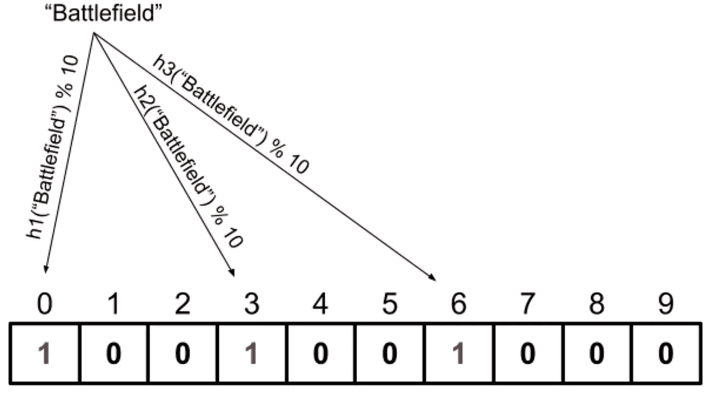

# 什么是计数布鲁姆过滤器？— Python 实现

> 原文：<https://medium.com/analytics-vidhya/cbfs-44c66b1b4a78?source=collection_archive---------2----------------------->

一个“计数布隆过滤器”的例子

在谈论计数布隆过滤器之前，我将简要介绍一下布隆过滤器及其主要亮点。这是因为计算布隆过滤器函数偏离了布隆过滤器算法函数。之后，我将详细讨论计数布隆过滤器的主要功能，并说明它与布隆过滤器的不同之处。

# **布鲁姆过滤器**

***概述***

Bloom Filter 是一种概率数据结构，主要用于检查一个元素是否存在于一个集合中。众所周知，它节省空间，因为它只使用位来存储数据。此外，布隆过滤器的优点之一是时间效率，因为添加和查找元素需要恒定的时间复杂度。布隆过滤器依靠散列函数将元素分配到槽中。为了查找一个元素，Bloom Filters 接受该元素的输入，并返回该元素是否在数据结构中。然而，正输出并不总是正确的，这意味着数据结构可能返回一个元素存在，但它并不存在。有一些版本的布隆过滤器；其中之一是“计数布隆过滤器”，这将是本文的重点。那篇文章将讨论计数布鲁姆过滤器的主要功能和与之相关的一些概率方程。

***主要亮点***

*   布隆过滤器没有假阴性输出，这意味着它永远不会说一个特定的值存在，当它并不真正存在。
*   它有假阳性概率，这意味着它可能会说某个东西存在，而它不存在。当不同元素的哈希函数的输出重叠时，就会出现这个问题。
*   布隆过滤器使用比特大小(0 或 1)来存储标记一个时隙。
*   在初始化中，布隆过滤器具有特定大小(m)的零，并且该大小影响得到误报的概率。

> 我推荐阅读那篇文章[以获得更多关于 Bloom Filters 的信息](https://www.geeksforgeeks.org/bloom-filters-introduction-and-python-implementation/?fbclid=IwAR1abUlrTPvgNfJvUtYWn8DvCw2tr15wCLIJ1gz4g4I3AxWlQCNdK0wd4p8)

# **计数布隆过滤器**

> 计数布隆过滤器使用与布隆过滤器相同的功能，但主要区别在于，在计数布隆过滤器时，我们在每个槽中添加计数器，而不是(0 或 1)。这意味着我们可以从数据结构中删除元素，这在 Bloom Filters 中是不可能的。

***计数布隆滤镜功能:***

**1-初始化**

为了初始化计数布隆过滤器，我们应该创建一个由 ***m*** 个槽组成的数组，其中每个槽将保存一个计数器的值。开始时，所有的槽将等于**零**，因为在数据结构中没有添加元素。

创建大小为 10 的空计数布隆过滤器

这里需要指出的是，计数 Bloom Filter 初始化一个固定大小的数组( ***m*** )。所以，它具有恒定的空间复杂度 *O(1)* 。但是，如果它有灵活的大小久而久之，它将失去空间效率的优势。

**2-散列法**

要了解计数布隆过滤器如何存储数据，您需要知道哈希函数是如何工作的。

> 哈希函数接受数据输入，并返回固定长度的唯一标识符，用于识别输入。

> 我建议阅读那篇文章[以了解更多细节。](http://quiz.geeksforgeeks.org/hashing-set-1-introduction/)

为了找到数组中每个元素的键，我们将使用散列函数。哈希将主要用于三种方法，即添加元素、删除元素和查找元素。

每个元素将被分配给数据结构中的一个以上的槽。因此，每个元素都将经过不止一个散列函数，以在数据结构中找到相应的散列码。所使用的散列函数的数量将用字母 ***k 来表示。*** 寻找 ***k*** 的最佳值将在下面的“*假阳性概率”*部分中解释。

在 Python 实现中，我将使用 Python 内置的哈希库( [hashlib](https://docs.python.org/3/library/hashlib.html) )，因为它抽象了有效的哈希算法。

**3-添加**

要添加一个元素，我们首先需要使用散列函数来查找元素的键，然后我们应该从数组大小中得到输出的余数(modules 函数)。所以，公式会如下:***key = hᵢ(element)% m***其中**【hᵢ(】*是哈希函数， ***m*** 是数组的大小。*

*之后，我们应该转到元素键指向的插槽，然后将它们的计数器值加 1。这里，我们将计数器的值增加 1，因为我们使用了计数布隆过滤器。另一方面，如果我们使用布隆过滤器，我们将改变这些槽等于一，即使元素不是槽中的第一个。*

**举例:**

*如果我们正在为视频游戏构建一个数据结构，我们将从初始化数组开始。然后，我们会推送下图所示数据结构中的第一款游戏《战地》:*

**

*添加“战场”*

*之后，我们可以使用下图所示的相同哈希函数添加第二个游戏“GTA”:*

**

*添加“GTA”*

*这里，我们可以注意到槽号 3 增加了 1，因为两个散列函数输出在那里相交。*

***4-移除***

*从数据结构中删除元素的方法与添加元素的方法类似。因此，要删除一个元素，我们首先需要使用散列函数找到元素的键。之后，我们将转到找到键的槽，然后我们应该将这些槽的值减 1。*

**举例:**

*回到前面的例子。现在，如果我们需要删除视频游戏“战地”，我们将首先转到具有相应键的插槽，然后将它们的值减一，如下图所示:*

**

*移除“战场”*

***5-查找:***

*在数据结构中查找元素采用了与 remove 函数和 add 函数相似的方法。首先，我们将使用以下公式使用返回元素键的哈希函数:***key = hᵢ(element)% m***其中***【hᵢ()***是哈希函数， ***m*** 是数组的大小。*

*然后，我们将使用元素键检查每个槽的值。如果计数器的值等于零，则意味着该元素不存在。但是，如果计数器值大于零，这意味着我们需要检查其他插槽。如果所有带有元素键的槽都大于零，那么这意味着数据结构中存在元素，否则该元素不存在。有时查找函数会返回假阳性结果；这意味着查找函数说元素存在，但它不存在。*

**例子:**

*回到我们之前的例子，我们将尝试检查视频游戏“战场”是否仍然存在。首先，我们将进入具有“战场”键的槽，这些键是(0，3，6)。我们会发现(0 和 6)的值为零。这意味着“战场”在数据结构中不存在，如下图所示:*

**

*寻找“战场”*

> ***完整的 python 类(CBFs)实现可见** [**要诀**](https://gist.github.com/KareemAlsayed1/30b78a673421880de9f554823b0b98d2)*

****误报概率:****

*并非总是如此，查找函数返回正确的正输出，这意味着有一个错误率，称为假阳性概率。假阳性概率通过用阳性假次数除以阳性结果的总数来实验计算。此外，理论上，另一种计算方法是使用以下公式: **P=(1-[1-(1/m)]ⁿᵏ)ᵏ** 其中**pt5】是误报概率，**m**是数组的大小， ***n*** 是元素的预期数量， ***k*** 是使用的哈希函数的数量。***

*这就是为什么其他一些方程试图找到散列函数的最佳数量( *k* )。一个等式是***k =(m/n)×ln(2)***其中 ***k*** 是哈希函数的最优个数， ***m*** 是数组的大小， ***n*** 是元素的估计个数。*

*另外，在给定概率和预期元素数量的情况下，使用另一个等式来寻找数组的最佳大小。那个等式如下:***m =-(n×ln(P))/(ln(2))***其中 ***m*** 是数组大小， ***n*** 是估计元素的个数， ***P*** 是误报概率。*

*因此，CBFs 类的参数将是元素的估计数量和期望的假阳性概率；之后，代码可以计算出最佳的数组大小和哈希函数的最佳数量。*

****假阴性:****

*计数布隆过滤器没有假阴性结果，这意味着如果输出是假的，那么它是 100%假的。这是因为如果其中一个槽是零，这意味着没有元素接触到该计数器。*

****复杂度分析:****

****计算应用:****

*   ***检查唯一用户名的可用性:***

*在网站注册时可以使用计数布鲁姆过滤器，我们选择一个特定的用户名，网站会检查该用户名是否被占用。这是一个很好的应用程序，因为如果计算 Bloom Filters 返回的用户名是唯一的，那么 100%用户名是唯一的，因为假阴性率为零。此外，如果有人正在删除他在该网站上的帐户，那么计数布隆过滤器将使我们能够从数据库中删除该用户名。*

*   ***钥匙卡认证***

**许多公司正在使用门卡进入系统进行门禁控制。所以，允许钥匙卡持有者进入应该不需要时间，并且过程应该准确，以避免非授权人员进入。因此，计数布鲁姆过滤器将是解决该问题的一个很好的选择，因为它具有恒定的时间复杂度和零假阴性概率。**

*感谢阅读！欢迎任何反馈:D*