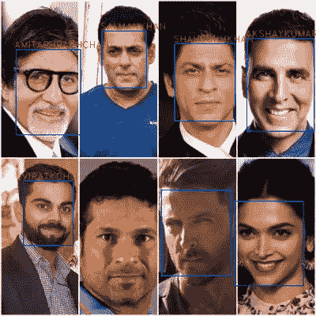
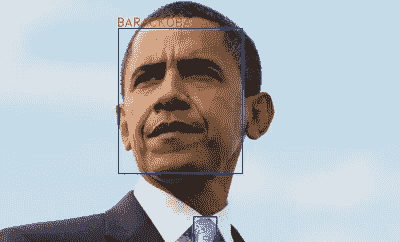

# 使用 VGGFace 和 Annoy 进行名人识别

> 原文：<https://medium.com/analytics-vidhya/celebrity-recognition-using-vggface-and-annoy-363c5df31f1e?source=collection_archive---------14----------------------->



这是一个关于如何创建一个使用人脸匹配算法识别名人的模型的指南。

本文包括以下主题:

1.  使用库和创建自己的模型的指南。
2.  为存储库发布 pip 包。

请参考[本](https://celeb-recognition.readthedocs.io/en/main/)获取详细文件。

本文中提到的所有代码都可以在我的 GitHub 资源库中找到。

[](https://github.com/shobhit9618/celeb_recognition) [## shobhit9618/celeb_recognition

### 使用人脸匹配算法识别名人的模型。该模型基于 60 张照片的约 6000 个数据集

github.com](https://github.com/shobhit9618/celeb_recognition) 

# 模型的基本工作

该模型的基本算法包括以下内容:

1.  人脸检测模型(目前我正在使用 MTCNN)是用来寻找图像中的人脸。

2.裁剪后的人脸被发送到一个名为 [VGGFace](https://github.com/rcmalli/keras-vggface) 的模型。该模型以大小为 2048 的数组的形式为面部提供编码。

3.编码通过一个名为[的库来存储和索引。这用于找到与需要检测的面部最接近的匹配。](https://github.com/spotify/annoy)

因此，为了训练你自己的名人模型，你需要提供一个你需要认识的名人的数据集。使用 Google images、DuckDuckGo、Bing 等网站可以轻松收集数据。这些数据必须安排在一个适当的文件夹结构中，每个名人有一个单独的文件夹。模特的名字取自文件夹名(所以确保文件夹名中没有空格或特殊字符)。尽可能多地提供名人照片。随着更多数据的加入，该模型将不断改进。

现在，你只需要提供文件夹的路径，该文件夹中存储了所有名人的照片。使用代码的细节将在下一节中显示。

模型创建完成后，我们需要进行预测。在预测过程中，每幅图像都要经历相同的过程，人脸检测和编码创建。面部的编码是使用所创建的烦恼指数模型来搜索的，这给了我们最接近的匹配面部。annoy 库提供了尽可能多的最接近的匹配，我们可以只使用最接近的匹配进行预测。但是为了减少错误检测，增加了一个简单的技巧。我们找到 10 个最接近的匹配，如果 3 个或更多的匹配属于同一个名人，那么结果被考虑，否则它被丢弃。

# 使用图书馆

有几种方法可以使用该库:

1.  Python 代码文件

首先将库克隆到您的本地系统。使用 requirements.txt 文件安装依赖项:

```
git clone [https://github.com/shobhit9618/celeb_recognition.git](https://github.com/shobhit9618/celeb_recognition.git)
cd celeb_recognition
pip install -r requirements.txt
```

现在，要创建自己的模型，只需打开`create_celeb_model.py`文件，提供名人图片的根文件夹路径，然后运行该文件。这将启动模型创建过程，并存储 3 种文件:用于存储每个名人图像(在训练期间生成)到名人姓名的映射的 celeb_mapping.json，用于存储索引和快速搜索的编码的 celeb_index.ann，用于存储为每个名人生成的编码的 celeb_name_encoding.pkl 文件。您可以在 celeb_utils 文件夹内的`create_celeb_utils.py`文件中提供存储这些文件的路径。

为了进行预测，请在 celeb_utils 文件夹的`celeb_utils.py`文件中提供 celeb_mapping.json 和 celeb_index.ann 文件的路径。然后，在`celeb_recognition.py`文件中提供图像文件的路径或图像 URL，并运行它。这将提供图像中的预测和检测到的面部。您还可以选择将带有边界框的输出图像存储到本地系统。



对巴拉克·奥巴马形象的预测

2.Pip 包

我的 pip 包可以在这里找到。

[](https://badge.fury.io/py/celeb-detector) [## 名人探测器

### 使用人脸匹配算法识别名人的模型。该模型基于 60 张照片的约 6000 个数据集

badge.fury.io](https://badge.fury.io/py/celeb-detector) 

要安装 pip 包，请运行:

```
# pip release version
pip install celeb-detector
# also install additional dependencies with this (if not installed via requirements.txt file)
pip install annoy keras-vggface keras-applications
# Directly from repo
pip install git+https://github.com/shobhit9618/celeb_recognition.git
```

如果您在 Linux 或 Ubuntu 上使用 conda，您可以使用以下命令创建并使用一个名为 celeb-detector 的新环境(这将安装所有必需的依赖项):

```
conda env create shobhit9618/celeb-detector
conda activate celeb-detector
```

要使用我的模型进行预测，请在安装后使用以下代码行:

```
import celeb_detector # on running for the first time, this will download vggface model
img_path = 'sample_image.jpg'
celeb_detector.celeb_recognition(img_path) # on running for the first time, 2 files (celeb_mapping.json and celeb_index_60.ann) will downloaded to the home directory# if you want to use an image url, just provide the url and add url=True
url = 'https://sample/sample_image_url.jpg'
celeb_detector.celeb_recognition(url, url=True)
```

这将返回一个字典列表，每个字典包含 bbox 坐标，名人姓名和图像中检测到的每个人脸的置信度(如果没有检测到匹配的人脸，名人姓名将是未知的)。

为了使用您自己的定制模型，还需要提供 json 和 ann 文件的路径，如下所示:

```
import celeb_detector
img_path = 'sample_image.jpg'
ann_path = 'sample_index.ann'
celeb_map = 'sample_mapping.json'
celeb_detector.celeb_recognition(img_path, ann_path, celeb_map)
```

用于创建您自己的模型，如下运行:

```
import celeb_detector
folder path = 'celeb_images'
celeb_detector.create_celeb_model(folder path)
```

3.Jupyter 笔记本

*   在`celeb_recognition.ipynb`文件中提供`celeb_mapping.json`和`celeb_index.ann`文件的路径。如果你想试试我的模型，忽略这一步。
*   运行`celeb_recognition.ipynb` 文件中的所有单元格，最后一个单元格将提供上传图像和进行预测的小部件(这也将下载必要的模型文件)。
*   注意:`celeb_recognition.ipynb`是一个独立的文件，运行时不需要 repo 中的任何其他文件。
*   您也可以在 [google colab](https://colab.research.google.com/github/shobhit9618/celeb_recognition/blob/main/celeb_recognition.ipynb) 中打开并使用该文件。只需取消第一个单元的注释，并运行它来安装所有的需求。
*   您也可以点击[这里](https://mybinder.org/v2/gh/shobhit9618/celeb_recognition/main)运行活页夹应用程序。
*   你也可以点击[这里](https://mybinder.org/v2/gh/shobhit9618/celeb_recognition/main?urlpath=%2Fvoila%2Frender%2Fceleb_recognition.ipynb)，启动一个活页夹应用程序(它只有图片上传和名人预测的插件)。

# 发布存储库的 pip 包

如果您的代码是干净的，并且是使用适当的函数和类构建的，那么制作您自己的 pip 包会非常容易。

创建 pip 包的一般指南可以在以下官方文档中找到:

 [## 打包 Python 项目——Python 打包用户指南

### 本教程将带您了解如何打包一个简单的 Python 项目。它将向您展示如何添加必要的文件…

packaging.python.org](https://packaging.python.org/tutorials/packaging-projects/) 

基本要求是创建一个许可证文件、setup.py 文件和一个文件夹，该文件夹应包含 pip 包中包含的所有代码。

Python setuptools 包可以直接找到所有需要包含在 pip 包中的函数。您还需要在 PyPI 站点上创建一个帐户，并获得您的令牌来发布这个包。

在我的例子中，我添加了一个名为 celeb-detector 的文件夹(这是我的 pip 包的名称)。该文件夹包含一些文件，这些文件包含获取图像预测和创建模型的功能。

一旦安装并导入了 pip 包，您就可以使用这些函数来获得预测或创建您自己的模型。