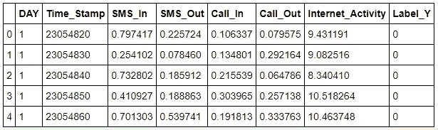
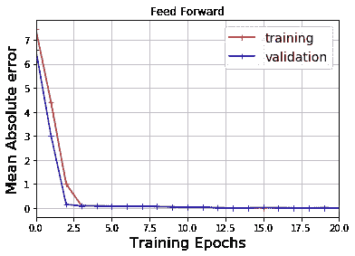
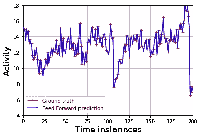
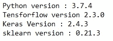

# 基于深度神经网络的蜂窝网络流量预测。

> 原文：<https://medium.com/analytics-vidhya/cellular-traffic-prediction-using-deep-neural-network-6ac309ad7039?source=collection_archive---------15----------------------->


图片提供:[https://www.warrenentsch.com.au/](https://www.warrenentsch.com.au/)

在这篇博客中，我们将学习使用深度神经网络来预测蜂窝网络流量。特别是，我们将使用长短期记忆(LSTM)。

作为我们的时间序列数据，我们将使用真实世界的呼叫数据记录(CDR)来预测网络流量。几乎所有的网络服务提供商都维护 cdr 来跟踪他们的操作。

事实上，本博客中获得的知识可以用于大多数其他时间序列预测场景。

我们将使用的 CDR 由意大利电信公开，作为其 2014 年大数据挑战的一部分。在我之前的[博客](/analytics-vidhya/data-cleansing-using-pandas-in-python-33204242d3b2)中，我已经使用了相同的 CDR 来展示数据清理和准备步骤。在这篇博客中，我将使用前一篇博客中准备的数据，但为了数据大小的利益做了一些调整。数据可以从我的 [Github](https://github.com/SRJaffry/Network_traffic_Prediction) 下载。

让我们摇滚起来！

# **导入必要的包**

```
**import** **numpy** **as** **np**
**import** **tensorflow** **as** **tf** 
**import** **matplotlib**
**import** **matplotlib.pyplot** **as** **plt**
**import** **pandas** **as** **pd**
**from** **pandas** **import** DataFrame
**from** **keras.models** **import** Sequential
**from** **keras.layers** **import** Dense
**from** **sklearn.metrics** **import** mean_squared_error
```

# 导入数据集

记得先从我的 [Github](https://github.com/SRJaffry/Network_traffic_Prediction) 下载数据集。将数据集保存在与可执行代码相同的文件夹中。尝试以下方法:

```
DS = pd.read_csv('Filtered_Grid_01.txt')

*# Consider only the column 'Internet_Activity' from dataframe DS*
dataset = DS['Internet_Activity']

*# Change pandas series into numpy arrays*
series = dataset.values
series = series.reshape([len(series), 1])
DS.head(5)
```



我们将只在当前的博客中使用互联网活动。因此，我们在上面的代码中选择了该特定列的值。我们已经将互联网活动转换为 Numpy 数组。

# 数据分割

我们现在将把数据分成训练集、验证集和测试集。在 ML 中，训练/验证/测试集的 80/20/20 分割比率非常常见。因此，我们也坚持以下观点:

```
#Data split
size_train_main = int(np.floor(len(series)*.8))
size_val_main = int((len(series) — size_train_main)/2)
size_test_main = int((len(series) — size_train_main)/2)## Split data
train_set_main = series[:size_train_main]
valid_set_main = series[size_train_main:-size_val_main]
test_set_main = series[size_train_main+size_val_main:]
```

# 时间序列的数据准备

互联网活动构成了我们的特征向量，但我们没有针对特征元素的任何标签。因此，我们将在下面制作带标签的数据。

对于时间序列预测，任何特征元素的标签只是同一向量的一步移动元素(在时间上一步传播的情况下)。

数学上，对于一步传播，如果 *x(t)* 是在时间“*t”*的特征元素，那么 *x(t+1)* 将是该元素的标签。对于特征元素 *x(t+1)* ，标签将为 *x(t+2)* ，以此类推…

(对于 n 步传播，特征元素 *x(t)* 的标签应为 *x(t+n)* )

```
*# Make x and y labels*
X_train = pd.DataFrame(train_set_main)
y_train = X_train.shift(-1)

X_val = pd.DataFrame(valid_set_main)
y_val = X_val.shift(-1)

X_test = pd.DataFrame(test_set_main)
y_test = X_test.shift(-1)

*# Drop the last element of X_* as we will not have any label for it.*
X_train.drop(X_train.tail(1), inplace = **True**)
X_val.drop(X_test.tail(1), inplace = **True**)
X_test.drop(X_test.tail(1), inplace = **True**)

*#Last element of y_* would have NaN, hence drop it.*
y_train.dropna(inplace = **True**)
y_val.dropna(inplace = **True**)
y_test.dropna(inplace = **True**)
```

# 模型准备和培训

LSTM 模型的输入向量必须观察特定的形状。在下面，我们将重新排列我们的向量到那个形状，并把它们提供给 LSTM 模型。

```
*# Convert all the data frames to numpy arrays again.*

X_train = X_train.values
y_train = y_train.values
X_val = X_val.values
y_val = y_val.values
X_test = X_test.values 

*# How many steps do we want to proceed in the time series*
n_steps = 1 

*# How many features do we have in the time series*
n_features = 1

*# reshape input to be 3D [samples, timesteps, features]*
X_train = X_train.reshape((X_train.shape[0], n_steps, n_features))
X_val = X_val.reshape((X_val.shape[0], n_steps, n_features))
X_test = X_test.reshape((X_test.shape[0], n_steps, n_features))
```

我们在下面定义了 50 个 LSTM 隐藏层的模型。

```
model_LSTM = Sequential()
model_LSTM.add(LSTM(50, activation = 'relu', input_shape=(n_steps, 
               n_features)))
model_LSTM.add(Dense(1))
```

该模型被编译和训练(拟合)如下。

```
model_LSTM.compile(loss='mae', optimizer = 'adam')

history_LSTM = model_LSTM.fit(X_train, y_train, epochs=20, 
               batch_size=64, validation_data=(X_val, y_val), 
               verbose=0, shuffle=**False**)
```

在训练期间，模型将调整隐藏单元的权重值，以最小化预测值和真实值之间的误差。除了训练误差，验证误差也应该保持较低。在下文中，我们将展示这些错误。

```
*# Plotting the error in training and validation*
plt.plot(history_FF.history['loss'], "b+-", label='training', 
        color = "red")
plt.plot(history_FF.history['val_loss'], "b+-", label='validation', 
        color = "blue")
plt.legend(fontsize=14) 
plt.title('Feed Forward')
plt.grid()
plt.xlabel('Training Epochs', fontsize=16)
plt.ylabel('Mean Absolute error', fontsize=16)
plt.xlim(0, 20)
plt.show()
```



# **最终预测**

最后，让我们看看我们训练好的模型能够多好地预测蜂窝网络上的互联网流量。

```
y_pred_FF = model_FF.predict(X_test.reshape(X_test.shape[0],1))

plt.plot(y_test, "b-+", label='Ground truth', color = "red")
plt.plot(y_pred_FF, "b-", label='Feed Forward prediction', color = "blue")
plt.legend()
plt.ylim(4,18)
plt.xlim(0, 200)
plt.xlabel('Time instannces', fontsize=16)
plt.ylabel('Activity', fontsize=16)
plt.grid()
plt.show()
```



哇…它准确地预测了真实值…万岁:)

在我离开之前，让我分享一下我在这个项目中使用的库的版本:



使用的软件和库的版本

在这里，我承认我从[机器学习大师](https://machinelearningmastery.com/)的杰森·布朗利写的博客中学到了很多深度学习。这个特别的交通预测模型是受他的博客[的启发。](https://machinelearningmastery.com/how-to-develop-lstm-models-for-time-series-forecasting/)

享受编码。如果有任何问题，请让我知道。

完整的代码和数据集可以在我的 Github 页面[这里](https://github.com/SRJaffry/Network_traffic_Prediction)找到。