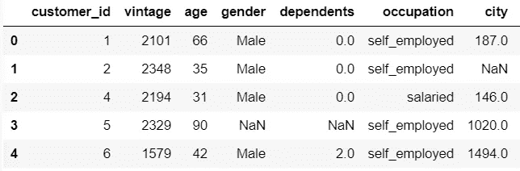
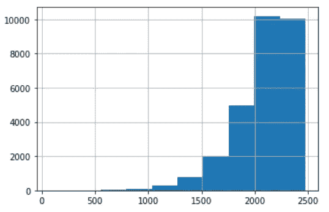
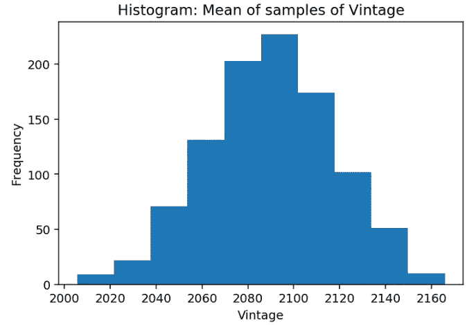

# 中心极限定理及其在 Python 中的实现

> 原文：<https://medium.com/analytics-vidhya/central-limit-theorem-and-implementation-in-python-bd0a3b1b919f?source=collection_archive---------17----------------------->


在这个充满了很少遵循良好理论分布的数据的世界里，中心极限定理是一盏明灯。在执行任何类型的数据分析时，这是一个需要理解的重要概念。这个博客将解释什么是中心极限定理以及它在 Python 中的实现。

# 大数定律

如果我们想知道美国人的平均收入。收集每个美国人的数据是不切实际的，所以我们从中抽取样本。随着人口样本量的增加，样本的平均收入趋于接近收入人口的平均值。这种现象被称为**大数定律**

随着样本量的增加:

—样本变得更能代表总体

—样本平均值更接近总体平均值

# 中心极限定理

我们想算出美国人的平均收入。现在我们取多个样本，取每个样本的平均值，然后我们计算样本的平均收益的平均值。令人惊讶的是，我们发现这个数字非常接近人口的平均收入。如果我们绘制样本的所有这些平均值并形成分布，我们会发现样本的平均值遵循正态分布，平均值接近实际总体平均值。这种现象被称为**中心极限定理。**

*   如果样本量足够大，样本均值的分布近似于高斯分布
*   样本的平均值接近总体平均值
*   我们需要随机抽样
*   样本的分布可以是非高斯的，但是样本的平均值将遵循高斯分布
*   我们可以从总体中收集数据的子集，并使用该样本的统计数据来得出关于总体的结论，而不是收集整个总体的数据。

# 中心极限定理的实现

```
# Import packages
import pandas as pd
import numpy as np
import matplotlib.pyplot as plt
%matplotlib inline# import our data
data = pd.read_csv('churn_prediction.csv')
data.head()
```



```
population = data['vintage']
```

考虑到数据集的 vintage 特征是人口值，我们将其转换为 dataframe。

```
population.hist(bins=10)
```



葡萄酒的分布是左偏的。

```
population.mean()
```

vintage 特征的平均值在 2091 左右。

## 然后我们开始从我们的人口中抽取一些样本

```
#Create a list
sampled_means = []# For 1000 times:
for i in range(1000):
    # Take a random sample of 100 rows from the popoulation, take the mean of these rows,append to sampled_means
    sampled_means.append(population.sample(100).mean())# plotting histogram
plt.figure(dpi = 140) #resolution of the figure
plt.hist(sampled_means)
plt.xlabel('Vintage')
plt.ylabel('Frequency')
plt.title("Histogram: Mean of samples of Vintage")
plt.show()
```



*   采集了 100 个数据点的 100 个样本
*   随机样本的平均值实际上遵循正态分布
*   中心极限定理也可以用 KDE 来证明

```
# View the mean of the sampled_means
pd.Series(sampled_means).mean()
```

样本均值的均值是 2089。

```
# Subtract Mean Sample Mean from True population mean
error = population.mean()- pd.Series(sampled_means).mean()#print
print('The Mean Sample Mean is only %f different the True Population mean!' % error)
```

样本平均值与真实总体平均值仅相差 1.232355！