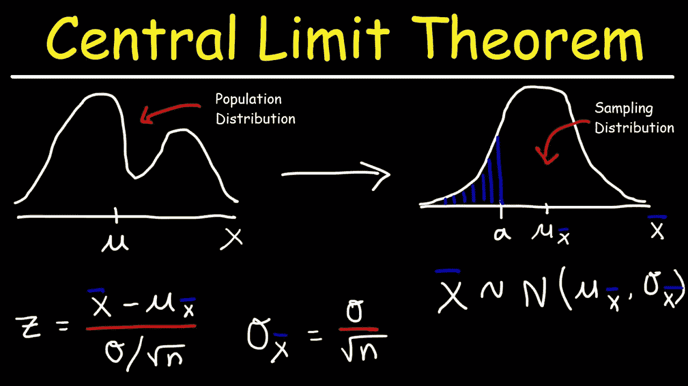
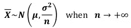
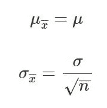
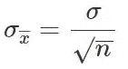
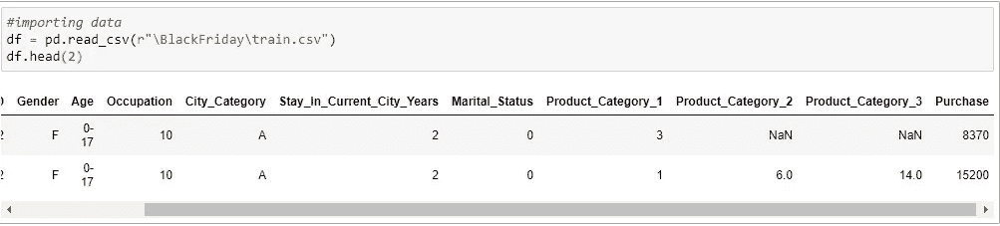
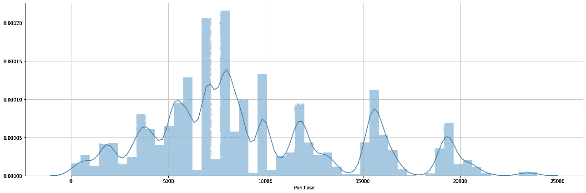
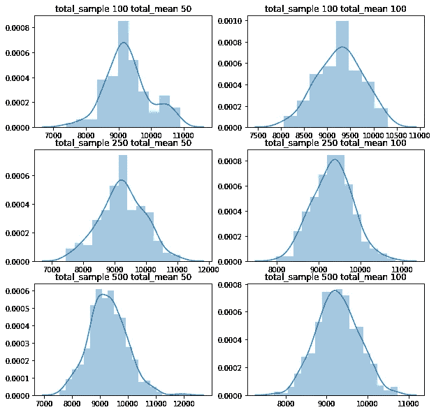
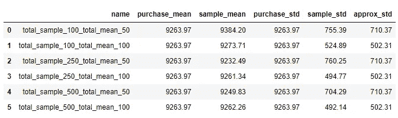
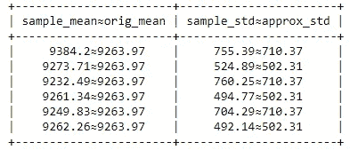

# 中心极限定理和机器学习|第一部分

> 原文：<https://medium.com/analytics-vidhya/central-limit-theorem-and-machine-learning-part-1-af3b65dc9d32?source=collection_archive---------2----------------------->

> 注意:在这里，我将尝试涵盖中心极限定理的思想，它在统计分析中的意义，以及它如何在机器学习中有用。如果你还没有检查，请在这里找到正常分布博客[的链接。](https://abhishek-barai.medium.com/normal-distribution-and-machine-learning-ec9d3ca05070)



来源:谷歌

> 假设我们要研究印度整个人口的平均年龄。由于印度的人口非常多，获取每个人的年龄数据将是一项繁琐的工作，这将花费大量的时间进行调查。因此，我们可以从印度不同地区收集样本，并尝试做出推断，而不是那样做。为了处理样本，我们需要一个近似理论来简化计算平均年龄的过程。这里，中心极限定理出现了。它基于这样的近似，在统计学领域有着巨大的意义。它使用抽样分布来概括样本，并用于计算近似平均值、标准差和其他重要参数。

## ***什么是中心极限定理？***

CLT 指出，如果你有一个总体，其均值为μ，标准差为σ，从替换总体中随机抽取足够大的样本，那么样本均值的分布将是正态分布的。

只要样本量足够大(通常是 n > 30 )，无论源总体是正态还是偏态，这一点都成立。如果总体是正态分布的，那么这个定理甚至适用于小于 30 的样本。

*注:当样本相当大时，CLT 将有效。如果我们有更少的数据点，那么样本必须很小，这不是证明 CLT 的理想情况。*

## ***什么是抽样分布？***

从具有平均值 **μ** 和标准差 **σ** 的大型数据集中独立获取样本的图称为采样分布。基本上，它是带有相关参数的样本分布图。

## ***CLT 的提法:***

对于一个总体( **n** )如果“ ***X*** ”有有限均值 **μ** 和 sd **σ** ，则 CLT 定义为，



其中样本均值和标准差为，



***因此样本平均值将近似于总体平均值(* μ *)，sd(* σ *)将是平均标准误差。***

## ***什么是标准误差？***

统计的标准误差(SE)是其抽样分布的标准偏差或该标准偏差的估计值。总体平均数的抽样分布是通过重复抽样和记录所获得的平均数而产生的。这就形成了一个不同均值的分布，这个分布有自己的均值和 sd。

数学上， ***得到的抽样分布的方差等于总体的方差除以样本量。*** 随着样本量的增加，样本均值更紧密地围绕总体均值聚类。因此，平均值的标准误差和标准偏差之间的关系为:



标准误差

# **数据分析:**

这里我拿了 [*黑色星期五销售数据集*](https://www.kaggle.com/sdolezel/black-friday) 来分析 CLT。数据集由*550068 个数据点*组成。



它包含 12 列。“购买”栏将是我们研究 CLT 的专题。

```
μ and σ of overall purchases are 9263.97 and 5023.07 units respectively.
```

## 分布图:



总购买量分布图

分布是不对称的。这里我们要取 30 个以上的样本，画出均值的抽样分布，来检验它是否遵循正态分布。

## **样本生成的假设有哪些？**

1.  样本应该随机抽取。
2.  应该是相互独立的。
3.  总样本量不应超过整个数据集的 10%。
4.  当原始数据集有偏差或不对称时，样本量应该足够大(n>30)。

## 平均分布图:



正如我们所见，样本数量越多，均值的样本分布呈正态分布的概率就越高。

让我们计算每个分布的**均值μ和 sd σ** ，并检查它与总体采购数据的 **μ** 和 **σ** 的接近程度。



所有计算值



随着样本数量的增加，样本均值和标准差变得越来越接近原始均值和标准差。所以我们使用 CLT 的方法和观察是有效的。

# 机器学习方面:

## CLT 如何帮助概化大型数据集？

机器学习模型通常将训练数据视为确定性和随机部分的混合。让因变量(Y)由这些部分组成。模型总是想把因变量(Y)表示成几个自变量(X)的某个函数。如果函数是 sum(或者表示为某个其他函数的和)并且 X 的个数很大，那么 Y 应该是正态分布。
这里 ml 模型试图将确定性部分表示为确定性自变量(X)之和:

***确定性+随机性= func(确定性(1)) +…+ func(确定性(n)) + model_error*** 
如果用 **X、**来解释 **Y** 的整个确定性部分，那么 **model_error** 只描绘了随机部分，应该具有正态分布(根据 CLT)。
因此，如果 ***误差分布为正态*，**那么我们可以认为模型是成功的，我们可以对数据集应用 ***线性算法以获得更好的结果。*** 否则一些特征在模型中不存在但对 Y 有足够大的影响，或者模型不正确。

## ***统计推断:***

对给定的数据进行 ***统计推断*** 是数据科学家或 ML 工程师每天要做的事情。这个定理使我们能够量化样本偏离总体的可能性，而不需要任何新的样本与之比较。我们不需要整个人口的特征来理解我们的样本代表它的可能性。

> 所以这意味着如果我们不知道实际总体均值( **μ** ，那么我们可以推断样本均值为我们的实际均值( **μ)。**在上面的例子中，如果我们取 500 个样本，每个样本有 100 个数据点，那么 9262.26 单位可以被认为是最初购买的平均值。
> 
> **否……**
> 
> 尽管样本平均值与原始平均值( **μ** )几乎相同，但是单个数字估计本身(500 个样本，100 个数据点)**并不能提供关于更大总体估计的精度和可靠性的信息。**

问:那么，当我们有了一个最终的训练好的模型时，我们如何决定总体均值，或者用最大似然法来表示，我们如何推断这个模型在实践中的熟练程度呢？

这种不确定性被称为**置信区间。**

*请在这里找到* [*part-2 博客链接*](https://abhishek-barai.medium.com/central-limit-theorem-and-machine-learning-part-2-f252d0c8ad81) *。请在这里* *找到完整代码* [*。*](https://github.com/MaverickMonk/Machine-Learning-Methods/blob/main/central_limit_theorem_and_machine_learning.ipynb)

# 参考:

 [## 数据科学的中心极限定理

### 昨天，我在 Quora 上看了一个帖子。这个帖子里的人回答了下面的问题——另见…

www.kdnuggets.com](https://www.kdnuggets.com/2016/08/central-limit-theorem-data-science.html) [](https://en.wikipedia.org/wiki/Standard_error) [## 标准误差

### 统计数据(通常是参数的估计值)的标准误差(SE)是其抽样的标准偏差

en.wikipedia.org](https://en.wikipedia.org/wiki/Standard_error)  [## 抽样分布

### 在统计学中，抽样分布或有限样本分布是给定样本的概率分布。

en.wikipedia.org](https://en.wikipedia.org/wiki/Sampling_distribution) [](https://www.investopedia.com/terms/c/central_limit_theorem.asp) [## 什么是中心极限定理(CLT)？

### 在概率论的研究中，中心极限定理(CLT)指出样本的分布接近于…

www.investopedia.com](https://www.investopedia.com/terms/c/central_limit_theorem.asp)