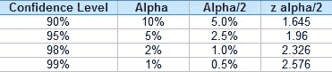
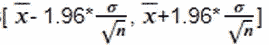

# 中心极限定理和机器学习|第二部分

> 原文：<https://medium.com/analytics-vidhya/central-limit-theorem-and-machine-learning-part-2-f252d0c8ad81?source=collection_archive---------12----------------------->

> 本博客是“中心极限定理与机器学习”的延续。请访问第 1 部分，了解有关该主题的先验知识。这里的链接是[这里的](https://abhishek-barai.medium.com/central-limit-theorem-and-machine-learning-part-1-af3b65dc9d32)。

正如我们前面所讨论的，我们不能简单地假设样本的平均参数输出为我们的总体参数输出，尽管它们的值很接近。我们需要使用**置信区间**方法来验证这种不确定性。

# **什么是置信区间？**

在统计学中，置信区间指的是某个总体参数在一定时间内落在一组值之间的概率。置信区间衡量抽样方法中不确定性或确定性的程度。他们可以采用任意数量的概率极限，最常见的是 95%或 99%的置信水平。

置信区间告诉我们对结果有多少信心。对于任何调查或实验，我们从来没有 100%确定我们的结果可以重复。如果我们有 95%或 99%的把握，这在统计学上通常被认为是“足够好”了。这个确定的百分比就是置信区间。

例如，我们调查了一群宠物主人，看看他们一年购买多少狗粮罐头。我们在 99%的置信水平下测试我们的统计数据，并得到一个置信区间(200，300)。这意味着他们每年购买 200 到 300 罐罐头。我们超级自信(99%是很高的水平！)我们的结果在统计学上是合理的。

当我们对大总体参数一无所知时，这是很有帮助的。那么我们将不能确定我们的样本参数，因为它没有描述任何精度。

## z 分数:

一个 **z 分数**描述了一个原始分数，当以标准偏差单位测量时，它与平均值的距离。如果值高于平均值，则 **z 值**为正，如果值低于平均值，则为负。

通过将正态分布的值(原始分数)转换为 z 分数来标准化这些值非常有用，因为:

1.  它允许我们计算分数出现在标准正态分布中的概率
2.  它还使我们能够比较来自不同样本(可能具有不同的均值和标准差)的两个分数。

z 分数和相应的百分位数

## 计算:

设 0*100 *(1-α))*%表示置信度。

假设我们有一个标准的正态分布“z”

(Z_ *α/2)* 表示其右侧具有α/2 概率的 **z 得分**。
类似地，让(-Z_ *α/2)* 表示其左侧具有α/2 概率的 **z 得分**。

设 *α= 0.1，那么它右边的* (Z_ *α/2) = 1.645，左边的* (Z_ *α/2) = -1.645。*

z 得分的一些值

让我们回到我们的*黑色星期五销售数据分析。*让我们计算已知标准偏差平均值的 95%置信区间。

## **已知标准差的 95%置信水平:**

为了计算 95%置信水平的极限，公式为:

x_bar =样本均值，σ =总体的已知标准差，n=样本数

***99%上限= x_bar(样本均值)+ SE(标准误=*σ*/*sqrt**(**n**)***)*((Z _ 0.05/2)= 1.96)***

***下限 99%极限= x_bar(样本均值)— SE(标准差=*σ*/*sqrt**(**n**)***)*((Z _ 0.05/2)= 1.96)***

有上限和下限

对于每个实验，我们可以看到计算的平均值落在下限和上限之间。我们可以推断整个数据集的购买均值( **μ** )参数介于 8277.73 和 10246.79 之间，我们对此有 95%的把握。

## 无标准偏差的 95%置信水平:

当我们不知道总体的标准偏差时，这对于大量的总体来说是很常见的，在下面的例子中，假设我们不知道所购买的特征的标准偏差。在这种情况下，我们必须使用 ***样本 sd/sqrt(样本数)*** 来计算 sd，如下所示。

x_bar =样本均值，s =总体的样本标准差，n=样本数

***上限= x _ bar(样本均值)+ SE(标准差= s/*sqrt**(**)***)*((Z _ 0.05/2)= 1.96)*****

*****下限 99%极限= x_bar(样本均值)— SE(标准误差= s/*sqrt**(**)***)*((Z _ 0.05/2)= 1.96)*******

********

****我们还可以清楚地看到，对于每个实验，计算的平均值落在下限和上限之下。虽然现在差距很小，但我们可以说对此有 95%的信心。****

****同样，我们可以计算这两种情况的 99%置信区间。****

## ******从机器学习方面:******

****根据中心极限定理，已知样本均值将是高斯分布的一部分，我们可以使用高斯分布的知识来基于样本大小估计样本均值的似然性，并计算围绕机器学习模型的技能的期望置信区间。****

*******注:正态分布的 z 值可取自*** [***z 表***](http://www.z-table.com/) ***。*******

****如果你喜欢这个博客，请为它鼓掌。完整代码请在 *这里找到* [*。*](https://github.com/MaverickMonk/Machine-Learning-Methods/blob/main/central_limit_theorem_and_machine_learning.ipynb)****

# ******参考:******

**** [## z 分数:定义、公式和计算-统计操作指南

### 内容(一般):内容(技术):如何在 TI-89 上找到 Z 分数。如何在 Excel 中找到一个 Z 值？如何…

www.statisticshowto.com](https://www.statisticshowto.com/probability-and-statistics/z-score/) 

[https://machine learning mastery . com/a-gentle-introduction-to-The-central-limit-theorem-for-machine learning/#:~:text = The % 20 central % 20 limit % 20 theorem % 20 has，使用% 20 numerical % 20 optimization % 20 methods](https://machinelearningmastery.com/a-gentle-introduction-to-the-central-limit-theorem-for-machine-learning/#:~:text=The%20central%20limit%20theorem%20has,solved%20using%20numerical%20optimization%20methods)。****