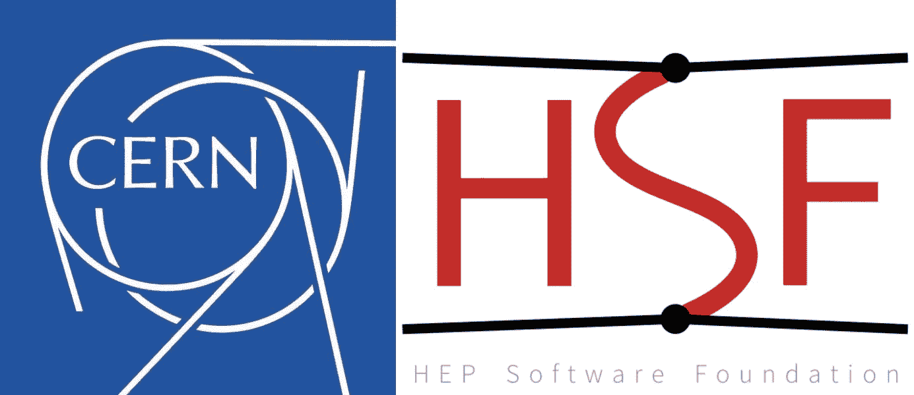
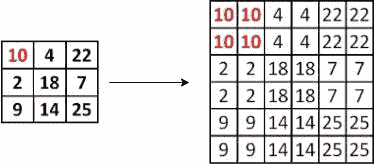
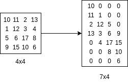
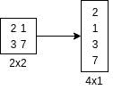
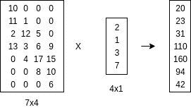

# CERN | GSoC'19:粒子物理应用的生成对抗网络

> 原文：<https://medium.com/analytics-vidhya/cern-gsoc19-generative-adversarial-networks-for-particle-physics-applications-c3da13a3f44b?source=collection_archive---------14----------------------->

三个月前，我被选为 [CERN-HSF](https://home.cern/) 的[谷歌代码之夏](https://summerofcode.withgoogle.com)学生，在 [TMVA(多变量分析工具包)图书馆](https://root.cern/tmva)从事“粒子物理应用的生成对抗网络(GANs)”项目。这段旅程真的很棒，我喜欢在 CERN 组织下工作，也学到了很多东西。

[ROOT](https://root.cern/) 是由 CERN 开发的模块化科学工具包，提供处理大数据处理、统计分析、可视化和存储所需的所有功能。 [TMVA](https://root.cern/tmva) 是一个根集成项目，为高能物理中多变量分类和回归目标应用的训练和评估提供机器学习环境。

该项目的主要目标是为生成性对抗网络建立一个基础，并为 TMVA 的 GANs 开发一个模型。

# 生成对抗网络导论

生成对抗网络是最有趣的深度学习模型之一。两个模型通过对抗过程联合训练:

1.  生成器学习创建看起来真实的图像。
2.  鉴别器学习辨别图像是真实的(来自数据集)还是伪造的(来自生成器)。

## 鉴别器模型

该模型的功能类似于卷积神经网络(CNN)。鉴别器是由许多隐藏层和一个输出层组成的 CNN。鉴别器通过在真实数据上训练来学习实际图像看起来如何以及真实数据应该包含什么特征。因此，鉴别器的输出可以是 0 或 1，其中 0 表示鉴别器将输入数据分类为假数据(从生成器采样)，1 表示它将输入数据分类为实数据(从实分布采样)

## 发电机模型

生成器负责生成图像，有效地反转了 CNN 的功能。在 CNN 中，我们传递一个图像作为输入，图像的标签作为输出。相反，在生成器中，随机生成的噪声作为输入给出。

然后，发生器将这种噪声转换成有意义的输出。噪声通常从比输出空间的维度更小的维度上的分布中被采样。

## 训练甘斯

在训练期间，发生器在创建看起来真实的图像方面逐渐变得更好，而鉴别器在区分生成的样本和实际样本方面变得更好。当鉴别器不再能够区分真实图像和赝品时，就达到了平衡。

# GANs 的层数

正如我们所知，在生成图像的过程中，生成器需要增加输出的维度，因此，我们在生成器模型中采用了层来实现这一点。

TMVA 拥有卷积层和最大池层等图层，可对输入张量进行下采样，并将其转换为低维张量。因此，我们引入了像上采样和转置卷积层这样的层，它们将对给定的张量进行上采样，因此，我们可以获得更高维的张量。

## TMVA 一层的结构

TMVA 不支持 3D 张量数据结构(尽管目前正在引入 RTensor)。因此，对于任何 3D 输入，我们需要将 3D 输入张量转换为 2D 矩阵，然后可以执行相应的操作。每一层执行相应的正向传递和反向传递。

# 上采样层

上采样层是一个简单的层，通常不需要任何过滤器/权重。它增加了输入的维度，因此可用于卷积层之后的生成模型。它也可以被认为是一个反向的池层。

## 工作

这里介绍一种简单的上采样变体，即最近邻插值技术。在最近邻插值中，我们将输出图像中每个像素的值确定为输入图像中最近邻的值，如下图所示。

考虑最近邻插值的简单例子，其中我们将矩阵 A (3x3)上采样为更高维的矩阵 B (6x6)。

最近邻插值

# 转置卷积层

转置卷积运算等效于常规卷积的梯度计算(常规卷积的反向传递)。我们可以用它来增加张量的维数，而不是使用预定义的插值技术。

## 工作

这里使用的转置卷积技术最好用一个例子来描述:考虑一个输入矩阵 A(2×2)和一个核矩阵 B(4×4)。

## 生成转置卷积矩阵

我们用矩阵来表示转置卷积运算。它只不过是一个重新排列的核矩阵，因此我们可以使用矩阵乘法来执行转置卷积运算。在上面的例子中，为了得到大小为 7×1 的输出向量，我们生成大小为 7×4 的转置卷积矩阵。

在这里，我们将 4x4 内核重新安排为 7x4 内核。

## 将输入转换成单个列向量。

这里，我们将输入矩阵(2x2)展平成一个列向量(4x1)

## 生成相应的输出向量

因此，我们通过将转置卷积矩阵与输入向量相乘来生成输出向量。

# TMVA DNN 模块中的 GANs

类 MethodGAN ( GAN 模块)包含了 GAN 的实际实现。MethodGAN 为用户定义自己的 GANs 架构提供了灵活性，因为架构作为输入传递到模型上，MethodGAN 由各种解析函数组成，这些函数在解析架构输入字符串后创建模型。

在粒子物理中，生成对抗网络在生成图像方面非常有用，作为实验的替代方案，我们需要执行大量实验并以图像的形式生成结果。

TMVA 甘斯建筑

# 未来的工作

*   为发生器和鉴别器实现独立的损耗函数。
*   增加了对高能物理应用的 gan 的其他变体的支持。
*   用其他标准实现对结果进行基准测试。

## 感谢

我衷心感谢我的所有导师 *Lorenzo Moneta、Manos Stergiadis、Sergei Gleyzer、Omar Andres Zapata Mesa、Sitong An、Stefan Wunsch、Kim Albertsson 和 Gerardo Gutiérrez* 在整个开发过程中为我提供指导，帮助我做出实施决策，处理技术问题，并在周会上提供宝贵的意见。

我还要感谢 [*Anushree Rankawat*](/@anushreerankawat110) 帮助我理解现有的代码库，并帮助解决其他实现问题。

谷歌代码之夏帮助我成为这样一个伟大社区的一部分，并给了我一个在这样一个令人兴奋的项目上工作的机会。

此外，和 Surya Dwivedi 一起工作也是一次很棒的经历。

## 重要链接:

链接到上采样层和转置层的实现:PR-4146

链接到 GANs 代码: [GANs 实施](https://github.com/Ask149/root/tree/dev/ashish/temp)

其他链接: [PR-4275](https://github.com/root-project/root/pull/4275)