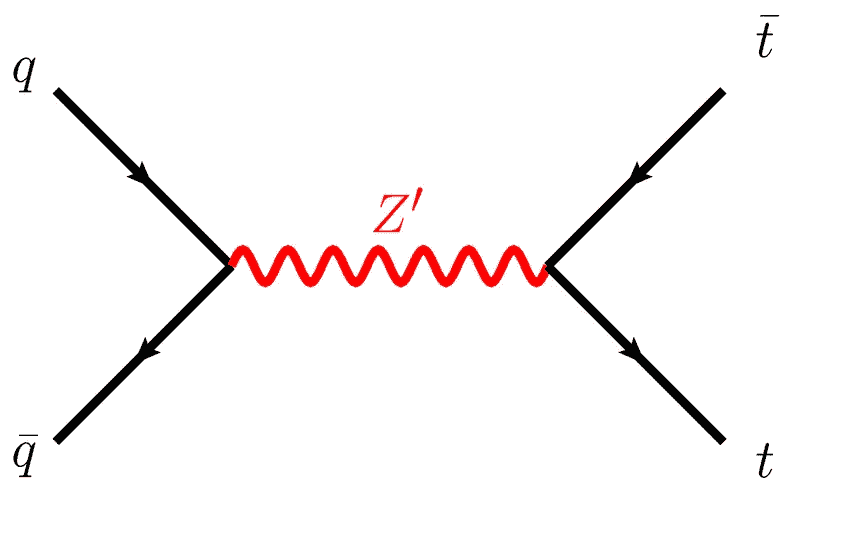
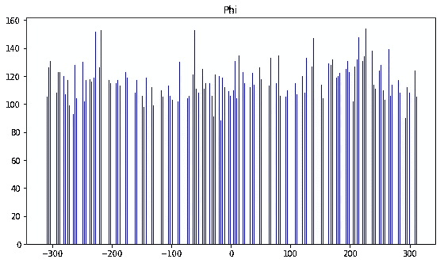
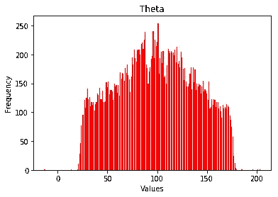
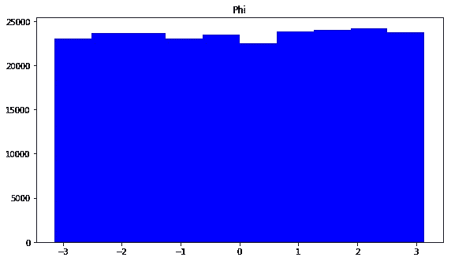
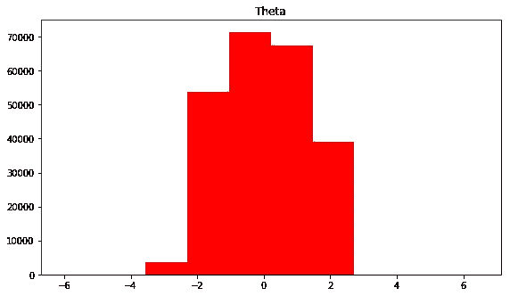
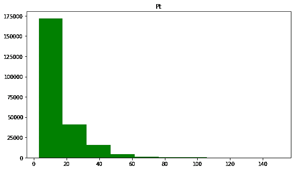
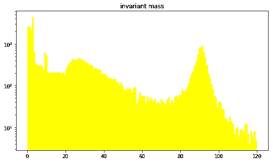
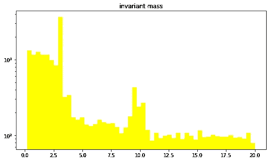
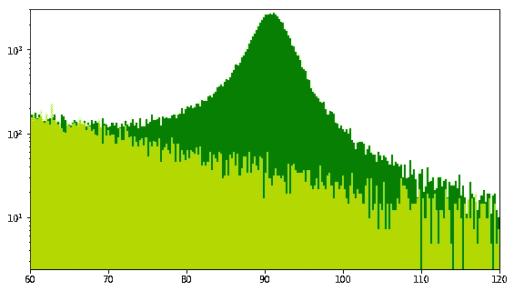
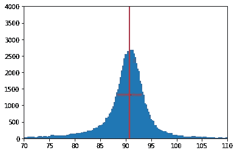

# CERN Z 玻色子识别和理解

> 原文：<https://medium.com/analytics-vidhya/cern-z-boson-identification-understanding-3d4c4765bf1?source=collection_archive---------14----------------------->

# 介绍

在接下来的文章中，我将分析从 CERN 的 CMS 探测器接收到的数据。其目的是探测大型强子对撞机中一组质子碰撞后可能出现的不同粒子；这使得科学家能够研究我们宇宙的构成，暗物质等等。在我们的模块中收集的数据考虑了来自碰撞粒子的纯μ子。μ子是被归类为轻子的基本粒子。因此，它被认为没有子结构。根据我们收集的数据，我们将主要从每个μ子中提取信息，以获得较大粒子的不变质量。不变质量是物体静止时的质量；被测量的粒子以高速运动。因此，我们没有它们的“真实质量”,因为它被扭曲了，也就是相对论质量。数据分析的目标是分析更重要的单个粒子，在我们的例子中，我们将关注 z 玻色子或 z 零粒子。欧洲粒子物理研究所在 20 世纪 80 年代早期发现了这种玻色子。很像 W 玻色子，z 零粒子携带弱力，不像他的对应物(W)这个玻色子是中性的。



Z 玻色子图

# 历史

为了进一步了解我们将要会聚的粒子，我们将回顾一下它的历史。在欧洲粒子物理研究所，科学家们意识到通过发射 W 玻色子，弱力可以改变；例如，质子的电荷通过改变它的夸克构型。1958 年，西德尼·布罗德曼(Sidney Bludman)提出，弱力中可能存在另一个角色，但这一次是一个中立的对应角色。一旦实验开始，科学家将中微子射入一个气泡室，在那里中微子开始相互作用，从而证明存在一种弱中性流:Z 玻色子。此外，在超级质子同步加速器(20 世纪 70 年代末)即质子-反质子对撞机诞生后，他们能够凭经验证明 W 玻色子和 Z 玻色子的存在，这要归功于欧洲核子研究中心 SPS 中的粒子探测器 UA1。

# 数据

从 CMS 接收的数据来自一个根文件，其中包含超过 5700 万次冲突的信息。这些事件产生的μ子已经被记录下来；数据文件让我们知道它们碰撞后的电荷、横向动量、φ和θ角。μ子要么带正电，要么带负电(1 或-1)。μ子的横向动量相当于动量在横向平面上的投影(3d 向量),形成一个 2d 图形。μ子的θ角等于 y 轴和粒子投影之间的角度，而φ角等于粒子投影和 x 轴之间的角度。所有角度都以弧度为单位。

```
%**matplotlib** inline
**import** **numpy** **as** **np**
**import** **matplotlib.mlab** **as** **mlab**
**import** **matplotlib.pyplot** **as** **plt**
**import** **ROOT**
**import** **math**
**import** **datetime**
read = ROOT.TFile.Open("Run2012BC_DoubleMuParked.root")
parse = read.Get("Events")
phi={}
theta={}
**print** "start"
df=[]
start = datetime.datetime.now()
k=0**for** i **in** parse:
    k+=1
    **if** k>10000:**break**
    **if** k%**1000000** == 0:
        **print**(k)
    **for** g **in** range(i.nMuon):
        fig1 = int(-(i.Muon_phi[g]-np.pi)/(np.pi/100))
        cfig1= int(((fig1 * np.pi/100)- np.pi + (np.pi/200))*100)
        fig2 = int(-(i.Muon_eta[g]-np.pi)/(np.pi/100))
        cfig2 = int(((fig2 * np.pi/100)- np.pi + (np.pi/200))*100)
        **if** cfig1 **in** phi:
            phi[cfig1]+=1
        **else**:
            phi[cfig1]=1
        **if** fig2 **in** theta:
            theta[fig2]+=1
        **else**:
            theta[fig2]=1

**print**(datetime.datetime.now()-start)
f=plt.gcf()
plt.title("Phi")
f.set_size_inches(9.25, 5.25)
plt.bar([i **for** i **in** phi],[i **for** i **in** phi.values()], color="blue")
plt.show()
g=plt.figure(2)
plt.title("Theta")
plt.bar([i **for** i **in** theta], [i **for** i **in** theta.values()], color="red")
g.show()
plt.xlabel('Values')
plt.ylabel('Frequency')
plt.show()
```



# 不变质量

不变质量图给了我们一个很强的指示，我们正在处理的粒子。我们注意到，在特定的时间，不变质量大幅度上升，这可能表明粒子的存在。在我们的数据集中，我们注意到有各种各样的峰，但我们将只关注本笔记本中的一个，即 Z 玻色子(正如我前面提到的)，它是不变质量图的最后一个峰。

```
**def** massm(pt,et,ph,ms):
    mass1 = ms[0]
    px1 = vector(pt[0],et[0],ph[0])[0]
    py1 = vector(pt[0],et[0],ph[0])[1]
    pz1 = vector(pt[0],et[0],ph[0])[2]
    energy1 = math.sqrt(mass1**2 + px1**2 + py1**2 + pz1**2)
    mass2 = ms[1]
    px2 = vector(pt[1],et[1],ph[1])[0]
    py2 = vector(pt[1],et[1],ph[1])[1]
    pz2 = vector(pt[1],et[1],ph[1])[2]
    energy2 = math.sqrt(mass2**2 + px2**2 + py2**2 + pz2**2)

    mass1 = energy1**2 + 2*energy1*energy2 + energy2**2
    mass2 = (px1+px2)**2 + (py1+py2)**2 + (pz1+pz2)**2
    mass = math.sqrt(mass1-mass2)

    **return** massphi=[]
theta=[]
pt=[]
mass=[]
%**pylab** inline
mass2=[]
**print** "start"
k=0
**for** i **in** parse:
    k+=1
    **if** k>100000:**break**
    **if** k%**1000000** == 0:
        **print**(k)
    **for** g **in** range(i.nMuon):
        phi.append(i.Muon_phi[g])
        theta.append(i.Muon_eta[g])
        tt = i.Muon_pt[g]
        **if** tt<150: pt.append(tt)

    **if** i.nMuon!=2: **continue**   
    **if** i.Muon_charge[0] * i.Muon_charge[1] < 0:
        qv0 = ROOT.Math.PtEtaPhiMVector(i.Muon_pt[0], i.Muon_eta[0], i.Muon_phi[0], i.Muon_mass[0])
        qv1 = ROOT.Math.PtEtaPhiMVector(i.Muon_pt[1], i.Muon_eta[1], i.Muon_phi[1], i.Muon_mass[1])
        ms = (qv0 + qv1).mass()
        **if** ms<20:
            mass2.append(ms)
        **if** ms<120:
            mass.append(ms)f=plt.figure(1)
plt.title("Phi")
plt.hist(phi, color="blue")
f.set_size_inches(9.25, 5.25)
f.show()
g=plt.figure(2)
plt.title("Theta")
plt.hist(theta, color="red")
g.set_size_inches(9.25, 5.25)
g.show()
e=plt.figure(3)
plt.title("Pt")
plt.hist(pt, color="green", bins=10)
e.set_size_inches(9.25, 5.25)
e.show()
t=plt.figure(4)
plt.title("invariant mass")
plt.hist(mass, color="yellow", bins=150)
plt.yscale("log")
t.set_size_inches(9.25, 5.25)
t.show()
h=plt.figure(5)
plt.title("invariant mass")
plt.hist(mass2, color="yellow", bins='auto')
plt.yscale("log")
h.set_size_inches(9.25, 5.25)
h.show()
```



```
mass=[]
bmass = []
gmass=[]
k=0
g=0
**for** i **in** parse:
    k+=1
    **if** k%**100000** == 0:
        **print**(k)
    **if** k>1000000:**break**
    **if** i.nMuon!=2: **continue** 
    qv0 = ROOT.Math.PtEtaPhiMVector(i.Muon_pt[0], i.Muon_eta[0], i.Muon_phi[0], i.Muon_mass[0])
    qv1 = ROOT.Math.PtEtaPhiMVector(i.Muon_pt[1], i.Muon_eta[1], i.Muon_phi[1], i.Muon_mass[1])  
    ms = (qv0 + qv1).mass()
    p = math.sqrt((qv0.X()+qv1.X())**2 + (qv0.Y()+qv1.Y())**2 + (qv0.Z()+qv1.Z())**2)
    **if** p > 10:
        **if** i.Muon_charge[0] * i.Muon_charge[1] > 0:  
            **if** ms<120:
                bmass.append(ms)
        **elif** i.Muon_charge[0] * i.Muon_charge[1] < 0:
            **if** ms<120:
                gmass.append(ms)
**def** mean_clean(cleanhist,xhist,start,end):
    xv = xhist[1].tolist()
    yv = cleanhist
    k=0
    sum = 0
    **for** i,j **in** zip(xv,yv):
        **if** i < start: **continue**
        **if** i > end: **continue**
        i = (xv[xv.index(i) + 1] + i)/2
        sum += i * j
        k += j
    **return** sum/k
```

# 背景

然而，原始数据/图表可能会相对误导。在 CMS 中，条件接近完美，但还没有完全达到，这意味着存在不同的干扰可能性，可能会影响检测或接收的数据质量。例如，在我们的情况下，即使我们有大量的数据，不变质量的第一个直方图中的背景显示的扰动仍然是明显的，因为数据是许多碰撞的集合，Z 零并不总是存在。为了去除合理数量的背景，我们去除了两个重要的背景源。我们的第一个变数是粒子的质量:如果可能粒子的不变质量不值得注意，我们决定它可能不是粒子，而可能是先前碰撞的分支。我们考虑的第二个变量是动量。我们的结论是，如果一个可能的粒子的动量太低，那么它就没有必要被包括在计算中(因为 z0 具有相对较大的质量，我预计动量会很大)。

```
b=[]
**for** i **in** bmass:
    b.append(2.4)
h = plt.figure(1)
plt.yscale("log")
one = plt.hist(gmass, bins=500, facecolor='green')
two = plt.hist(bmass,bins=500, facecolor='yellow', weights=b, alpha=0.7)
plt.axis([60, 120, 0, 3000])
h.set_size_inches(9.25, 5.25)
plt.show()
```



# 减法

一旦我们完成了对背景的估计/识别，我们必须找到一种从原始直方图中去除背景的方法。为了实现这一点，我们试图尽可能地将背景的直方图与原始直方图对齐，以查看背景对我们的数据有多大影响。对齐完成后，我们通过减去两个直方图(原始—背景)的 y 坐标数组来构建一个条形图。一旦这样做了，Z 玻色子的峰值应该是单独的，并且平行于 x 轴。

# Z 零点的质量

我们想计算 Z 玻色子的质量。为了实现这一点，我们将首先需要消除背景(解释了以上段落)。这种错误源的消除使得峰值与 x 轴平行，从而更容易计算。扰动的消除给我们展示了玻色子探测的清晰图像。它的质量等于这个峰的顶点的 x 坐标。为了检索此信息，我们计算峰内包含的面元的平均值，这将为我们提供一个以 GeV/°c 为单位的近似正确的质量值。如果我们没有犯任何重大错误，我们得到的值应该接近 Z 玻色子的合法值，约为 91.18 GeV/°c。当然，如果我们考虑更多可能的错误来源，除了低动量和无关紧要的质量，我们计算的值将不断接近真实值。

# FWHM

计算出粒子的质量后，另一个有趣的测量是半峰全宽(FWHM)值。该值表示粒子的衰减宽度，通过将剩余背景视为 0 并计算中点之间的距离来计算。该距离代表衰变宽度，该宽度与衰变寿命直接相关，并且是粒子共振的直接倒数。与假设值 2.49 GeV/℃在被探测到之前，粒子会穿过多层物质/金属，因此它的“飞行路径”会发生偏离。因此，粒子的属性(例如速度、方向等)可以被改变。因此，这些最小的诉讼环境或多次散射将扩大检测器感知的结果。事实上，不变质量直方图的峰值变得更大，可能会扭曲结果。

```
bar = []
**for** d **in** range(len(one[1])):
    **if** d==0: **continue**

    middle = (one[1][d]+one[1][d-1])/2
    bar.append(middle)
new=[]
**for** i,j **in** zip(one[0],two[0]):
    new.append(i-(j*2.3))
point = mean_clean(new,one,87,94)
**print**(point)
big=0
k=0
**for** i **in** new:
    k+=1
    **if** k<80:**continue**
    **if** i>big:
        big=i 
middle = big/2
num=0
k=0
high = new.index(big)
**for** i **in** new:
    k+=1
    **if** k<high:**continue**
    **if** abs(middle-i)<abs(middle-num):
        num=i
first = one[1][new.index(num)]
num=0
k=0
**for** i **in** new:
    k+=1
    **if** k<70:**continue**
    **if** k>high:**continue**
    **if** abs(middle-i)<abs(middle-num):
        num=i
second = one[1][new.index(num)] 
dif = first - second
**print** dif
p3=[first,second]
p4=[middle, middle]
p1=[0,100000]
p2=[point,point]
diff=plt.bar(bar, height=(one[0]-two[0]))
plt.plot(p2,p1,color="red")
plt.plot(p3,p4,color="red")
plt.axis([70, 110, 0, 4000])
plt.show()
```

